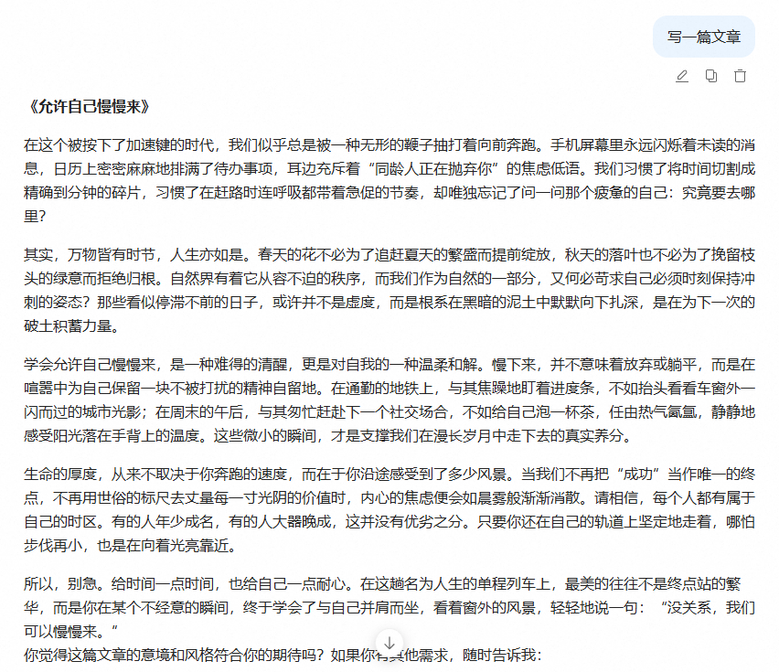
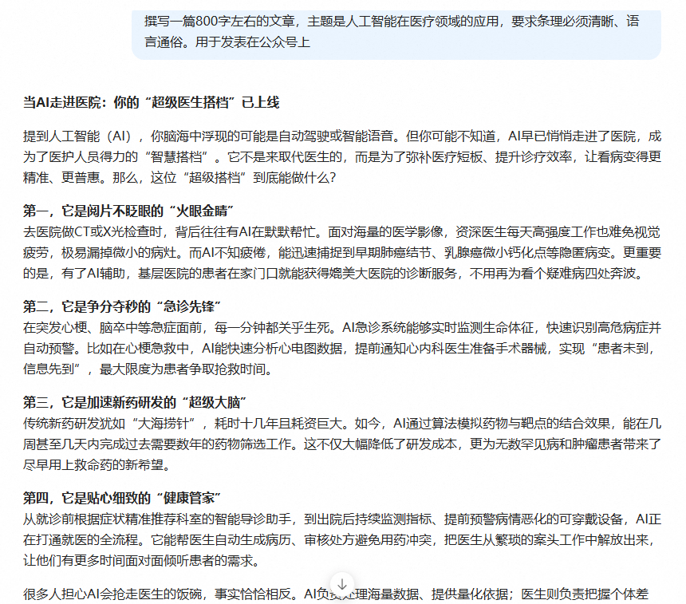
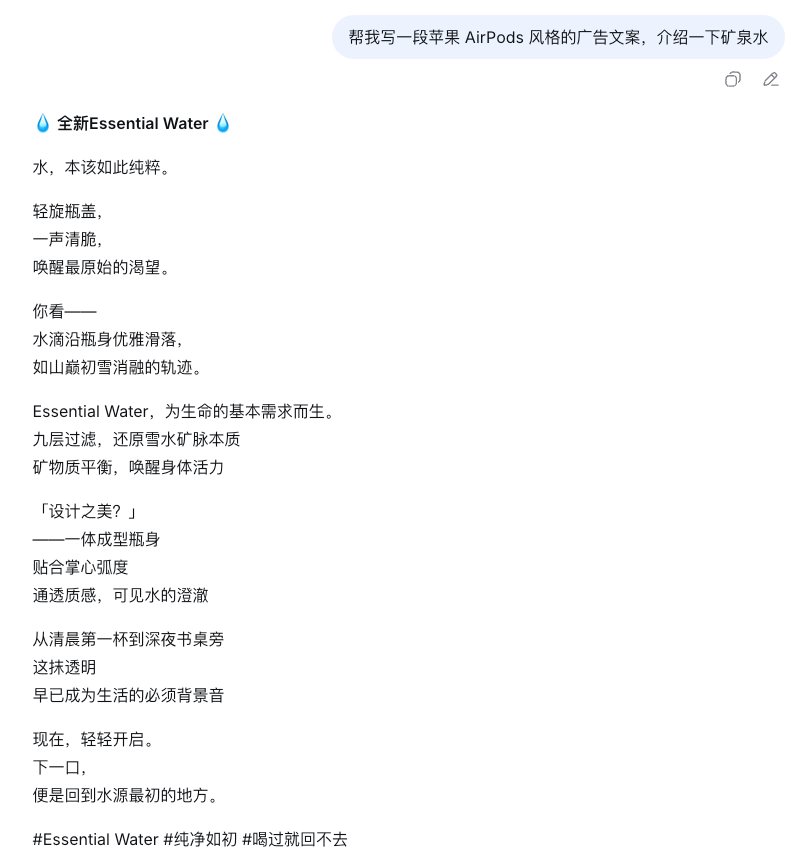
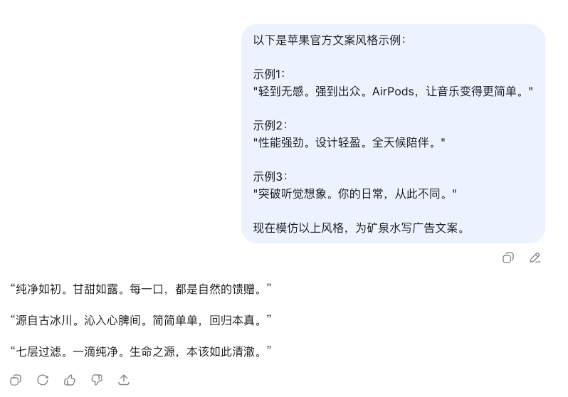

# ✅如何设计Prompt？


提示词设计原则与技巧

明确角色设定

为模型指定明确的**角色**，有助于其理解任务的上下文和预期输出。例如：

```text
# 角色设定
你是一名网络安全专家，请根据以下安全告警日志，并输出专业分析报告
```

这种方式可以**引导模型以特定的语气、风格和专业性**进行回应。

清晰具体的任务指令

在设计 Prompt 时，要避免**模糊、笼统以及繁琐**的指令，而是明确告诉模型 **需要做什么**、**如何做**以及 **期望输出的形式**。**清晰明了**的任务指令可以帮助模型准确理解你的意图，减少生成不相关或错误内容的可能性。

并且，一定要注意不要对大模型**太礼貌**，可以经常用一些**命令**的词汇来写提示词，比如“**必须”，“肯定”，“绝对”**，直截了当的对大模型下达指令。

举个例子：

```text
## 模糊指令（效果不佳）：
“写一篇文章。”


## 清晰具体的指令（效果更好）：
“撰写一篇800字左右的文章，主题是人工智能在医疗领域的应用，要求条理必须清晰、语言通俗。用于发表在公众号上”
```

通过这种方式，模型能明确任务目标、内容范围和输出要求，从而生成更贴合预期的结果。

比如（提示词并不明确的）：



比如（提示词明确的）：



结构化提示词

结构化提示词，是一种通过明确划分提示内容结构、强化语义层次来提升模型理解与输出质量的提示设计方法。它通常通过清晰地定义 **角色（Role）**、**任务（Task）**、**上下文背景（Context）**、**输出格式（Format）** 等关键信息，并辅以显式的分隔符（如编号、引号、换行、Markdown标题等），将复杂指令拆解为模型可识别的模块化输入。

常见的有很多结构化提示词框架，这篇文章有做介绍：文档

这种方式能显著提高模型对任务目标的理解精度，使输出更加**可控、稳定且符合预期结构**，尤其适用于多步骤推理、专业内容生成和规范化输出等场景。

例如：

```text
# 角色
你是一名资深的市场文案撰写专家

# 任务
撰写一份产品描述

# 要求
1. 强调产品的独特卖点  
2. 使用简洁明了的语言  
3. 字数控制在150字以内  
4. 风格偏向专业且富有吸引力  

# 输出格式
- 标题：一句话概括产品卖点  
- 正文：2-3句描述产品特性和优势  
- 列表：用项目符号列出最核心的3个特点
```

在这个 Prompt 结构中，每个部分都被明确分隔，模型可以更好地理解任务的**角色定位、任务目标、要求细节和输出格式**，提高生成内容的准确性和可读性。

提供示例

**Zero-Shot（零样本提示）**

Zero-Shot 是指 **不给模型提供任何示例，仅通过任务指令完成生成任务**。

这种方式完全依赖模型的预训练知识与理解能力，简单直接，适合通用任务或模型熟悉的领域。

例如（**简单**）：

```text
# 任务：
判断用户的这句话属于什么意图（查询天气、设置提醒、播放音乐）。

# 用户输入：
帮我查一下明天北京的天气。
```

例如（**复杂**）：

```text
# 任务：
判断用户的这句话属于什么意图（查询API、检索知识库、联网查询）。

# 用户输入：
帮我解读一下这个安全漏洞。
```

**优点**：简洁、高效、无需额外示例，适合简单直接的任务。

**缺点**：容易出现偏差或输出格式不统一，特别是任务较复杂时。

在简单场景下，意图比较简单清晰，模型本身能够很好的识别出用户问题属于哪种意图；而在“复杂”场景下，我规定了三种“工具调用”的意图，如果没有相应的示例，模型很难判断你这个问题属于哪种意图，应该调用哪种工具来查询。

**Few-Shot（少样本提示）**

Few-Shot 是指 **在提示中加入少量示例**，让模型通过这些示例学习思考模式和输出风格。

**示例一般是输入与输出的成对样本，用来引导模型模仿思维逻辑和输出结构。**

例如，如果我们让AI帮我们写一段苹果风格的广告文案：



如果你想让这个文案满意，完全就是在碰运气，比如我们希望他有苹果的风格，就可以用few shot的方式来优化提示词：



```text
以下是苹果官方文案风格示例：

示例1：
"轻到无感。强到出众。AirPods，让音乐变得更简单。"

示例2：
"性能强劲。设计轻盈。全天候陪伴。"

示例3：
"突破听觉想象。你的日常，从此不同。"

现在模仿以上风格，为矿泉水写广告文案。
```

这里我们通过给出了多个例子的方式，让LLM能能够更加稳定的，和我们的例子风格一致的输出。

**优点**：模型更容易理解任务边界，输出更稳定、风格更一致。

**缺点**：提示词更长，容易占用上下文长度。

**相比于zero-shot在复杂场景中的缺陷，few-shot则可以很容易的提升模型意图识别的稳定性。**

**指定输出格式**

明确告诉模型 **“你希望的结果长什么样”**，能显著提升输出的**结构化和一致性**。

大模型虽然具备强大的生成能力，但如果不限定格式，它往往会“自由发挥”，导致输出不符合需求。**某些调用参数生成的场景**，用户可能需要大模型生成JSON格式，用于后续API的使用，**某些分析报告生成的场景**，用户就可能需要的是Markdown格式。所以根据场景的不同，通过定义输出格式Prompt，可以有效统一输出格式。

例如：

```text
# 任务描述：
你是一个接口参数生成专家，需要根据自然语言描述生成一个调用API接口的参数配置。

# 输出格式：
请将输出结果以JSON格式给出，字段包括：
- pageSize：每页大小，最大不超过10
- pageNum:：当前页，默认1
- type：类型（0 查询商品、1 查询订单）

# 用户输入：
我想分页查询订单列表。
```

**预期模型输出：**

```text
{
  "pageSize": 10,
  "pageNum":1,
  "type": 1
}
```

通过规定输出格式（JSON、字段定义、类型限制等），模型生成出的结果可直接用于后续处理或接口调用，减少二次处理成本。

随着模型的能力 越来越强，输出的json的稳定性已经很好了，但是在以前，json的输出其实并不是特别的稳定，即使我们要求模型按照json输出也是一样的。所以，在很多实际线上的生产级的应用中，还是需要考虑输出不稳定的情况，比如引入一些json修复的框架来修复模型输出结果存在错误的情况。

提供上下文信息

在提示词中加入**任务背景、相关知识、历史会话或上下文内容**，能帮助模型更好地理解输入语义，生成更准确、更符合预期的结果。

比如在模型上下文中**增加会话历史**，让模型具备**记忆能力**。大模型拥有了用户当前会话的历史问答后，面对用户的新问题，可以实现关联分析的效果，模型会在历史会话的基础上，继续回答用户的新问题。

并且这在 **RAG（Retrieval-Augmented Generation，检索增强生成）** 场景中尤为常见**（后续会有单独章节讲解）** —— 模型在生成前，会通过检索系统获取相关文档、API说明或知识库内容，将这些作为上下文信息一并输入，从而显著提升回答的**相关性与专业度**。

```text
# 基于以下知识库文档信息：
[文档片段1]
[文档片段2]
...

# 请回答用户的问题：
[用户问题]
```

系统提示词&用户提示词

提示词可以分为系统提示词和用户提示词。

```text
messages=[
            {"role": "system", "content": "You are a helpful assistant."},
            {"role": "user", "content": "你是谁？"},
        ]
```

**系统提示词（System Prompt）**：由系统开发者或应用平台预先设定的一段指令性文本，用于引导模型的整体行为、角色定位、输出风格、安全边界等。

- **作用**：
- 设定模型的角色（例如：“你是一个专业作家”）；
- 指定任务要求（例如："请给我写一篇文章，用于发表在公众号上面"）
- 限制输出内容（例如："不要出现一些让程序员看了之后会反感的内容。"）；
- 控制格式（例如：用简洁的语言回答，或以JSON格式输出）；
- 提供上下文框架（例如：始终使用中文，或假设用户位于中国）。
- **特点**：
- 用户通常看不到或不能直接修改；但是做大模型应用开发的时候，代码里面是可以指定系统提示词的。
- 在每次对话中隐式地作用于模型；
- 是模型“默认行为”的基础。

**用户提示词（User Prompt）**：用户在与AI交互时主动输入的问题、指令或请求。

- **作用**：
- 明确用户当前的具体需求（例如：请围绕内容"关于AI时代对于程序员的影响"）
- 提供具体上下文（如“根据以下文章总结要点……”）；
- **特点**：
- 由用户自由输入；
- 决定单次交互的具体内容方向；

示例位置对模型输出的影响

在设计 Few-Shot 提示时，我们往往关注：示例选择多少、示例的输入输出格式、提示词的角色设定、任务指令等。但研究显示，**示例的位置（即放在提示词的开头、角色前、任务后、用户输入前／后等）也会显著影响模型性能**。

有一篇论文 “Where to show Demos in Your Prompt: A Positional Bias of In‑Context Learning”指出：即便示例内容完全不变，仅仅改变其在 Prompt 中的位置，模型的准确率、输出稳定性会有大幅波动。

论文链接：[https://arxiv.org/pdf/2507.22887](https://arxiv.org/pdf/2507.22887)

这个论文的研究提醒我们：Prompt的设计不仅要“**是什么**”和“**怎么写**”，还要考虑“**放在哪里**”。

该论文研究定义了四种典型的示例放置位置：

- **ssp（Start of System Prompt）**：示例放在系统提示的最前面。
- **esp（End of System Prompt）**：示例放在系统提示的末尾。
- **sum（Start of User Message）**：示例放在用户消息的最前面（很多系统默认位置）。
- **eum（End of User Message）**：示例放在用户消息的最后。

**主要规律：将示例放在开头（尤其 ssp），通常会带来最稳定且最高的性能提升；而将示例放在用户消息的末尾（eum）常导致性能下降、输出波动大。**

研究还发现，一些小模型**（参数量小）**对这个现象

极为敏感， **更容易受位置影响**。而大模型**（参数量大）**中，这种效应则会减弱，比如在llama3模型中，**sum 位置（用户消息开头）有时还会优于 ssp**。

这些示例体现了大模型对上下文中示例位置的敏感，说明**提示词位置设计也是提示工程的重要环节。**

一个完整的Prompt示例

````text
# 角色定义
你是一名专业的旅行规划顾问，擅长根据用户偏好制定个性化的旅游计划。  
你需要以Markdown格式输出一份简洁、清晰、实用的行程安排。  

---

# 任务描述
根据用户输入的出行需求（如目的地、天数、兴趣点等），制定一个详细的旅行计划。  
要求内容包括：
1. 每日行程安排（含景点、交通、餐饮推荐）  
2. 总体花费预估（以人民币计）  
3. 温馨提示（如天气、穿衣建议、注意事项）

---

# 景点参考信息（上下文信息）
以下是部分城市旅游参考资料（供你在规划时参考）：

[文档片段1]
北京以历史文化景点为主，热门景点包括故宫、长城、颐和园。春秋季节气候宜人，适合户外活动。  

[文档片段2]
上海以现代都市景观与夜景闻名，热门景点包括外滩、迪士尼、豫园。地铁交通便利，美食多样。  

[文档片段3]
成都以美食和休闲文化著称，热门景点包括宽窄巷子、大熊猫基地、都江堰，节奏悠闲，消费亲民。

---

# 示例
## 示例1：
输入：我想去北京玩两天，主要想看名胜古迹。
输出：
```markdown
  # 北京两日游行程规划
  
  ## 第一天：历史文化探索
  - 上午：参观 **故宫**  
  - 下午：游览 **天安门广场**、**王府井步行街**  
  - 晚餐推荐：全聚德烤鸭  
  
  ## 第二天：自然与皇家园林
  - 上午：游览 **颐和园**  
  - 下午：前往 **八达岭长城**  
  - 晚餐推荐：老北京炸酱面  
  
  ### 预算预估
  约 ¥1200 / 人（含交通与餐饮）
  
  ### 温馨提示
  - 早晚温差较大，请带外套。  
  - 部分景区需提前预约。
```

## 示例2：
输入：帮我规划一个上海三天的亲子游。
输出：
```markdown
  # 上海三日亲子游计划
  
  ## 第一天：城市初体验
  - 上午：参观 **上海自然博物馆**  
  - 下午：漫步 **外滩**，夜游黄浦江  
  - 晚餐推荐：蟹粉小笼包  
  
  ## 第二天：迪士尼奇幻乐园
  - 全天游玩 **上海迪士尼乐园**  
  - 晚餐推荐：园区主题餐厅  
  
  ## 第三天：城市休闲与购物
  - 上午：游览 **豫园**  
  - 下午：南京路步行街自由活动  
  - 晚餐推荐：新天地西餐厅  
  
  ### 预算预估
  约 ¥2200 / 人（含门票与住宿）
  
  ### 温馨提示
  - 提前预约迪士尼门票。  
  - 夏季炎热，请携带防晒用品。
  ```

---

# 按照如下格式输出：
# <城市+天数>行程规划标题

## 第一天：
- 上午：
- 下午：
- 晚餐推荐：

## 第二天：
- 上午：
- 下午：
- 晚餐推荐：

## 第三天：
- 上午：
- 下午：
- 晚餐推荐：

### 预算预估
### 温馨提示

---

# 当前任务
请根据以下用户输入，生成Markdown格式的旅行行程方案：

用户输入：
“我打算去成都玩三天，想吃美食也想看看大熊猫。”
请确保按照指定的输出格式输出，不要输出多余解释或说明。
````

以上提示词几乎涵盖了我们前面所讲解的全部Prompt技巧，我们可以将这段**标准提示词**放到一些通用的在线大模型进行尝试，看模型的输出是否稳定且符合预期。

**GPT：**

```text
# 成都三日游行程规划

## 第一天：城市休闲与美食体验
- 上午：抵达成都，入住酒店  
- 中午：品尝 **担担面** 或 **龙抄手**  
- 下午：漫步 **宽窄巷子**，感受老成都街巷文化  
- 晚餐推荐：火锅（如 **蜀大侠火锅**）

## 第二天：大熊猫与自然景观
- 上午：参观 **成都大熊猫繁育研究基地**  
- 中午：基地附近餐厅午餐  
- 下午：游览 **锦里古街**，体验川味小吃  
- 晚餐推荐：川菜餐厅（如 **陈麻婆豆腐**）

## 第三天：历史文化与水利工程
- 上午：前往 **都江堰景区**，参观古老水利工程  
- 中午：景区附近餐厅用餐  
- 下午：返回市区，自由活动或品尝甜品（如 **龙抄手甜品店**）  
- 晚餐推荐：小吃街美食（如 **合江亭美食街**）

### 预算预估
约 ¥1500 / 人（含交通、门票与餐饮）

### 温馨提示
- 成都昼夜温差较大，建议带轻便外套。  
- 大熊猫基地早晨活动更活跃，建议早起参观。  
- 喜欢辣的可以尝试地道川菜，注意个人口味。  
- 三天行程节奏适中，适合休闲游玩。
```

**DeepSeek:**

```text
# 成都三日游行程规划

## 第一天：市区美食文化探索
- 上午：游览 **宽窄巷子**，体验成都慢生活
- 下午：参观 **锦里古街**，品尝地道小吃
- 晚餐推荐：蜀九香火锅

## 第二天：大熊猫与历史遗迹
- 上午：参观 **成都大熊猫繁育研究基地**
- 下午：游览 **武侯祠**，了解三国文化
- 晚餐推荐：陈麻婆豆腐（旗舰店）

## 第三天：周边景点一日游
- 上午：前往 **都江堰** 参观水利工程
- 下午：游览 **青城山**，感受道教文化
- 晚餐推荐：老码头火锅

### 预算预估
约 ¥1500 / 人（含景点门票、交通与餐饮）

### 温馨提示
- 成都气候湿润，建议携带雨具和舒适步行鞋
- 热门餐厅需提前排队，建议错峰用餐
- 大熊猫基地早上参观效果最佳，熊猫较为活跃
```

**qwen3-plus：**

```text
# 成都三日游行程规划

## 第一天：美食初体验与城市漫步
- 上午：参观 **宽窄巷子**，感受老成都风貌  
- 下午：游览 **杜甫草堂**，领略诗意园林  
- 晚餐推荐：蜀九香火锅  

## 第二天：大熊猫探秘与休闲文化
- 上午：前往 **成都大熊猫繁育研究基地**，观看大熊猫活动  
- 下午：漫步 **锦里古街**，体验川西民俗  
- 晚餐推荐：钟水饺或龙抄手  

## 第三天：世界遗产之旅与地道风味
- 上午：游览 **都江堰水利工程**  
- 下午：返回市区，自由活动或品尝街头小吃（如担担面、夫妻肺片）  
- 晚餐推荐：冒菜或串串香  

### 预算预估
约 ¥1500 / 人（含交通、门票与餐饮）

### 温馨提示
- 成都多阴雨，建议携带雨具。  
- 熊猫基地早晨7:30开园，建议早到以避开人流并看到活跃的大熊猫。  
- 饮食偏辣，可根据口味提前告知餐厅调整辣度。
```

经验之谈：提示词设计如“炼丹”

提示词设计可以类比为**炼丹**：并不是你写得指令再完美、示例再精确，就一定能“生效”或产生预期结果。**炼丹**是通过各种原料的混合、炼制，试图得到某种具有特定功效的丹药，但具体的配比和炼制过程缺乏精确的科学依据，**更多是靠经验**。提示词设计也类似，用户需要尝试不同的提示词组合、结构和参数，来使大模型生成理想的结果。但由于大模型的**复杂性和不确定性**，很难准确预测哪种提示词设置会完全符合预期，需要经过多次尝试才能找到一个相对较好的方案。

同时，模型的输出质量，还受到诸多因素的影响：

**模型自身的指令遵循能力**

不同模型对指令的敏感度不同，有些模型天生对自然语言指令理解精准，而有些则需要更多示例或严格格式才能执行。即使提示词写得再清晰，如果模型本身理解能力有限，也可能出现偏差或格式不一致的输出。

**模型参数量与训练特性**

参数量大、训练数据丰富的模型通常能更好地理解复杂提示，但仍可能受任务类型、领域知识和上下文分布影响。小模型或针对特定领域微调的模型，对提示的精确度和位置敏感性更高。

**上下文窗口大小与占用情况**

是否包含历史会话（记忆能力）、是否包含专业知识（RAG），也会严重影响模型输出效果。并且提示词越长，占用的上下文越多，模型在生成时可用的上下文就越少，可能导致**精度下降**或忽略部分信息。

**提示词设计的迭代性**

与炼丹类似，提示词需要**多次试验、调整和优化**，才能找到**“最优配方”**。相同提示词，在不同架构、不同参数的大模型中，体现的效果也很可能会出现较大的差异，所以需要反复的调测。这包括调整示例位置、优化示例内容、简化或细化任务指令、明确输出格式等。每一次调整，都可能带来输出稳定性或准确性的提升，直到达到理想效果。

提示词设计就像炼丹，不是单靠“完美配方”就一定生效，还要结合模型自身能力、参数规模、任务难度和上下文窗口等因素。优秀的提示工程师，需要像炼丹师一样**实验、观察、调整**，才能让大模型稳定产出高质量结果。

---

来源: https://thoughts.aliyun.com/workspaces/6963289eb0fc2e001bb052eb/docs/6963522974e40300010b7ce3
