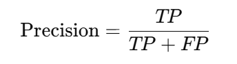
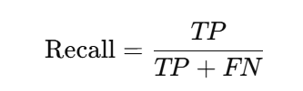
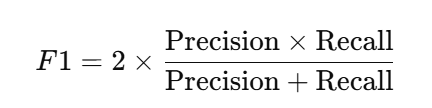

# ✅Prompt评测方法

当我们设计开发出了一个提示词后，是否能让大模型给出我们想要的、高质量的回答。那就需要一套方法来评估它是否真的有效，或者说是绝大多数场景下是有效的。大模型提示词的评测方法主要分为两类：**人工评测** 和 **自动评测**。

针对提示词的评测，其实主要还是靠人工评测的，所谓的炼丹过程，就是提示词调优的过程，只有一次一次的根据问答结果，不断的调整，才能让提示词更好，而一个提示词到底好不好，很多时候机器不如人的感受更加直接和明显。

人工评测

利用行业专家或目标用户，根据他们的**主观判断、专业知识和实际体验**，对模型输出的质量进行主观评估和打分。人工评测就是评测的**最权威、最可靠的评估方式**，最贴近实际用户的体验，但缺点是**成本高、耗时长**。

人工评测通过人工打分或标注来评估模型输出质量，更能捕捉文本的主观质量。

评测维度

在设计人工评测标准时，可以从以下几个维度入手**（不同任务的侧重点不一样）**：

| **维度** | **说明** |
| --- | --- |
| 相关性 | 输出是否与提示词要求紧密相关，没有偏题。 |
| 准确性 | 信息是否真实、无错误，没有胡编乱造。 |
| 逻辑性 | 思维是否连贯、结构合理，没有前后说法不一致的情况出现。 |
| 流畅性 | 语言是否自然、表达是否顺畅，没有出现胡言乱语的情况。 |
| 创造性 | 是否展现出创造性的思维，或者全新的思维角度。 |
| 完整性 | 内容是否覆盖了用户的全部任务要求。 |
| 有害性 | 是否包含偏见、歧视、暴力或不安全内容。 |

如何打分？

除了上述维度，还需要明确评委应当如何进行判断和反馈，常见的方式有两种：

- **绝对评分：**对每一个结果**单独打分**（例如 1-10 分），不需要与其他结果比较。这用于衡量单个提示词的**绝对质量**是否达标。
- **相对排名：**同时看到由不同提示词生成的多份结果，并**选择相对最优的结果**。这用于精确地比较**不同提示词设计间的差异性**，常用于最终的优化决策。

自动评测

有的时候，人工评测的工作量比较大，那么也可以借助自动评测，但是记住，自动评测一般是适合特定场景的。

评测指标

**准确率**和**召回率**是用于评估分类模型（尤其是二分类问题）性能的指标。它们从两个不同的角度来衡量模型的好坏，通常此消彼长，需要权衡。

比如我们有一个模型，任务是从100个人中识别出谁是“坏人”（正类），谁是“好人”（负类）。

首先，我们需要了解一个更基础的表格——**混淆矩阵**，它是计算所有指标的基础。

模型的预测结果和真实情况组合，会得到四种情况：

|  | 真实是“坏人” (正类) | 真实是“好人” (负类) |
| --- | --- | --- |
| 预测为“坏人” | 真正例 (TP) | 假正例 (FP) |
| 预测为“好人” | 假负例 (FN) | 真负例 (TN) |

我们来逐一解释：

- **TP：你预测他是坏人，他确实是坏人。 -> 抓对了**
- **FP：你预测他是坏人，但他其实是好人。 -> 冤枉了好人**
- **FN：你预测他是好人，但他其实是坏人。 -> 放跑了坏人**
- **TN：你预测他是好人，他确实是好人。 -> 判断正确**

**精确率**：模型“认为对的”结果中，有多少是真的对的。

**准确率讲求的是：“宁缺毋滥” **：我抓的人，要尽量保证每一个都是真正的坏人。我不在乎有没有漏掉几个坏人，但我非常在乎不能冤枉好人。典型场景：垃圾邮件标记。

**召回率**：所有“真的对”的结果中，模型找回了多少。

**召回率讲求的时候“宁可错杀一千，不可放过一个”**：我的目标是尽可能把所有的坏人都抓出来。即使这意味着可能会误抓一些好人，我也要确保漏网的坏人越少越好。典型场景：疾病筛查。

**Precision@K（查准率）**：关注的是**“准不准”**。它衡量的是你返回的前 K 个结果里，有多少是靠谱的。比如前 5 个里有 3 个相关，Precision@5 就是 3/5 = 0.6。**Recall@K（查全率）**：关注的是**“全不全”**。**在所有真正相关的文档中，系统成功把它们“捞”进前 K 个结果里的比例是多少？**比如总共 10 个相关文档，你只找到了 3 个，Recall@5 就是 3/10 = 0.3。

**F1 Score**：**F1 Score是平衡精确率和召回率的指标**，F1分数是准确率和召回率的调和平均数。它同时考虑了这两者，只有当准确率和召回率都很高时，F1分数才会高。

评测方法

- **BLEU**： 主要用于机器翻译，通过比较生成文本和参考文本之间的n-gram重叠度来打分。
- **ROUGE**：  与BLEU关注精确率不同，ROUGE更关注召回率，即参考摘要中的词有多少被生成的摘要覆盖到了。
- **METEOR**： 比BLEU更先进，考虑了同义词、词干化等，与人类判断相关性更高。
- **BERTScore**： 利用BERT等预训练模型的上下文嵌入，计算生成文本和参考文本在语义空间上的相似度，更能捕捉语义相似性。

基于更强模型的评测

这是目前大模型领域最流行和实用的自动评测方法，它用模型来弥补传统指标的不足。

- **方法：** 借助一个**能力更强、更稳定的模型**（比如参数量更大、规模更大），让它扮演“**专家裁判**”。我们给这个“裁判模型”一个详细的**评分准则**（如：逻辑性、完整性、真实性、与提示词任务的关联度等），让它对被测模型针对提示词的输出进行打分。

prompt：你是一个公正的裁判。请比较以下两个模型对同一个问题的回答，从‘准确性和帮助性’维度判断哪个更好。只输出‘A’或‘B’。

- **优势：** 速度快、成本低于人工，最重要的是，**它能评估主观、复杂的文本质量**，让自动评测的结果更接近人类的主观判断。

---

来源: https://thoughts.aliyun.com/workspaces/6963289eb0fc2e001bb052eb/docs/69637a3e51b1440001126a05
