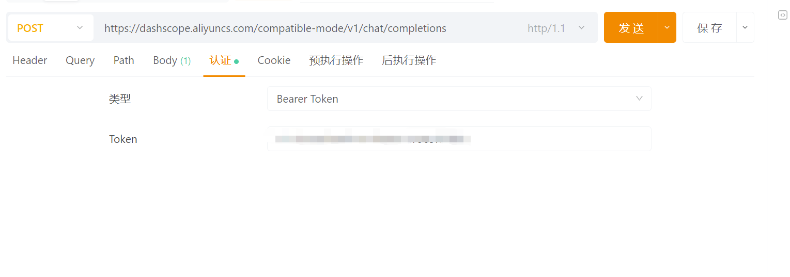
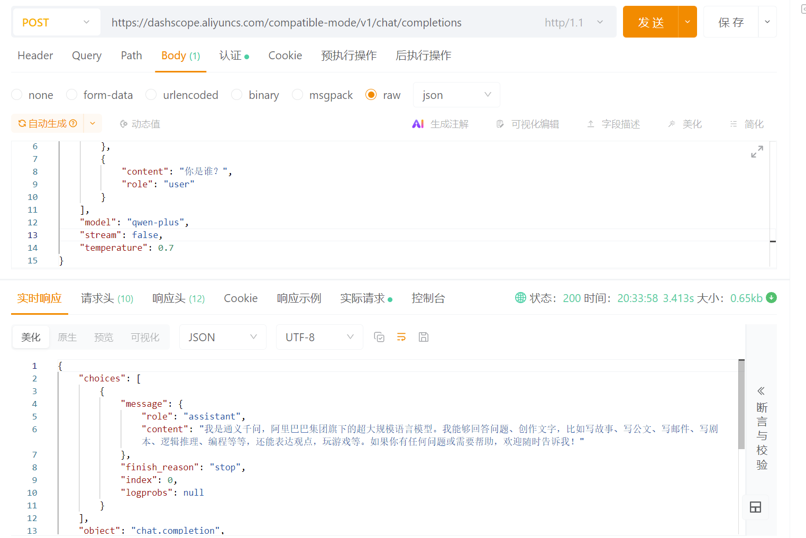
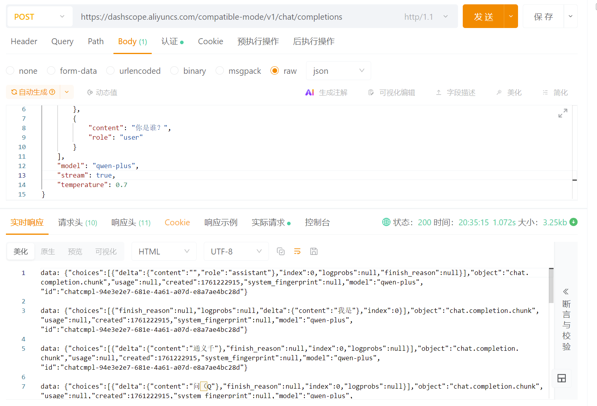

# ✅理解 OpenAI API

这一章节介绍了很多和提示词有关的内容，提示词的好坏决定着模型的输出效果，但是其实，模型是否能正常输出，以及输出的效果好不好，还有一些其他的参数也会有所影响。

这一篇我们介绍下其他一些和模型输出有关的内容，重点讲解下我们后续课程中会高频使用到的OpenAI 的API。

OpenAI API 几乎是所有基于大模型应用开发的**底层基础**（有部分大模型有自己的标准，比如早期Azure的大模型与OpenAI的并不兼容）。无论构建什么样的智能应用场景，开发的核心逻辑始终围绕这个API 的组合调用展开的。在很多智能体框架中，如SpringAI、Langchain、Autogen等等，他们都很好的对这个API进行了深度封装，但是不论框架如何封装设计，最终都会归结为向大模型的 API 接口发送一个格式化的 **HTTP 请求**。甚至，我们可以只用一个httpclient即可开展我们的智能体应用开发。

目前主流的大模型几乎都已经完全兼容OpenAI的接口规范（[https://platform.openai.com/docs/overview](https://platform.openai.com/docs/overview) ），OpenAI API 已成为事实上的**行业标准接口**。所以说，只有先了解清楚OpenAI API的**调用方式、入参、出参、流式/非流式输出**，才能算真正理解大模型应用开发的底层原理。（百炼API文档：[https://bailian.console.aliyun.com/cn-beijing/?tab=doc#/doc/?type=model&url=2579562](https://bailian.console.aliyun.com/cn-beijing/?tab=doc#/doc/?type=model&url=2579562) )

入参说明

还记得我们在文档给大家讲解使用的脚本么：

```
import os
from openai import OpenAI

try:
    client = OpenAI(
        # 替换成你自己的ak
        api_key="<your key>",
        base_url="https://dashscope.aliyuncs.com/compatible-mode/v1",
    )

    completion = client.chat.completions.create(
        model="qwen-plus",
        messages=[
            {"role": "system", "content": "You are a helpful assistant."},
            {"role": "user", "content": "你是谁？"},
        ],
    )
    print(completion.choices[0].message.content)
except Exception as e:
    print(f"错误信息：{e}")
```

以上其实就是一个标准的Open AI的API调用代码， 其中的重要参数我们也能发现有很多。

**base_url：**模型服务器地址。

在各种智能体框架和低代码平台中，都会要求配置此参数以指定请求发送到哪个模型服务器。

**格式说明：**

**完整的 API 接口路径通常是：https://域名地址（或者ip+port）/v1/chat/completions**

但是大多数智能体框架（如 LangChain、Autogen等等）默认会拼接 **/chat/completions**，因此我们只需配置到：**https://域名地址/v1/ **即可。

而在我们课程中用的最多的SpringAI，他不太一样的点就是，他默认拼接的是：**/v1/chat/completions。所以在SpringAI框架中的配置是只到v1之前。**

**常见模型的base_url：**

- **Chatgpt：**https://api.openai.com/v1
- **通义千问：**https://dashscope.aliyuncs.com/compatible-mode/v1
- **DeepSeek：**https://api.deepseek.com/v1
- **本地模型：**http://<IP地址或域名>:<端口号>/v1 （如ollama：http://localhost:11434/v1）

| **参数名称** | **是否必填** | **数据类型** | **作用** | **参数说明** |
| --- | --- | --- | --- | --- |
| **api_key** | **必填** | **String** | **身份验证** | **在 HTTP 请求头 (Authorization: Bearer <API Key>**<br>**) 中设置，用于验证身份信息、授权访问、计费等。** |
| **model** | **必填** | **String** | **指定模型** | **确定使用哪一个具体的大模型（如 qwen-plus）。** |
| **messages** | **必填** | **Array** | **消息列表** | **传递给模型的对话历史或指令。包含 role（角色：system、user、assistant）和 content(内容)。** |
| **temperature** | **非必填** | **Float** | **温度系数** | **0.0 到 2.0 （部分模型是0.0-1.0）。控制大模型输出的随机程度。低值更稳定，高值更随机。**<br>**高多样性**（示例`temperature`=0.9）：适用于需要创意、想象力和新颖表达的场景，如创意写作、头脑风暴或市场营销文案。<br>**高确定性**（示例`temperature`=0.1）：适用于要求内容准确、严谨和可预测的场景，如事实问答、代码生成或法律文本。<br>**通常建议默认0.7即可。** |
| top_p | 非必填 | Float | 核采样 | 与温度系数类似（但算法不同），0.0 到 1.0 。<br>控制大模型输出的随机程度。低值更稳定，高值更随机。<br>高值的输出不会像温度系数那么极端。通常不要与温度系数同时调整，只需调整其中之一即可。 |
| **max_tokens** | **非必填** | **Integer** | **模型最大输出长度** | **限定模型单次响应可以生成的最大 Token 数量，影响大模型的回复长度。** |
| n | 非必填 | Integer | 生成次数 | 请求 API 为给定的 Prompt 生成 n 个不同的回应。 |
| **stream** | **非必填** | **Boolean** | **流式输出** | **默认为false，如果设置为 true，模型会流式返回 Token，而不是等待整个回复生成完毕。非常重要，用于提升用户体验。** |
| stop | 非必填 | String/Array | 停止标记 | 字符串或字符串列表。模型一旦生成列表中的任一字符串，就会立即停止生成。 |
| presence_penalty | 非必填 | Float | 出现惩罚 | -2.0 到 2.0。<br>较高的正值：鼓励模型引入新话题和新词汇，生成的文本会更加多样化。<br>较低的负值：减少新话题的引入，生成的文本会更加集中和一致。 |
| frequency_penalty | 非必填 | Float | 频率惩罚 | -2.0 到 2.0。<br>较高的正值：减少重复词语的出现，生成的文本会更加多样化。<br>较低的负值：增加重复词语的出现，生成的文本会更加一致和连贯。 |
| seed | 非必填 | Integer | 复现性种子 | 如果设置，有助于在多次调用中复现相同的输出，提高结果的可预测性（并非 100% 保证）。 |

以上就是OpenAI API的全部入参字段，**加粗标记的就是正常我们使用的最多的标准字段**，其他字段基本可以不用设置，因为设置的不好就非常可能会导致模型输出的不确定性，使用默认值即可。

调用示例

**通义千问：**

[https://dashscope.aliyuncs.com/compatible-mode/v1/chat/completions](https://dashscope.aliyuncs.com/compatible-mode/v1/chat/completions)

**一个简单的标准入参：**

```text
{
  "messages": [
    {
      "content": "you are a helpful asistant.",
      "role": "system"
    },
    {
      "content": "你是谁？",
      "role": "user"
    }
  ],
  "model": "qwen-plus",
  "stream": false, // 非流式，true就是流式输出
  "temperature": 0.7  // 用于控制模型的输出多样性，建议默认0.7，要求结果更加稳定可以设置0.3，太低则可能会触发某些模型的死循环输出
}
```

**postman调用：**我们可以使用postman工具来调用一次试试看，首先在请求头存放你的api_key。



**非流式调用：**



**流式调用：**



输出字段说明

非流式输出

| **参数名称** | **数据类型** | **作用** | **参数说明** |
| --- | --- | --- | --- |
| **id** | **String** | **唯一标识符** | **本次 API 请求的唯一 ID** |
| object | String | 响应对象类型 | 固定为 "chat.completion" |
| model | String | 模型名 | 实际使用的模型名称 |
| created | Integer | 时间戳 | API 响应创建的时间戳 |
| **choices** | **Array** | **输出列表** | **列表中的 choices[0].message包含完整的回复或工具调用信息。** |
| usage | Object | Token 统计 | 计费的核心依据，token消耗 |
| **choices[i].message.content** | **String** | **生成文本结果** | **模型生成的全部文本内容。如果模型选择调用工具，此字段可能为空。** |
| **choices[i].message.tool_calls** | **Array** | **工具调用请求** | **智能体应用的核心参数。当模型判断需要调用外部工具时，此字段会包含要调用的函数名和参数。（后续会详细介绍）** |
| choices[i].finish_reason | String | 停止 | 停止原因，默认stop |

以上加粗标记的字段，是非流式输出通常最关注的字段，尤其是**choices[i].message.content和choices[i].message.tool_calls**，这两个就是我们后续开发智能体应用的核心参数。**一切的智能体开发主要都是围绕这两个核心参数进行的。**

流式输出

| **参数名称** | **数据类型** | **作用** | **参数说明** |
| --- | --- | --- | --- |
| **id** | **String** | **唯一标识符** | **本次 API 请求的唯一 ID，在每个数据块中都相同。** |
| object | String | 响应对象类型 | 固定为 "chat.completion.chunk" |
| **model** | **String** | **模型名** | **实际使用的模型名称。** |
| created | Integer | 时间戳 | API 响应创建的时间戳 |
| **choices** | **Array** | **分块输出列表** | **列表中的****delta****字段包含本次生成的文本内容。** |
| usage | Object | Token 统计 | 通常为 null，最后一个流会输出 |
| **choices[i].delta.content** | **String** | **流式生成的文本** | **本次数据块新增的极小部分文本。应用需要自己将所有块的content拼接起来才能得到完整回复。** |
| **choices[i].finish_reason** | **String** | **停止** | **仅在最后一个数据块中返回。当它出现时，表示流式输出结束。** |
| **choices[i].tool_calls** | **Array** | **工具调用** | **智能体应用的核心参数。****当模型判断需要调用外部工具时，此字段会包含要调用的****函数名****和****参数****。（后续会详细介绍）** |

以上加粗标记的字段，是流式输出通常最关注的字段，尤其是**choices[i].delta.content和choices[i].tool_calls**，与非流式输出一样，**一切的智能体开发主要都是围绕这两个核心参数进行的。**

---

来源: https://thoughts.aliyun.com/workspaces/6963289eb0fc2e001bb052eb/docs/696387d23fb9180001f4186d
