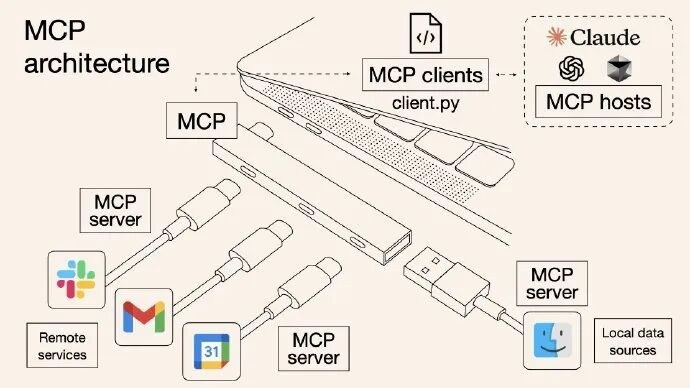
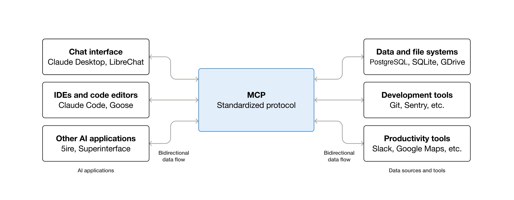
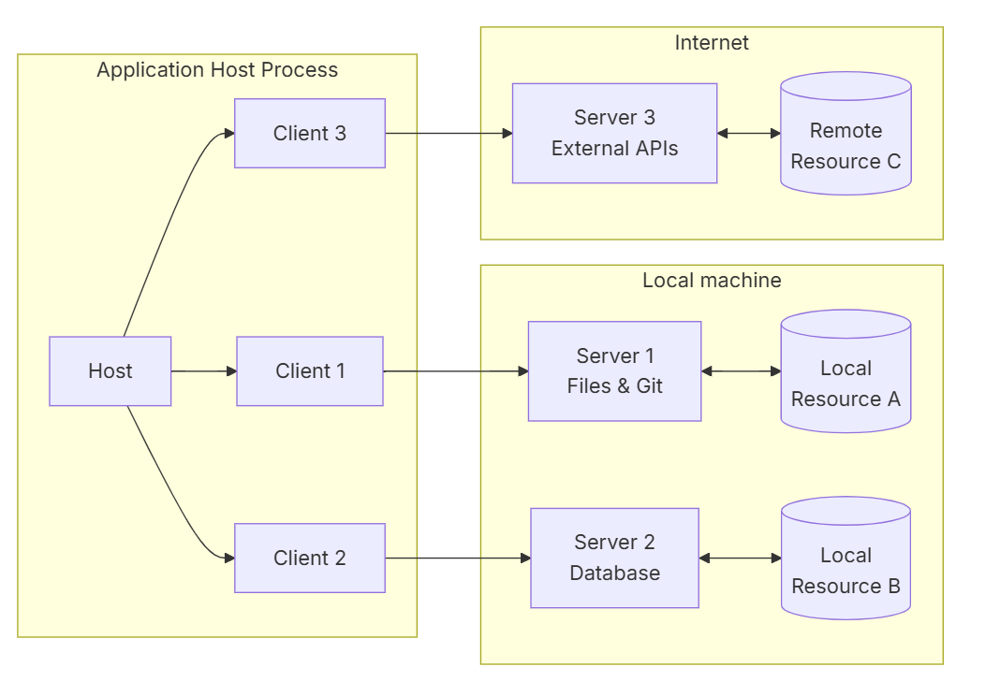
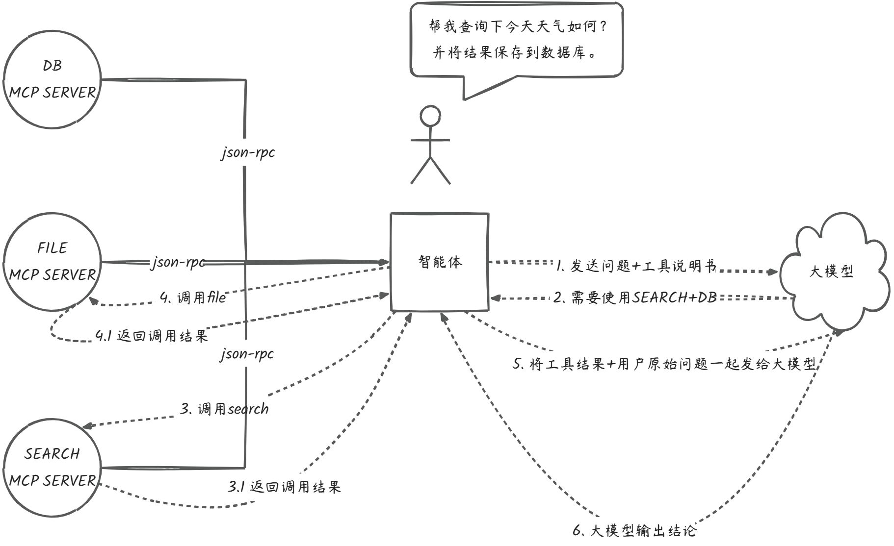
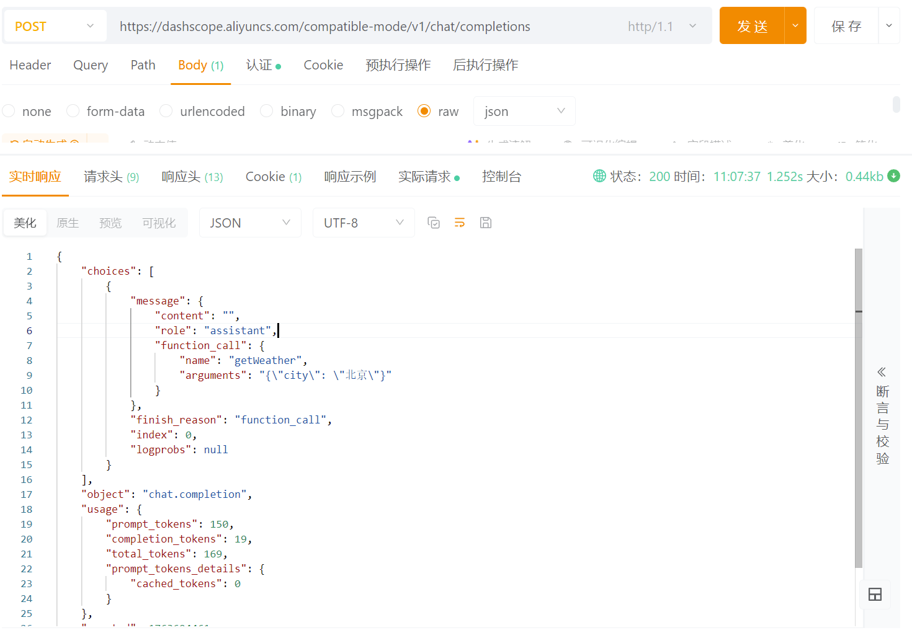

# ✅什么是MCP？

MCP，全称是 **Model Context Protocol（模型上下文协议）**。它是由 Anthropic 开源，旨在解决大模型与外部世界“沟通不畅”的问题。

首先需要理解的是：它不是一个具体的框架或技术，而是一个**通用开源标准协议**，用于安全、高效地连接智能体应用与外部工具。其核心理念就是赋予智能体应用类似 **USB 接口**的功能：只需遵守统一的协议，就能标准化地调用各种外部工具，从而实现即插即用。**你完全可以把 MCP 理解为是智能体连接外部工具的 USB 接口。**



比如，以前如果你想让大模型读取你的数据库，你必须为这个特定的智能体写一段专门的 **function call** 代码。如果你换一个智能体，这代码可能就得重新写一遍。现在有了 MCP 后，你只需要把数据库的一些列操作包装成一个 **MCP Server**。任何支持 MCP 的客户端（如 Claude Desktop, Cursor，Cline等）都能直接连接上这个server使用工具，无需重复**造轮子**。

借助MCP，工具都遵循统一的调用协议，智能体则能够更加丝滑地与外部工具交互。社区中已经公开了大量可用的 MCP Server 工具，而这些工具的功能和能力，将直接决定智能体在实际任务中的执行效果。

下面这张图是来自 MCP 官网的架构图，可以直观地感受到 MCP 协议的“枢纽”作用：中间的 MCP 协议层作为统一标准，连接了左侧的智能体客户端（如 Claude、IDE）和右侧的工具（如数据库、文件系统等）。它将原本没有复用性的点对点连接，简化为了统一的接口调用，意味着只要支持 MCP 标准，左侧的任意客户端应用都能**“即插即用”**地连接右侧的任意工具，真正实现了智能体和工具的**功能解耦**。



MCP 和 Function Call 有什么区别？

在理解了 MCP 的整体架构之后，我们再回到一个核心问题：**MCP 与传统的 Function Call 有什么区别？**从表面上看，二者似乎都是为了让智能体调用工具，但实际上，它们在抽象层级、复用能力和工程复杂度上有着本质差异。

**Function Call 流程痛点：**

在传统的 Function Call 模式中，整个流程本质上是一种 **“硬编码式集成”**。每次的工具集成，都是一次完整的开发，不可避免的就回重复造轮子、强耦合。**所有环节都要由开发者自己实现。**

并且这些逻辑全部都必须得在智能体内部“写死”。如果智能体数量增加，则每个智能体的接入代码都要重复书写。随着工具规模扩大，系统的耦合度越来越高，智能体的扩展成本也会急剧上升。

**下面引用一张MCP官网的架构图来进行说明，MCP是如何解决Function call的硬编码问题的。**

MCP 通过清晰的 **Client–Server 分层架构** 解决了传统 Function Call 的“强耦合、难扩展、难管理”问题。工具不再需要嵌入到智能体内部，而是以独立的 MCP Server 暴露能力；Client 负责通过 JSON-RPC 与 Server 进行能力协商与通信；智能体则统一管理权限、上下文整合与大模型的调用。这样一来，工具接入不再需要在智能体中硬编码逻辑，功能边界更清晰，智能体也能通过工具的组合与复用轻松扩展。



通俗来讲，Function Call 是**“智能体直接带着自制的工具去工作”**，而 MCP 则通过一套标准的协议与架构，把工具变成独立服务，由智能体统一调度，就像**“在工具商店，挑选专业制造商制造的工具去工作”**。智能体只需通过协议查询和调用，无需了解工具的内部实现即可直接使用，从而真正实现了工具的模块化、标准化和可插拔化。

MCP 工作流程

下面用一张图，描述一下智能体通过MCP是如何来工作的。



**第一阶段：初始化（工具说明获取）** 智能体初始化的时候，会通过 MCP 协议向所有连接的 MCP Server 使用**JSON-RPC **协议请求工具说明书。MCP Server 负责提供并确保这些说明书是**标准化的JSON格式**。

**第二阶段：决策（大模型规划）** 智能体将用户的原始问题和获取到的所有标准化工具说明，一同发送给大模型。大模型根据这些信息进行规划，并返回一个清晰的**工具调用指令**。

**第三阶段：调用（执行与结果回传）** 智能体接收到指令后，立即通过 **MCP 协议**请求对应的 MCP Server 执行工具操作。MCP Server 完成实际的工具逻辑（如数据库查询），并将**原始执行结果**返回给智能体。

**第四阶段：总结（生成最终回复）** 智能体将用户原始问题+工具执行的**最终结果**+完整的对话历史，再次发回给大模型。大模型基于这个结果进行总结，生成一段自然语言回复，输出给用户。

我们可以看到在**初始化和调用阶段**，我们都用到了**MCP协议**。在**初始化阶段**，它通过标准化的 **JSON-RPC** 协议解决了**工具说明书获取**的问题，确保了工具说明书的可读性。而在**调用阶段**，MCP 协议则将大模型指令转发给 Server 执行实际操作，确保了工具的执行逻辑。

工具调用的本质

通过上述流程，我们可以清晰地界定智能体与大模型的职责：**大模型**在工具调用中扮演的始终是**决策者**和**规划者**的角色，它只负责输出调用哪个工具、传入什么参数的指令。而工具调用的**实际执行者**，其实是**智能体本身（智能体框架基本都封装好了）**。是智能体接收到大模型的决策指令后，才会去请求服务、执行操作并获取结果，大模型自身并不参与服务的实际调用。

不论是 Function Call 还是 MCP，它们在底层与大模型的交互，本质上都要回到同一种能力：**向模型发送带有工具定义（schema）的对话请求，让模型基于这些标准化描述返回结构化指令**。下面的例子中，我们把用户消息与工具说明一起发送给模型，让模型根据工具说明生成 JSON 格式的函数调用参数。因此，从大模型的角度看，它始终只是在**读取你提供的工具说明书（schema），并给出“该调用哪个工具、参数是什么”的结构化结果。**

两者的区别只在于：**Function Call 需要由应用自行构造工具说明并封装工具实现逻辑，而 MCP 将工具说明与工具执行逻辑都封装成独立的外部服务**。

```text
POST https://dashscope.aliyuncs.com/compatible-mode/v1/chat/completions
{
  "model": "qwen-plus",
  "messages": [
    { "role": "user", "content": "帮我查询北京今天的天气" }
  ],
  "functions": [
    {
      "name": "getWeather",
      "description": "获取某个城市的实时天气",
      "parameters": {
        "type": "object",
        "properties": {
          "city": { "type": "string" }
        },
        "required": ["city"]
      }
    }
  ]
}
   
```



---

来源: https://thoughts.aliyun.com/workspaces/6963289eb0fc2e001bb052eb/docs/69638828c71a890001a2395f
