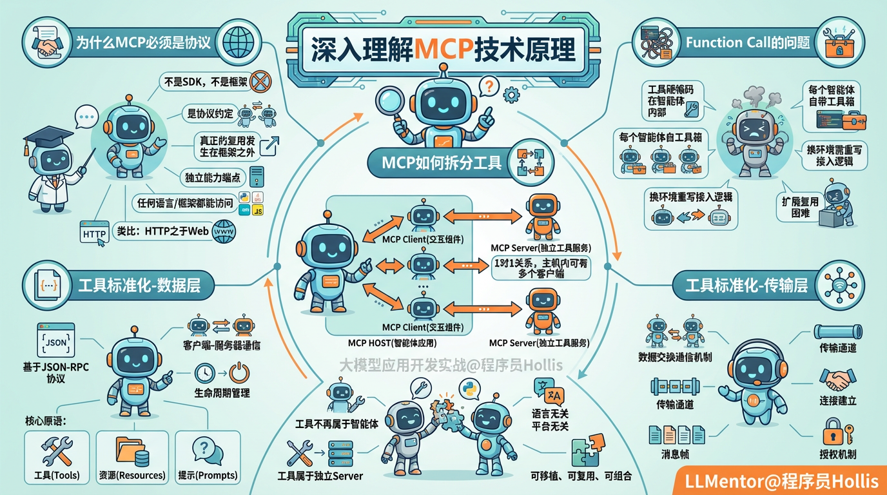
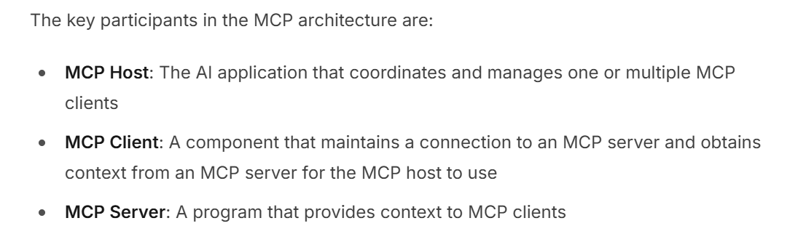
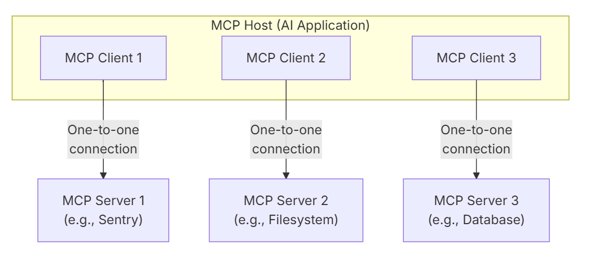

# ✅深入理解MCP技术原理（上）

在上一节中，我们已经弄清楚了 MCP 的设计初衷：它要解决智能体中“工具混乱、硬编码、难以复用、扩展代价大”等问题。

而 Function Call 的问题在于：**工具被硬编码绑定在智能体内部**，每个智能体都得自己背着一整套自定义的工具箱去工作，任何工具换环境、换智能体都得重写接入逻辑，扩展复用几乎无从谈起。

因此就产生了两个关键问题：

- **MCP 是怎么做到把工具从智能体里拆出来的？**
- **它又是通过什么机制，让工具变成了真正意义上的标准化？**

这一节，我们就要从原理出发，逐一回答这些“为什么”。

为什么 MCP 必须是协议，而不是框架？

理解 MCP 的第一原则就是：

**它不是一个 SDK，也不是一个框架，而是一种协议约定。**

这背后的核心原因只有一个：

**真正的复用，一定发生在框架之外。**

只要工具被绑定在某个 SDK 或某个框架内部，它就无法脱离该框架供其他智能体使用。

你写一个 Java SDK，Python 智能体怎么用？

工具要实现可移植、可复用、可组合，唯一办法就是：

**把工具做成一个任何人、任何语言、任何框架都能访问的“独立能力端点”。**

因此，**MCP 的本质是一种能力协商标准，而不是一种调用技术。**

**它更像是“HTTP 之于 Web”，而不是“Mybatis之于数据库”。**

**MCP 是怎么做到把工具从智能体里拆出来的？**

要让工具不再绑定某个智能体，首先必须让**工具的和智能体分离**。

MCP 之所以能够做到这一点，正是因为它设计了**“client–server”**的结构：

智能体作为**客户端**，向外部的 **MCP Server** 去请求能力；工具不再属于智能体，而属于**独立的 Server**。这种结构看似简单，却解决了此前所有工具耦合在智能体中的问题。

工具的代码不再放在智能体内部，也不再依赖于智能体的开发语言和运行环境，而是被包装为一个能够独立运行的能力端点。智能体只是与它进行通信，也不用关心工具是用 Java 写的、Python 写的，还是运行在什么平台上。这样工具就被从智能体内部拆到了系统外面，成为独立服务。

下面这个就是 MCP 官网提供的架构图。

MCP HOST 其实就是我们的智能体应用，MCP Client 就是安装在 HOST 中的一段代码，用于与MCP Server 交互获取工具信息的组件，而 MCP server 就是独立的工具服务，用于提供说明书和具体执行逻辑。从图中也可以看出，**client 和 server 是一对一的，而 host 中则可以接入多个 client 用于实现智能体的能力扩展**。

MCP 如何实现工具的标准化？

工具被拆出智能体后，接下来要解决的是工具的标准化问题。没有标准，就不可能实现复用、组合，也无法让不同的智能体理解工具的使用方式。

MCP 则是由两层标准化组成：

- **数据层**：定义了基于 **JSON-RPC** 的客户端-服务器通信协议，包括生命周期管理和核心原语，工具、资源、提示。
- **传输层**：定义了客户端和服务器之间进行数据交换的通信机制和通道，包括特定于传输的连接建立、消息帧和授权。

针对这两层标准，我们在下面的章节分别进行详细的介绍。

---

来源: https://thoughts.aliyun.com/workspaces/6963289eb0fc2e001bb052eb/docs/6964ede851b14400011465db
