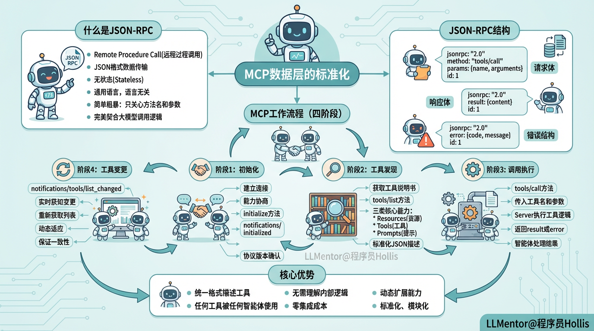

# ✅深入理解MCP技术原理（中）

MCP 数据层的标准化



**什么是 JSON-RPC 协议？**

**所有工具都必须用统一的格式描述自己——包括工具名、使用说明、参数结构、返回格式等。**

这种描述不是随意写的，而是采用严格的 JSON 格式。智能体在连接 MCP Server 的第一步，就是向其索要所有工具的说明书。这一步在 MCP 中被称为**“初始化”**，对应一次**标准的 JSON-RPC **请求。智能体无需关心工具是谁写的，也无需去理解其内部逻辑，只需要根据“说明书”就能让大模型进行决策判断，并最终发起调用。另外，工具的执行返回也遵循同样的标准格式，因此智能体无需适配不同工具的返回值，也不需要写任何特殊逻辑。

**只要按标准写了工具说明书，任何工具就能被任何智能体直接使用，不需要额外的集成成本。**

JSON-RPC 就是两个服务之间通过发送 JSON 数据来进行沟通的一种“通用语言”。

- **RPC (Remote Procedure Call)**：就是指远程过程调用。它的核心思想是：我在 A 服务上调用一个函数（比如 getWeather()），但实际上这个函数是在 B 服务上运行的，B 把结果运行完再传回给 A。
- **JSON**：所有的数据传输都使用最通用的 JSON 格式，这意味着无论你的智能体是用什么编程语言写的，大家都能看懂对方发来的信息，而且这样的请求是非常简洁高效的。
- **无状态 (Stateless)**：每一次请求都是独立的，就像寄信一样，寄出去一封，收回来一封，协议本身不记忆之前的状态。

相比于复杂的 RESTful API（需要关心 HTTP 方法、URL 路径、Header），JSON-RPC 极其简单粗暴：**只关心“需要调用的方法名”和“参数”**。这与大模型调用工具的逻辑完美契合。

MCP 中的每一次请求，本质上都是在交换JSON-RPC 2.0 标准的数据包。我们来看一下它的结构是什么样的。

**请求体：**

```text
{
  "jsonrpc": "2.0",          // 1. 版本号：必须是 "2.0"
  "method": "tools/call",    // 2. 方法名：需要执行的操作
  "params": {                // 3. 参数：执行操作需要的数据
    "name": "get_weather",   // 4. 调用的函数名
    "arguments": {
      "city": "Beijing"      // 5. 函数入参
    }
  },
  "id": 1                    // 6. ID：请求的编号号，用于匹配回信
}  
```

**响应体：**

```text
{
  "jsonrpc": "2.0",
  "result": {                // 1. 结果：成功时的返回数据
    "content": [
      {
        "type": "text",
        "text": "北京今天晴，气温 25 度"
      }
    ]
  },
  "id": 1                    // 2. ID：对应请求的 ID
}
```

**错误结构：**

```text
{
  "jsonrpc": "2.0",
  "error": {                 // 错误对象
    "code": -32601,          // 标准错误码
    "message": "Method not found" // 错误信息
  },
  "id": 1
}
```

**MCP 如何利用 JSON-RPC 工作？**

在 MCP 架构中，JSON-RPC 并不是简单的数据传输工具，而是整个工具调用、状态管理和决策执行的核心标准语言。MCP 将智能体（MCP Host）、客户端（MCP Client）和工具服务（MCP Server）的交互完全规范化，使得每一次调用都遵循相同的流程。

初始化阶段：建立连接与能力协商

当 MCP Host（智能体应用）启动时，MCP Client 会向 MCP Server 发起 JSON-RPC 请求，进行初始化。

- **能力协商**：客户端和服务端会确认协议版本、功能支持等信息。
- **准备就绪通知**：初始化完成后，客户端会发送 notifications/initialized 告知服务器自己已准备好。
- **意义**：这一阶段保证双方在同一协议下通信，建立通信基础，为后续工具发现和调用做好准备。

示例请求：

```text
{
  "jsonrpc": "2.0",
  "id": 1,
  "method": "initialize",
  "params": {
    "protocolVersion": "2024-11-05",
    "capabilities": {
      "roots": {
        "listChanged": true
      },
      "sampling": {},
      "elicitation": {}
    },
    "clientInfo": {
      "name": "ExampleClient",
      "title": "Example Client Display Name",
      "version": "1.0.0"
    }
  }
}
```

**初始化成功后，客户端必须发送****initialized****通知，表明其已准备好开始正常运行：**

**如果没有这步，服务端会认为客户端并未准备好，所以将禁止后续的其他操作。**

```text
{
  "jsonrpc": "2.0",
  "method": "notifications/initialized"
}
```

工具发现阶段：获取工具说明书

初始化完成后，客户端需要知道服务器上“有哪些工具”可以使用。

- **标准化描述**：每个工具都以 JSON 格式描述方法名、参数类型、返回格式和使用说明。
- **无需理解内部逻辑**：智能体只需知道工具能做什么、需要哪些参数、返回什么结果，无需关心内部实现。
- **动态发现**：工具可能随时变化，每次获取的都是最新工具列表。

MCP Server 对外暴露三类核心能力：

- **Resources（资源）**：可供客户端直接读取的外部数据，如文件内容、API 返回结果等。
- **Tools（工具）**：具体执行的工具服务。（核心能力）
- **Prompts（提示）**：预定义的提示词模板。

示例请求：

```text
{
  "jsonrpc": "2.0",
  "method": "tools/list",
  "params": {},
  "id": 100
}
```

响应返回所有工具的说明信息。智能体在拿到这些说明后，就可以利用大模型构建调用策略和决策逻辑。

调用阶段：执行具体工具

当智能体通过大模型决策需要调用某个工具（如 get_weather）时，通过 MCP Client 构建标准 JSON-RPC 请求发送给 MCP Server：

```text
{
  "jsonrpc": "2.0",
  "method": "tools/call",
  "params": {
    "name": "get_weather",
    "arguments": {
      "city": "Beijing"
    }
  },
  "id": 101
}
```

服务器收到请求后：

- **解析工具名和参数**：根据 name 找到对应工具执行。
- **执行工具**：独立运行工具逻辑，无需 Host 参与内部过程。
- **返回结果**：按照 JSON-RPC 的 result 或 error 返回数据。

智能体接收到返回值后，可以直接处理输出、组合多个工具结果，或者继续做下一步决策。整个流程完全无需针对每个工具写不同的适配逻辑。

工具变更阶段：处理工具列表更新

**在运行过程中**，服务器上的工具可能会发生变更（新增、下线或修改）。MCP 支持客户端实时获知变更：

- **变更通知**：服务端通过 notifications/tools/list_changed 通知客户端工具列表已更新。
- **重新获取列表**：客户端收到通知后会重新请求 tools/list，更新内部工具注册表。
- **保证一致性**：智能体始终知道最新的可用工具，实现动态适应和高可扩展性。

示例通知：

```text
{
  "jsonrpc": "2.0",
  "method": "notifications/tools/list_changed",
  "params": {}
}
```

MCP 通过 JSON-RPC 的各阶段的调用，从而实现了工具的数据层的标准化、模块化和动态扩展能力。

---

来源: https://thoughts.aliyun.com/workspaces/6963289eb0fc2e001bb052eb/docs/6964f2a63fb9180001f5e8a0
