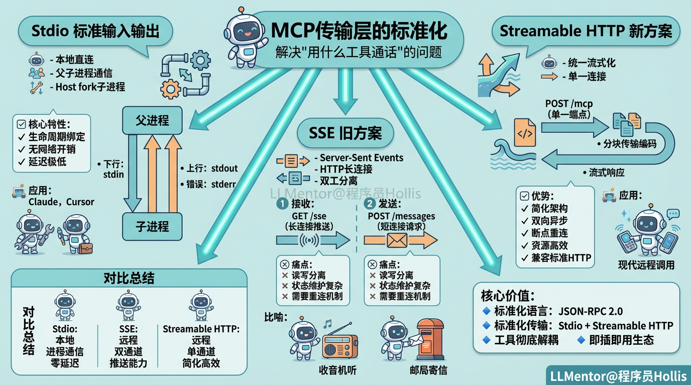
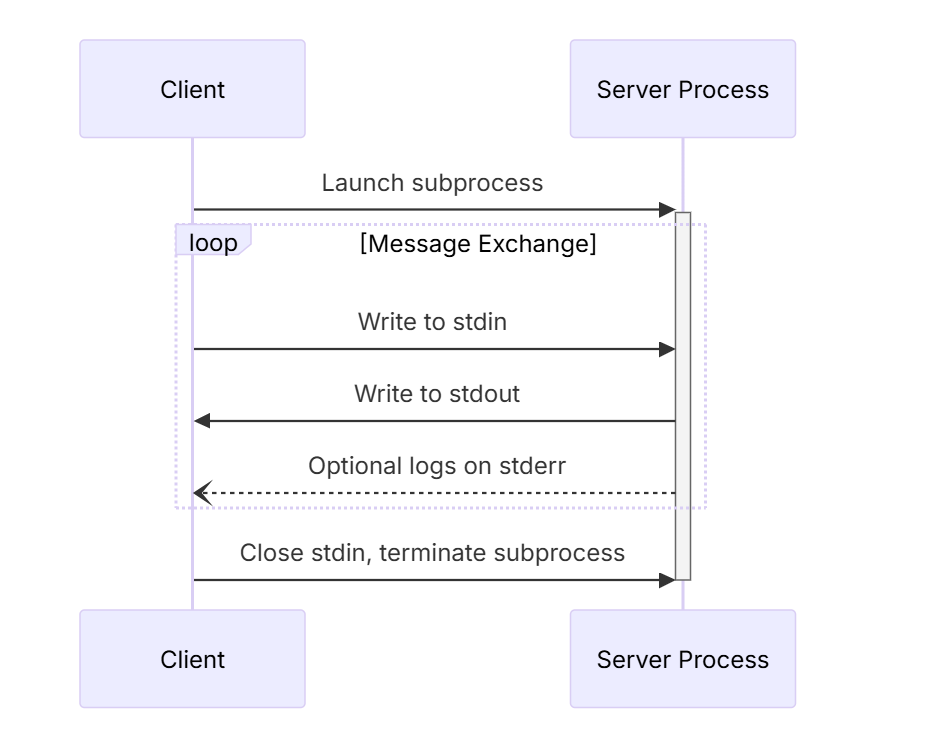
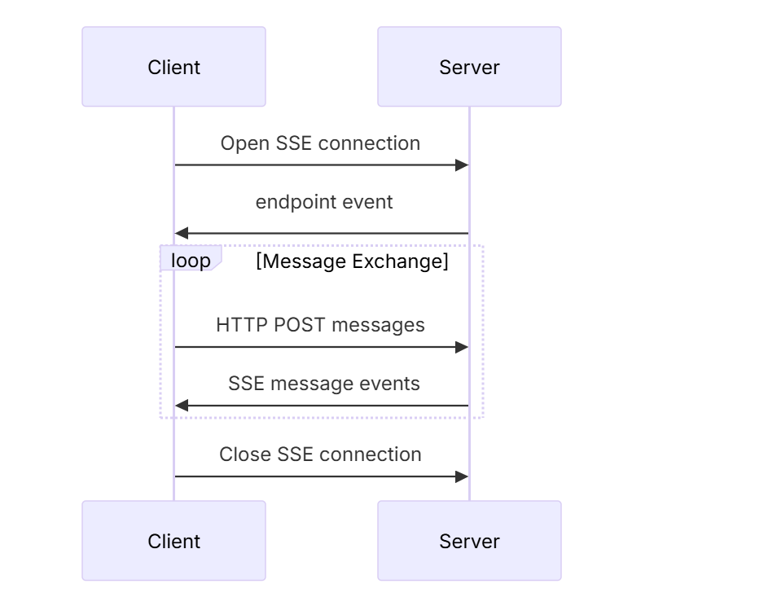
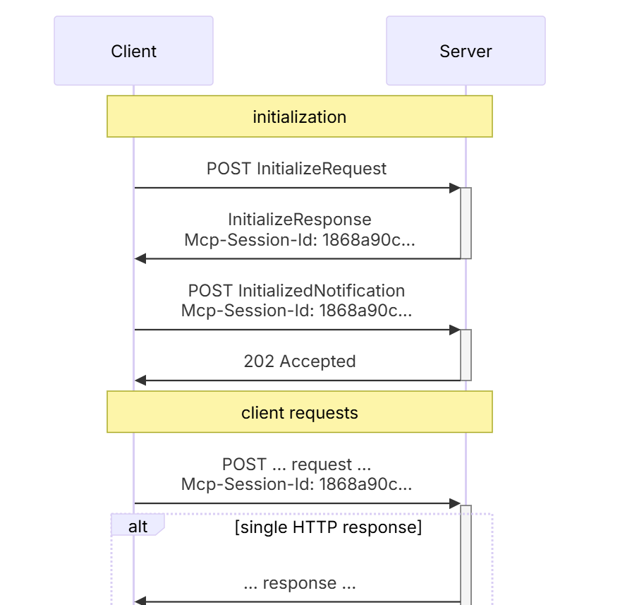

# ✅深入理解MCP技术原理（下）

MCP 传输层的标准化

在上一节中，我们理解了 JSON-RPC，搞定了 MCP 的数据层标准化。如果把 MCP 比作两个人的沟通，JSON-RPC 解决了“大家说什么语言（比如都说中文）”的问题。 那么接下来，我们必须解决“用什么工具通话”的问题。是面对面说话？打电话？还是发传真？这就是我们本节要讲的第二层标准：**传输层**。

MCP 官方前后共定义了三种主流的标准通信管道，分别对应不同的应用场景：Stdio、SSE（旧） 和 Streamable HTTP（新）。

Stdio (标准输入输出)

也就是本地直连，这是 MCP 最原始、最高效的传输方式，也是 Claude、Cursor 等本地客户端智能体的首选集成方式。

- **技术原理：父子进程** Stdio 传输不涉及任何网络协议（TCP/HTTP）。它的本质是**进程间通信**。当 MCP Host（如 Cursor）启动一个 MCP Server 时，它实际上是在操作系统中 fork 了一个**子进程**。
- **下行通道 (Host -> Server)**：Host 将 JSON-RPC 请求序列化为字符串，写入子进程的 stdin（标准输入流）。
- **上行通道 (Server -> Host)**：Server 处理完后，将结果写入自己的 stdout（标准输出流），Host 监听这个流来获取响应。
- **错误通道**：日志信息通常写入 stderr，这样不会干扰正常的 JSON 数据流。
- **关键特性：**
- **生命周期绑定**：Server 的生命周期完全由 Host 管理。Host 关闭，Server 进程随之销毁。
- **无网络开销**：数据在内存中流转，延迟极低。

SSE (Server-Sent Events)

当工具部署在远程服务器时，我们必须使用 HTTP。但在 HTTP/1.1 时代，服务器无法主动发消息给客户端。SSE 是为了解决服务端主动推送消息给客户端而引入的方案。

- **技术原理：双工分离** SSE 只能推，不能收。因此 MCP 必须建立两条独立的通道来模拟双向通信：
- **接收通道 (Events Channel)**：
- Client 发起一个 GET /sse 请求。
- Server 保持连接不关闭 (Keep-Alive)，并设置 Content-Type: text/event-stream。
- 一旦有消息（如工具执行结果、日志），Server 就通过这个长连接推送给 Client。
- **发送通道 (Post Channel)**：
- 当 Client 需要调用工具时，它无法通过 SSE 连接发送。
- Client 必须向 Server 的另一个端点（如 /messages）发起一个**新的**的 HTTP POST 请求。
- **架构痛点**：
- **状态维护**：Client 必须同时维护一个长连接（听）和一个短连接客户端（说）。
- **重连机制**：无法自动断点重连，需要双方自己实现定时心跳检测来维护长连接。

**打个比方，就像用收音机听指挥（单向接收 Server消息），但要汇报工作时，却必须另外跑去邮局寄信（独立发送）。虽然能通，但整个过程很笨重。**

Streamable HTTP

Streamable HTTP 的出现，就是为了解决 **SSE 模式中读写分离带来的架构复杂度和传统 HTTP的一次性交互无法满足 MCP 双向异步通知、以及无法断点重连 **等问题。

- **技术原理：**Streamable HTTP 的核心是**统一**和**流式化**。它将所有交互都汇集到一个标准的 HTTP POST 请求中，并利用 HTTP 的流式能力来承载 MCP 的 JSON-RPC 协议。
- **单一连接**：Client 只需要连接一个统一的端点（/mcp），无需维护两个分离的通道。
- **请求发送**：Client 将 JSON-RPC 报文（如 tools/call）放在 **POST 请求的 Body** 中发送给 Server。
- **流式响应**：Server 接收请求后，并不会立即关闭连接。它会利用 HTTP 协议的 **分块传输编码 (Chunked Encoding)** ，将响应（包括结果、日志、通知）**分批次、实时地**写入 **POST 响应的 Body** 中。
- **核心优势：**
- **简化架构**：只需要一个 HTTP 端点，不再读写分离即可实现双向异步通信。
- **灵活性强**：可以根据场景选择是否使用流式 SSE 响应，不必每次都保持长连接，支持无状态模式。
- **资源效率更高**：不用一直维持 SSE 长连接时，节省资源；需要流时也能按需开启。
- **更可靠的恢复机制**：支持断点重连，可恢复会话（通过 Session ID + Last‑Event-ID），通信更稳定。
- **基础设施更友好**：与标准 HTTP 基础设施（API 网关、负载均衡、云服务）兼容性更好。
- **向后兼容**：既可以支持新的 Streamable HTTP，也可以保留旧 SSE 通道，方便平滑升级。

| 传输方式 | 技术原理 | 传输特点 | 核心优势 | 典型应用场景 |
| --- | --- | --- | --- | --- |
| **Stdio（标准输入输出）** | 父子进程间通信，Host fork 子进程，数据通过 stdin/stdout 流动 | 下行：Host -> Server（stdin）上行：Server -> Host（stdout）错误：Server -> Host（stderr） | 生命周期绑定、无网络开销、延迟极低 | 本地客户端（如 Cursor），或者本地智能助手，高性能本地工具集成 |
| **SSE（Server-Sent Events，旧）** | HTTP 长连接，Server 主动推送消息，Client 通过 POST 发送请求 | 接收通道（GET /sse，长连接）发送通道（POST /messages，短连接） | 可远程通信，支持服务端推送 | 远程工具调用，HTTP/1.1 环境下需服务端主动推送消息 |
| **Streamable HTTP（新）** | HTTP POST 流式传输，JSON-RPC 数据分块发送 | 单一连接（POST /mcp），Server 使用分块传输（Chunked Encoding）返回响应 | 简化架构、双向异步、资源效率高、易恢复、兼容标准 HTTP 基础设施 | 远程工具调用，替代 SSE，支持双向异步通知和流式结果 |

总结

通过深入剖析 MCP 的原理，我们看到它解决了传统 Function Call 的局限，将工具从智能体内部彻底解耦，并形成**可复用、可组合**的独立能力服务 。

MCP 并非一个框架，而是一种**能力协商协议**，其核心价值在于确立了工具发现、调用和通信的**标准化语言（JSON-RPC 2.0）和传输机制（Stdio, Streamable HTTP）**。正是这种彻底的标准化和解耦，使得工具无论用何种语言编写，都能被任何智能体应用无缝接入和动态调用 ，大家都可以根据自己的需要，按照统一标准创建各种 MCP 工具服务，避免了重复造轮子。

MCP 的出现，也标志着智能体正在从**孤立的工作模式，转向即插即用的生态化协作模式。**

---

来源: https://thoughts.aliyun.com/workspaces/6963289eb0fc2e001bb052eb/docs/6964f4d351b1440001146d23
