# ✅如何接入MCP Server？

接下来就让我们进入实操环节，动手为我们的智能体接入 MCP Server，来亲身感受一下 MCP 的魅力所在。

目前主流已经有多款开发者常用的客户端（MCP Host）支持接入 MCP Server，其中最典型的有：

- **Cursor**

一款面向开发者的智能编程编辑器，原生支持 MCP 协议。Cursor 能通过 MCP 自动从外部系统获取上下文（如代码库、API、数据库等），并在对话或编辑过程中调用工具（tools），几乎是目前最完整的 MCP 客户端。

- **VS Code Cline**

Cline 是 VS Code 中的智能体工作流扩展，它内部基于 MCP 协议与外部工具交互。通过接入 MCP Server，Cline 可以调用你提供的工具、访问资源或工作环境，让 VS Code 也具备了可调用外部工具的能力，**最重要的是完全免费**。

- **Claude Desktop**

Claude 官方桌面客户端也已经内置 MCP 支持。Claude 可以能读取你的资源、执行工具、调用你注册的服务，这让 Claude 不再只是一个聊天助手，而是真正能够帮助你的智能体。

VS Code Cline

接下来我们以 Cline 为例来介绍下，如何接入 MCP Server？

首先你需要安装一个VS Code，各位可以去官网自行下载：[Visual Studio Code - The open source AI code editor](https://code.visualstudio.com/)

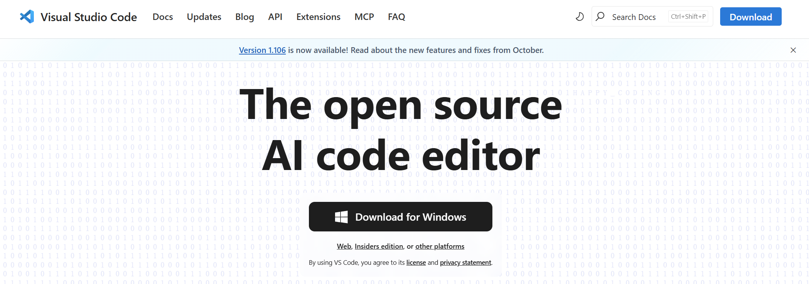

安装完成后，打开VS Code的插件管理，然后在箭头的输入框中，搜索Cline这个插件，安装即可。

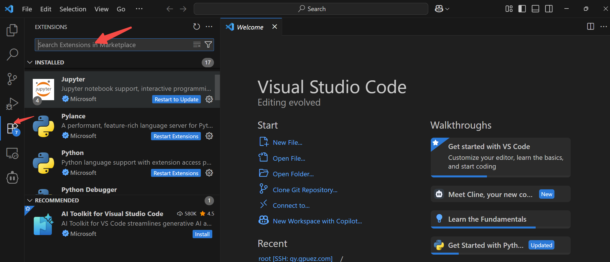

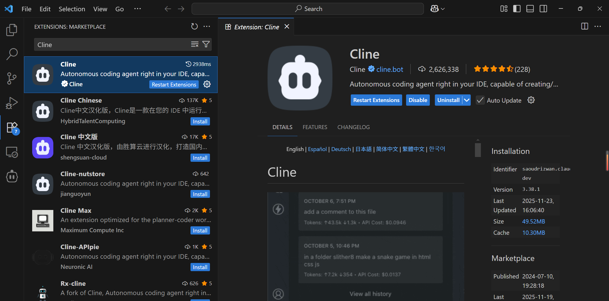

安装成功后，我们点击左边的机器人图标，即可进入Cline。

为了使用这个智能体助手，当然我们需要先配置大模型，点击右上角的齿轮按钮，进入设置界面，配置相应的大模型，这边你用千问的话，可以跟我保持一致，使用Open Compatiable。

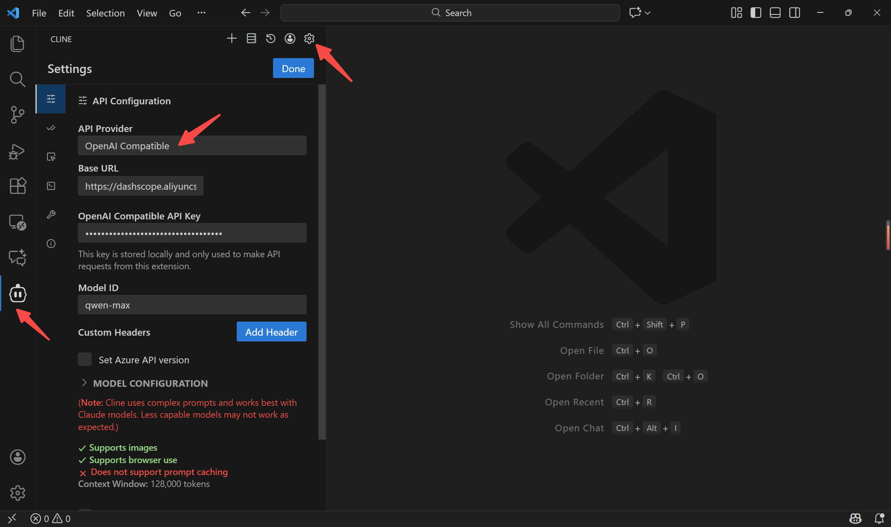

到这里你就已经拥有了一个智能助手了，只是这个智能助手只有大脑，没有四肢，没法调用工具。我们可以简单尝试提问一下。

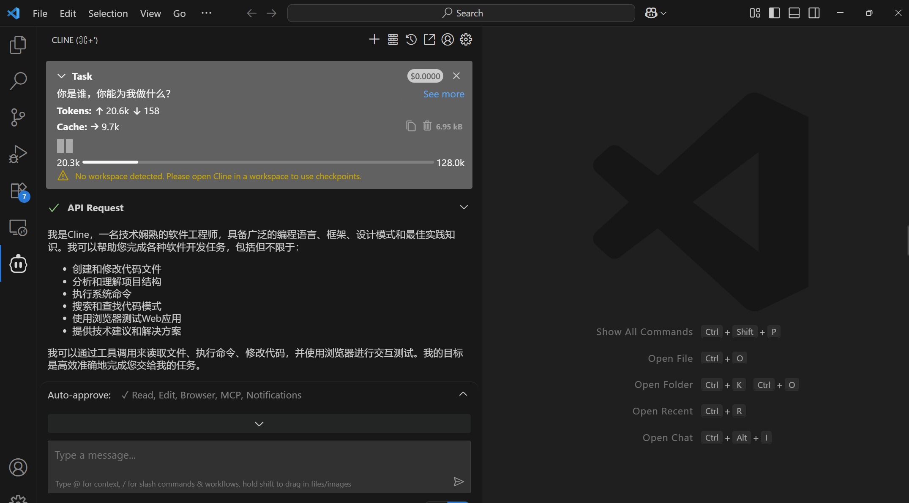

接下来我们就开始配置MCP Server，给这个智能体装上四肢。

MCP Server

NodeJs

在安装之前，我们还需要安装一下nodejs环境，因为大部分的stdio传输的MCP server都是基于nodejs开发的。可以自行去官网下载：[Node.js — 在任何地方运行 JavaScript](https://nodejs.org/zh-cn)

我本地的nodejs版本如下，各位安装完成后，可以执行这个命令看下是否安装成功。

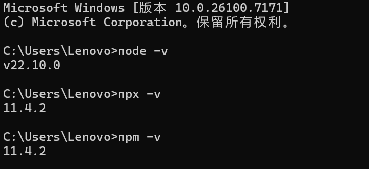

接入工具

Cline 中内置了一个MCP Server 仓库，可以方便的供你使用，点击三条杠的图标即可看到

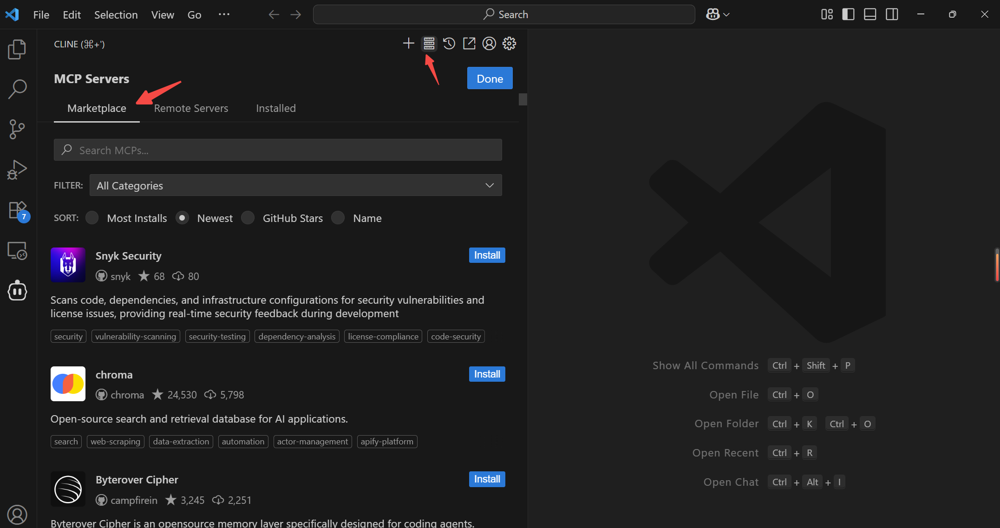

在搜索框输入“FILE SYSTEM”，我们安装一个操作本地文件的工具试试效果。

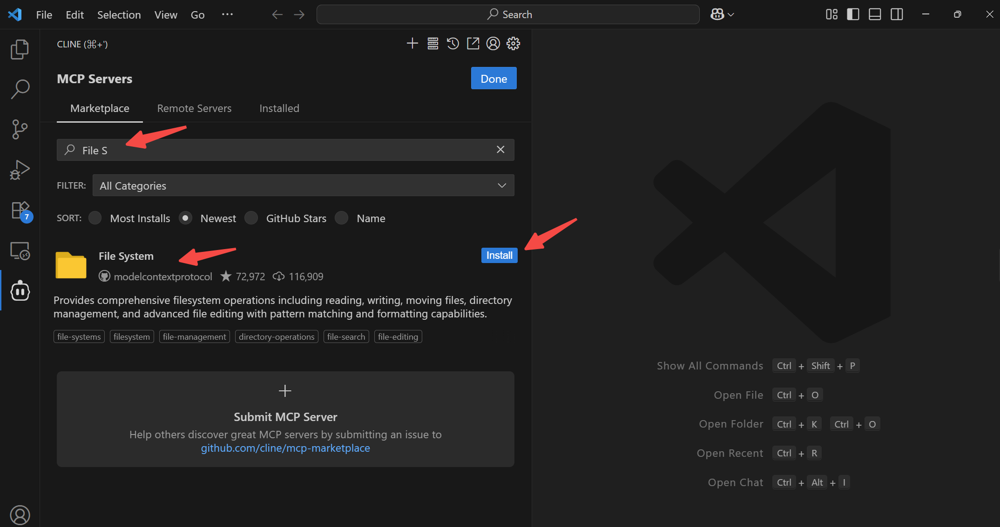

安装的时候，Cline 会请求让你同意执行某些脚本，但这些脚本在实际执行中，会存在一些问题，比如他生成的这种命令。

```text
cd C:\Users\Lenovo\Documents\Cline\MCP\filesystem-server && npx @modelcontextprotocol/create-server filesystem
```

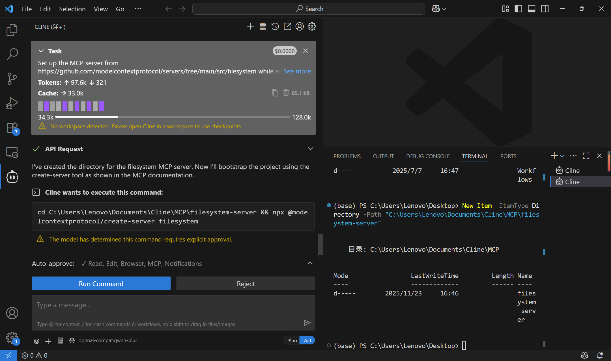

其实你直接同意执行他是会报错的，因为windows是不允许这种 && 操作的。所以你在使用这种方式的时候，是需要一些门槛的，你需要自己判断他命令是否正确，然后选择执行，这种方式既浪费大模型的token，稳定性也比较差。

其实我们的目标就是想去安装一个：npx @modelcontextprotocol/create-server filesystem，并接入到智能体中来而已。那正确的做法应该是怎么样的呢？

点击Installed，再点击Configure MCP Servers，我们可以看到右边会有一个可编辑的JSON文件。如何来配置这个JSON文件呢？

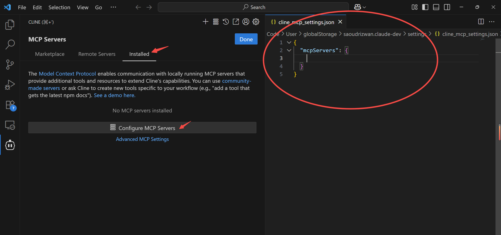

我们点击进入到刚才FILE SYSTEM那个菜单，点击就会跳转到MCP Servers官方的仓库中：

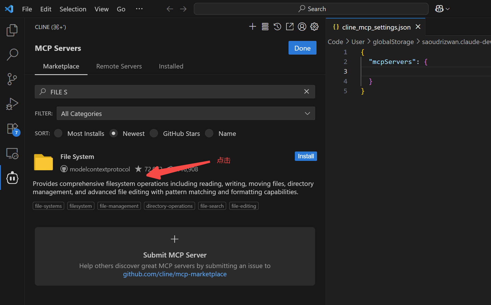

类似如下的链接：

[https://github.com/modelcontextprotocol/servers/tree/main/src/filesystem](https://github.com/modelcontextprotocol/servers/tree/main/src/filesystem)

往下翻，我们可以看到它提供了很多接入的方式，我们选择使用npx的方式来接入：

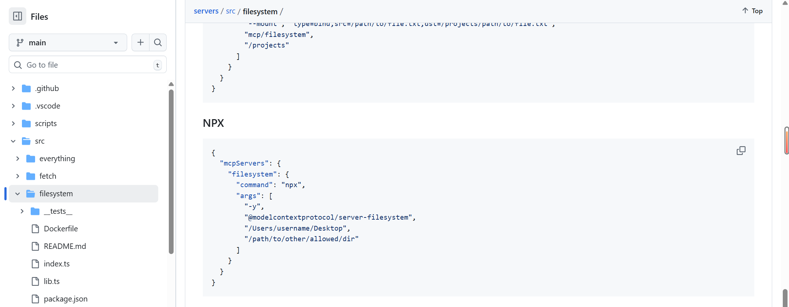

将这块内容copy到我们刚才的settings.json文件中，并做出略微的修改，让MCP服务只操作我们本地的桌面文件，然后保存。

```text
{
  "mcpServers": {
    "filesystem": {
      "command": "npx",
      "args": [
        "-y",
        "@modelcontextprotocol/server-filesystem",
        "C:/Users/Lenovo/Desktop"
      ]
    }
  }
}
```

但是windows环境跟其他环境不太一样，他在使用npx mcp的时候，必须需要调整一下命令格式，变成如下：

```text
{
  "mcpServers": {
    "filesystem": {
      "command": "cmd",  // 固定增加cmd
      "args": [
        "/c",   // 固定增加/c
        "npx",  // 后面保持与原版一致
        "-y",
        "@modelcontextprotocol/server-filesystem",
        "C:/Users/Lenovo/Desktop"
      ]
    }
  }
}
```

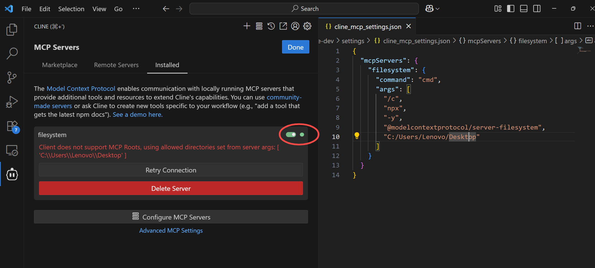

我们可以看到这时候MCP Server的后面的小圆灯就变成了绿色，说明我们的配置成功了。filesystem下面的红色的文字是一些告警，不用管它。

为了演示整体的效果，接下来我们再接入一个联网搜索的tavily工具：

可以在这个地址申请相应的APIKEY：[https://app.tavily.com/home](https://app.tavily.com/home)

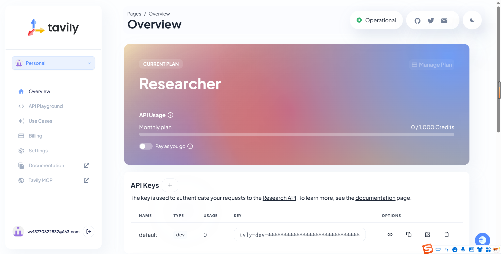

```text
{
  "mcpServers": {
    "filesystem": {
      "command": "cmd",
      "args": [
        "/c",
        "npx",
        "-y",
        "@modelcontextprotocol/server-filesystem",
        "C:/Users/Lenovo/Desktop"
      ]
    },
    "tavily-search": {
      "command": "cmd",
      "args": [
        "/c",
        "npx",
        "-y",
        "tavily-mcp"
      ],
      "env": {
        // 替换成自己的API_KEY
        "TAVILY_API_KEY": "tvly-dev-XXXXXXXXXXXXXXXXXXXXXX"
      },
      "autoApprove": []
    }
  }
}
```

完成之后，点击右上角的Done按钮，我们试着提问一下：“帮我搜索下今天南京的天气如何，并将结果保存在桌面上。”

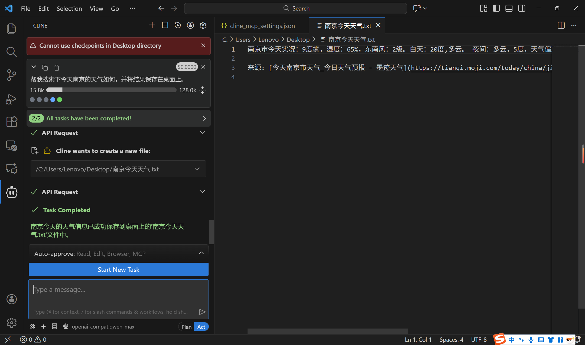

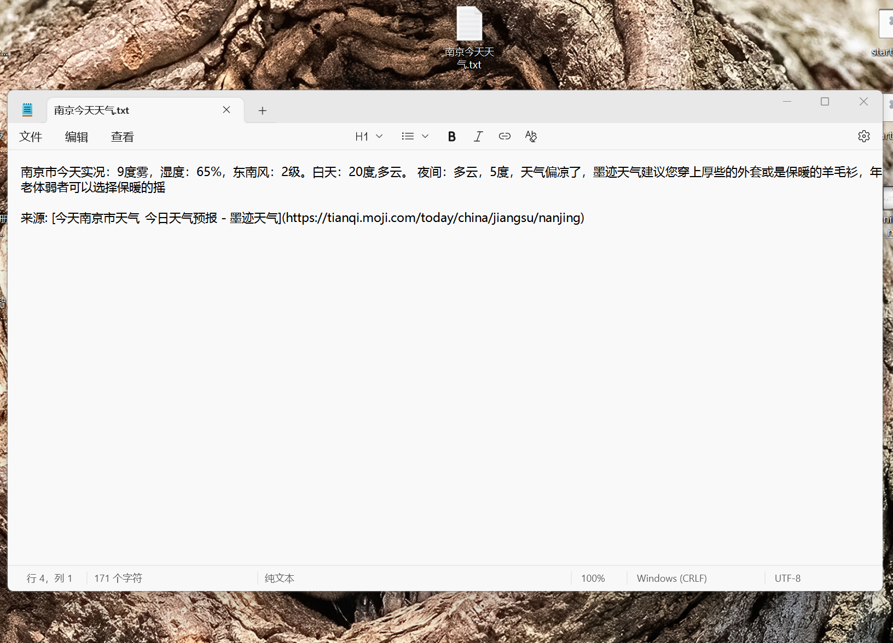

可以看出这个小助手已经成功帮我们完成了任务。目前市面上有很多的MCP Server仓库，有着大量的MCP工具供我们拿来即用，我们不需要再像以前一样，自己去写文件操作，或者联网查询的function。使用mcp，就可以快速扩展我们的智能体能力

MCP Server 仓库

MCP Server 仓库可以理解为一个集中管理的工具插件库，里面收录了各种已经实现好的能力模块，例如文件操作、数据库访问、搜索引擎等等。智能体只要接入其中的某个 MCP Server，就能立刻获得对应的能力，无需重复造轮子。可以理解为就是Java 的 **Maven 仓库**：开发者不必从头实现工具，而是像引入依赖一样，直接接入即可用，让智能体的能力扩展变得标准化、模块化、可插拔。

| **仓库名称** | **地址** |
| --- | --- |
| MCP 官方服务器仓库 | [https://github.com/modelcontextprotocol/servers](https://github.com/modelcontextprotocol/servers) |
| Awesome MCP Servers | [https://github.com/punkpeye/awesome-mcp-servers](https://github.com/punkpeye/awesome-mcp-servers) |
| GitHub MCP Server 仓库 | [https://github.com/github/github-mcp-server](https://github.com/github/github-mcp-server) |
| CLine 专属 MCP 市场 | [https://cline.bot/mcp-marketplace](https://cline.bot/mcp-marketplace) |
| [mcpservers.org](https://mcpservers.org/) | [https://mcpservers.org/](https://mcpservers.org/) |
| 阿里云百炼 MCP 服务市场 | [https://bailian.console.aliyun.com/?spm=5176.29619931.J__Z58Z6CX7MY__Ll8p1ZOR.1.3b24521cr2ypKX&tab=mcp#/mcp-market](https://bailian.console.aliyun.com/?spm=5176.29619931.J__Z58Z6CX7MY__Ll8p1ZOR.1.3b24521cr2ypKX&tab=mcp#/mcp-market) |
| Cursor 专属 MCP 资源库 | [https://cursor.directory/mcp](https://cursor.directory/mcp) |
| Smithery 平台 | [https://smithery.ai/](https://smithery.ai/) |
| mcp.so 平台 | [https://mcp.so/](https://mcp.so/) |
| Glama MCP 服务器集合 | [https://glama.ai/mcp/servers](https://glama.ai/mcp/servers) |
| Portkey MCP Servers | [https://portkey.ai/mcp-servers](https://portkey.ai/mcp-servers) |
| modelscope 社区 | [https://modelscope.cn/mcp](https://modelscope.cn/mcp) |

---

来源: https://thoughts.aliyun.com/workspaces/6963289eb0fc2e001bb052eb/docs/6965e77f51b14400011547c5
