# ✅实战：使用Spring AI开发MCP Server

Stdio

Stdio 模式通过标准输入输出与客户端通信，服务器启动后直接在控制台读写 JSON-RPC 消息，适合本地轻量化工具或无需网络的场景，要求控制台输出完全干净，保证客户端能够正确解析消息。

```text
<dependency>
  <groupId>org.springframework.ai</groupId>
  <artifactId>spring-ai-starter-mcp-server-webmvc</artifactId>
</dependency>
```

如果你的项目是响应式的，可以用这个包，但是不要和mvc混用，在IO密集的接口调用时会发生阻塞卡死。

```text
<dependency>
    <groupId>org.springframework.ai</groupId>
    <artifactId>spring-ai-starter-mcp-server-webflux</artifactId>
</dependency>
```

**Stdio 模式要求你的程序运行时，控制台输出必须是纯 JSON（JSON-RPC），不能有任何多余字符，所以必须关闭 web、关闭 banner、关闭所有日志输出。否则智能体只要解析 stdout 就会报错。**

```text
spring:
  main:
    web-application-type: none
    banner-mode: off

  ai:
    mcp:
      server:
        name: mcp-server
        version: 1.0.0
        stdio: true
        enabled: true
        type: SYNC

logging:
  level:
    root: OFF
```

编写工具，以最经典的天气查询工具为例：

```text

@Service
public class WeatherService {

    @Tool(description = "根据城市名称查询天气信息")
    public String getWeather(String city) {
        if (city == null) {
            return "请提供城市名称";
        }
        return switch (city) {
            case "北京" -> "北京: 晴, 25°C";
            case "上海" -> "上海: 多云, 22°C";
            case "深圳" -> "深圳: 小雨, 28°C";
            default -> city + ": 下雪, -20°C";
        };
    }
}
```

将MCP工具注入到ToolCallbackProvider之中

```text
@Bean
public ToolCallbackProvider weatherTools(WeatherService weatherService) {
    // 自动扫描 WeatherService 中带有 @Tool 注解的方法
    return MethodToolCallbackProvider.builder().toolObjects(weatherService).build();
}
```

配置到Cline之中，无需启动springboot，直接在Cline中配置 java jar 启动即可，看下效果

```text
{
  "mcpServers": {
    "weather-stdio": {
      "disabled": false,
      "timeout": 60,
      "type": "stdio",
      "command": "java",
      "args": [
        "-jar",
        "D:\\LLMentor\\LLMentor\\mcp\\mcp-server-stdio\\target\\mcp-server-stdio-1.0.0-SNAPSHOT.jar"
      ]
    }
  }
}
```

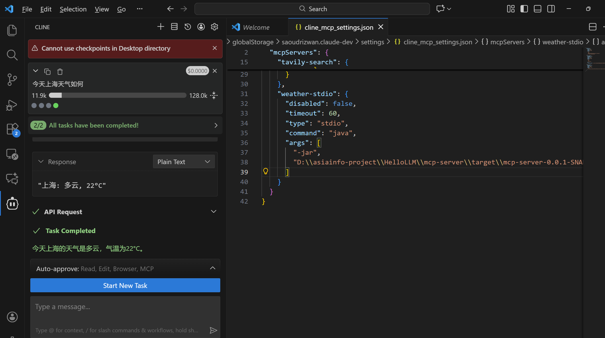

HTTP SSE

SSE（Server-Sent Events）模式基于 HTTP，采用**双端点架构**：sse-message-endpoint 是 MCP Client 用来向服务器发送请求、调用工具的接口，客户端通过约定的 JSON-RPC 协议将参数传入并获取响应。sse-endpoint 则是 MCP Client 用来监听服务器主动推送消息的通道，比如工具列表更新、状态变更等。二者配合构成了 MCP SSE 的核心通信机制，使客户端既能主动发起操作，也能实时接收服务器推送的变化，实现双向互动和高效协作。

这边和 Stdio 引入相同的jar包即可。再修改配置文件：

```text
server:
  port: 8003

spring:
  application:
    name: mcp-weather-sse
  ai:
    mcp:
      server:
        enabled: true
        name: weather-sse-server
        version: 1.0.0
        type: SYNC
        capabilities:
          tool: true
          resource: false
          prompt: false
          completion: false
        sse-message-endpoint: /mcp/messages   # 客户端发送消息的HTTP endpoint ("写信发消息")
        sse-endpoint: /sse                    # 客户端订阅SSE的endpoint （"听收音机"）
```

MCP 工具的代码与 Stdio 的保持一致，我们启动这项目，在浏览器中访问这个地址，就可以看到如下结果：

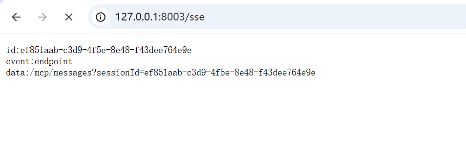

这说明我们已经与 mcp server 建立起了长连接，这个 data:/mcp/messages?sessionId=ef851aab-c3d9-4f5e-8e48-f43dee764e9e，就是指向的你发消息的端点，你可以通过向这个端点发送请求，从而和mcp server实现能力协商。我们在文档介绍了json-rpc的生命周期，正好我们借此，深入讲解一下SSE的原理，使用 postman 调用端点接口，窥探一下整个流程。

首先我们先进行初始化：

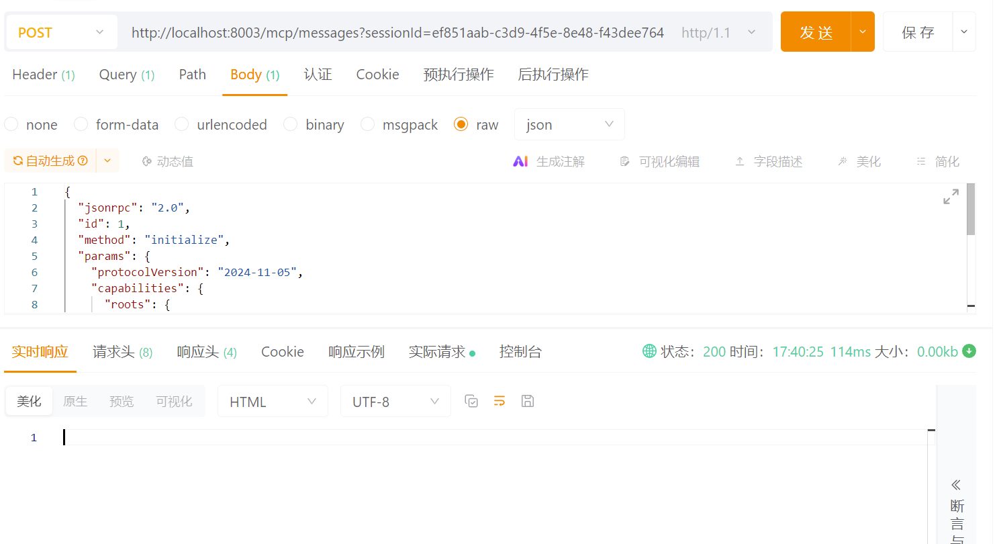

可以看到我们的长连接已经收到了 mcp server 初始化成功的消息：

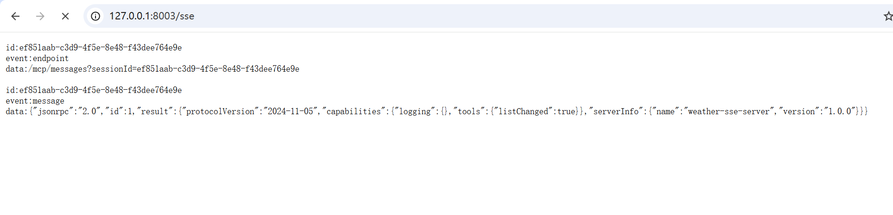

接下来我们需要告知mcp server，我的客户端也准备就绪了：

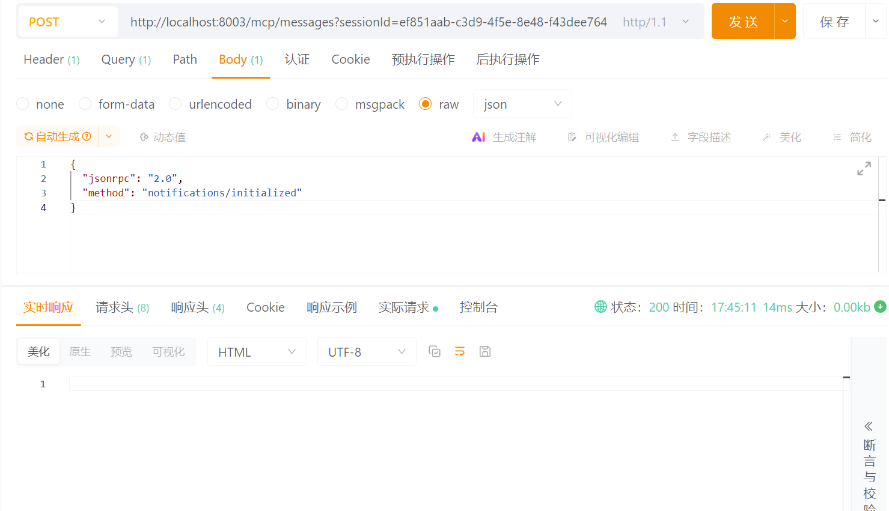

接下来就开始去查询可用工具列表了

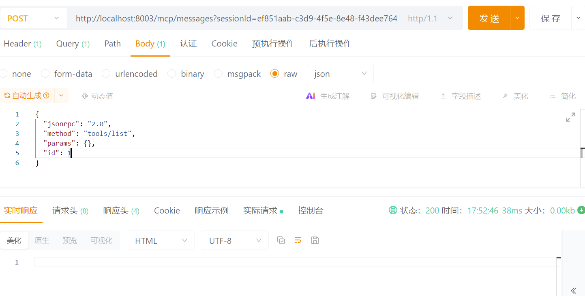

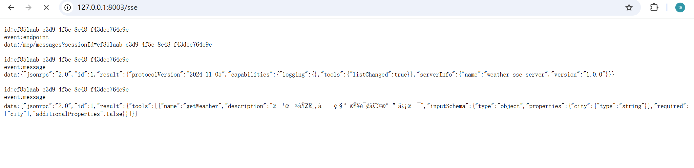

我们可以看到监听信息，获取到了我们之前创建的查询天气的工具以及详细的参数。**这个地方有中文乱码，因为浏览器默认当成 ISO-8859-1 编码，我们可以修改下application.yml的配置，强制输出utf-8编码即可解决。**

```text
server:
  port: 8003
  servlet:
    encoding:
      charset: UTF-8
      force: true
      enabled: true
```

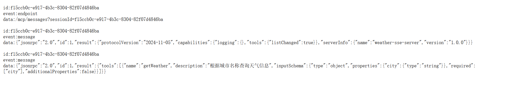

最后我们再发起一次调用，查看结果：


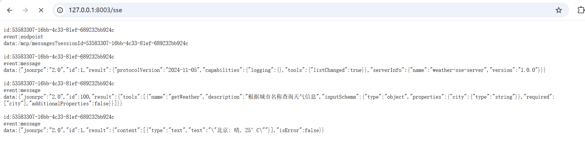

可以看到我们成功获取到了json-rpc格式的标准结果。是不是这样实操调用后，我们对mcp的json-rpc调用理解就更加深入了呢。接下来，我们还是一样使用 Cline 来接入这个SSE。

```text
{
  "mcpServers": {
    "weather-sse": {
      "type": "sse",
      "url": "http://127.0.0.1:8003/sse",
      "autoApprove": [],
      "timeout": 60,
      "disabled": false
    }
  }
}
```

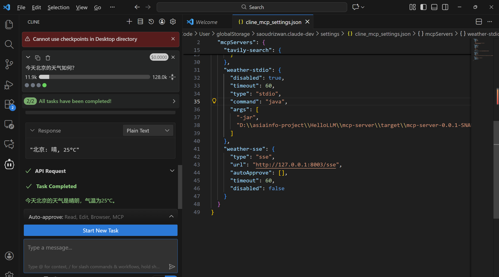

Streamable HTTP

StreamableHTTP 是MCP在**2025年3月26日**正式提出的最新官方传输标准，用来改进传统 SSE 在长连接、大数据流和双端点管理上的局限。它通过 **单一 HTTP 端点**实现请求发送与流式响应接收，支持 **断续重连和未确认消息重发**，保证长时间任务或增量输出的稳定可靠，同时简化了客户端与服务器的交互模型，是官方推荐替代SSE的方案。我们直接去修改我们的配置文件：

```text
server:
  port: 8004
  servlet:
    encoding:
      charset: UTF-8
      force: true
      enabled: true

spring:
  application:
    name: mcp-weather-streamable
  ai:
    mcp:
      server:
        ## 这个地方改成STATELESS，就是无状态模式
        protocol: STREAMABLE
        name: streamable-mcp-server
        version: 1.0.0
        type: SYNC
        instructions: "这个服务是用来查询城市天气的。"
        resource-change-notification: true
        tool-change-notification: true
        prompt-change-notification: true
        streamable-http:
          mcp-endpoint: /api/mcp
          keep-alive-interval: 30s
```

protocol：**STREAMABLE**：表示开启 Streamable HTTP 模式；instructions：用于定义 MCP Server 的提示词，指导模型行为；streamable-http.mcp-endpoint：指定服务的端口路径，与SSE的不同，这边一个端口就可以实现双向通信；keep-alive-interval：设置 HTTP 连接心跳间隔，保证长连接稳定。

其中protocol 还可以直接切换成 STATELESS。在 无状态模式下，MCP Server 不会在内存中保存客户端会话，也不会分配或要求 **Mcp-Session-Id**。每个请求都是独立处理的，服务器不会记录多轮对话历史或流式事件状态。这种模式适合 单次调用、无历史依赖的工具或 API，例如一次性计算、查询数据库、或者获取即时信息的场景，不需要断点重连或多轮交互。

由于无状态模式无法保留上下文或中途恢复，它不适合依赖会话连续性的多轮交互、长连接流式推送或复杂工具链操作；但它的优势是 **简单、易扩展、适合 serverless 或微服务架构**。

同样的工具代码，这边不多做赘述，我们启动项目**，访问mcp-endpoint这个端点。**

还是和 SSE 的生命周期流程一样，必须先初始化：

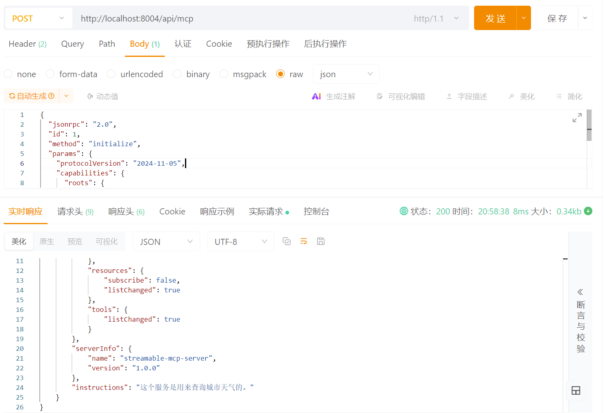

这个地方需要注意的是，**请求头必须按照如下方式设置才能访问。**

**MCP 的 Streamable HTTP 协议规定，服务端可能会根据情况返回 SSE 流（Server-Sent Events）或者普通的 JSON 响应。因此，规范要求客户端必须在 Header 里声明它能同时处理这两种格式。 **

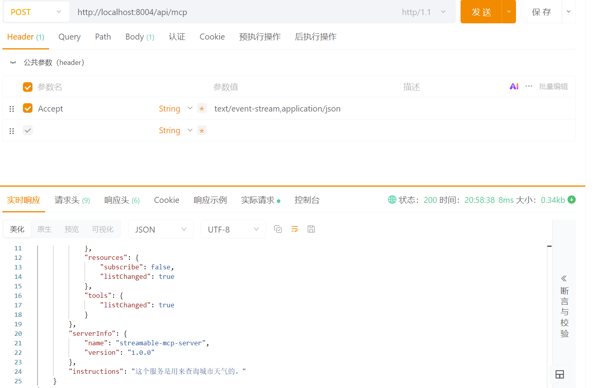

然后我们可以在响应头中，获取到一个很重要的参数叫做：**Mcp-Session-Id**

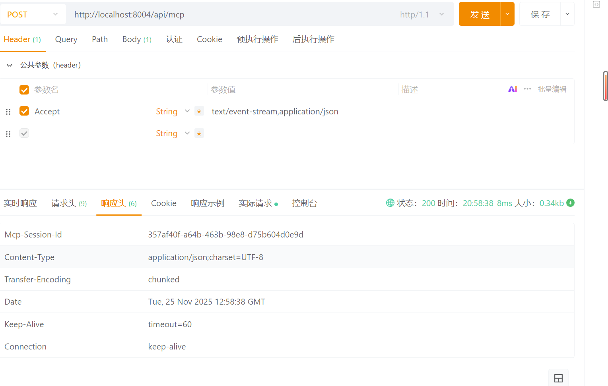

后续的请求，必须在请求头里设置这个**Mcp-Session-Id才可以正常访问。**

**我们直接略过其他步骤，直接调用一下试试效果：**

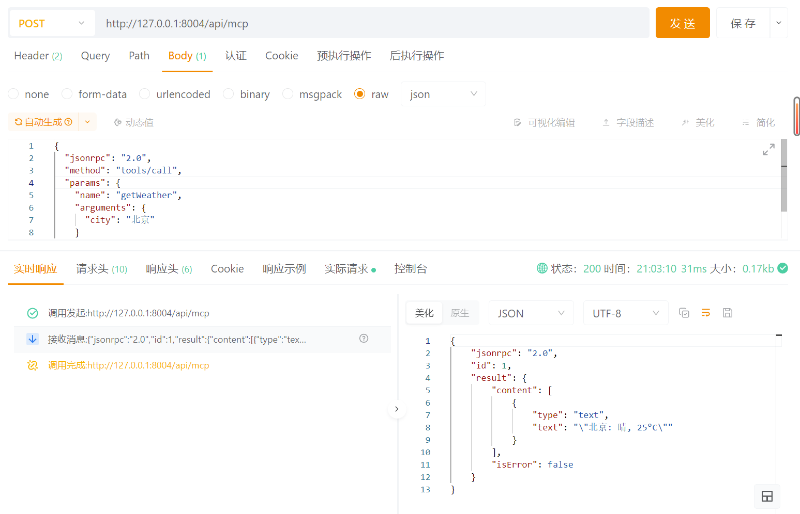

我们可以看到我使用的这种流式访问，已经能够可以正常的返回结果了。

**另外如果是无状态模式，需要使用纯POST请求，而不是SSE请求来调用，才能获取到结果：**

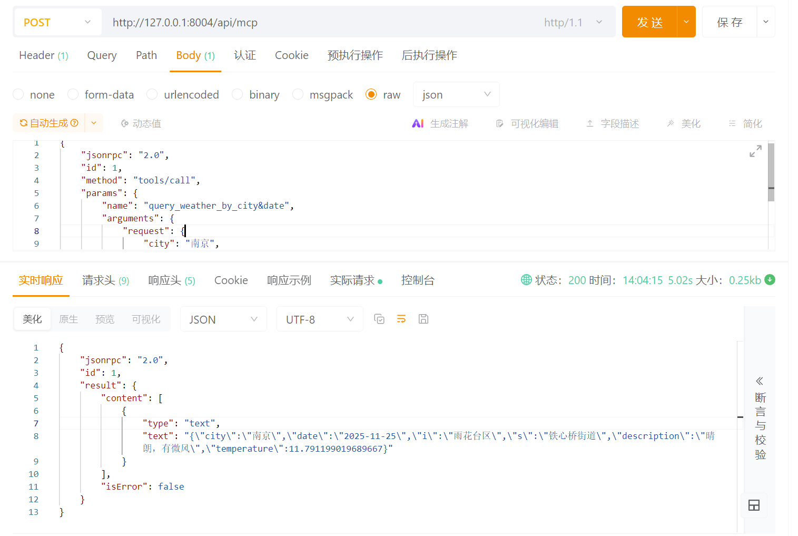

同样我们接入到Cline里看看效果。

```text
{
  "mcpServers": {
    "weather-streamable": {
      "url": "http://127.0.0.1:8004/api/mcp",
      "type": "streamableHttp",
      "timeout": 60,
      "disabled": false
    }
  }
}
```

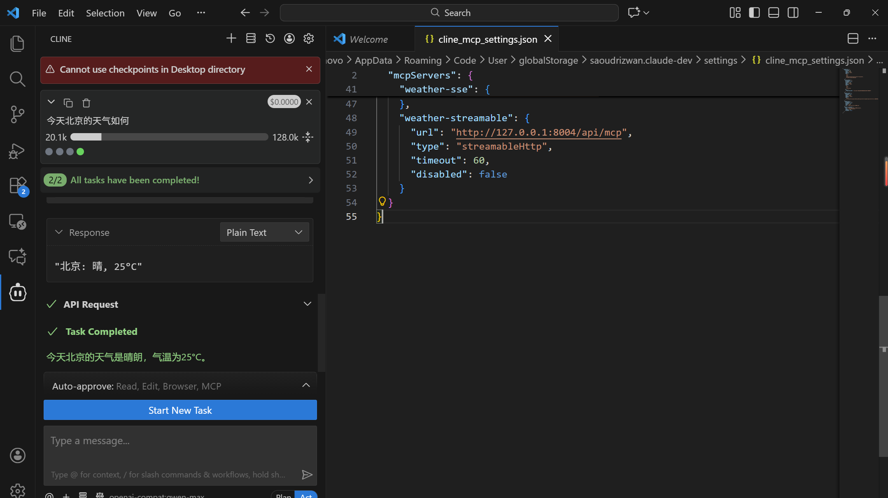

**值得一提的是，Spring AI 的mcp server同样支持pojo类作为入参和出参。**

**改造一下我们的tool的出参和入参：**

```text
@Tool(
    name = "query_weather_by_city&date",
    description = "根据城市和日期获取天气信息"
)
public WeatherResponse queryWeather(WeatherRequest request) {
    try {
        // 模拟调用api
        Thread.sleep(10000);
    } catch (InterruptedException e) {
        throw new RuntimeException(e);
    }
    double temp = Math.random() * 15 + 10;
    
    return new WeatherResponse(
        request.getCity(),
        request.getDate(),
        request.getI(),
        request.getS(),
        "晴朗，有微风",
        temp
    );
}
```

```text
@Data
public class WeatherRequest {
    @ToolParam(description = "城市")
    private String city;

    @ToolParam(description = "日期")
    private String date;

    @ToolParam(description = "区县")
    private String i;

    @ToolParam(description = "街道")
    private String s;
}
```

**请尽量使用 @ToolParam 来说明参数的值**，不加的话，如果你的字段名比较简单，大模型也能够识别，但是当业务比较复杂的时候，大模型不一定会理解你的业务字段，这就会有问题了。

我这边故意用了两个比较含糊的字段“i”和“s”，看下效果，大模型通过ToolParam的描述也能识别出字段的真实含义了。

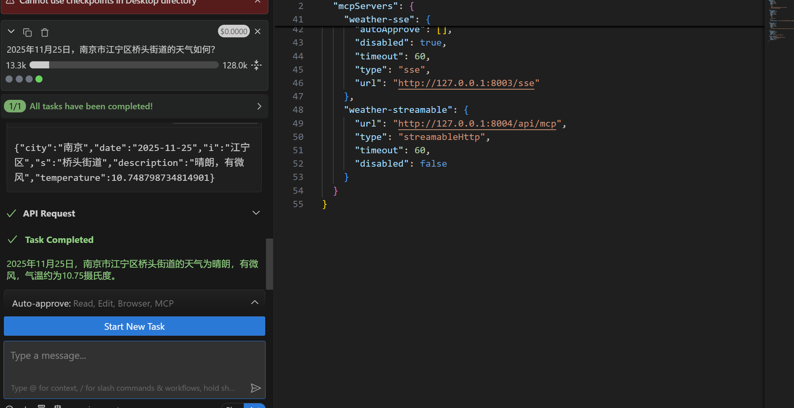

---

来源: https://thoughts.aliyun.com/workspaces/6963289eb0fc2e001bb052eb/docs/696605b051b144000115afc0
