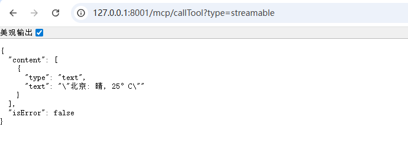
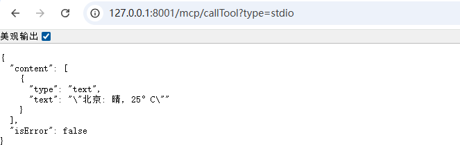
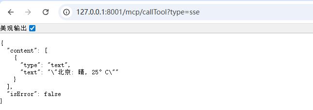
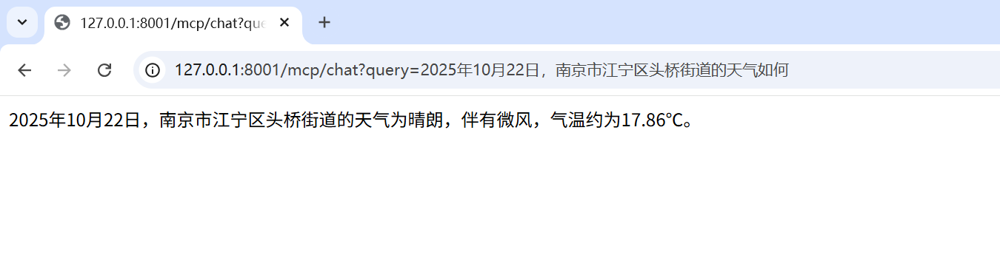
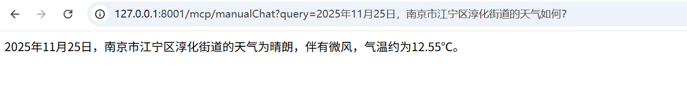

# ✅实战：使用Spring AI开发MCP Client

基于之前课程的讲解，我们已经深入了解了 MCP 的原理和概念，以及如何使用 Spring AI 开发 MCP Server，包括 STDIO、SSE 和 Streamable HTTP 三种模式，并使用 VSCode Cline 作为客户端来进行接入调用。

Cline 其实就是内置了 MCP Client，接下来，我们将介绍基于 Spring AI 的 MCP Client 开发，它在操作方式上与 Cline 类似，同时允许我们在项目中灵活定义 Client，使得我们的智能体实现更加丰富的功能。

还是和开发mcp server一样，我们先引包，传统web项目直接无脑用 **webmvc **即可，追求响应式编程的可以使用 **webflux**，依然二选一即可：

```text
<dependency>
  <groupId>org.springframework.ai</groupId>
  <artifactId>spring-ai-starter-mcp-client</artifactId>
</dependency>
```

```text
<dependency>
    <groupId>org.springframework.ai</groupId>
    <artifactId>spring-ai-starter-mcp-client-webflux</artifactId>
</dependency>
```

接下来提供两种方式给大家讲解，一种是基于配置文件自动注入的，另一种则是手动构建。

自动注入

修改我们的配置文件，配置好，我们上节课中，讲解的三种mcp server，分别是stdio，sse，streamablehttp

```text
spring:
  ai:    
    mcp:
      client:
        enabled: true
        name: my-mcp-client
        version: 1.0.0
        request-timeout: 60s
        type: SYNC
        stdio:
          connections:
            weather-stdio:
              command: java
              args:
                - -jar
                - "D:\\LLMentor\\LLMentor\\mcp\\mcp-server-stdio\\target\\mcp-server-stdio-1.0.0-SNAPSHOT.jar"
        sse:
          connections:
            weather-sse:
              url: http://127.0.0.1:8003
              sse-endpoint: /sse
        streamable-http:
          connections:
            weather-streamable:
              url: http://127.0.0.1:8004/stream/test/
              endpoint: api/mcp
```

还有一种方式是类似于cline那种json配置的方式，**但是不推荐，因为目前只支持stdio。**

首先，需要在我们的resources目录下放一个mcp-servers.json文件。

```
{
  "mcpServers": {
    "weather-stdio": {
      "command": "java",
      "args": ["-jar", "D:\\LLMentor\\LLMentor\\mcp\\mcp-server-stdio\\target\\mcp-server-stdio-1.0.0-SNAPSHOT.jar"]
    }
  }
}
```

然后修改stdio的配置：

```
        stdio:
          servers-configuration: classpath:/mcp-servers.json
```

接下来，我用两种方式来演示给大家看调用方式，一种是直接通过McpSyncClient进行调用，另一种是通过注入 chatClient 来进行调用。

McpSyncClient 调用

我们上面的配置，会被自动注入到List<McpSyncClient>之中，也就是说这个list包含了我们所有在配置文件注册的mcp server。

这边为了方便演示，我只调用了stdio的mcp server，其他两种大家可以自行尝试一下，调用方式都是一样的。

clientInfo表示当前客户端的信息，serverInfo则表示对应服务端的信息，这两者是一一对应的，这与我们在前面学习的概念是一致的。

```java
/**
     * 直接调用mcp server
     */
    public McpSchema.CallToolResult callTool(String type) {
        String toolName = "getWeather";
        Map param = new HashMap();
        param.put("city", "北京");

        for (McpSyncClient client : mcpSyncClients) {
            McpSchema.Implementation clientInfo = client.getClientInfo();
            McpSchema.Implementation serverInfo = client.getServerInfo();
            log.info("clientInfo: {}", JSON.toJSONString(clientInfo));
            log.info("serverInfo: {}", JSON.toJSONString(serverInfo));
            try {
                if (clientInfo.title().contains(type)) {
                    log.info("开始调用mcp服务");
                    McpSchema.CallToolRequest request = McpSchema.CallToolRequest.builder().name(toolName).arguments(param).build();
                    McpSchema.CallToolResult result = client.callTool(request);
                    log.info("callTool result: {}", result);
                    return result;
                }
            } catch (Exception ex) {
                ex.printStackTrace();
            }
            log.info("====================================================");
        }
        return null;
    }
```







ChatClient 调用

我们将SyncMcpToolCallbackProvider注入到chatclient中，即可实现智能体对mcp server的接入。

```text
/**
 * 将MCP Client的工具注入到 ChatClient
 */
@Autowired
private SyncMcpToolCallbackProvider toolCallbackProvider;

@Autowired
private OpenAiChatModel chatModel;

private ChatClient chatClient;

@PostConstruct
public void init() {
    ToolCallback[] toolCallbacks = toolCallbackProvider.getToolCallbacks();

    this.chatClient = ChatClient.builder(chatModel)
            .defaultToolCallbacks(toolCallbacks)
            .build();
}

/**
 * 智能体调用
 */
public String chat(String userMessage) {
    return chatClient.prompt()
            .user(userMessage)
            .call()
            .content();
}
```



手动构建

分别手动构建了Stdio，SSE，Streamable三种mcp client，并注入到chatclient之中。

```text
@Service
public class ManualMcpClientService {

    @Autowired
    private OpenAiChatModel chatModel;

    private ChatClient chatClient;

    @PostConstruct
    public void init() {
        // STDIO
        ServerParameters parameters = ServerParameters.builder("java")
                .args("-jar", "D:\\LLMentor\\LLMentor\\mcp\\mcp-server-stdio\\target\\mcp-server-stdio-1.0.0-SNAPSHOT.jar")
                .build();
        StdioClientTransport stdioTransport = new StdioClientTransport(parameters, McpJsonMapper.createDefault());

        McpSyncClient stdioClient = McpClient.sync(stdioTransport)
                .clientInfo(new io.modelcontextprotocol.spec.McpSchema.Implementation("my‑client", "1.0"))
                .requestTimeout(Duration.ofSeconds(10))
                .build();

        stdioClient.initialize();

        // SSE
        HttpClientSseClientTransport transport = HttpClientSseClientTransport.builder("http://127.0.0.1:8003").sseEndpoint("/sse").build();
        McpSyncClient sseClient = McpClient.sync(transport)
                .clientInfo(new io.modelcontextprotocol.spec.McpSchema.Implementation("sse-client", "1.0"))
                .requestTimeout(Duration.ofSeconds(10))
                .build();
        sseClient.initialize();

        // STREAMABLE
        HttpClientStreamableHttpTransport streamableTransport = HttpClientStreamableHttpTransport.builder("http://127.0.0.1:8004/stream/test/").endpoint("api/mcp").build();
        McpSyncClient streamableClient = McpClient.sync(streamableTransport)
                .clientInfo(new io.modelcontextprotocol.spec.McpSchema.Implementation("streamable-client", "1.0"))
                .requestTimeout(Duration.ofSeconds(10))
                .build();
        streamableClient.initialize();

        List<McpSyncClient> clients = List.of(streamableClient);

        SyncMcpToolCallbackProvider provider = SyncMcpToolCallbackProvider.builder()
                .mcpClients(clients)
                .build();

        ToolCallback[] callbacks = provider.getToolCallbacks();

        this.chatClient = ChatClient.builder(chatModel)
                .defaultToolCallbacks(callbacks)
                .build();
    }

    /**
     * 智能体调用
     */
    public String chat(String userMessage) {
        return chatClient.prompt()
                .user(userMessage)
                .call()
                .content();
    }
}
```

注意在手动配置 **HttpClientSseClientTransport 和 HttpClientStreamableHttpTransport **的时候，**endpoint 要和 baseuri 建议一定要分开写**，这边是跟Spring AI 的 URI 解析方式有关，如果融合在一起，会导致解析错误，报错404。



---

来源: https://thoughts.aliyun.com/workspaces/6963289eb0fc2e001bb052eb/docs/696745caa7c8ff000138f747
