# ✅Spring AI MCP 调用实现原理

通过上一节，我们可以看到 chatclient 调用 mcp server 这个过程非常简洁，是不是很好奇是如何做到的，我们接下来看下源码。

如何注入mcp？

我们先从init方法的getToolCallbacks进入，看下做了什么工作：

```text
@PostConstruct
public void init() {
    ToolCallback[] toolCallbacks = toolCallbackProvider.getToolCallbacks();

    this.chatClient = ChatClient.builder(chatModel)
            .defaultToolCallbacks(toolCallbacks)
            .defaultTools()
            .build();
}
```

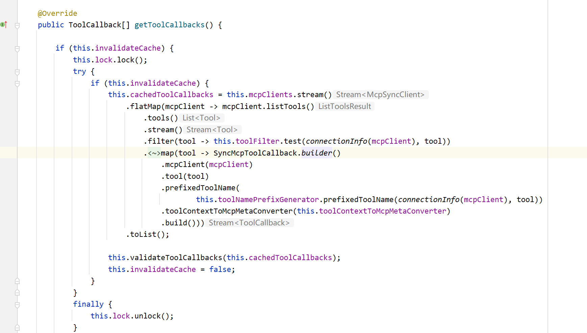

发现他这边确实是对McpSyncClient做了一些转换处理，包装成了 SyncMcpToolCallback，这个东西说白了就是将概念的工具转换成了具有可执行能力的工具，SyncMcpToolCallback 具备了工具的定义、元数据、执行逻辑。

我们进入 SyncMcpToolCallback 看下他是如何去执行调度的。下面是这个类的调用方法，我加上了中文注释，核心就是接收大模型发过来的工具参数，最终还是调用mcpClient.callTool方法。

```text
@Override
public String call(String toolCallInput, @Nullable ToolContext toolContext) {
    // 兜底处理：如果没有参数，就使用一个空的 JSON 对象 "{}"
    if (!StringUtils.hasText(toolCallInput)) {
        logger.warn("Tool call arguments are null or empty for MCP tool: {}. Using empty JSON object as default.",
                this.tool.name());
        toolCallInput = "{}";
    }

    // 将模型传进来的 JSON 字符串参数转成 Map
    Map<String, Object> arguments = ModelOptionsUtils.jsonToMap(toolCallInput);

    CallToolResult response;
    try {
        // 转换元数据
        var mcpMeta = toolContext != null ? this.toolContextToMcpMetaConverter.convert(toolContext) : null;

        // 构建 CallToolRequest 对象
        var request = CallToolRequest.builder()
            // 工具名称
            .name(this.tool.name())
            // 参数
            .arguments(arguments)
            .meta(mcpMeta)
            .build();

        // 调用mcp client的call tool方法，这个前面介绍过
        response = this.mcpClient.callTool(request);
    }
    catch (Exception ex) {
        logger.error("Exception while tool calling: ", ex);
        throw new ToolExecutionException(this.getToolDefinition(), ex);
    }

    if (response.isError() != null && response.isError()) {
        logger.error("Error calling tool: {}", response.content());
        throw new ToolExecutionException(this.getToolDefinition(),
                new IllegalStateException("Error calling tool: " + response.content()));
    }

    // 将工具返回内容序列化成 JSON 字符串并返回
    return ModelOptionsUtils.toJsonString(response.content());
}
```

**在Spring AI 1.1.0-M4版本中，这部分的逻辑变化较大：**

SyncMcpToolCallbackProvider 首先去看他的builder方法的调用方。

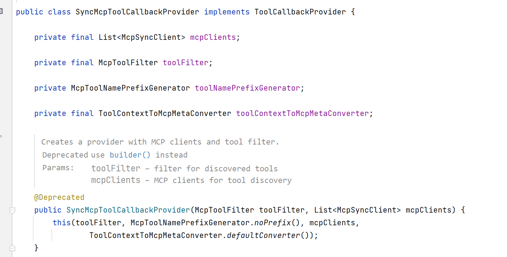

他的初始化其实是在McpToolCallbackAutoConfiguration之中的。也就是当Spring.ai.mcp.client.type=SYNC的时候触发初始化。

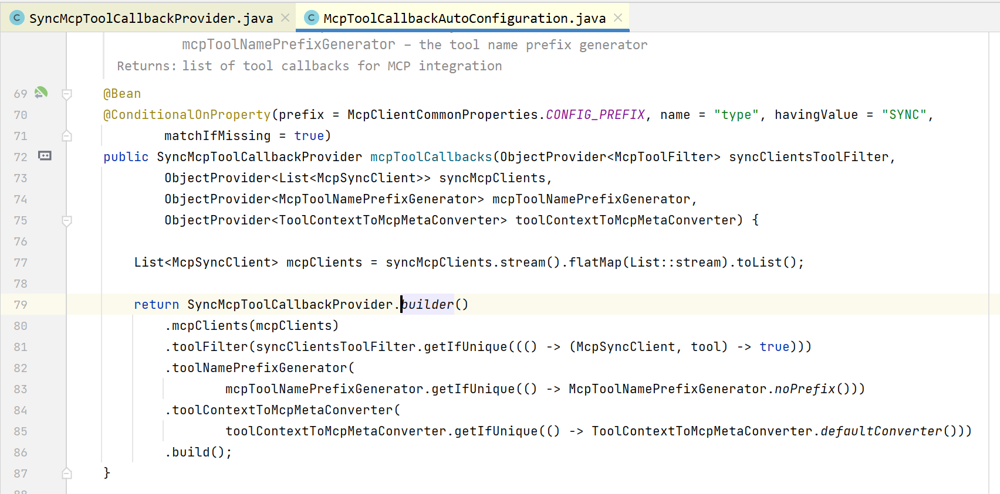

在这里我们构建了SyncMcpToolCallbackProvider，但是他入参中的McpSyncClient又是从何而来呢？他其实同样也有一个autoconfiguration。核心就在于这个NamedClientMcpTransport。

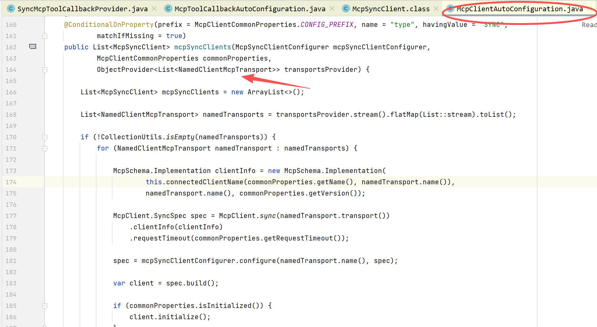

NamedClientMcpTransport是一个record，但是从他的调用类，我们可以看到，包含了stdio，sse，以及streamable。

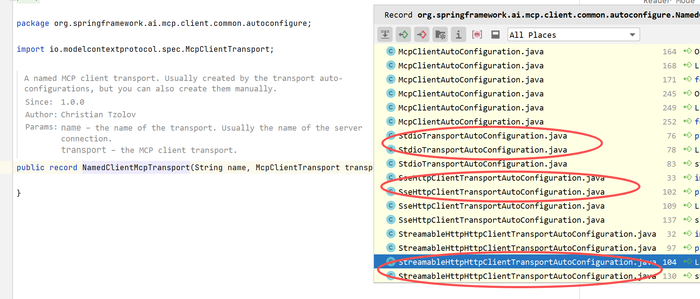

我们选择进入Stdio的自动配置类，可以看到他其实就是读取的配置就的properties，来构建我们的transport通道的。sse和streamable也是同理。

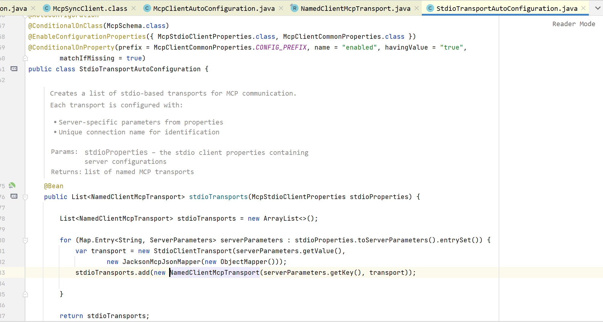

我们了解了mcptransport是如何构建了之后，这时候我们再回到McpClientAutoConfiguration

在这段代码里，他还对mcpclient进行了初始化操作，并加入到了List<McpSyncClient>之中。由此来提供给SyncMcpToolCallbackProvider，方便后续chatclient的使用。

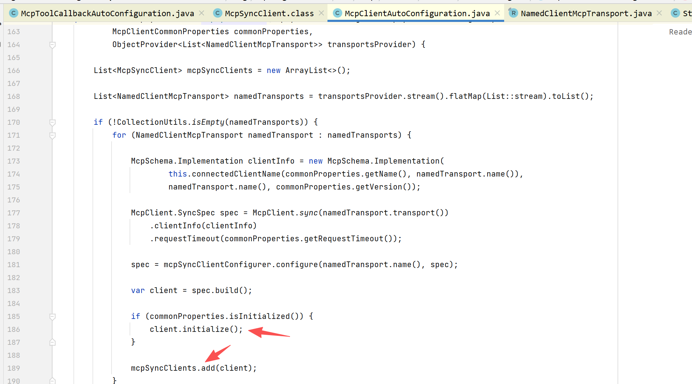

**而在 ****Spring AI 1.1.0之前的版本，他是通过event机制来触发初始化的，这边也为大家介绍一下：**

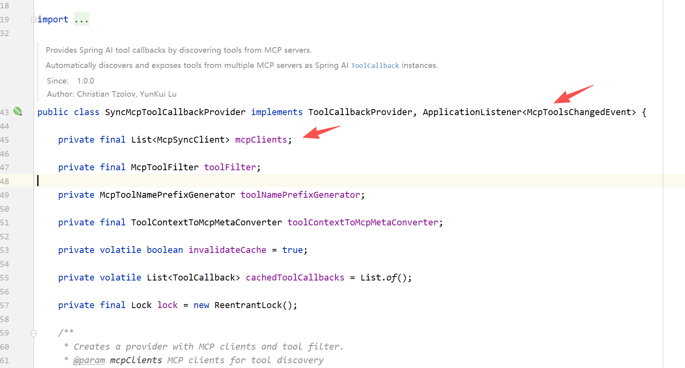

我们可以看到他实现了一个事件listener：McpToolsChangedEvent

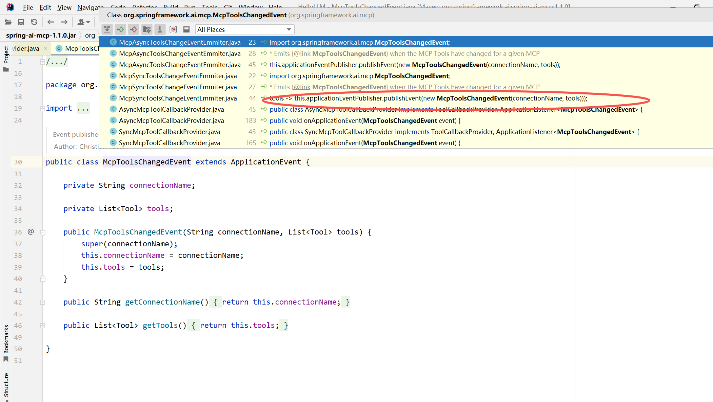

而这个事件又是在 McpSyncToolsChangeEventEmmiter 中发布的，我们继续跟进：

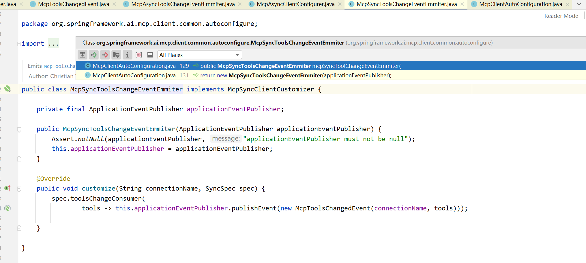

可以看到这个类又是从 McpClientAutoConfiguration 中new出来的。

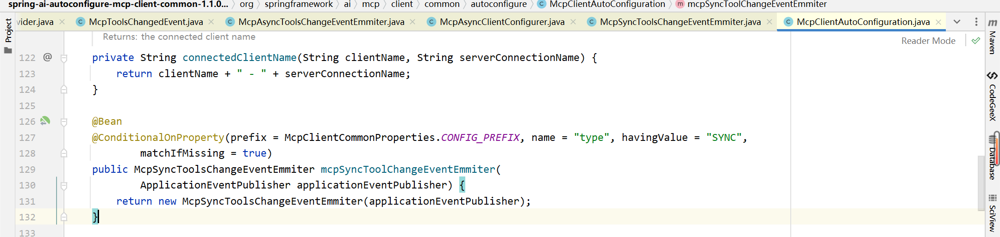

**结果很显然了，就是自动注入，设置了 ****spring.ai.mcp.client 的 ****type = SYNC（异步就是ASYNC）就可以触发自动注入的逻辑。**

**如何调用mcp server？**

理解了 Spring AI 是如何将mcp client和mcp server进行绑定的，我们再来看下 chatclient 是如何调用mcp server的。我们从call方法进入。

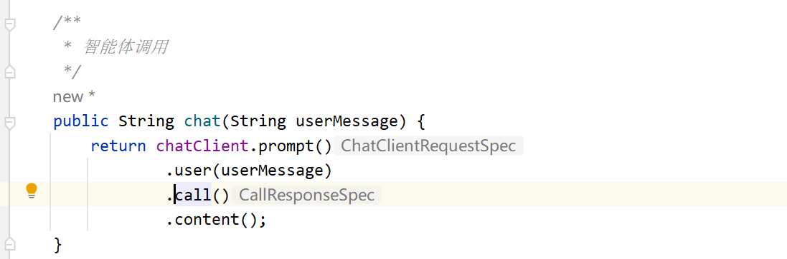

跟进到他的默认实现类 **DefaultChatClient **：

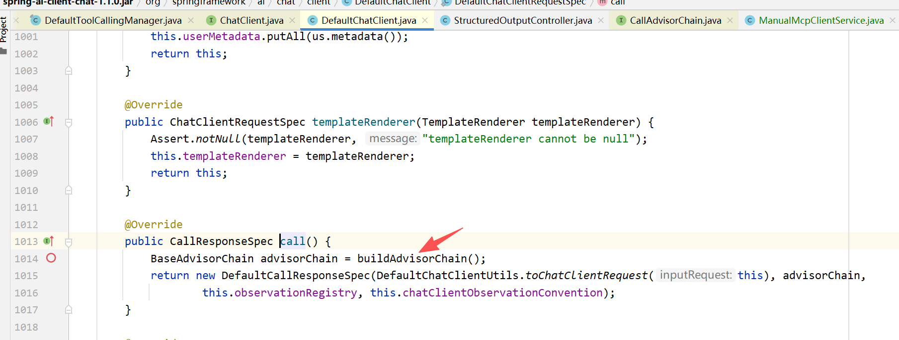

发现 call 方法中有一个 **buildAdvisorChain **方法，**他的含义就是将你在chatclient中设置的advisor构建成一个链，而ChatModelCallAdvisor和ChatModelStreamAdvisor则位于这个链的末端，也就是最后执行调用大模型。**

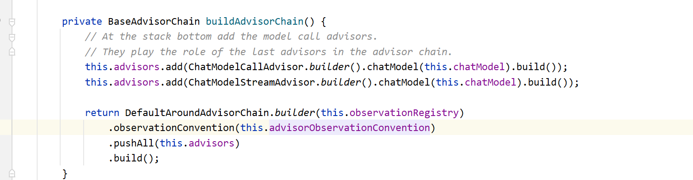

我们为了演示方便，没有设置任何 **advisor**，我们以非流式为例，进入 **ChatModelCallAdvisor**。

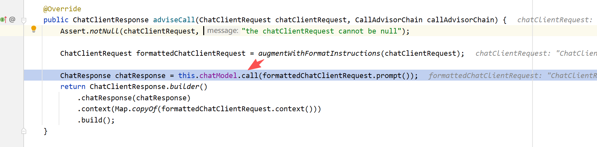

继续跟进到 **OpenAiChatModel**，这也是我们之前设置的model类型：

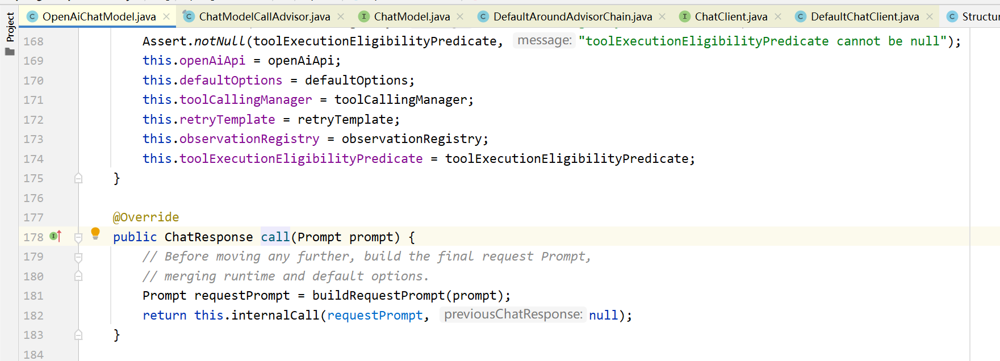

进入 **internalCall** 方法，我把这块代码贴出来，并增加了中文注释，方便你看懂：

```text
public ChatResponse internalCall(Prompt prompt, ChatResponse previousChatResponse) {

    // 1、构造请求对
    ChatCompletionRequest request = createRequest(prompt, false);

    // 2、设置监控上下文，记录请求和响应
    ChatModelObservationContext observationContext = ChatModelObservationContext.builder()
        .prompt(prompt)
        .provider(OpenAiApiConstants.PROVIDER_NAME)
        .build();

    // 3、调用大模型
    ChatResponse response = ChatModelObservationDocumentation.CHAT_MODEL_OPERATION
        .observation(this.observationConvention, DEFAULT_OBSERVATION_CONVENTION, () -> observationContext,
                this.observationRegistry)
        .observe(() -> {

            ResponseEntity<ChatCompletion> completionEntity = this.retryTemplate
                .execute(ctx -> this.openAiApi.chatCompletionEntity(request, getAdditionalHttpHeaders(prompt)));

            var chatCompletion = completionEntity.getBody();

            // 4、解析模型返回
            List<Choice> choices = chatCompletion.choices();
            List<Generation> generations = choices.stream()
                .map(choice -> buildGeneration(choice, Map.of(), request))
                .toList();

            // 5、汇总token使用量
            OpenAiApi.Usage usage = chatCompletion.usage();
            Usage accumulatedUsage = UsageCalculator.getCumulativeUsage(
                    usage != null ? getDefaultUsage(usage) : new EmptyUsage(),
                    previousChatResponse
            );

            // 6、将结果包装成chatResponse
            ChatResponse chatResponse = new ChatResponse(
                    generations,
                    from(chatCompletion, null, accumulatedUsage)
            );

            observationContext.setResponse(chatResponse);
            return chatResponse;
        });

    // 7、核心重点：判断是否要求调用工具
    if (this.toolExecutionEligibilityPredicate.isToolExecutionRequired(prompt.getOptions(), response)) {

        // 8、执行工具调用
        var toolExecutionResult = this.toolCallingManager.executeToolCalls(prompt, response);

        // 9、工具要求直接返回，则终止循环
        if (toolExecutionResult.returnDirect()) {
            return ChatResponse.builder()
                .from(response)
                .generations(ToolExecutionResult.buildGenerations(toolExecutionResult))
                .build();
        }

        // 10、工具执行完，将结果加入对话历史，再次调用模型，递归处理
        return this.internalCall(
            new Prompt(toolExecutionResult.conversationHistory(), prompt.getOptions()),
            response
        );
    }

    // 不需要工具调用，直接返回模型结果
    return response;
}
```

整体流程就是，先调用一次大模型，然后大模型会返回结果，根据模型返回结果判断是否含有 **tool_calls** 字段，如果有则表明需要调用工具，接着判断工具的参数 **returnDirect**，是否是仅仅调用工具不需要总结，还是需要获取到工具执行结果后，再次总结输出。**这个地方做了递归处理，直到模型不再输出tool_calls，也就是不需要再调用工具，则判断停止。**

**conversationHistory 则是拼接的上下文信息，包括用户的原始问题，大模型返回的 tool_calls，工具返回的结果，将这些信息一起拼接成新的 prompt 传递给下次模型调用。**

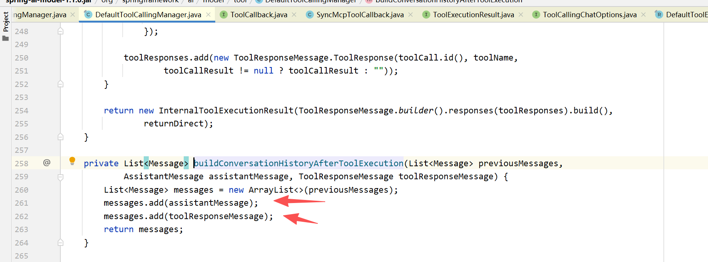

**其中 tool_calls** 判断逻辑如下：

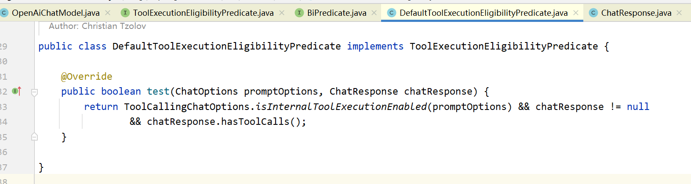

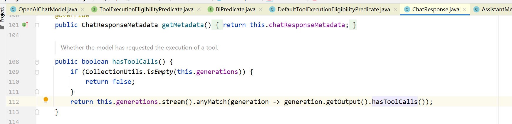

我们再回到 **DefaultToolCallingManager** 的 **executeToolCalls** 方法中，进入到 **executeToolCall **方法，这就是他具体执行工具地方：

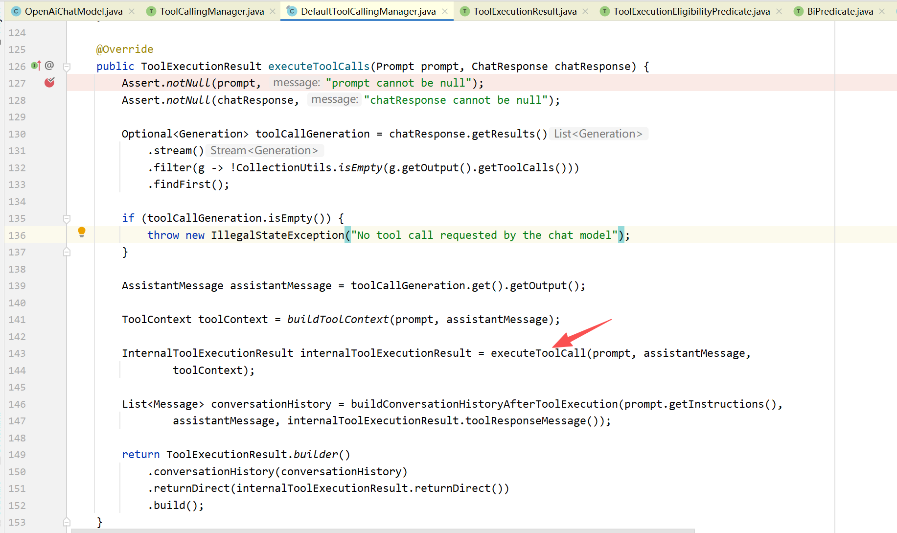

这边直接展示他的核心代码，就是这个 **toolCallback.call** 方法，这个 **toolCallback** 是不是很眼熟，我们在之前的注入中，是不是就是注入的这个 **toolCallback**。

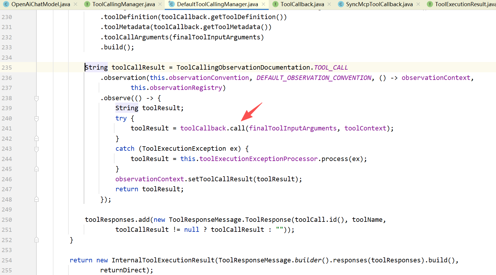

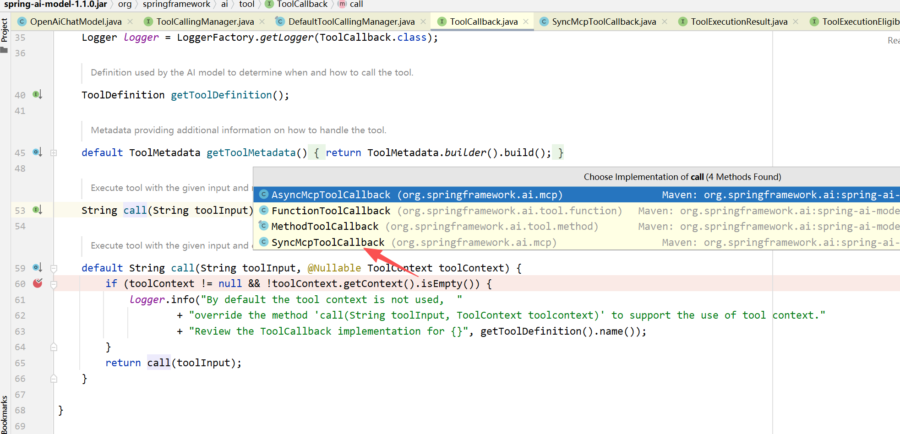

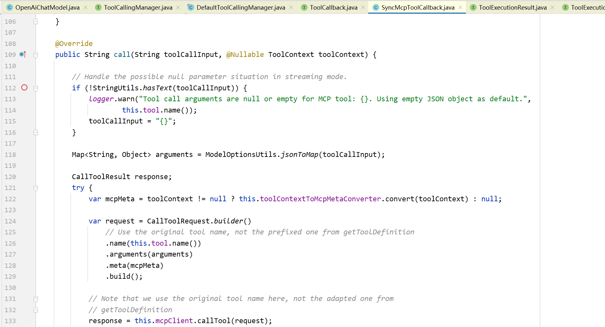

到这里，我们的注入和调用流程是不是都串联起来了，又回到了 **SyncMcpToolCallback** 的 **call** 方法了。

原来 chatclient 就是利用默认的 **ChatModelAdvisor** 来执行工具调用的，先调用大模型，获取结果，判断结果是否包含 **tool_calls** 字段，如果有，就调用注入的 **SyncMcpToolCallback** 来 call 相应的工具，最终根据你的参数，判断是直接 **returnDirect** 还是再次抛给大模型总结输出。

---

来源: https://thoughts.aliyun.com/workspaces/6963289eb0fc2e001bb052eb/docs/69674b23d31fed0001f16f05
