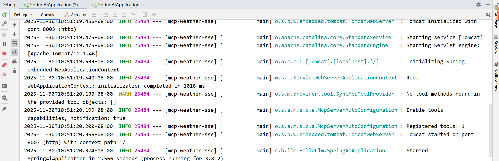
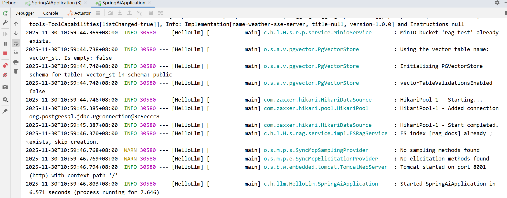
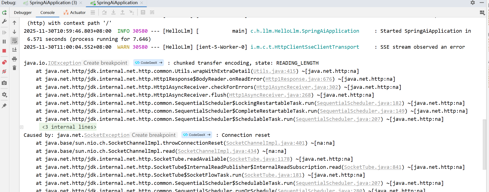
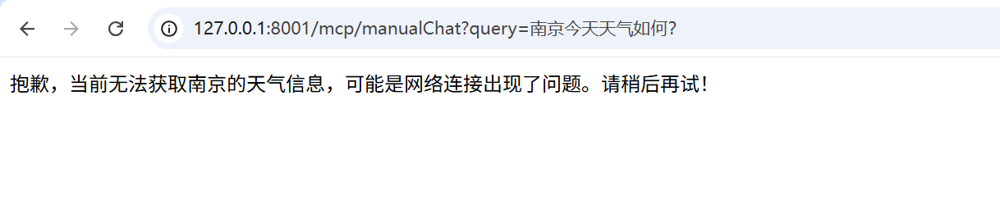
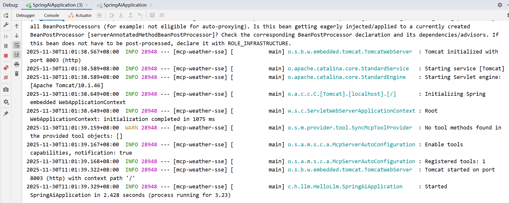
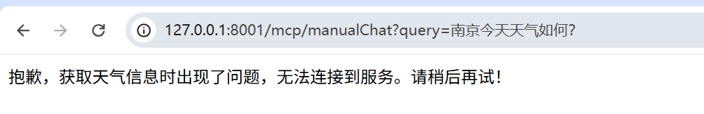
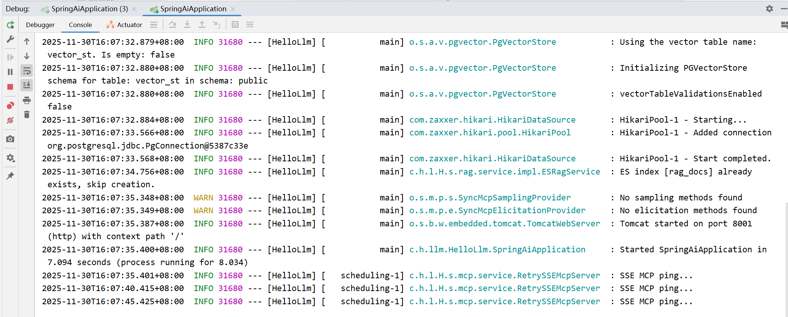
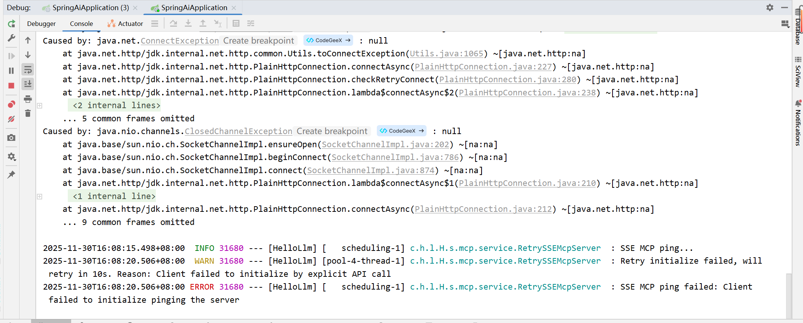
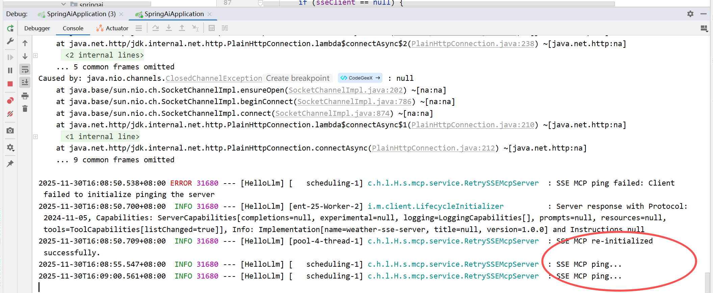
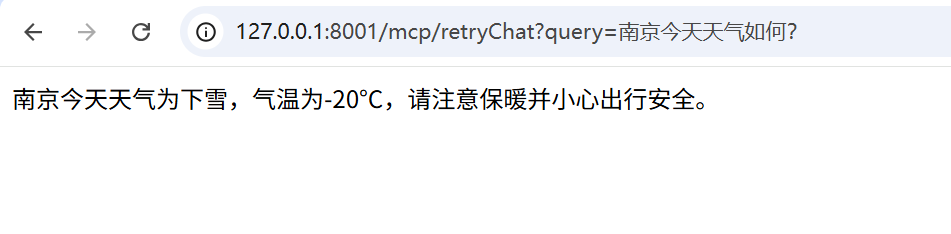

# ✅SSE MCP Server如何实现重连？

在 MCP 的早期版本中，还没有出现**Streamable http**这种方式，主要依赖的就是本地 **Stdio**，远程 **SSE** 建立长连接。SSE 是一种典型的单向流式机制，通过一个端点持续监听服务器指令，再通过另一个端点发送消息。在稳定网络环境下，这种模式可以正常工作，但它**对长连接的依赖非常强**，一旦**网络出现抖动、服务端重启、代理回收空闲连接，SSE 管道就会立即断开。**

基于上面的问题，Spring AI MCP Client 也**没有提供自动重连**的能力，一旦 SSE 被中断，客户端实际上就失去了与 MCP Server 的指令通道，工具虽然注册着，但不再响应任何调用，整个智能体就会陷入无工具状态。

客户端无法自行恢复工具能力，只能**重新初始化 MCP Client 才能重新建立会话**。对于需要长时间稳定运行的企业级智能体系统，这明显无法满足可靠性要求。网络波动在生产环境中不可避免，而服务端升级重启也属于常态，如果 MCP Client 缺乏自愈能力，那么系统的工具链随时可能失效，导致业务流程意外中断。因此，在 SSE 模式下如何**实现可靠的重连能力**，成为保障智能体系统可用性的关键。

问题复现

接下来，我给大家演示一下这个问题现象，让大家能够直观的感受到，做这个事情的必要性。

我们先启动MCP Server SSE的项目，端口8003：



然后启动MCP Client，端口8001，代码和前面章节中的一样，通过手动方式，将mcp server 注入到了chatclient之中。



```text
HttpClientSseClientTransport transport = HttpClientSseClientTransport.builder("http://127.0.0.1:8003").sseEndpoint("/sse").build();
McpSyncClient sseClient = McpClient.sync(transport)
    .clientInfo(new io.modelcontextprotocol.spec.McpSchema.Implementation("sse-client", "1.0"))
    .requestTimeout(Duration.ofSeconds(10))
    .build();
sseClient.initialize();

List<McpSyncClient> clients = List.of(sseClient);

SyncMcpToolCallbackProvider provider = SyncMcpToolCallbackProvider.builder()
    .mcpClients(clients)
    .build();

ToolCallback[] callbacks = provider.getToolCallbacks();

this.chatClient = ChatClient.builder(chatModel)
    .defaultToolCallbacks(callbacks)
    .defaultTools()
    .build();
```

连接成功后，我们尝试访问一下，看能不能调用工具：


接下来，问题来了，我现在MCP Server挂了，我们直接断开8003这个项目，然后就可以看到8001这边立马就会产生了报错，这个报错就表明，我们已经连不上MCP Server了。



尝试再访问下接口，我们可以看到工具已经没法用了：



然后我们再恢复MCP Server，重新启动8003端口，但是我们的MCP Client，依然无法感知重连上MCP Server，工具调用依然失败！这在生产环境肯定是没法接受的效果，我不可能为了这种情况，再去手动重启项目，重新初始化，这样根本就没法用。所以，MCP Server的重连机制是不可获取的！





重连机制

要解决这个问题，核心是为 SSE 模式增加一层弹性的连接管理机制，使客户端能够自动检测到 SSE 中断，并主动重新建立连接，重新初始化会话与工具注册流程。这样，即使网络链路被关闭，客户端也能自动完成恢复，不需要人工干预，也不会影响智能体对 MCP 工具的调用。

Spring AI 虽然没有提供现成的重连脚手架，但是他提供了一些有用的方法，可以让我们自行实现重连效果。

核心方法就是** McpSyncClient 的 ping **方法，可以作为我们的心跳检测手段。项目启动的时候先初始化一次，如果初始化失败，就会启动一个后台重试线程，不停地尝试重新初始化。接着再利用一个定时任务，做心跳检测，比如可以每隔 5 秒 ping 一次 MCP Server。并且使用了原子标记，只会启动一个重试线程，不会出现重复创建多个任务的情况。重试线程会一直循环重连，连成功了就自动停止。这样一来，无论是网络抖一下还是服务器重启，客户端都能自动恢复。

工具代码我们还复用之前的一个查天气的Demo：

```text
@Service
public class WeatherService {

    @Tool(description = "根据城市名称查询天气信息")
    public String getWeather(String city) {
        if (city == null) {
            return "请提供城市名称";
        }
        return switch (city) {
            case "北京" -> "北京: 晴, 25°C";
            case "上海" -> "上海: 多云, 22°C";
            case "深圳" -> "深圳: 小雨, 28°C";
            default -> city + ": 下雪, -20°C";
        };
    }
}
```

重连机制核心代码逻辑如下：

```text
@Service
@Slf4j
public class RetrySSEMcpServer {

    @Autowired
    private OpenAiChatModel chatModel;

    private ChatClient chatClient;

    private McpSyncClient sseClient;

    // 是否正在重试 initialize（保证唯一性）
    private final AtomicBoolean retrying = new AtomicBoolean(false);

    // initialize 重试线程
    private final ExecutorService retryExecutor = Executors.newSingleThreadExecutor();

    @PostConstruct
    public void init() {
        log.info("Initializing SSE MCP Client...");

        // 初始化 SSE Client
        this.sseClient = buildClient();

        try {
            this.sseClient.initialize();
            log.info("SSE MCP client initialized.");
        } catch (Exception e) {
            log.error("Initial SSE initialize failed, will rely on retry thread.", e);
            // 启动重试线程
            startRetryInitialize();
        }

        // 初始化 toolcallback
        SyncMcpToolCallbackProvider provider = SyncMcpToolCallbackProvider.builder()
                .mcpClients(List.of(this.sseClient))
                .build();

        ToolCallback[] callbacks = provider.getToolCallbacks();

        this.chatClient = ChatClient.builder(chatModel)
                .defaultToolCallbacks(callbacks)
                .defaultTools()
                .build();
    }

    private McpSyncClient buildClient() {
        HttpClientSseClientTransport transport = HttpClientSseClientTransport
                .builder("http://127.0.0.1:8003")
                .sseEndpoint("/sse")
                .build();

        return McpClient.sync(transport)
                .clientInfo(new io.modelcontextprotocol.spec.McpSchema.Implementation("sse-client", "1.0"))
                .requestTimeout(Duration.ofSeconds(10))
                .build();
    }

    /**
     * 定时任务：每 5 秒 ping 一次 SSE
     * ping 不通则触发 initialize 重试线程
     */
    @Scheduled(fixedDelay = 5000)
    public void pingSse() {
        log.info("SSE MCP ping...");
        if (sseClient == null) {
            log.warn("SSE client not initialized yet.");
            startRetryInitialize();
            return;
        }

        try {
            sseClient.ping();
            log.debug("SSE MCP ping OK.");
        } catch (Exception e) {
            log.error("SSE MCP ping failed: {}", e.getMessage());
            startRetryInitialize();
        }
    }

    /**
     * 启动 initialize 重试线程
     */
    private void startRetryInitialize() {
        // 保证只启动一个重试线程
        if (!retrying.compareAndSet(false, true)) {
            return;
        }

        retryExecutor.submit(() -> {
            log.warn("Start retrying SSE MCP initialize...");

            while (true) {
                try {
                    // 重建 sseClient
                    this.sseClient = buildClient();
                    this.sseClient.initialize();
                    log.info("SSE MCP re-initialized successfully.");

                    // chatclient 也同样需要重建
                    SyncMcpToolCallbackProvider provider = SyncMcpToolCallbackProvider.builder()
                            .mcpClients(List.of(this.sseClient))
                            .build();

                    ToolCallback[] callbacks = provider.getToolCallbacks();

                    this.chatClient = ChatClient.builder(chatModel)
                            .defaultToolCallbacks(callbacks)
                            .defaultTools()
                            .build();

                    retrying.set(false);
                    return;
                } catch (Exception e) {
                    log.warn("Retry initialize failed, will retry in 10s. Reason: {}", e.getMessage());
                }

                try {
                    Thread.sleep(10000);
                } catch (InterruptedException e) {
                    throw new RuntimeException(e);
                }
            }
        });

    }

    public String chat(String userMessage) {
        return chatClient.prompt()
                .user(userMessage)
                .call()
                .content();
    }
}
```

需要注意的是除了McpSyncClient需要重新初始化，我们的Chatclient也同样需要初始化，因为 ChatClient 内部的 ToolCallback **是在初始化时注入的**。ToolCallback 绑定的 McpSyncClient 是旧的，会话已断开。即使你重新初始化了 sseClient，ChatClient 没有同步更新，仍然会继续调用旧的客户端。

我们再次启动MCP Client 8001端口，和MCP SSE Server 8003端口，来看下效果：



启动成功后，我们断开SSE 8003端口，MCP Client 8001就报错了：



然后我们再把MCP Server SSE 8003端口启动起来，查看MCP Client会不会自己实现重连：



我们可以看到上面的SSE MCP re-initalized已经成功了，我们再尝试下，进行chatclient提问：



---

来源: https://thoughts.aliyun.com/workspaces/6963289eb0fc2e001bb052eb/docs/696857b2c71a890001a79b6a
