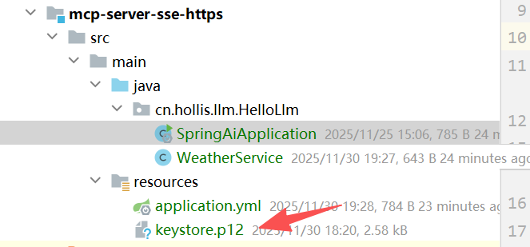
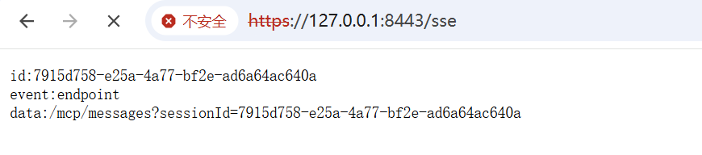
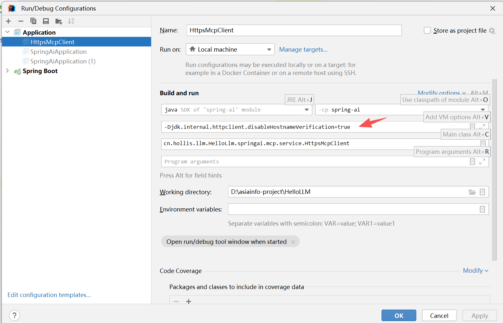

# ✅将 MCP 改造为 HTTPS

MCP 作为连接大模型与企业数据、业务系统、外部工具的关键协议，其安全性的重要程度不亚于传统 API 接口。虽然在日常开发中，我们为了快速集成，往往会把 MCP Server 部署成简单的 HTTP 服务，尤其在公司内网环境下更是如此。但这种做法在安全性上存在天然隐患。

首先，**HTTP 属于明文传输协议**，无论是在公司内网还是跨服务调用场景，都非常容易遭受中间人攻击（MITM）。攻击者只需要监听网络流量，就能轻易获取到 MCP 请求内容、上下文数据、模型输出，甚至是用户敏感信息。因此，在对安全性要求严格的企业环境，尤其是金融、运营商、政府、网络安全厂商中，**HTTP 版 MCP Server 通常被直接判定为不合规**，必须强制升级为 **HTTPS/TLS 加密传输** 才能上线。

通过HTTPS协议，实现通信加密、防止中间人攻击，确保所有 SSE/Streamable HTTP 通道都在受保护的链路上运行。

改造 MCP Server

将 MCP Server 升级为 HTTPS 协议本身并不复杂，流程与普通 Web 服务一致：准备证书、通过 Nginx 配置 TLS，然后用反向代理方式暴露对应的 HTTPS 端点即可。不过，仅仅让服务端支持 HTTPS 还不够，和普通的 HTTP 客户端一样，MCP Client 在访问 HTTPS 时也需要进行额外的适配，否则会因为证书校验或握手失败而无法建立连接。

为了方便测试，我们改造一下我们的SSE MCP Server，将http 改造为https。

首先生成自签名CA证书：

```text
//如果有重复生成，请先执行删除
keytool -delete -alias local-ssl -keystore keystore.p12 -storepass 123456

//生成p12服务器证书（包含公私钥）
keytool -genkeypair -alias local-ssl -keyalg RSA -keysize 2048 -storetype PKCS12 -keystore keystore.p12 -validity 3650 -storepass 123456 -keypass 123456 -dname "CN=localhost, OU=Dev, O=Demo, L=Local, ST=Local, C=CN" -ext "SAN=IP:127.0.0.1,DNS:localhost" -ext "BasicConstraints=ca:true"
```

在执行目录下，会生成一个** keystore.p12 **证书文件，我们将其放入到项目的resources下面：



并增加https配置到yml文件中：

```text
server:
  port: 8443
  ssl:
    key-store: classpath:keystore.p12
    key-store-password: 123456
    key-store-type: PKCS12
    key-alias: local-ssl
    enabled: true
```

到这里我们的https改造就基本完成了，当然实际生产环境肯定不是这样做，应当用合法的方式申请域名证书，并使用nginx进行方向代理，这边是为了演示方便才使用这种方式。

接下来我们访问一下8443端口，看服务是否通了：



改造 MCP Client

接下来就是MCP Client的改造了，**如果你是纯公司内网环境或者是开发环境，甚至是说白了就是为了应付公司的合规性检查，可以使用跳过https的方式，也就是信任所有证书。**

```text
public static void createInsecureHttpsClient(String baseUrl, String endpoint) {
    try {
        // 1. 创建一个信任所有证书的 TrustManager
        TrustManager[] trustAllCerts = new TrustManager[]{
                new X509TrustManager() {
                    public X509Certificate[] getAcceptedIssuers() {
                        return new X509Certificate[0];
                    }

                    public void checkClientTrusted(X509Certificate[] certs, String authType) {
                    }

                    public void checkServerTrusted(X509Certificate[] certs, String authType) {
                    }
                }
        };

        // 2. 初始化 SSL 上下文，绕过校验
        SSLContext sslContext = SSLContext.getInstance("TLS");
        sslContext.init(null, trustAllCerts, new SecureRandom());

        // 3. 创建并配置 SSLParameters 以禁用主机名验证
        SSLParameters sslParameters = new SSLParameters();
        sslParameters.setEndpointIdentificationAlgorithm(null);

        // 4. 重新构建 httpClient
        HttpClient.Builder httpClient = HttpClient.newBuilder()
                .connectTimeout(Duration.ofSeconds(30))
                .sslContext(sslContext)
                .sslParameters(sslParameters);

        HttpClientSseClientTransport transport = HttpClientSseClientTransport.builder(baseUrl).sseEndpoint(endpoint)
                .clientBuilder(httpClient)
                .build();
        McpSyncClient mcp = McpClient.sync(transport).build();
        mcp.initialize();
    } catch (Exception e) {
        throw new RuntimeException("创建 Insecure MCP Client 失败", e);
    }
}
```

实际生产环境可以使用下面的方式：

```text
public static void createSecureHttpsClient(String baseUrl, String endpoint, String caCertPath) {
    try {
        // 1. 加载 CA 证书
        CertificateFactory cf = CertificateFactory.getInstance("X.509");
        FileInputStream fis = new FileInputStream(caCertPath);
        Certificate caCert = cf.generateCertificate(fis);
        fis.close();

        // 2. 创建 KeyStore 并导入 CA
        KeyStore ks = KeyStore.getInstance(KeyStore.getDefaultType());
        ks.load(null, null);
        ks.setCertificateEntry("caCert", caCert);

        // 3. 构建 TrustManagerFactory
        TrustManagerFactory tmf = TrustManagerFactory.getInstance(TrustManagerFactory.getDefaultAlgorithm());
        tmf.init(ks);

        // 4. 创建 SSLContext
        SSLContext sslContext = SSLContext.getInstance("TLS");
        sslContext.init(null, tmf.getTrustManagers(), new java.security.SecureRandom());

        // 5. 使用默认 Hostname 验证
        HttpClient.Builder httpClient = HttpClient.newBuilder()
                .connectTimeout(Duration.ofSeconds(30))
                .sslContext(sslContext);

        // 6. 构建 SSE Transport
        HttpClientSseClientTransport transport = HttpClientSseClientTransport.builder(baseUrl)
                .sseEndpoint(endpoint)
                .clientBuilder(httpClient)
                .build();

        // 7. 初始化 MCP Client
        McpSyncClient mcp = McpClient.sync(transport).build();
        mcp.initialize();
        System.out.println("生产环境 MCP Client 初始化成功");

    } catch (Exception e) {
        throw new RuntimeException("创建 Secure MCP Client 失败", e);
    }
}
```

然后我们通过p12服务器证书来下发公钥证书crt：

```
keytool -exportcert -alias local-ssl -keystore keystore.p12 -storetype PKCS12 -storepass 123456  -rfc -file mcp-server.crt
```

为了演示连接效果，我们直接通过 main 函数进行测试，验证已经能够正常连接到我们的 HTTPS 服务。


另外一个细节，如果在本地测试环境中，证书没有配置SAN，需要注意忽略主机名校验，因此启动时需要添加 JVM 参数：



```text
-Djdk.internal.httpclient.disableHostnameVerification=true
```

---

来源: https://thoughts.aliyun.com/workspaces/6963289eb0fc2e001bb052eb/docs/696857d6a7c8ff000139fd0f
