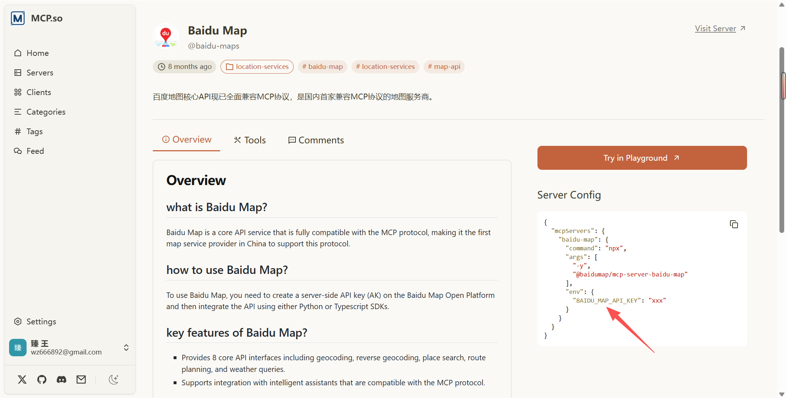
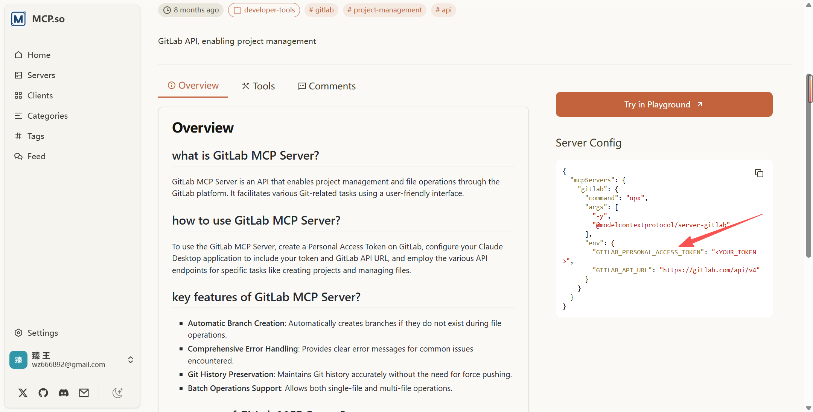
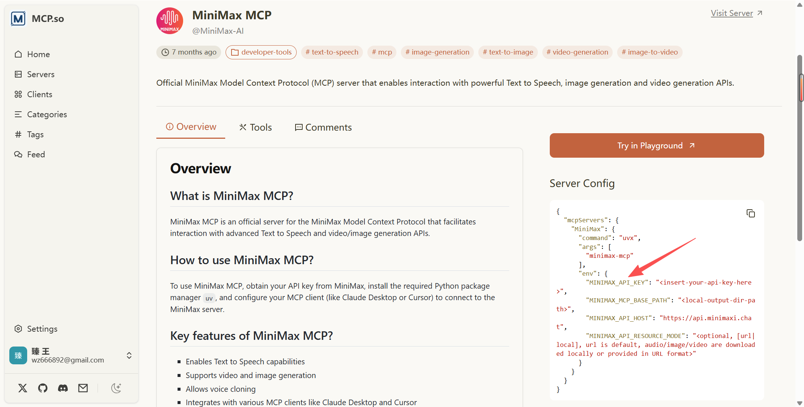
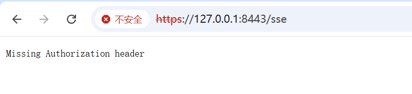
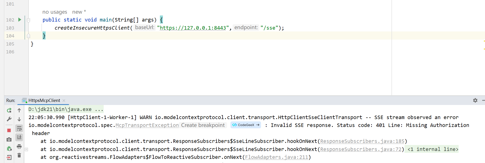
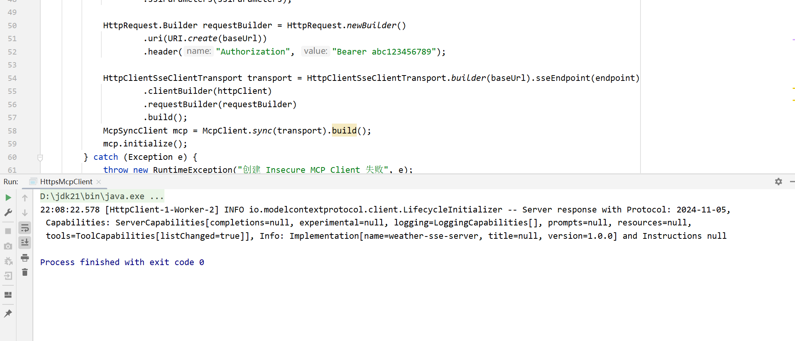

# ✅MCP 如何实现认证鉴权

在上一节课，我们解决了**安全传输**的问题。然而在实际落地中，**如何防止 MCP Server 被滥用**同样至关重要。

MCP 本质上允许客户端调用各种工具，这些工具可能访问数据库或内部系统 API。一旦缺乏认证和访问控制，非授权客户端就可能冒充合法用户，通过 MCP 调用敏感功能，从而导致数据泄露、系统滥用甚至破坏性操作。

因此，一个真正可用于生产环境的 MCP Server，至少需要解决两个安全问题：**传输安全**和**访问控制**。

- **传输安全**：通过 HTTPS 确保数据在传输过程中不被窃取或篡改。
- **访问控制**：通过认证和鉴权机制（如请求头携带 **Bearer Token**），防止工具被任意调用。

只有同时保障了这两点，MCP 服务才能具备生产环境下的安全能力。

经过前面的学习，我们已经知道了，**MCP Server** 分为本地服务和远端服务，本地服务就是 **Stdio**，远端服务就是 **SSE **和 **Streamable**，这两类服务的认证方式也是有所区别。

本地服务

我们可以去MCP Server的市场看一下，随便找几个公开的MCP Server，我们都能看出来，他们是通过设置env的环境变量来控制权限的。







这种认证方式本质上就是在本地环境中设置一个环境变量 KEY 来区分访问权限，这对于个人使用的智能体环境是可行的，因为使用者只有你自己。但在实际企业场景中，MCP Server 通常不是单人使用的。

举个例子：如果一个产品提供了一个专门查询数据的 MCP Server，**不同用户访问的数据范围可能不同，就必须通过传入 token 来区分每个用户的数据权限**。而如果 MCP Server 是 stdio 类型，**本地环境变量 KEY 会被覆盖**，无法实现按用户区分的数据权限控制，因此不适合企业级多用户场景。

Stdio这种方式的认证只需要在初始化的时候传入相应的token即可，比如我用 **tavily**（一种搜索引擎mcp server）为例：

```text
private McpSyncClient initializeTavilyMcp() {
    Map<String, String> env = new HashMap<>();
    // 填写你自己的 API_KEY，去官网申请
    env.put("TAVILY_API_KEY", "tvly-dev-xxxxxxxxxxxxx");
    // 判断是windows环境还是linux环境
    String osName = System.getProperty("os.name").toLowerCase();
    ServerParameters tavily;
    // 设置参数和环境变量（存放认证key）
    if (osName.contains("win")) {
        tavily = ServerParameters.builder("cmd")
        .args("/c", "npx", "-y", "tavily-mcp")
        .env(env)
        .build();
    } else {
        tavily = ServerParameters.builder("npx")
        .args("-y", "tavily-mcp")
        .env(env)
        .build();
    }
    StdioClientTransport tavTransport = new StdioClientTransport(tavily, McpJsonMapper.createDefault());
    McpSyncClient tavilyMcp = McpClient.sync(tavTransport)
    .loggingConsumer(logingMessage -> {
        log.info("WANGZHEN.......TAVILY SEARCH MCP LOGGING: [" + logingMessage.level() + "] " + logingMessage.data());
    })
    .clientInfo(new McpSchema.Implementation("SEARCH ENGINE", "v1.0"))
    .requestTimeout(Duration.ofSeconds(10)).build();
    tavilyMcp.initialize();
    return tavilyMcp;
}
```

远端服务

对于远端服务（SSE 与 Streamable），尽管两者的交互模式不同，但认证机制是一致的：**客户端通过在请求头中加入 token 进行身份验证**。

在服务端，MCP Server 也可以沿用传统 Web 服务的认证方式，通过拦截器对请求头中的 token 进行校验即可。拦截器的实现方式与常规 Web 应用完全相同，例如基于 OAuth、Filter、Interceptor等，这里为了演示方便，选择加一个拦截器来实现此效果。

我们基于上一节课的 HTTPS 的MCP Server来加以改造，新增 **AuthInterceptor** 拦截器，用于校验token，这边演示效果，直接写死即可。

```text

@Component
public class AuthInterceptor implements HandlerInterceptor {

    private static final String FIXED_TOKEN = "abc123456789";
    private static final String AUTH_HEADER = "Authorization";
    private static final String PREFIX = "Bearer ";

    @Override
    public boolean preHandle(HttpServletRequest request,
                             HttpServletResponse response,
                             Object handler) throws Exception {

        String header = request.getHeader(AUTH_HEADER);

        // 判断 header 是否存在
        if (header == null || !header.startsWith(PREFIX)) {
            response.setStatus(HttpServletResponse.SC_UNAUTHORIZED);
            response.getWriter().write("Missing Authorization header");
            return false;
        }

        // 提取 token
        String token = header.substring(PREFIX.length());

        // 校验 token
        if (!FIXED_TOKEN.equals(token)) {
            response.setStatus(HttpServletResponse.SC_UNAUTHORIZED);
            response.getWriter().write("Invalid token");
            return false;
        }

        // 校验成功
        return true;
    }
}
```

注册拦截器：

```text
@Configuration
public class WebConfig implements WebMvcConfigurer {

    private final AuthInterceptor authInterceptor;

    public WebConfig(AuthInterceptor authInterceptor) {
        this.authInterceptor = authInterceptor;
    }

    @Override
    public void addInterceptors(InterceptorRegistry registry) {
        registry.addInterceptor(authInterceptor)
                .addPathPatterns("/**")
                .excludePathPatterns("/health");
    }
}
```

启动项目，访问SSE端点，访问报错，认证不通过，这说明我们的拦截器已经生效了：



接下来，就是要看 MCP Client 如何传递这个token。使用之前的代码，跑一下试试：



发现已经报错401了，然后我们对初始化方法加以改造：

```text
public static void createInsecureHttpsClient(String baseUrl, String endpoint) {
    try {
        // 1. 创建一个信任所有证书的 TrustManager
        TrustManager[] trustAllCerts = new TrustManager[]{
                new X509TrustManager() {
                    public X509Certificate[] getAcceptedIssuers() {
                        return new X509Certificate[0];
                    }

                    public void checkClientTrusted(X509Certificate[] certs, String authType) {
                    }

                    public void checkServerTrusted(X509Certificate[] certs, String authType) {
                    }
                }
        };

        // 2. 初始化 SSL 上下文，绕过校验
        SSLContext sslContext = SSLContext.getInstance("TLS");
        sslContext.init(null, trustAllCerts, new SecureRandom());

        // 3. 创建并配置 SSLParameters 以禁用主机名验证
        SSLParameters sslParameters = new SSLParameters();
        sslParameters.setEndpointIdentificationAlgorithm(null);

        HttpClient.Builder httpClient = HttpClient.newBuilder()
                .connectTimeout(Duration.ofSeconds(30))
                .sslContext(sslContext)
                .sslParameters(sslParameters);

        // 4. 设置请求头
        HttpRequest.Builder requestBuilder = HttpRequest.newBuilder()
                .uri(URI.create(baseUrl))
                .header("Authorization", "Bearer abc123456789");

        HttpClientSseClientTransport transport = HttpClientSseClientTransport.builder(baseUrl).sseEndpoint(endpoint)
                .clientBuilder(httpClient)
                .requestBuilder(requestBuilder)
                .build();
        McpSyncClient mcp = McpClient.sync(transport).build();
        mcp.initialize();
    } catch (Exception e) {
        throw new RuntimeException("创建 Insecure MCP Client 失败", e);
    }
}
```

重点在31行，设置请求头，通过构造 **requestBuilder** 在其 **header **中设置 **Authorization **即可。



---

来源: https://thoughts.aliyun.com/workspaces/6963289eb0fc2e001bb052eb/docs/696857f3d31fed0001f2654b
