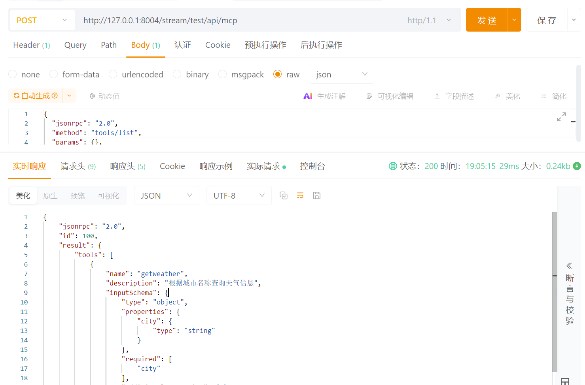
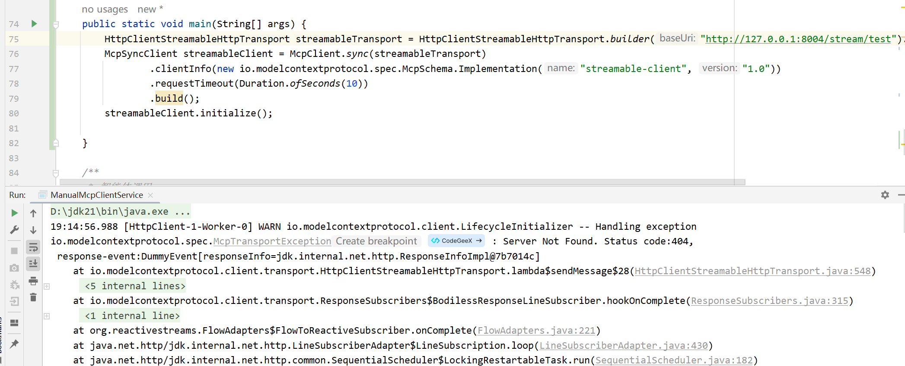
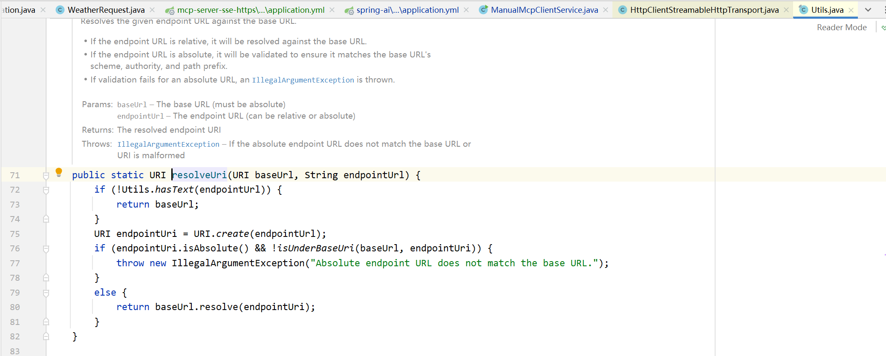
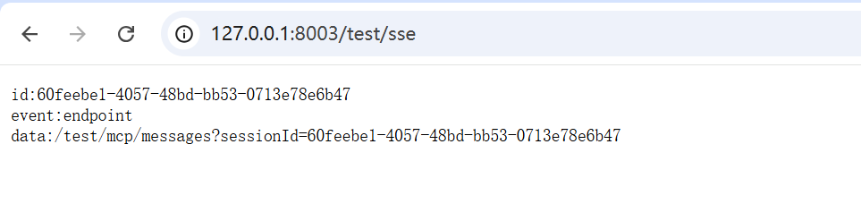

# ✅神奇的 context-path

相信大家肯定都在 Spring Boot 项目中配置过 **server.servlet.context-path**，这在微服务或多模块 Web 应用中非常常见，用于给每个服务分配独立的路由前缀。

然而，对于 MCP 的 SSE 机制来说，这个看似普通的 **context-path**，却可能成为让系统无法通信的关键因素。很多人可能会以为，只要 SSE endpoint 和 message endpoint 配置正确，系统就能正常运行，其实这并不完全。

我将在这里结合自己的亲身经历，为大家讲解这个非常奇怪的问题。尤其是在 MCP Server 与 Client 版本混用的情况下，这个 context-path 很容易让你掉进兼容性的深坑里。

**官方issue：**

[https://github.com/spring-projects/spring-ai/issues/4168](https://github.com/spring-projects/spring-ai/issues/4168)

[https://github.com/spring-projects/spring-ai/issues/2512](https://github.com/spring-projects/spring-ai/issues/2512)

Streamable HTTP

MCP Server

我们以之前的 **Streambale HTTP **的 MCP Server为例，增加 **context-path** 属性：

```text
server:
  port: 8004
  servlet:
    encoding:
      charset: UTF-8
      force: true
      enabled: true
    context-path: /stream/test

spring:
  application:
    name: mcp-weather-streamable
  ai:
    mcp:
      server:
        protocol: STATELESS
        name: streamable-mcp-server
        version: 1.0.0
        type: SYNC
        instructions: "这个服务是用来查询城市天气的。"
        resource-change-notification: true
        tool-change-notification: true
        prompt-change-notification: true
        annotation-scanner:
          enabled: true
        streamable-http:
          mcp-endpoint: /api/mcp
          keep-alive-interval: 30s
```

那这时候，我们访问的地址应该就变成了：[http://127.0.0.1:8004/stream/test/api/mcp](http://127.0.0.1:8004/stream/test/api/mcp)

我们调用一下postman看下是否通：



没错，是不是很简单就搞定了。接下来我们看下MCP Client应该如何来连接。

MCP Client

下面这部分代码是之前没有 context-path 的连接代码：

```text
HttpClientStreamableHttpTransport streamableTransport = HttpClientStreamableHttpTransport.builder("http://127.0.0.1:8004").endpoint("/api/mcp").build();
McpSyncClient streamableClient = McpClient.sync(streamableTransport)
        .clientInfo(new io.modelcontextprotocol.spec.McpSchema.Implementation("streamable-client", "1.0"))
        .requestTimeout(Duration.ofSeconds(10))
        .build();
streamableClient.initialize();
```

那现在多了一个** context-path**，我们是不是可以直接将 **baseuri** 改一下就可以了：

```text
HttpClientStreamableHttpTransport streamableTransport = HttpClientStreamableHttpTransport.builder("http://127.0.0.1:8004/stream/test").endpoint("/api/mcp").build();
McpSyncClient streamableClient = McpClient.sync(streamableTransport)
        .clientInfo(new io.modelcontextprotocol.spec.McpSchema.Implementation("streamable-client", "1.0"))
        .requestTimeout(Duration.ofSeconds(10))
        .build();
streamableClient.initialize();
```

看着很ok对吧，**但是你可以试一下这个会报错 404：**



这是因为啥呢？我们接下来看下源码。

源码实现

**HttpClientStreamableHttpTransport** 中在解析 **uri 和 endpoint **的时候，使用了这个工具类。



这段代码就是 **MCP Server 连接不通** 的根源：

- **如果 endpoint 以 ****`/`**** 开头**，`baseUrl.resolve("/xxx")` 会把 `baseUrl` 的 path 覆盖掉（得到 `http://host/xxx`），也就是抹掉 context-path。
- **如果 endpoint 不以 ****`/`**** 开头**，解析会把它当作相对路径附加到 `baseUrl` 的路径上。

**举例说明**

**情况 A**

正确（期望结果）：

```text
baseUrl  = http://127.0.0.1:8004/stream/test/   // 注意：以 '/' 结尾
endpoint = api/mcp                              // 无前导 '/'
```

解析后（期望）：

```text
http://127.0.0.1:8004/stream/test/api/mcp
```

**情况 B **

常见错误 1（漏写尾斜杠）：

```text
baseUrl  = http://127.0.0.1:8004/stream/test     // 无尾 '/'
endpoint = api/mcp
```

解析后（会替换最后一段）：

```text
http://127.0.0.1:8004/stream/api/mcp   // 不是你想要的 /stream/test/api/mcp，导致 404
```

**情况 C**

常见错误 2（endpoint 以 '/' 开头）：

```text
baseUrl  = http://127.0.0.1:8004/stream/test/
endpoint = /api/mcp
```

解析后（覆盖 path）：

```text
http://127.0.0.1:8004/api/mcp   // context-path 被抹掉，导致 404
```

**那么，正确的设置是什么？**

**baseUrl 以 ****`/`**** 结尾 + endpoint 不以 ****`/`**** 开头（推荐写法）**

```text
HttpClientStreamableHttpTransport transport =
    HttpClientStreamableHttpTransport.builder("http://127.0.0.1:8004/stream/test/") // 注意尾斜杠
        .endpoint("api/mcp")   // 注意：没有前导 '/'
        .build();
```

**（PS：当然你也可以endpoint暴力设置绝对路径，但是不推荐，这样逻辑是混乱的，违背了URI的拼接逻辑，baseuri仅剩schame和ip地址的校验作用）**

**虽然也可以通，但是不推荐的写法！！！**

```text
HttpClientStreamableHttpTransport transport =
    HttpClientStreamableHttpTransport.builder("http://127.0.0.1:8004")
        .endpoint("http://127.0.0.1:8004/stream/test/api/mcp") 
        .build();
```

SSE

MCP Server

这边我们再顺带介绍一下 SSE的配置。

同样，我们还是先修改mcp server的配置，增加 context-path，并且增加另一个重要的参数：base-url

```text
server:
  port: 8003
  servlet:
    encoding:
      charset: UTF-8
      force: true
      enabled: true
    context-path: /test

spring:
  application:
    name: mcp-weather-sse
  ai:
    mcp:
      server:
        enabled: true
        name: weather-sse-server
        version: 1.0.0
        type: SYNC
        capabilities:
          tool: true
          resource: false
          prompt: false
          completion: false
        sse-message-endpoint: /mcp/messages
        sse-endpoint: /sse
        base-url: /test
```

修改完后，我们浏览器直接访问一下SSE的监听地址：



我们关注它返回的data，也就是message的端点，前面也同样多了一个前缀根路径：/test。

**这是一个新版本相比于旧版本的不同点，旧版本中（如Spring AI 1.0.0-M7），返回的data是不带有这个前缀的，框架默认去发消息的时候会添加这个前缀，但是新版本（Spring AI 1.1.0）的处理方式完全变了，这就导致，假如你是用的旧版本做MCP Server，并且用新版本的MCP Client来连接，就会导致连接不通，这就是所谓的兼容性问题。**

MCP Client

与Streamable的规则一致，client也需要做如下的配置即可。还是斜杠的问题，多一个斜杠少一个斜杠，都会导致连接报错404，只要按照我们上面介绍的原则来配置就可以了。

```text
HttpClientSseClientTransport transport = HttpClientSseClientTransport.builder("http://127.0.0.1:8003/test/").sseEndpoint("sse").build();
McpSyncClient sseClient = McpClient.sync(transport)
.clientInfo(new io.modelcontextprotocol.spec.McpSchema.Implementation("sse-client", "1.0"))
.requestTimeout(Duration.ofSeconds(10))
.build();
sseClient.initialize();
```

总之，如果可以的话，尽量不要为 MCP Server 配置 `context-path`，因为无论是 Streamable 还是 SSE，都对路径的精确匹配高度敏感，一旦存在多余的前缀就会导致客户端无法连接、消息端点错位、版本兼容性混乱等问题。如果确实必须使用 `context-path`，请严格按照我之前提供的推荐方式配置，并且需要保证客户端与服务端框架版本的一致性（**Spring AI 新旧版本SSE 不兼容的问题，同样也是因为对context-path的解析方式的问题**）、路径规范保持统一。这样才能避免在实际生产中遇到连接失败、协议不兼容等隐蔽且难排查的问题。

---

来源: https://thoughts.aliyun.com/workspaces/6963289eb0fc2e001bb052eb/docs/6969cf9da7c8ff00013bdc7e
