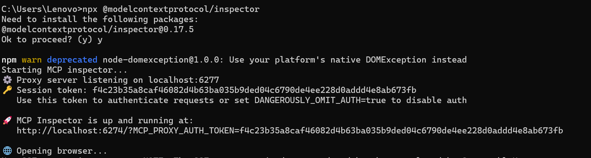
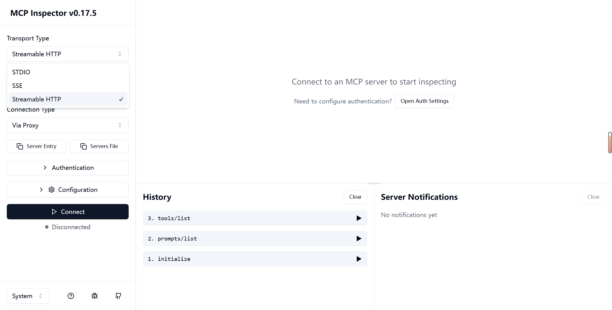
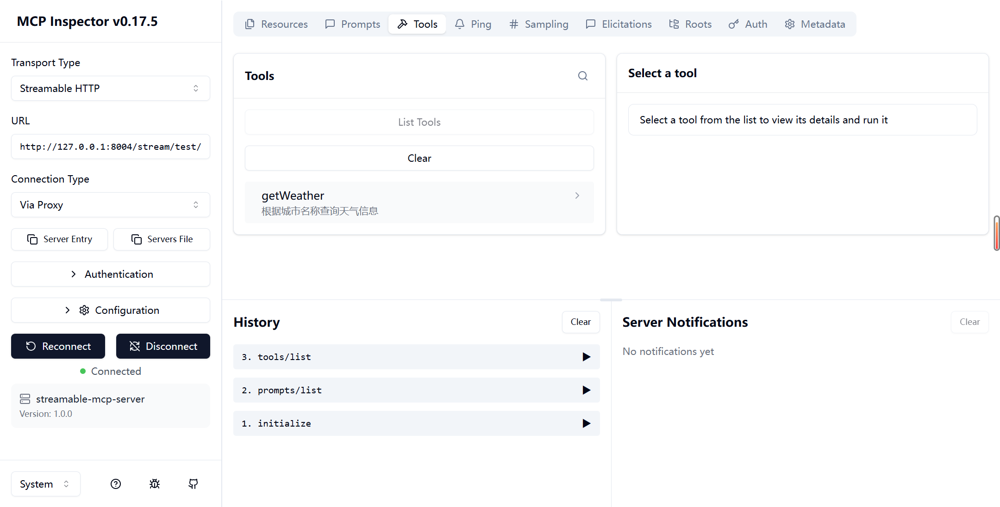
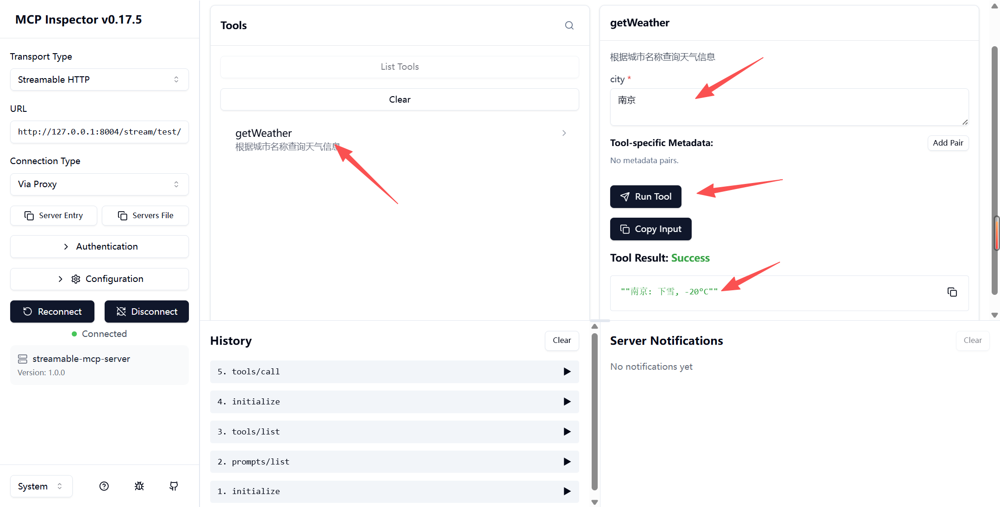
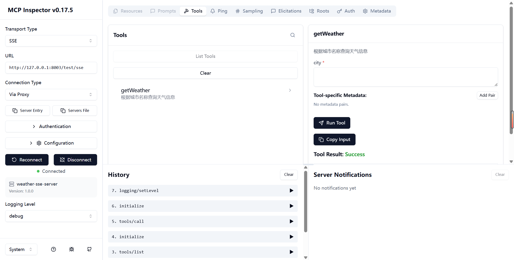
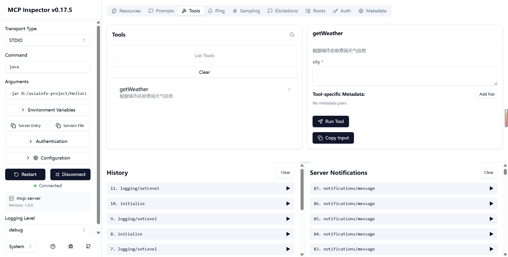

# ✅MCP 调试工具

**MCP Inspector** 是 MCP官方推出的一款可视化调测与调试工具，旨在帮助开发者快速验证 MCP 服务器的实现是否符合规范，并便捷地查看工具（tools）、资源（resources）、事件（events）等内容。它以一个独立的 Web UI 运行，能够与本地或远程 MCP Server 建立连接，实时展示通信内容，是目前最方便的 MCP 开发辅助工具之一。

安装要求本地有nodeJs环境：[https://nodejs.org/zh-cn](https://nodejs.org/zh-cn)

本地打开cmd，启动命令，不指定版本，默认下载最新版本：

```text
npx @modelcontextprotocol/inspector@latest
```



目前最新版本是0.17.5。然后我们就可以打开浏览器访问：[http://localhost:6274/](http://localhost:6274/)

右上角的Transport Type 包含3种类型：Stdio，SSE，Streamable



Streamable HTTP

我们选择Streamable 来尝试连接一下，在URL的输入框填写：[http://127.0.0.1:8004/stream/test/api/mcp](http://127.0.0.1:8004/stream/test/api/mcp)

点击Connect。



连接成功后，我们点击Tab页签的Tools，就可以看到所有的工具列表了，不但如此，我们还可以在线调试：

**点击工具名称 → 填写参数 → Run Tool → 获取结果**



SSE

同样还是在URL输入：[http://localhost:8003/test/sse](http://localhost:8003/test/sse)

这个我在使用旧版本的时候，inspector0.7.0，是不支持带前缀的SSE的，新版本已经解决了这个BUG。

并且这个工具也不认自签名证书，所以在本地调试的时候，需要改成HTTP来调试。正常情况下，我们也不会在springboot项目里直接使用https，生产上更常见的方式其实是用nginx来转发https的。



Stdio

同样这个工具也支持本地服务，这边简单演示一下：

```text
java -jar D:/LLMentor/LLMentor/mcp/mcp-server-stdio/target/mcp-server-stdio-1.0.0-SNAPSHOT.jar
```



---

来源: https://thoughts.aliyun.com/workspaces/6963289eb0fc2e001bb052eb/docs/6969d345d31fed0001f462a7
