# ✅如何跳过 MCP 的模型总结

在文档这一章节中，我们已经深入了解了 MCP 的内部工作流程，**在大模型决策选择工具，框架调用工具结束后，会将工具执行结果再次丢给大模型做迭代总结**。这个机制的好处是：模型不仅能决定调用哪个工具、如何调用工具，还能对工具结果进行自然语言的总结，使最终回答更自然、更贴近用户需求。

但这套机制不是在所有场景下都合适，有时候甚至会成为性能瓶颈。

为什么要跳过模型总结？

在真实的业务系统中，你往往会遇到如下的场景：

**多智能体协作（Multi-Agent）**

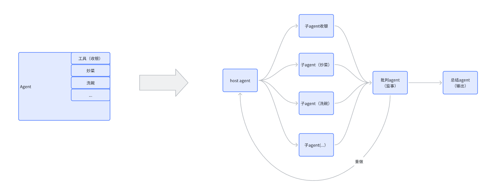

多个 Agent 持续调用工具、互相传递结果，如果每一步工具执行完都要让模型再总结一遍：

- 延迟倍增
- token 成本增加
- 智能体的逻辑链路变长、变慢
- 最终用户等待时间过长

某些时候，Agent 根本不需要模型再去总结。例如：

- 一个 Agent 专门用于执行计算任务
- 一个 Agent 专门用于进行数据清洗
- 调用工具的任务就是中间过程，无需总结

这些都是中间过程，只需要获取到结果就好，在最终总结的时候，将这些中间结果一起抛给最后一个总结智能体中，让总结智能体流式输出，这样体验就会好很多。

工具本身输出就是最终答案

很多 MCP 工具的职责非常明确：**提供业务结果，而不是给模型做二次润色的素材**。例如：

- 天气查询工具
- 支付下单工具
- 订单查询工具
- 文件上传工具
- 流式数据读取工具
- 数据库查询工具

这些工具返回的通常是 **结构化、可直接使用的业务数据**（JSON、对象、列表等）。这类结果本来就是系统最终要用的内容。如果让模型再进一步总结，不但：

- **浪费时间和算力**
- **增加 token 成本**
- **延长响应延迟**

更糟糕的是，模型的主观性还可能破坏结构化数据，例如：

- 字段名被改写
- 格式被重新组织
- 结构变成自然语言而无法被系统消费
- 甚至把本来简单的结果加工得变得又长又啰嗦

除此之外，还有一些 **AI 工具本身已经经过模型推理**，再次总结完全没有意义。例如：

- 基于 **LightRAG** 的知识图谱问答工具
- 本身就调用过大模型进行推理、推断、总结的高级 AI 能力组件
- 二次推理结果会让上下文变得更模糊，而不是更清晰

LightRAG 这类工具内部已经走过了「检索 → 推理 → 生成」全流程，返回的内容往往就是经过模型深度处理的最终结果。此时强行让 MCP Client 再回到大模型进行“总结”，不仅没有价值，还可能把它原本的严谨推理结果变得混乱。

综上所述，跳过模型总结的核心原因在于：在某些实际业务场景中，模型的迭代推理不仅没有必要，反而会带来明显的性能开销与工程风险。工具已经提供了结构化、可直接消费的结果时，再让模型进行总结只会增加延迟、提高 token 成本，并可能因模型的主观性导致数据被重新组织甚至失真。此外，在高性能 API、自动化流程、多智能体协作等场景中，链路中每一个额外的推理步骤都会显著影响整体速度与稳定性。因此，当我们只需要模型负责工具决策与参数生成，而不需要它对结果进行改写时，跳过模型总结不仅是优化，更是工程上最合理的选择。

returnDirect

Spring AI 提供了一个参数，使我们可以方便的进行选择是否跳过模型迭代总结，这个参数就是**returnDirect**。

```text
@Tool(description = "根据城市名称查询天气信息",returnDirect = true)
public String getWeather(String city) {
    if (city == null) {
        return "请提供城市名称";
    }
    return switch (city) {
        case "北京" -> "北京: 晴, 25°C";
        case "上海" -> "上海: 多云, 22°C";
        case "深圳" -> "深圳: 小雨, 28°C";
        default -> city + ": 下雪, -20°C";
    };
}
```

我们只需要在 @Tool 注解中增加这个参数即可实现跳过。我们看下他的效果如何。


是不是有点意外，完全没作用啊，这不还是二次总结了，我们的期望是直接获取到我们的工具返回结果才对：

```text
南京：下雪，-20°C
```

为啥会这样呢，我们深入到源码中来分析下这个原因。

源码分析

我们在文档已经详细的对MCP的执行流程进行了分析，这边其他流程不再赘述，直接定位到重点的类，就是：**DefaultToolCallingManager** 的 **executeToolCall **方法。

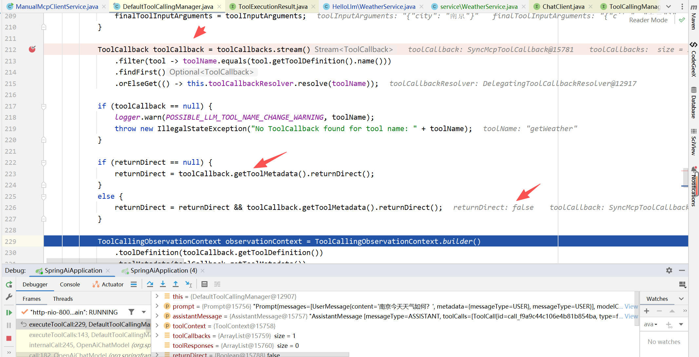

这边是它的一些代码片段，可以看到是会从 **toolcallback **的 **toolmetadata** 中获取这个 **returnDirect**的，那为啥我设置的是true，获取的是false呢？我们接着往下看。

我们进入到 **ToolCallback** 这个类，看下他的元数据是怎么获取的。他提供了一个默认方法，默认方法的返回其实就是false，那就是说我们在MCP Server中设置的参数没传过来，没有生效。

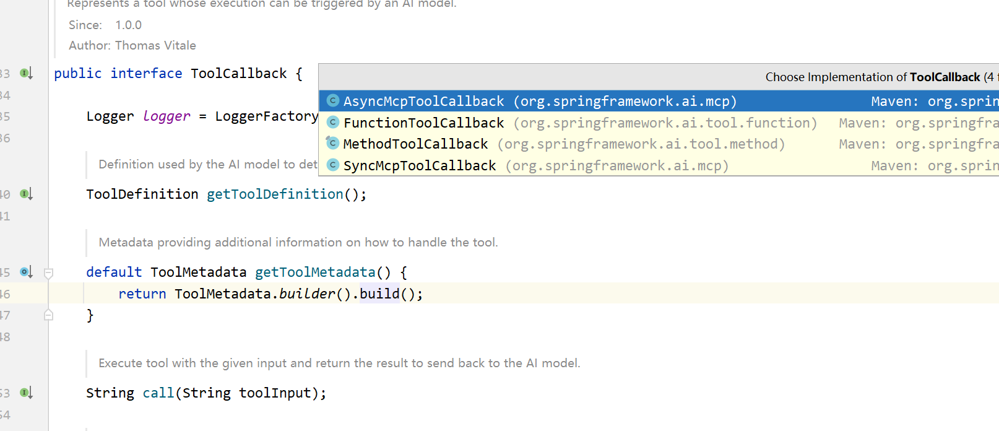

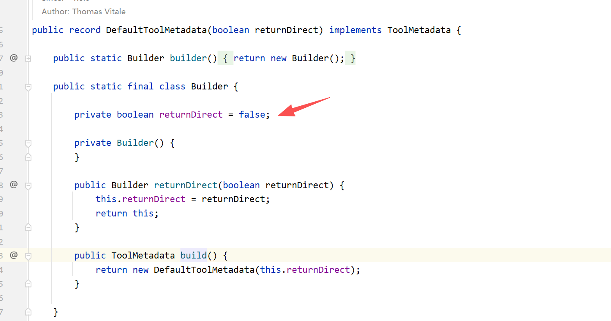

我们还可以看到 **ToolCallback** 有几种默认实现类，我们现在用的是MCP方式 **SyncMcpToolCallback。**

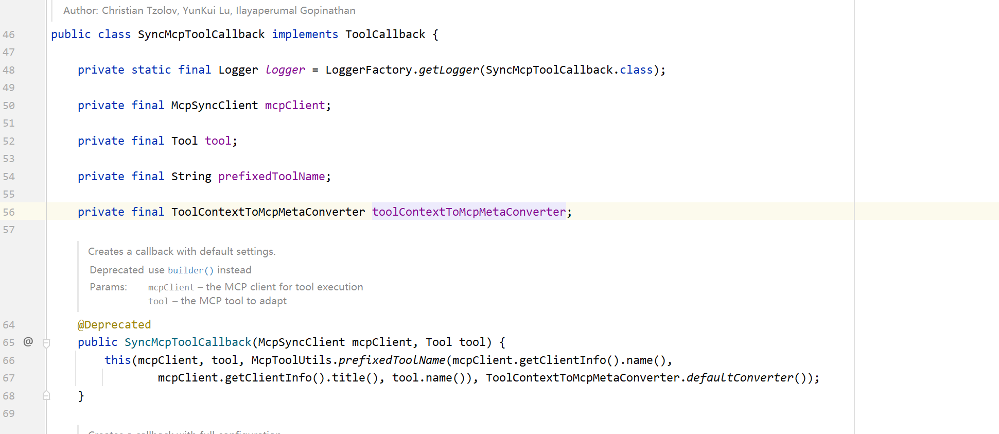

发现这个类完全没有对这个元数据进行实现，天塌了，这不就是不支持嘛。是不是很好奇这个 returnDirect 到底啥情况下才能生效呢？

我们看下其他的实现类，比如：**FunctionToolCallback，也就是传统的Function-Call。**

**FunctionCall 能否生效？**

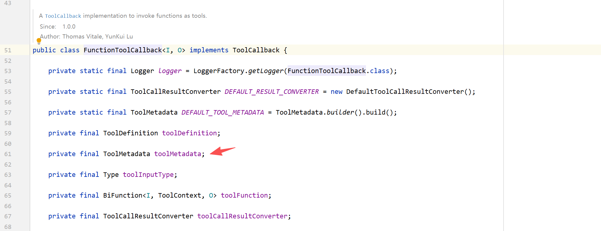

他这边是有元数据的相关操作的，那我们就试试看，使用functioncall的方式能不能实现跳过的效果。

修改一下chatclient的注入工具方式，改为tools：

```text
        this.chatClient = ChatClient.builder(chatModel)
//                .defaultToolCallbacks(callbacks)
                .defaultTools(new WeatherService())
                .build();
```

自己在同项目，再重新创建一个WeatherService，注意不是远程调用，function call是本地调用。

```text
@Service
@Slf4j
public class WeatherService {

    @Tool(description = "根据城市名称查询天气信息",returnDirect = true)
    public String getWeather(String city) {
        if (city == null) {
            return "请提供城市名称";
        }
        return switch (city) {
            case "北京" -> "北京: 晴, 25°C";
            case "上海" -> "上海: 多云, 22°C";
            case "深圳" -> "深圳: 小雨, 28°C";
            default -> city + ": 下雪, -20°C";
        };
    }
}
```

到这里就ok了，我们再次请求访问看下效果。看到我们断点处的returnDirect已经是读取到true了。

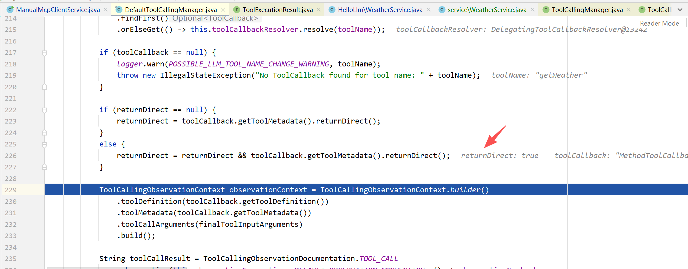

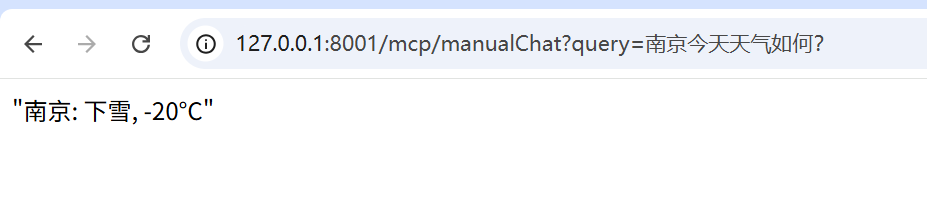

是不是就跟我们的预期是一样的。说明这个参数功能对于MCP而言就是Spring AI没有帮我们实现啊。那MCP现在已经作为了通用工具的标准，他肯定也是需要解决这个问题的，那应该怎么做呢？其实也是有办法的。

MCP 如何跳过？

核心问题就在于如何接管 **SyncMcpToolCallback，**而这个类实际上是我们在注入工具的时候设置的：

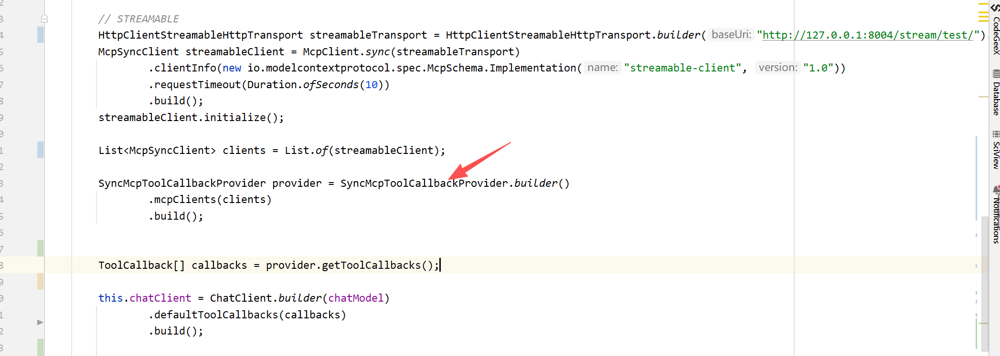

也就是这个 **SyncMcpToolCallbackProvider，**在他的内部会去初始化 **SyncMcpToolCallback**

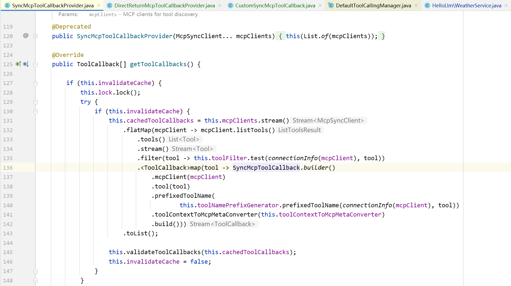

了解其原理后，我们如何来接管这两个类？是不是就可以自然而然的想到我们的继承，我只要继承这两个类，修改其获取元数据的方式，是不是就可以将 **returnDirect** 动态传入进去了。

那我们首先开发一个 **ReturnDirectSyncMcpToolCallback** 继承 **SyncMcpToolCallback，只需要重写getToolMetadata即可。**

```text
package cn.hollis.llm.HelloLlm.springai.mcp.callback;

import io.modelcontextprotocol.client.McpSyncClient;
import io.modelcontextprotocol.spec.McpSchema;
import org.springframework.ai.mcp.SyncMcpToolCallback;
import org.springframework.ai.tool.metadata.ToolMetadata;

public class ReturnDirectSyncMcpToolCallback extends SyncMcpToolCallback {

    private final boolean returnDirect;

    public ReturnDirectSyncMcpToolCallback(McpSyncClient client, McpSchema.Tool tool, boolean returnDirect) {
        super(client, tool);
        this.returnDirect = returnDirect;
    }

    @Override
    public ToolMetadata getToolMetadata() {
        return ToolMetadata.builder()
                .returnDirect(returnDirect)
                .build();
    }
}
```

**接着创建一个 DirectReturnMcpToolCallbackProvider 用于接收 McpSyncClient 并转换成 toolcallback**

```text
@Slf4j
public class DirectReturnMcpToolCallbackProvider extends SyncMcpToolCallbackProvider {

    private final List<McpSyncClient> mcpClients;

    private boolean returnDirect;

    public DirectReturnMcpToolCallbackProvider(List<McpSyncClient> mcpClients, boolean returnDirect) {
        super(mcpClients);
        this.mcpClients = mcpClients;
        this.returnDirect = returnDirect;
    }

    @Override
    public ToolCallback[] getToolCallbacks() {
        var toolCallbacks = new ArrayList<>();

        for (McpSyncClient mcpClient : mcpClients) {
            List<McpSchema.Tool> toolList = Collections.emptyList();

            try {
                toolList = mcpClient.listTools().tools();
            } catch (Exception e) {
                // 跳过该 MCP，继续处理其它的
                continue;
            }

            for (var tool : toolList) {
                toolCallbacks.add(new CustomSyncMcpToolCallback(mcpClient, tool, returnDirect));
            }
        }
        var array = toolCallbacks.toArray(new ToolCallback[0]);
        validateToolCallbacks(array);
        return array;
    }

    private void validateToolCallbacks(ToolCallback[] toolCallbacks) {
        List<String> duplicateToolNames = ToolUtils.getDuplicateToolNames(toolCallbacks);
        duplicateToolNames.forEach(s -> log.info("tool name found: {}", s));
        if (!duplicateToolNames.isEmpty()) {
            throw new IllegalStateException(
                    "Multiple tools with the same name (%s)".formatted(String.join(", ", duplicateToolNames)));
        }
    }
}
```

最后我们再改造一下注入 **chatclient** 的方式，将 **returnDirect **设置为true透传进去即可。

```text
DirectReturnMcpToolCallbackProvider callbackProvider = new DirectReturnMcpToolCallbackProvider(clients,true);

this.chatClient = ChatClient.builder(chatModel)
       .defaultToolCallbacks(callbackProvider)
       .build();
```

改造到这就ok了，接下来我们尝试调用一下：

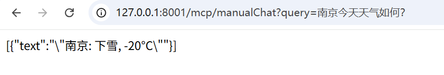

到这里我们可以看到成功跳过了模型的迭代总结，至于为什么这边会有text，这个其实就需要去看**SyncMcpToolCallback 的 **call 方法的返回值：

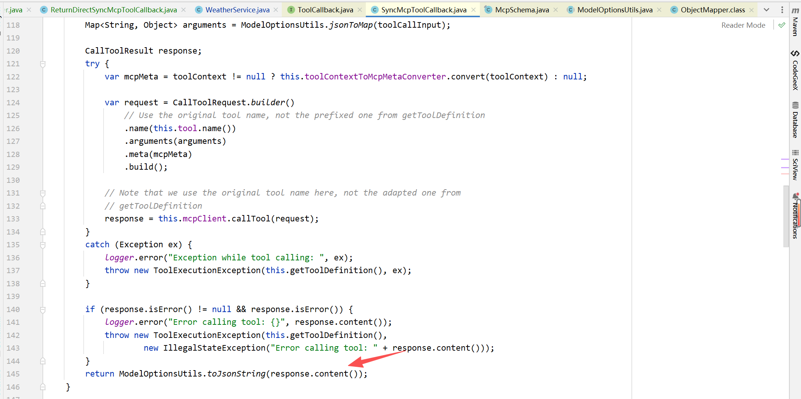

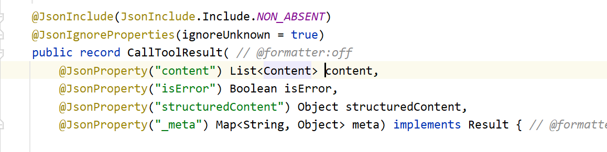

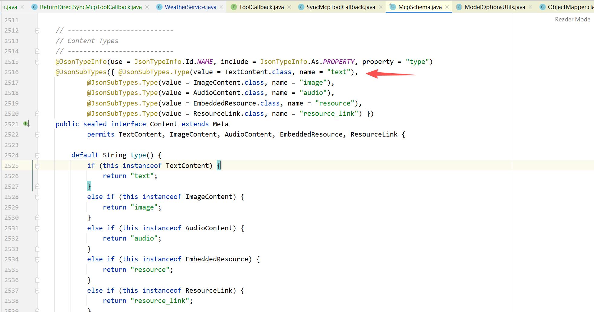

通过继承的方式，我们重写了provider 和 toolcallback 类，成功实现了跳过MCP模型总结，甚至通过这种方式，我们还可以重写 **SyncMcpToolCallback的 call 方法**，在调用MCP工具时做一些定制化的处理，这个大家可以自己尝试去做一下。

---

来源: https://thoughts.aliyun.com/workspaces/6963289eb0fc2e001bb052eb/docs/696b00f851b14400011b2775
