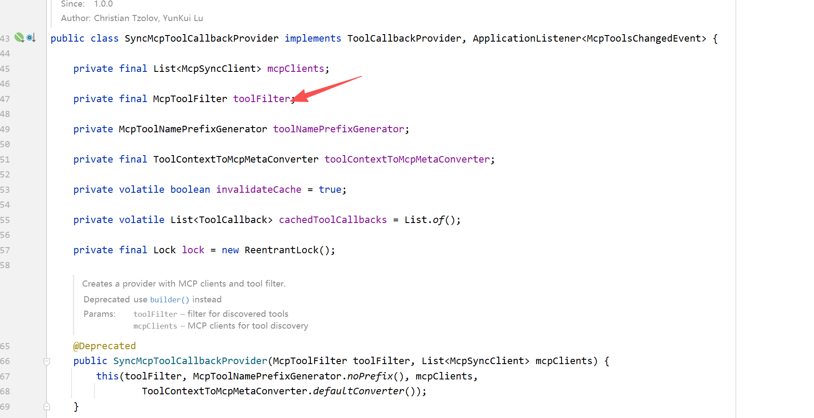
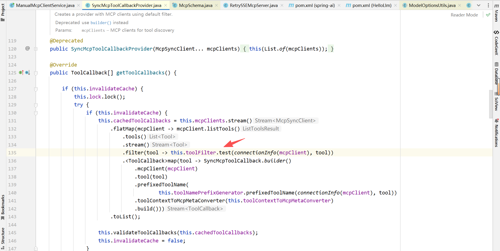
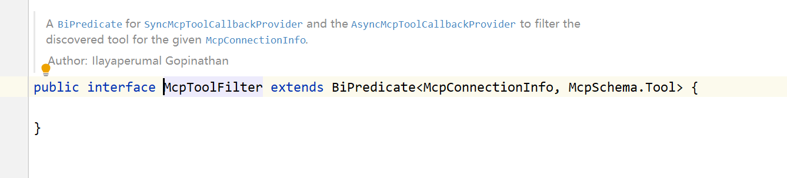
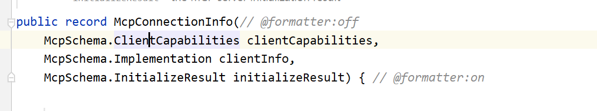
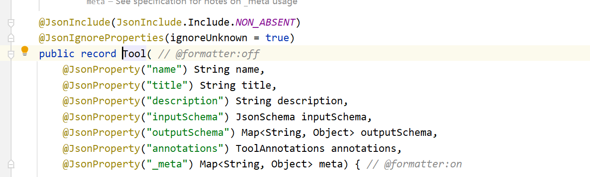
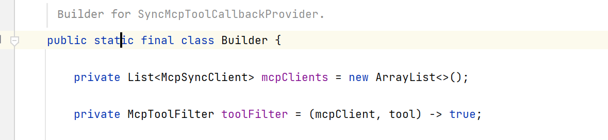
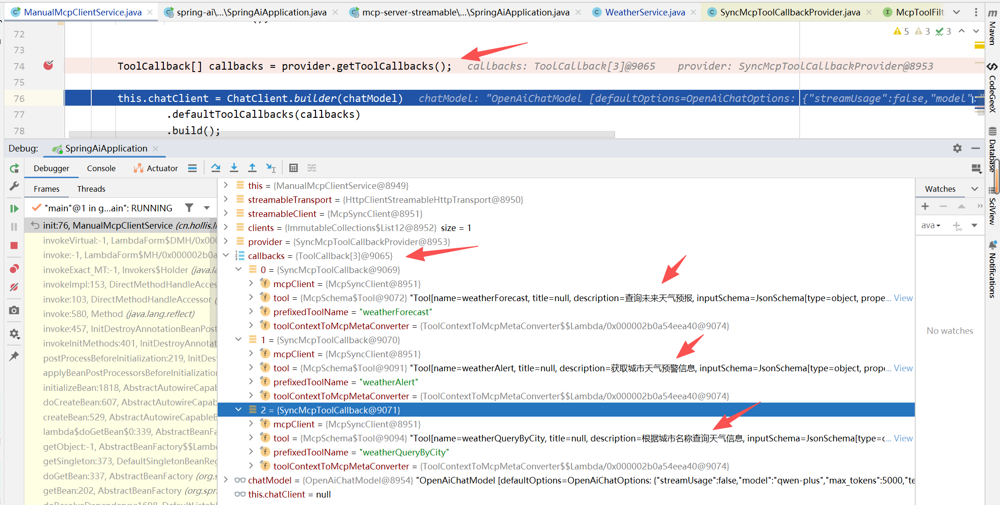

# ✅如何实现 MCP 工具过滤

为什么要做工具过滤？

在企业级的复杂场景中，MCP Server 往往会包含**大量工具**，如果不加区分地将所有工具直接交给大模型使用，会带来**明显的性能与准确性问题**。因此，在 MCP Client 侧引入**工具过滤机制是非常有必要的操作**。

主要原因包括以下三点：

1. **降低上下文压力与 Token 成本**每个工具都带有结构化的 Schema 和详细描述，这些内容会被放入系统提示词中，**同样占用大模型的上下文**。如果一个 MCP Server 有几十个工具，而当前任务仅需要其中少量，其余工具描述都会成为无意义的上下文负担，不仅浪费 Token，还会减少模型可处理的有效信息空间。
2. **提升模型工具选择的准确性**当工具数量过多时，模型在进行工具选择时需要在一个更大的候选集合中进行判断，干扰项越多，**选错工具或产生幻觉的概率越高**。通过过滤掉无关工具，可以让模型在更干净有用的工具列表中做决策，从而显著提高调用成功率和整体推理质量。
3. **多智能体角色划分**在多智能体架构中，不同智能体通常负责不同任务。例如，在网络安全领域，告警分析智能体只需要告警查询的相关工具，而资产分析智能体只需要资产查询的相关工具。如果不做过滤，所有智能体都会看到全部接口，既增加不必要的复杂度，也可能造成误调用甚至越权风险。工具过滤能够为每个智能体提供更精确的工具可见性，**确保单智能体的功能原子性**，更安全、职责更清晰。

因此，**在 client 端对 MCP Server 工具做过滤**，只把需要的工具注入到智能体中，这是一种简洁且有效的做法。Spring AI 中则提供了 **McpToolFilter** 来实现这一点。

**工具过滤原理**

我们在前面的课程中，经常跟 **SyncMcpToolCallbackProvider** 和 **SyncMcpToolCallback** 这两兄弟打交道。在 **SyncMcpToolCallbackProvider** 中就有这个 **McpToolFilter** 来控制要不要构建 **SyncMcpToolCallback**。



在 **SyncMcpToolCallbackProvider** 的 **getToolCallbacks **方法中，也就是将 **McpSyncClient **转换成 **toolcallback **的时候，会使用这个 **McpToolFilter 对 MCP Server 中的工具进行 test 过滤**。





我们可以看到这个 **McpToolFilter 是继承于 ****BiPredicate。**

**BiPredicate** 是 **Java 8** 引入在 **java.util.function** 包下的一个函数式接口。它定义了一个抽象方法 **boolean test(T t, U u)**。也就是说，它接收两个输入参数（类型 **T 和 U**），返回一个 **boolean** 值，用于判断这两个参数是否满足某个条件。

因为它是一个函数式接口，所以你可以用 Lambda 表达式或方法引用来直接构造它，比如：

```text
BiPredicate<String, Integer> myCheck = (s, i) -> s.length() > i;
boolean result = myCheck.test("hello", 3);  // true
```

那了解到这里之后，我们可以看下 **McpToolFilter 的两个参数是什么？一个是 ****McpConnectionInfo 就是连接的Server信息，第二个就是连接中的工具本身。  **





**也就是说，McpToolFilter 本质是 BiPredicate<McpConnectionInfo, McpTool>，它以 (MCP 连接信息, 单个工具) 作为输入，对每个工具进行判断，返回 true 表示“保留该工具”、false 表示“丢弃该工具”。**

**Spring AI 这边的默认行为是全放行。**



**如何实现？**

接下来我们改造一下我们之前的Streamable HTTP的工具，给工具增加name属性，**其中3个方法的name以weather打头，另外一个方法则不是，用于区分过滤效果。**

```text
@Service
@Slf4j
public class WeatherService {

    @Tool(name = "weatherQueryByCity", description = "根据城市名称查询天气信息")
    public String getWeatherByCity(String city) {
        if (city == null) return "请提供城市名称";
        return switch (city) {
            case "北京" -> "北京: 晴, 25°C";
            case "上海" -> "上海: 多云, 22°C";
            case "深圳" -> "深圳: 小雨, 28°C";
            default -> city + ": 下雪, -20°C";
        };
    }

    @Tool(name = "weatherForecast", description = "查询未来天气预报")
    public String getWeatherForecast(String city) {
        if (city == null) return "请提供城市名称";
        return city + ": 明天多云，后天有小雨。";
    }

    @Tool(name = "weatherAlert", description = "获取城市天气预警信息")
    public String getWeatherAlert(String city) {
        if (city == null) return "请提供城市名称";
        return city + ": 暴雨黄色预警，注意安全。";
    }


    @Tool(name = "climateIndex", description = "查询城市气候指数")
    public String getClimateIndex(String city) {
        return city + ": 舒适度 72/100，相对湿度 65%。";
    }
}
```

接下来，我们改造下 **MCP Client **的相关代码，在构建 **SyncMcpToolCallbackProvider **的时候传入 **toolFilter**表达式即可，**startsWith("weather")**  表示只有工具名称 **weather **开头的工具才会返回 **true**，才能被注入使用。

```text
HttpClientStreamableHttpTransport streamableTransport = HttpClientStreamableHttpTransport.builder("http://127.0.0.1:8004/stream/test/").endpoint("api/mcp").build();
McpSyncClient streamableClient = McpClient.sync(streamableTransport)
        .clientInfo(new io.modelcontextprotocol.spec.McpSchema.Implementation("streamable-client", "1.0"))
        .requestTimeout(Duration.ofSeconds(10))
        .build();
streamableClient.initialize();

List<McpSyncClient> clients = List.of(streamableClient);

SyncMcpToolCallbackProvider provider =
        SyncMcpToolCallbackProvider.builder()
            .mcpClients(clients)
            // 关键过滤方法
            .toolFilter((conn, tool) -> tool.name().startsWith("weather"))
            .build();

ToolCallback[] callbacks = provider.getToolCallbacks();

this.chatClient = ChatClient.builder(chatModel)
        .defaultToolCallbacks(callbacks)
        .build();
```

运行我们的代码，我们可以看到，这边生成的 **toolcallback **不是4个而是3个 **weather **开头的工具。这样我们就成功实现了我们的工具过滤的效果，大家可以根据自己业务的实际情况，选择合适的过滤方式，只要去设置 **BiPredicate** 表达式即可。



---

来源: https://thoughts.aliyun.com/workspaces/6963289eb0fc2e001bb052eb/docs/696b3679a7c8ff00013d2575
