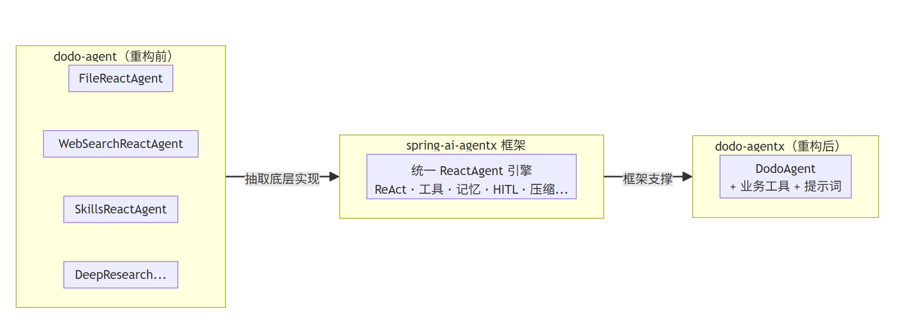
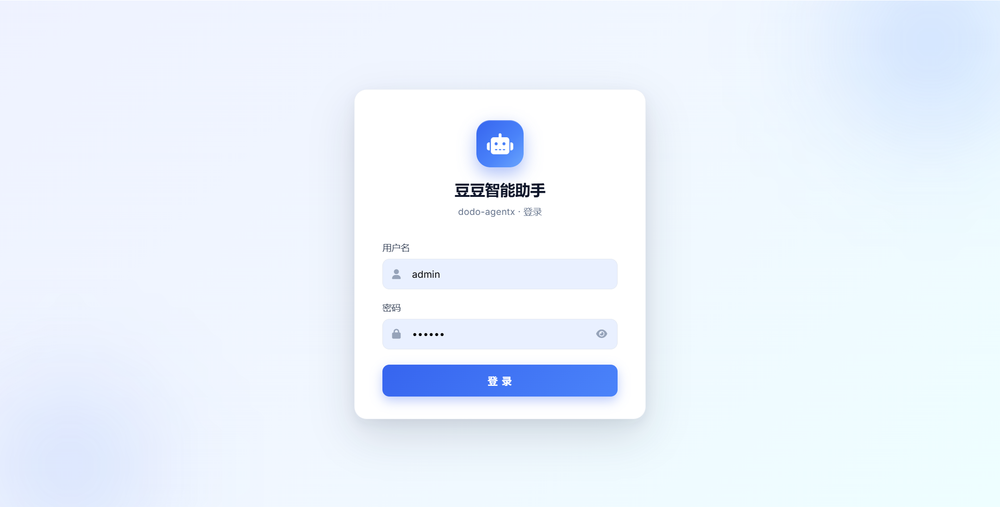
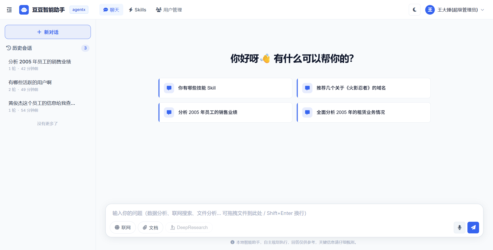
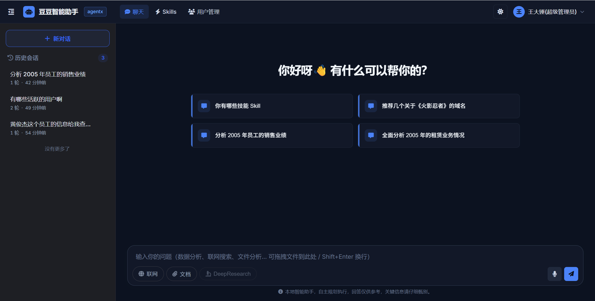
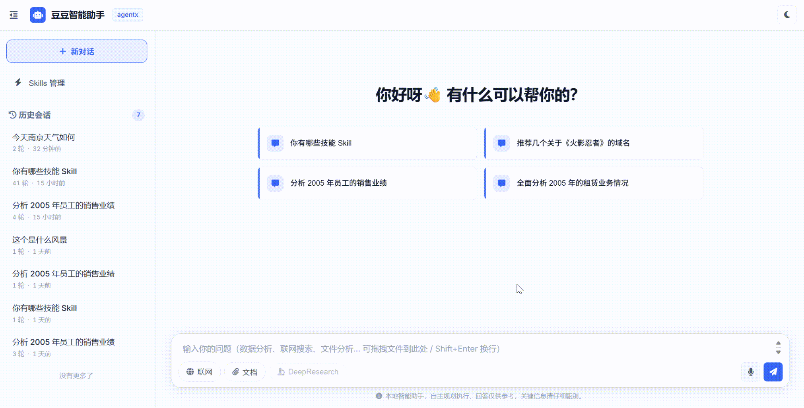
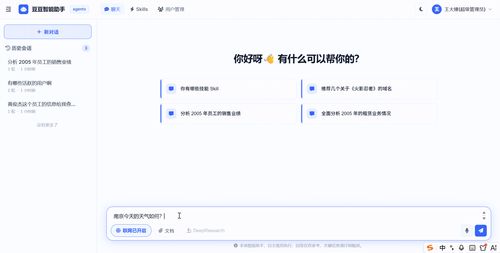
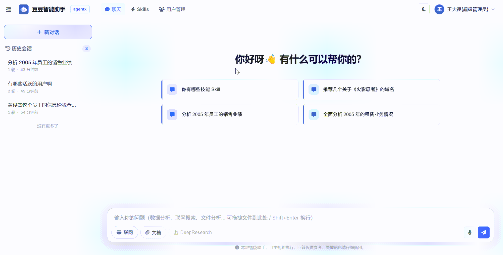
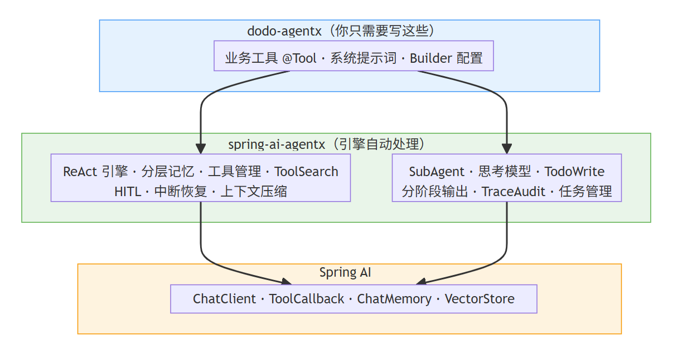

# ✅整体功能演示

dodo-agentx 是 dodo-agent 的重构版本。在 dodo-agent 中，我们为了把每个功能讲清楚，在各个 Agent 里写了大量的底层实现代码。比如：ReAct 循环怎么跑、流式输出怎么处理、工具怎么调度，全都和业务代码耦合在一起。

这其实在教学演示场景中，这些是有价值的，但代价是每个 Agent 都带着一份几乎相同的底层逻辑，新增能力就要再复制一遍。

dodo-agentx 做的事情就是把这些底层 Agent 实现，都抽象成一个独立的框架：**spring-ai-agentx**

[GitHub - bigchuidw3/spring-ai-agentx: 基于原生 Spring AI 的智能体（Agent）开发框架，提供 ReAct 执行引擎、分层记忆、工具调度、Human-in-the-Loop 等核心能力，形成完整的 Harness Engineering 方案，帮助开发者快速构建 AI Agent，可以快速搭建 Java 版的 Claude Code。](https://github.com/bigchuidw3/spring-ai-agentx)

让业务代码回归纯净。也就是原来分散在 FileReactAgent、WebSearchReactAgent、SkillsReactAgent 中的能力，**现在统一到一个 ReactAgent 中；同时，我还新增了 DataAgent 的能力，后续还会把 DeepResearch 也迁移过来。**



重构后什么效果

dodo-agentx 把原来分散在 FileReactAgent、WebSearchReactAgent、SkillsReactAgent 中的能力统一到了一个 ReactAgent 中，还新增了 DataAgent 数据分析能力。下面是几个核心场景的实际效果演示。

整体界面

登录页

默认用户名 / 密码：admin/123456



右上角可以切换主题样式深浅





文件对话

上传文档或图片等文件，Agent 统一调用 analyzeFile 工具自动解析内容——图片走多模态识别，小文本直接读取，大文本走 RAG（向量化 + 语义检索）。这块和 dodo-agent 的实现没有根本差异，只是把文件读取统一收拢到了 analyzeFile 工具里，和 React 主循环剥离开来，思路和 Claude Code 一致。



联网搜索

前端「联网」开关控制，开启后 Agent 自动注入 Tavily 工具，搜索实时信息。关闭时工具则不注入。



Skills 技能

Skill 管理放在了上方的菜单，各种业务场景都能以 Skill 的方式接入，由统一的 ReactAgent 调度执行。这是目前非常主流的 Agent 实现路线：要么走固定流程的 Workflow，要么走统一 ReactAgent + Skill 的方式来做 AI 赋能。



数据分析

这是 dodo-agentx 新增的能力。自然语言提问，Agent 自动拆任务、查表结构、查术语口径、校验 SQL、执行 SQL、算指标、调图表工具生成可视化图表，最后输出一份完整的分析报告。全程流式输出，分阶段时间线展示，样式美观，整体流程清晰可见。

演示库基于 MySQL 官方的 Sakila 电影租赁库做了改造：在保留 14 张业务表（actor / film / rental / payment 等）的基础上，删掉了 staff / store，新增了 sys_user / sys_dept / sys_user_dept / sys_role / user_profile 这一组系统表，把 sakila 的租片业务嫁接到一套带 RBAC + 数据权限的组织模型上，这样既能演示自然语言查数，也能演示不同用户看到不同数据的效果。

数据权限与字段脱敏

DataAgent包含了数据权限的功能，也就是每次查询都会按当前用户角色的 dataScope 自动注入 WHERE 条件，敏感字段（身份证号、家庭住址等）也会在返回结果里脱敏。

配套两个核心开关，都在 application.yml 里：

- `data-agent.data-permission.enabled`：开启后 SQL 自动按当前用户角色的 dataScope 注入 WHERE，包含 4 种角色的数据范围：ALL（全部可见）/ DEPT_AND_SUB（本部门+子部门）/ DEPT（仅本部门）/ SELF（仅自己）
- `data-agent.sensitive-filter.enabled`：开启后命中的敏感列值替换为 `********`，默认配置 `sys_user.password,user_profile.id_card,user_profile.home_address`


框架与业务分离

绝大多数 Agent 的实际能力是由挂在上面的工具和提示词决定的，而不是被框架锁定。你可以基于 spring-ai-agentx + Skills的方式，构建各种业务类型的 Agent：数据分析、代码助手、自动化运维、文档生成。

对 dodo-agentx 来说，这意味着代码只需要写：Agent 配置 + 业务工具实现 + 提示词/Skills 即可：

```text
// DodoAgent.java —— 整个项目的全部"Agent 代码"
ReactAgent agent = ReactAgent.builder()
        .chatModel(chatModel)
        .dataSource(dataSource)
        .semanticMemoryStore(semanticMemoryStore)
        .tools(mergeTools(
                ToolCallbacks.from(new AnalyzeFileTool()),
                ToolCallbacks.from(new ListTablesTool()),
                ToolCallbacks.from(new ExecuteSqlTool()),
                // ... 其他业务工具
        ))
        .instructions(SYSTEM_PROMPT)
        .build();
```

不需要关心 ReAct 循环、分阶段流式输出、分层记忆、上下文压缩.....这些功能框架全包了。



其实 dodo-agent 中把底层实现写在业务代码里，**对于理解 Agent 每个功能点的原理是非常有帮助的，**你能直接看到 ReAct 循环怎么构建、流式分块怎么处理、上下文压缩怎么做、Skills 怎么实现。这些都是 dodo-agent 作为教学项目的价值所在。

它的问题就在于**底层实现和业务代码没有很好地分离**。FileReactAgent、WebSearchReactAgent、SkillsReactAgent 各自带着一份几乎相同的底层逻辑，改一个 bug 要同步改多个 Agent，新增一种 Agent 要把同样的代码再抄一遍。

agentx 把这部分底层实现抽离到了框架内部。原来三个独立 Agent 的能力统一到一个 DodoAgent 中，新增 DataAgent 能力也不需要再建一个 Agent 类，挂几个 `@Tool` 方法、在 builder 里配置一下就够了。

**底层实现并没有消失，它只是从业务代码搬到了框架里**。这个系列文档的核心目标，就是带你深入框架内部，看清楚每个功能的底层实现，以data-agent为业务驱动，教会你每个功能点，具体是怎么基于 Spring AI 的底层代码来实现的。让你不仅是局限于只会调用开源 Agent 框架的 API，更能理解背后的原理。

---

来源: https://thoughts.aliyun.com/workspaces/6963289eb0fc2e001bb052eb/docs/6a54c52b3fb9180001c4d8c1
