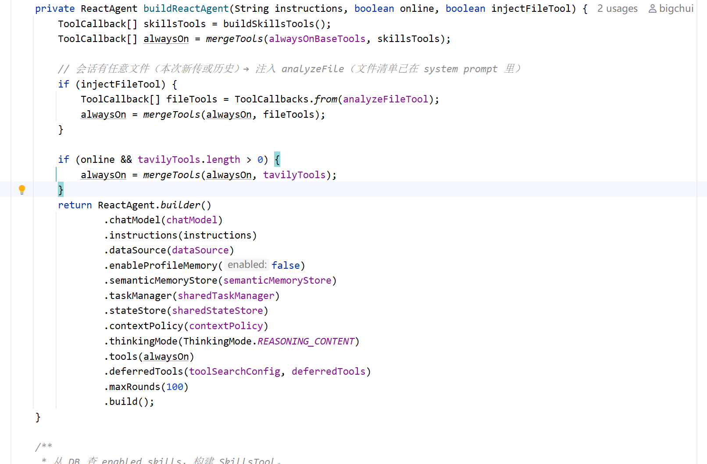
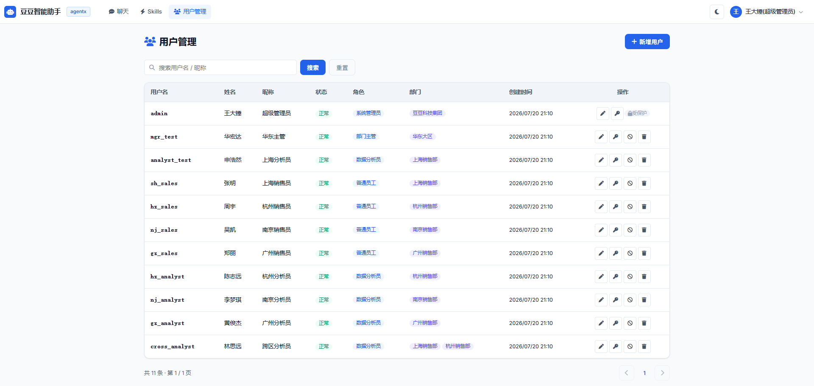

# ✅项目结构与安装部署

项目结构

```text
dodo-agentx/
├── docs/                              # 项目文档
├── skills/                            # Skills 技能定义（SKILL.md）
│   ├── data-analysis/                 #   数据分析技能
│   ├── skill-creator/                 #   技能创建技能
│   └── 域名创意生成器/                 #  域名生成技能
├── sql/                               # 数据库建表脚本（执行init.sql）
└── src/main/
    ├── java/cn/hollis/llm/mentor/agentx/
    │   ├── DodoAgentxApplication.java # Spring Boot 启动类
    │   ├── DodoAgent.java             # 统一智能体入口
    │   ├── auth/                      # 登录认证（Sa-Token）
    │   │   ├── controller/AuthController  #   /login、/logout、/me
    │   │   ├── dto/                   # 角色/部门 VO
    │   │   └── service/                   #   AuthService / Impl
    │   ├── sys/                       # 系统管理（RBAC + 组织架构）
    │   │   ├── controller/                #   UserController
    │   │   ├── dto/                       #   UserFormDTO
    │   │   ├── entity/                    #   SysUser / SysRole
    │   │   ├── mapper/                    #   MyBatis-Plus Mapper
    │   │   └── service/                   #   UserService
    │   ├── common/                    # 通用工具
    │   │   ├── R.java                 #   统一响应
    │   │   ├── GlobalExceptionHandler #   全局异常
    │   │   ├── datascope/             #   数据权限上下文（DataScopeContext / DataScopeResolver）
    │   │   └── enums/DataScope   #数据范围（ALL/DEPT_AND_SUB/DEPT/SELF）
    │   ├── config/                    # 配置类
    │   │   ├── AgentxMcpConfig        #   MCP 客户端
    │   │   ├── EmbeddingModelConfig   #   Embedding 模型
    │   │   ├── JacksonConfig          #   避免前端精度丢失
    │   │   ├── MinioConfig            #   MinIO 文件存储
    │   │   ├── MybatisPlusConfig      #   MyBatis-Plus
    │   │   ├── PgVectorConfig         #   PgVector 向量数据源
    │   │   ├── SaTokenConfig          #   Sa-Token 拦截器
    │   │   ├── SemanticMemoryConfig   #   语义长期记忆
    │   │   └── StpInterfaceImpl       #   Sa-Token 权限/角色查询
    │   ├── controller/                # REST 接口
    │   │   ├── AgentController        #   /agent/stream
    │   │   ├── SessionController      #   会话列表 / 详情 / 删除
    │   │   ├── FileController         #   文件上传 / 预览 / 删除
    │   │   └── SkillController        #   Skills 列表 / 上传 / 启停
    │   ├── domain/                    # 实体、DTO、VO
    │   │   ├── dto/                   #   ChatRequest
    │   │   ├── entities/              #   实体
    │   │   └── vo/                    #   会话详情 / 上传响应等出参 VO
    │   ├── mapper/                    # agentx_ 业务表mapper
    │   ├── prompt/                    # 系统提示词（SystemPrompt）
    │   ├── service/                   # 业务服务
    │   │   ├── permission/            #   表级权限规则
    │   │   ├── DataScopeRewriter      #   按角色 dataScope 注入 WHERE
    │   │   ├── SensitiveFilter        #   敏感列脱敏
    │   │   ├── UserContextBuilder     #   用户上下文注入 system prompt
    │   │   ├── SqlSafetyGuard         #   SQL 注入/白名单校验
    │   │   ├── ReadOnlyQueryRunner    #   只读执行
    │   │   ├── SchemaProvider         #   Schema 数据源策略接口
    │   │   ├── MschemaProvider        #   M-Schema 实时自省实现
    │   │   ├── MschemaIntrospector    #   JDBC 自省
    │   │   ├── MschemaFormatter       #   Mschema 对象 → M-Schema 文本
    │   │   ├── MschemaCacheService    #   Redis + 内存双层缓存
    │   │   ├── YamlSchemaProvider     #   YAML 字典方式的 Schema 实现
    │   │   ├── SchemaCatalogService   #   dodo_agentx.yml 加载
    │   │   └── ...                    #   文件解析 / 会话 / Minio 等
    │   ├── skill/                     # Skills 管理（SkillManager）
    │   ├── splitter/                  # 大文件 RAG 切分
    │   ├── tools/                     # 业务工具实现
    │   │   ├── AnalyzeFileTool        #   文件加载
    │   │   ├── TimeTool               #   当前时间
    │   │   ├── ListTablesTool         #   数据库表列表
    │   │   ├── DescribeTablesTool     #   表结构详情
    │   │   ├── ValidateSqlTool        #   SQL 安全校验
    │   │   ├── ExecuteSqlTool         #   SQL 执行（只读）
    │   │   ├── CalculateTool          #   数学表达式计算（同环比/占比）
    │   │   └── LookupGlossaryTool     #   业务术语查询
    │   └── utils/                     # 通用工具
    └── resources/
        ├── application-example.yml    # 配置模板（copy application.yml）
        ├── schema/dodo_agentx.yml     # 表结构字典 + 业务术语
        └── static/                    # 前端页面
            ├── login.html / users.html / skills.html  # 登录/用户/技能
            └── index.html             # 对话主界面
```

和 dodo-agent 相比，最明显的变化是原来 FileReactAgent、WebSearchReactAgent、SkillsReactAgent 各自带着一份完整的 ReAct 循环代码，现在统一到 `DodoAgent.java` 一个类里。业务工具集中在 `tools/` 和`skills/`目录下。

核心入口 DodoAgent

`DodoAgent.java` 是整个项目的智能体入口，核心是 `buildReactAgent()` 方法：根据请求参数动态构建一个 ReactAgent：



`instructions` 按当前登录用户动态拼接：`UserContextBuilder` 查 sys_user/sys_role/sys_user_dept 拿到「角色 / 数据范围 / 部门链」拼进系统提示词，让 LLM 在生成 SQL 时知道当前的身份和能看到的数据范围。真正的数据权限改写不在这里做（在 `ExecuteSqlTool` 里），这里只是让 LLM 知情，避免它写出自相矛盾的 SQL。

这里有一个关键设计，**工具三层动态装载**：

| 层级 | 包含工具 | 装载时机 |
| --- | --- | --- |
| **常驻工具** | TodoWrite、currentTime、SkillsTool | 每次请求都加载 |
| **条件工具** | Tavily 联网搜索、analyzeFile 文件加载 | 根据请求参数动态注入（online 开关 / 是否有文件上传） |
| **延迟工具** | listTables、describeTables、validateSql、executeSql、calculate、lookupGlossary、mcp-echarts | LLM 通过<br>`tool_search`<br>按需发现，不常驻上下文 |

这个设计解决了：大量工具长期占用上下文的问题，后续会专门展开讲。

安装部署

环境准备

| 组件 | 版本要求 | 说明 |
| --- | --- | --- |
| JDK | 21 | 必需 |
| Maven | 3.9+ | 必需 |
| MySQL | 8.0+ | 主数据源（会话、文件、Skill 记录等） |
| PostgreSQL + pgvector | 15+ / 0.5.0+ | 向量检索（大文件 RAG + 语义记忆） |
| Redis | 6+ | 数据库 Schema 缓存 |
| MinIO | latest | 文件存储 + 图表图床上传 |
| Node.js | 18+ | 运行 mcp-echarts 图表服务 |

spring-ai-agentx

`dodo-agentx` 依赖框架 `spring-ai-agentx`，为了编译打包方便，现在 **LLMentor 仓库里已经内置了一份 **`spring-ai-agentx-core`** 源码**，位置就在：

```text
ai-framework/spring-ai-agentx-core
```

所以当前这套项目**不需要再单独去 GitHub 下载 spring-ai-agentx**。只要在 `LLMentor` 根目录正常编译，内置的 `spring-ai-agentx-core` 就会一起参与构建。也就是说，当前默认用的是课程项目里这份内置版本，对应 `dodo-agentx/pom.xml` 里的依赖坐标是：

```xml
<dependency>
    <groupId>cn.hollis.llm</groupId>
    <artifactId>spring-ai-agentx-core</artifactId>
    <version>1.0.0-M2</version>
</dependency>
```

不需要额外执行 `git clone spring-ai-agentx`。

切换到 GitHub 最新版

如果你想使用 GitHub 上最新的 `spring-ai-agentx`，也可以单独下载并编译，然后把 `dodo-agentx` 的依赖坐标切过去。

GitHub 地址：

```text
https://github.com/bigchuidw3/spring-ai-agentx
```

先把最新源码拉到本地并编译安装：

```shell
git clone https://github.com/bigchuidw3/spring-ai-agentx.git

cd spring-ai-agentx

mvn clean install -DskipTests
```

然后修改 `agent/dodo-agentx/pom.xml` 里 `spring-ai-agentx-core` 的依赖坐标，把当前内置版本的坐标切换成 GitHub 版本的坐标。这个项目里其实已经预留了切换方式：

```xml
<dependency>
<!--    <groupId>com.agentx.ai</groupId>-->
    <groupId>cn.hollis.llm</groupId>
    <artifactId>spring-ai-agentx-core</artifactId>
    <version>1.0.0-M2</version>
</dependency>
```

初始化数据库

在 MySQL 中创建数据库：

```sql
CREATE DATABASE dodo_agentx DEFAULT CHARACTER SET utf8mb4 COLLATE utf8mb4_general_ci;
```

导入项目自带的 SQL 脚本：

```shell
mysql -u root -p dodo_agentx < sql/init.sql
```

`init.sql` 一个文件搞定全部初始化，包含三类表：

- `agentx_`** 开头**：项目自身业务表（会话、文件、Skill 记录、Trace 审计、中断状态等）
- **sakila 业务表**：MySQL 官方 sakila 库改造版（DVD 影碟租赁业务），14 张表
- **sys_ 系统表**：用户/角色/部门/用户角色/用户部门 + user_profile，提供 RBAC + 数据权限的载体

sakila 这套示例库和官方原版稍有差异：原版的 staff/store 两张表被删除，rental.staff_id、payment.staff_id 改成了 user_id 并新增 dept_id；customer/inventory 去掉了 store_id 列。这样把租片业务嫁接到一套带组织模型的系统上，既能演示自然语言查数据，也能演示「不同用户看到不同数据」的数据权限效果。

**你完全可以把 sakila + sys_ 这套替换成自己的业务库，配合 ****`resources/schema/dodo_agentx.yml`**** 字典文件改造自己业务的术语口径，就是一个属于你自己的业务数据分析 Agent。**

启动外部依赖

**MinIO**：按你的环境启动即可，确认能访问 UI 控制台页面。

**mcp-echarts**（图表生成服务）：

```shell
npm install -g @mcp-echarts/server

# Windows 推荐 streamable http 模式（stdio 在并发场景下会串话）
cmd /c "set MINIO_ENDPOINT=<your-minio-host>&& set MINIO_PORT=<port>&& set MINIO_ACCESS_KEY=<key>&& set MINIO_SECRET_KEY=<secret>&& set MINIO_BUCKET_NAME=dodo-agentx-files&& mcp-echarts -t streamable"
```

启动后监听 `http://localhost:3033/mcp`。**Tavily**（联网搜索）：不需要本地启动进程，dodo-agentx 启动时直接连接远程服务 `https://mcp.tavily.com/mcp/`，只需要到 [tavily.com](https://tavily.com) 申请 API Key。

修改配置文件

仓库不提交真实配置（含 API Key、数据库密码），只提供模板：

```shell
cp src/main/resources/application-example.yml src/main/resources/application.yml
```

编辑 `application.yml`，把以下占位符替换成你自己的值：

| 配置项 | 说明 |
| --- | --- |
| `spring.datasource.url/username/password` | MySQL 地址/账号/密码 |
| `spring.data.redis.host/port/password` | Redis 地址/端口/密码 |
| `spring.ai.deepseek.api-key` | **DeepSeek V4 API Key（主模型）** |
| `spring.ai.openai.api-key` | 阿里云 DashScope API Key（多模态/Embedding） |
| `skills.directory` | 你本地的 skills 目录绝对路径 |
| `minio.endpoint/access-key/secret-key` | MinIO 地址和凭证 |
| `embeddings.store.host/user/password` | PgVector 地址和凭证 |
| `tavily.api-key` | Tavily API Key 每个月有大量免费额度 |
| `data-agent.data-permission.enabled` | 数据权限开关：true = 按角色 dataScope 注入 WHERE；false = 全部可见 |
| `data-agent.sensitive-filter.enabled` | 敏感字段脱敏开关：true = 命中列返回 ******** |
| `data-agent.sensitive-filter.mask-fields` | 脱敏列清单，默认<br>`sys_user.password,user_profile.id_card,user_profile.home_address` |

**关于主模型**：可以用任何兼容 OpenAI 接口的模型，框架层面 spring-ai-agentx 目前测试过 MiniMax、Qwen、DeepSeek、GLM 等主流国产模型。ChatModel 的初始化由调用方自己决定，框架不绑定模型。

dodo-agentx 选用的是 DeepSeek V4 系列模型。这个模型有个兼容性的问题，原因是它的入参做了强校验，开启 tool_call 时要求必须携带上轮的 `reasoning_content`，否则 HTTP 400。Spring AI 原生的 `DeepSeekChatModel` 没处理这个兼容，所以 agentx 封装了 `DeepSeekV4ChatModel` 来解决。`DodoAgent` 的 `buildChatModel()` 里已经处理好了，配好 API Key 就行。选这个模型来讲解，也能顺便看看这类兼容性问题怎么解决。如果你想换成 Qwen DashScope 全套，改 `buildChatModel()` 换成对应的 ChatModel 即可。

启动 & 访问

```text
mvn spring-boot:run
```

启动成功后访问：[http://localhost:8889/](http://localhost:8889/)，会先跳到登录页。`init.sql` 里内置了一些示例账号：

- **admin / 123456**：管理员，dataScope = ALL，看全部数据
- 其他用户密码都是：123456，可以在admin的用户管理界面看到用户名：



---

来源: https://thoughts.aliyun.com/workspaces/6963289eb0fc2e001bb052eb/docs/6a54c694c71a89000174635f
