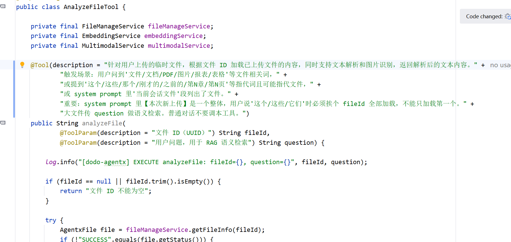
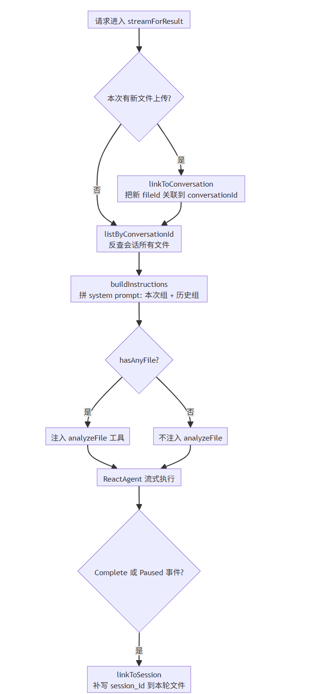
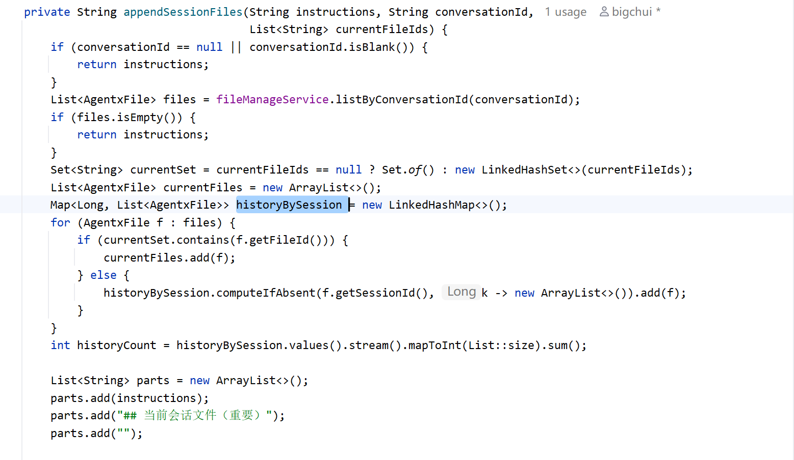

# ✅文件与联网搜索的重构

为什么需要重构

这次重构，主要是把 dodo-agent 里的 `FileReactAgent` 和 `WebSearchReactAgent` 两个独立 Agent，收敛成了 dodo-agentx 里 ReactAgent。会话里有文件就注入 `analyzeFile`，联网开关打开就注入 Tavily。

除此之外，还有一个更实际的问题：**原来的文件问答能力本身就不够完整，跨轮连续追问时容易丢上下文。**

比如用户第一轮上传一个 PDF 问“这份文档讲了什么”，第二轮再追问“那它的第三部分是什么意思”，如果文件只在上传当轮临时可见，没有和整个会话绑定，也没有和具体轮次建立关联，那么后一轮很可能就答不上来了。再往后，如果用户点开历史会话，前端也很难准确还原“哪一轮上传了哪些文件”。

所以这次文件问答是做了比较深的一轮重构。核心就是把下面几件事补完整：

- **文件的两个生命周期：会话级和轮次级**，解决文件跨轮可见和历史归属的问题
- **文件清单暴露**：解决模型在多轮里到底能看到哪些文件、应该优先读哪些文件的问题
- **历史会话回放**：解决前端回看历史问答时，附件怎么和具体轮次对应的问题

dodo-agentx 把这两类能力统一收回到一个 ReactAgent 里，按条件动态注入。下面会分别展开，详细讲解。

文件对话

文件上传

上传逻辑和 dodo-agent 基本一致，核心流程在 FileManageService.uploadFile 里：

```text
接收文件
  → 生成 UUID 作为 fileId
  → 写 DB（PROCESSING 状态）
  → 上传 MinIO
  → 按类型解析
  → 更新状态 SUCCESS
  → 返回 fileId
```

按文件类型分两条路：

**文本文件**（pdf / doc / docx / txt / md / csv / json / html 等），用 Apache Tika 统一解析出全文文本。拿到全文后判断是否走 RAG：

- 超过 1 万字符的大文件，用 OverlapParagraphTextSplitter 切成分片（500 字符一片，50 字符重叠），调 EmbeddingModel 向量化后存入 PgVector，DB 里 embed 标记为 1
- 小文件直接把提取的文本存到 extracted_text 字段（最多 2 万字符），不做向量化

**图片文件**（jpg / png / gif 等），上传时只落 MinIO + DB，不做任何识别。识别延迟到后面 analyzeFile 工具被调用时，按需调多模态模型。

关于文档文件（比如 PDF、Word）里面内嵌的图片，Tika 只提取文本，图片是跳过的。dodo-agentx 目前没有对文档内的图片做提取和识别。如果需要这个能力，可以参考 know-engine 项目的做法，感兴趣的话可以自己改造。

上传限制：单次对话最多 3 个文件，单个文件不超过 100MB，都在 application.yml 里配：

```text
file:
  max-count: 3
  max-size-mb: 100
  large-file-threshold: 10000    # 字符数，超过则切分 + 向量化
  text-max-length: 20000         # extracted_text 截断长度
```

上传成功后返回 fileId（UUID），前端拿着 fileId 发起对话。

文件内容加载：analyzeFile 工具

文件读取在 dodo-agentx 里是一个独立的工具：`analyzeFile`。它挂在 ReactAgent 上，LLM 需要的时候自己调，不需要知道文件是什么类型。

工具的入参只有两个：



工具内部根据 DB 中的文件元信息做三路分发：

- **图片**：MinIO 下载字节流，调多模态模型识别
- **大文本（embed=1）**：拿 question 做 RAG 语义检索，返回按相关性排序的片段
- **小文本（embed=0）**：直接返回 extracted_text

LLM 不需要判断文件类型，工具内部自动路由。这和 Claude Code 的思路是一致的：**文件加载是一个工具，而不是 Agent 的一部分**。

图片识别有个缓存的操作，首次识别后把结果写回 extracted_text，下次直接命中。如果同一个图片在多轮里被反复问到，缓存能避免重复调多模态模型烧钱。

analyzeFile 工具不是每次都挂的。只有检测到当前会话有任意文件（本次新传或历史文件）时才注入：

```java
boolean hasAnyFile = !fileManageService.listByConversationId(convId).isEmpty();

// ...

ReactAgent agent = buildReactAgent(instructions, online, hasAnyFile);
```

会话里一个文件都没有的对话，LLM 根本看不到这个工具，不会浪费模型上下文空间。

文件生命周期：会话级和轮次级

一个文件上传完，要回答两个问题：它属于哪次会话？它属于会话里的哪一轮问答？这是两个不同的生命周期，agentx_file 表用两个字段来分别记录：

```text
agentx_file
├── file_id          UUID 主键
├── conversation_id  会话级 key（跨轮次持久）
├── session_id       轮次级 key（每轮跑完才补写）
└── ...
```

- **conversation_id**：决定本次 system prompt 能反查到哪些文件，跨轮次持久。stream 启动时就写入
- **session_id**：决定历史回放时这条文件归属于哪一轮问答，每轮跑完后才补写

为什么要分两层？因为多轮对话里，文件的使用场景天然有两种：

- 当前会话我之前传过哪些文件：这是会话级视角，用户随时可能追问历史文件，必须跨轮次可见
- 历史回放时，第 3 轮里我上传了哪几个文件：这是轮次级视角，前端展示历史问答时要能还原某一轮的附件

一个字段扛不起来这两个语义。conversation_id 保证会话窗口可见性，session_id 保证与具体请求关联。

完整请求流程

一次对话请求进来，DodoAgent.streamForResult 把文件相关的所有事情串起来：



- **linkToConversation 在 stream 启动时立即执行**，不等对话跑完。这样本轮 system prompt 马上就能反查到本次新传的文件
- **session_id 的补写在事件回调里做**，因为 session_id 是 agentx 框架跑完，内部才生成的，stream 启动时获取不到

session_id 补写监听了两种事件：

```java
private void linkFilesFromEvent(List<String> fileIds, AgentStreamEvent evt) {
    // ...
    if (evt instanceof AgentStreamEvent.Complete c && c.sessionId() != null) {
        sessionId = c.sessionId();
        conversationId = c.conversationId();
    } else if (evt instanceof AgentStreamEvent.Paused p
            && p.state() != null && p.state().getSessionId() > 0) {
        sessionId = p.state().getSessionId();
    }
    // ...
}
```

Complete 是正常完成，Paused 是用户主动中断。两种情况都得把 sessionId 补上，不然中断后恢复时历史回放会丢附件。Complete 和 Paused 拿 sessionId 的方式不一样：Complete 本身携带 sessionId 字段；Paused 携带的是 PauseState 快照对象，sessionId 从 `p.state().getSessionId()` 里取。**这块 agentx 框架的设计还有点乱，后续会统一一下公共字段，但不影响对原理的理解。**

文件清单如何暴露

LLM 要能调 analyzeFile，必须知道有哪些 fileId 可用。文件清单由 `appendSessionFiles` 方法拼到 system prompt 末尾。

这里有个关键设计：**不能把所有文件平铺成一个列表，要分组**。

想象这个场景：用户一次性上传了 doc1.pdf 和 doc2.pdf，然后问"对比下这两个"。如果文件清单是平铺的，LLM 很容易把"这两个"理解成列表里的某一项，只加载第一个。**本次新上传的多个文件必须被视为一个整体**。

所以文件清单分两段渲染：

- **本次新上传**：本次 fileIds 对应的文件，整体作为一组
- **历史文件**：之前轮次上传的文件，按 session_id 分组（同一轮上传的聚在一起）

代码逻辑：



`historyBySession` 用 `LinkedHashMap`，因为 listByConversationId 已经按 `createdAt asc` 返回，分组后组间顺序天然就是"轮次从旧到新"。

渲染出来的 system prompt（appendSessionFiles 部分） 长这样：

```text
## 当前会话文件（重要）

### 本次新上传（2 个，是一个整体）

1. fileId: aaa，文件名: new1.pdf，类型: pdf
2. fileId: bbb，文件名: new2.pdf，类型: pdf

### 历史文件（3 个，按上传轮次分组，从旧到新）

【第 1 轮（最早），1 个】
1. fileId: ccc，文件名: old1.docx，类型: docx

【第 2 轮（最新），2 个】
1. fileId: ddd，文件名: old2.xlsx，类型: xlsx
2. fileId: eee，文件名: old3.xlsx，类型: xlsx

【触发规则】
- 用户说"这个/这些/它们/总结一下/讲了什么/分析下"等指代词或泛指时，默认指【本次新上传】整组，必须挨个调 analyzeFile(fileId, question) 加载
- 用户说"上一篇/上一个/刚才的文档"时，默认指【历史文件】里最新一轮的全部
- 用户明说某个文件名/序号时，按指定的加载
- 用户问题没明示文件但语义上可能指文件时，默认尝试调 analyzeFile
- 普通闲聊（天气、写代码、打招呼）不要调
```

几个关键设计：

- **本轮上传显式是一个整体**，需要让LLM知道一轮同时上传了哪些文件
- **历史文件按 session_id 分组**，让 LLM 知道"上一轮上传的那批"是哪些
- **轮次之间标"（最早）/（最新）"**，方便用户说"上一篇"时定位
- **本次无新文件时显式提示**："本次无新文件上传，仅可追问以下历史文件"，避免 LLM 误以为没有上下文

system prompt 是每轮重建的。用户每发一条消息，DodoAgent 都会重新查 DB 拼一份最新的文件清单。这是必要的开销，因为历史文件列表会随着对话推进越来越长，必须每次动态反映最新状态。

历史会话回放

点击历史会话的时候，SessionService 查会话详情，每轮问答按 sessionId 反查文件，组装成附件信息返回前端：

```java
private List<SessionMessageVO.AttachmentInfo> loadAttachments(Long sessionId) {
    List<AgentxFile> files = fileManageService.listBySessionId(sessionId);
    return files.stream()
            .map(f -> new SessionMessageVO.AttachmentInfo(
                    f.getFileId(), f.getFileName(), f.getFileType(), f.getFileSize()))
            .toList();
}
```

注意这里用的是 **session_id**（轮次级），不是 conversation_id。因为历史回放要精确到"哪一轮上传了什么"，而不是"整个会话有什么"。

前端拿到附件列表就能渲染出文件名、类型、大小，和对应的问答关联展示。

联网搜索

文件对话是条件工具，联网搜索也是。dodo-agent 里联网搜索是 WebSearchReactAgent 独立负责的，dodo-agentx 里变成了 Tavily MCP 工具的条件注入。

前端有个「联网」开关，打开后请求带 `online=true`，DodoAgent 构建 ReactAgent 时把 Tavily 的搜索工具注入进去：

```java
if (online && tavilyTools.length > 0) {
    alwaysOn = mergeTools(alwaysOn, tavilyTools);
}
```

关闭时工具不注入，LLM 的工具列表里根本没有搜索工具，它不知道自己能联网，自然不会尝试。这里有个潜在坑：默认常驻工具里挂着 BashTool，模型在没开联网时可能会尝试 `curl` 外部接口绕过限制。所以是否默认放开 BashTool 要权衡，不只是噪音问题，也是个权限边界问题。工具在 `@PostConstruct` 阶段构建一次，是单例，不会每次请求都重新连 MCP server。Tavily 本身支持 MCP 协议的远程服务，dodo-agentx 启动时连接 `https://mcp.tavily.com/mcp/`，无需本地部署，每个月有大量的免费额度，方便测试学习，到 [tavily.com](https://tavily.com) 申请 API Key 就行。

如果是生产环境，建议使用私有化部署搜索引擎：

[GitHub - searxng/searxng: SearXNG is a free internet metasearch engine which aggregates results from various search services and databases. Users are neither tracked nor profiled.](https://github.com/searxng/searxng)

---

来源: https://thoughts.aliyun.com/workspaces/6963289eb0fc2e001bb052eb/docs/6a54c79351b1440001e70685
