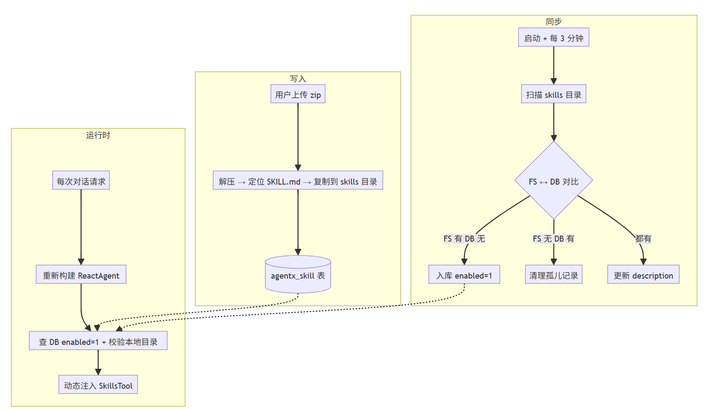
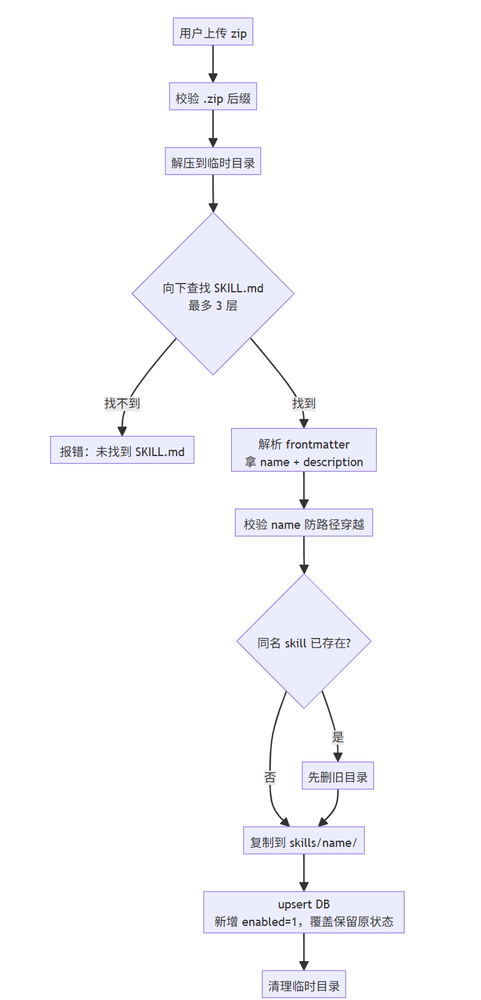
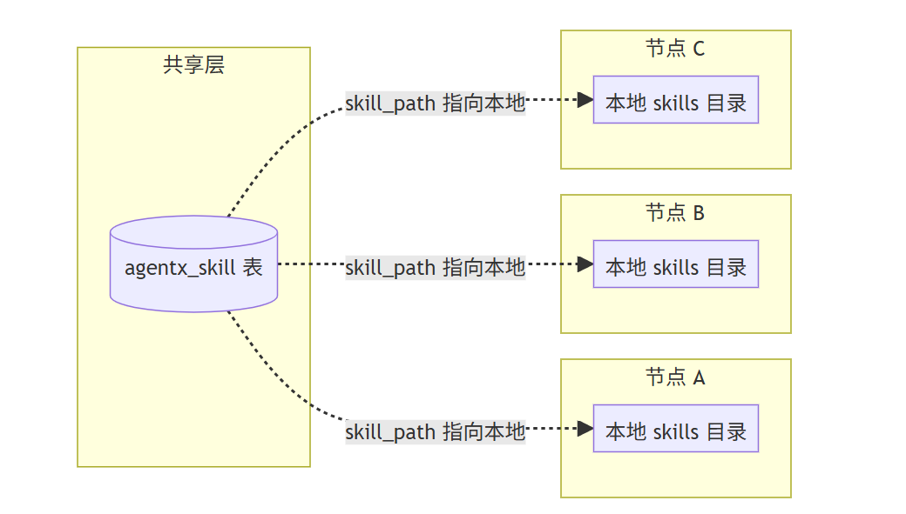

# ✅Skills管理（单机版）

`SkillManager` 负责 skill 的存储管理：上传、发现、启停、删除。和文件对话的 `analyzeFile` 一样，skill 对 LLM 来说只是一个工具（SkillsTool），用的时候加载，不用的时候不占上下文。

存储方式

skill 涉及两类数据，性质完全不同，所以存了两份：

- **文件系统**：SKILL.md、scripts、reference 这些文件有层级结构，scripts 可能被 LLM 调 bash 直接执行，reference 可能被按需读取。这些本质是文件，放文件系统是绕不开的
- **DB**：enabled / disabled、上传时间、路径索引。这些是需要频繁读写和查询的数据。比如"查所有 enabled=1 的 skill"，DB 里是一条 SQL 的事；放文件系统只能遍历目录

文件系统是 skill 内容的真实来源，SKILL.md 在哪，skill 就在哪。DB 不存内容，只记录"这个 skill 存不存在、启没启用、目录在哪"。

配置在 application.yml：

```text
skills:
  directory: D:\LLMentor\LLMentor\agent\dodo-agentx\skills
```

agentx_skill 表结构：

| 字段 | 用途 |
| --- | --- |
| name | skill 名称（唯一键，来自 frontmatter） |
| skill_path | skill 目录的绝对路径 |
| description | 来自 frontmatter，用于 LLM 匹配 |
| enabled | 1=启用，0=禁用 |
| file_name | 上传的原始 zip 文件名 |

核心流程

skill 管理围绕三条主线展开，后面的内容按这三条线逐个拆开：



写入：用户上传 zip，解压落盘，写 DB。

同步：文件系统始终是权威源，DB 向文件系统对齐。

运行时：每次对话请求重新构建 agent，动态注入当前启用的 skill。

上传流程



几个设计决策：

**先解压到临时目录，不能直接解压到 skills 目录。** zip 里的目录结构不确定。有的直接是 `SKILL.md`，有的套了一层 `my-skill/SKILL.md`，有的甚至 `dist/my-skill/SKILL.md`。直接解压到 skills 目录，目录结构不可控。所以先解压到临时目录，用 `FileUtils.findFile` 最多向下找 3 层定位 SKILL.md，拿到它所在的目录作为 skill 源目录，再复制到正式路径。**临时目录建在 skills 目录下，不用系统默认临时目录。** `Files.createTempDirectory(skillsDirectory, "skill-upload-")` 显式指定 skills 目录作为父目录。这是一个小但重要的决策：如果不指定父目录，临时目录会落到 JVM 默认的 `java.io.tmpdir`（Windows 上通常在 C 盘 `C:\Users\{用户}\AppData\Local\Temp\`），而 skills 目录可能配置在 D 盘。跨文件系统操作非空目录时，Windows 上会抛 `DirectoryNotEmptyException`。把临时目录建在 skills 目录下，两者一定在同一个文件系统上，从根上规避了跨盘问题。finally 块里 `FileUtils.deleteRecursively(tempDir)` 保证上传完成后临时目录一定被清理。

**覆盖上传保留启用状态。** 二次上传同一个 name，目录先删后建，DB 更新 skillPath 和 description，但 enabled 不动。用户不需要重新勾选。

**路径穿越防护。** name 从 SKILL.md 的 frontmatter 解析，如果 name 里有 `../` 或 `/\:`，可能跳出 skills 目录写到别的地方。`validateSkillName` 做了字符串黑名单 + 路径归属检查。

自动发现

`SkillManager` 初始化时（`@PostConstruct`）和每 3 分钟定时任务（`@Scheduled`）都跑一次 FS → DB 同步：

- **FS 有、DB 没有** → 插入（enabled=1），手动放目录的 skill 自动入库
- **FS 没有、DB 有** → 删除，目录被手动删了，清理孤儿记录
- **两边都有** → 从 SKILL.md 更新 description

运维人员可以直接往 skills 目录扔一个文件夹，3 分钟内自动发现，不需要走上传接口。

动态生效

ReactAgent 不是启动时建好就不变了。每次对话请求进来，`DodoAgent.buildReactAgent` 都会重新构建 agent，skill 工具也是这时候重新组装的：

```text
private ToolCallback[] buildSkillsTools() {
    List<String> enabledDirs = skillManager.getEnabledSkillDirs();
    if (enabledDirs.isEmpty()) {
        return new ToolCallback[0];
    }
    SkillsTool.Builder builder = SkillsTool.builder();
    for (String dir : enabledDirs) {
        builder.addSkillsDirectory(dir);
    }
    return new ToolCallback[]{builder.build()};
}
```

你在前端做的任何 skill 变更，下一次对话立刻生效，不需要重启服务：

- 关掉一个 skill → 下一次对话，这个 skill 不在工具列表里
- 启用新 skill → 下一次对话，LLM 能看到它的 description
- 删除一个 skill → 下一次对话，工具列表里消失

`getEnabledSkillDirs` 每次请求都重新查 DB（enabled=1）+ 校验本地目录是否存在。DB 说启用了但文件系统里目录不在，不报错，跳过并记 warn，agent 照常跑。这种优雅降级的思路在后面的分布式场景中尤其重要。

SkillsTool 是 agentx 框架提供的，工作机制是：扫描给定目录下的 SKILL.md，把 description 给 LLM（让它知道有哪些 skill 可用），LLM 觉得某个 skill 和当前问题相关时，主动调 SkillsTool 加载完整内容。description 常驻上下文，instructions 按需加载。

启停与删除

**启停**只改 DB 的 enabled 字段，不碰文件系统。下次请求构建 ReactAgent 时自然生效。

**删除**是双删：先删本地目录，再删 DB 记录，两步独立执行。

分布式部署场景

以上是单机部署的完整实现。单机下文件系统 + DB 没有问题，因为只有一个节点，DB 记录的 skill_path 指向的目录一定在本机存在。

一旦部署成多节点，问题就来了。skill 的执行依赖本地文件系统，而本地文件系统是各节点私有的。在 share-nothing 的多节点架构下，DB 是共享的，但磁盘不共享：



用户在节点 A 上传了 skill，DB 里有了记录，但节点 B 和 C 的本地磁盘上没有这个 skill 的文件。请求打到节点 B，`getEnabledSkillDirs` 查 DB 发现 enabled=1，但本地目录不存在，skill 就失效了。

这是一个**有状态本地资源在分布式架构下的一致性**问题，需要系统性地解决几个层面的问题：

**存储层**：skill 的 ZIP 包不能只存在某个节点的本地磁盘，需要引入所有节点都能访问的共享存储（对象存储或共享文件系统），作为 skill 内容的统一来源。

**传播层**：节点 A 上传了新 skill，其他节点需要感知这个变更并同步到本地。是走事件驱动（Pub/Sub，实时但可能丢消息），还是走轮询（定时任务，可靠但有延迟），还是两者结合。

**容错层**：某个节点磁盘满了、网络断了、服务重启了，同步中断后怎么办。agent 在 skill 缺失的情况下应该优雅降级（继续运行，只是少了这个 skill），而不是直接报错。

**一致性模型**：skill 是 agent 的可选增强，不是硬依赖。强一致性（所有节点必须同步完才可用）成本太高且没有必要，最终一致性（暂时不可用，后续追上即可）是更务实的选择，但需要一个收敛机制保证最终所有节点都能追上。

这些问题的具体解决方案和实现，我们会在后面的**分布式改造**章节统一讲解。

---

来源: https://thoughts.aliyun.com/workspaces/6963289eb0fc2e001bb052eb/docs/6a54c90a3fb9180001c4dc13
