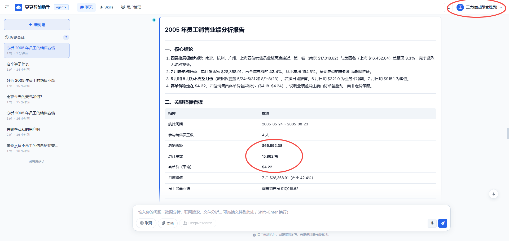
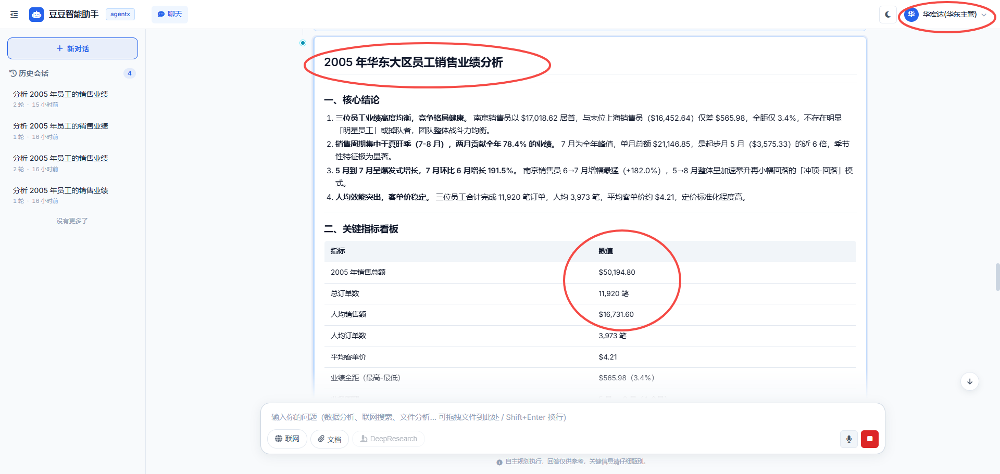
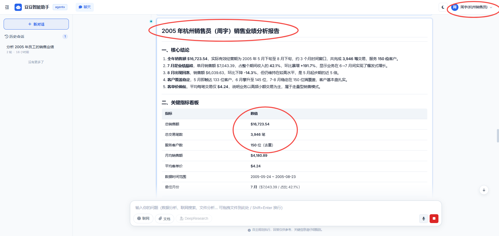
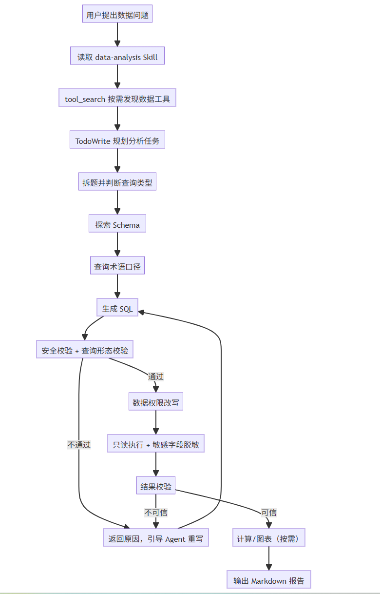
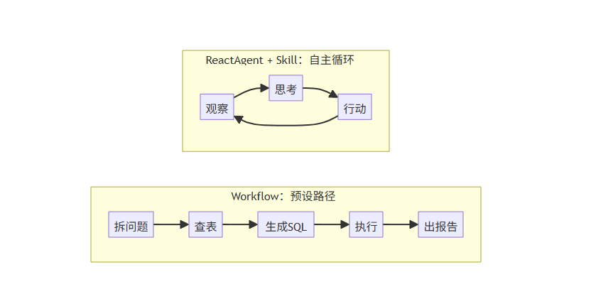
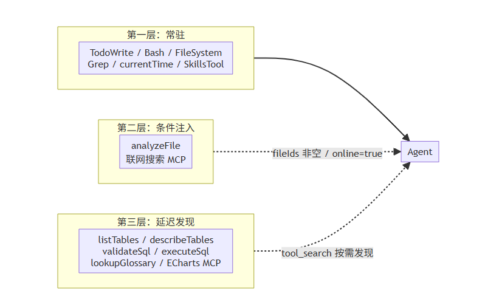
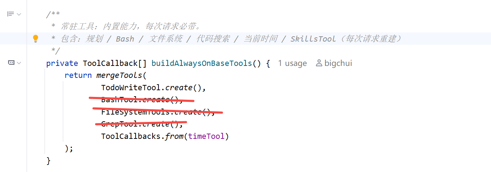

# ✅data-agent 整体流程

前面几篇文章我们完成了项目整体功能的介绍，也把文件对话、联网搜索这些从旧版 dodo-agent 继承过来的能力做了重构讲解。从这篇开始，我们正式进入 dodo-agentx 新增能力：**DataAgent 数据分析**。

用户用自然语言提一个数据问题，Agent 自动查表结构、理解业务术语、生成并校验 SQL、执行查询、计算结果、画图表，最后输出一份完整的分析报告。听起来像一条固定流水线，但 dodo-agentx 的做法不是 Workflow，而是 **ReactAgent + Skill 驱动**。

核心流程

DataAgent 端到端流程是怎样的，比如下面这个问题：

*用户："分析 2005 年 8 月的员工销售业绩"*

同一个问题，登录用户身份不同，看到的数据范围也不同。以三个用户做对比：admin 拥有 ALL 数据权限，mgr_test 是部门主管（DEPT_AND_SUB），hz_sales 是普通员工（SELF）。下面三张截图分别是这三个用户问同一个问题时 Agent 的实际回复：







同样的 SQL，落到 **超级管理员admin** 手里能看全公司员工业绩，落到 **华东部门主管mgr_test **手里只能看本部门及下属部门，落到 **具体的销售人员hz_sales** 手里只能看自己的。差异不在 SQL 本身，而在 Agent 后台对 SQL 做了行级数据权限改写，这部分细节后面会讲。

整个过程流式输出，用户能清晰的看到 Agent 思考的每一步，不是黑盒。完整流程如下：



上图是一个通用的完整流程，并不一定针对每个问题都是完全一模一样的，这是ReactAgent架构的特点：

- **任务拆解：** DataAgent 不会默认用一条 SQL 解决所有问题。比如"分析 2005 年 8 月的员工销售业绩"，它更像一个分析任务，可能包含整体销售额、员工排名、趋势变化、异常员工明细等多个子任务。dodo-agentx 会先在 Skill 里约束 Agent：统计、趋势、排名优先走聚合 SQL；列表、明细先确定主表再分页；详情、钻取先定位主键再查子表明细。这样可以避免一上来写一条巨型 JOIN，把大量明细塞进上下文。
- **探索 Schema：** 用户说"分析员工销售业绩"，Agent 不知道数据库里有没有"员工"这张表、字段叫 `user` 还是 `staff`，"销售业绩"对应哪张表的哪个字段。必须先 `listTables` 看全貌，再 `describeTables` 看字段和示例值。这里面有个关键问题：怎么把表结构喂给 LLM？直接塞 DDL 效果很差。业界的做法是把 schema 转成 LLM 更易读的格式，比如 M-Schema 用结构化 Markdown 描述表、字段、主外键和示例值。

[GitHub - XGenerationLab/M-Schema: a semi-structure representation of database schema](https://github.com/XGenerationLab/M-Schema)

- **消除歧义：** 业务术语和数据库字段之间有巨大的语义 gap。dodo-agentx 创建了一个术语口径查询工具，比如可以把"VIP 用户"翻译成具体的 SQL 条件，把"最近 3 个月"翻译成日期范围。遇到不确定表里存了哪些值的情况，Agent 主动发探针 SQL，比如：`SELECT DISTINCT city FROM address WHERE city LIKE '%Bei%' LIMIT 10`，先看一眼真实的数据长啥样，再写正式查询SQL，准确率会更高。
- **生成 + 校验 + 执行：** SQL 生成出来不能直接跑。`executeSql` 内部串了 5 步，从安全校验一路走到脱敏返回：
- **校验：** `validateSql` 用 JSqlParser 解析 SQL（解析失败直接拒绝，语法过不了关），只允许 SELECT/WITH 查询类 SQL，遍历 AST 拦截 sleep / benchmark / load_file 等危险函数，禁止 FOR UPDATE / SELECT INTO。除此之外，现在还会做查询形态校验：使用 OFFSET 必须有稳定 ORDER BY，JOIN 数量不能超过配置上限，CROSS JOIN 和无条件 JOIN 会直接拦截。这个校验不只看最外层 SQL，也会递归检查 CTE、UNION、子查询和 JOIN ON 里的子查询，避免把复杂查询藏在里面。
- **数据权限改写：** 按当前登录用户的数据范围（ALL / DEPT_AND_SUB / DEPT / SELF）注入权限条件。admin 这种 ALL 权限直接放行；DEPT_AND_SUB 会加入本部门及子部门范围；SELF 会限制到当前用户。普通表条件会进入 WHERE；如果受控表出现在 LEFT JOIN 右侧，权限条件会追加到 JOIN ON，避免把 LEFT JOIN 变成类似 INNER JOIN 的效果。改写过程任何异常都走 fail-closed，直接拒绝执行，不让一条没经过权限过滤的 SQL 跑到数据库。这是为什么前面三个用户问同一个问题能看到不同数据的原因。
- **只读执行：** 以只读账户连接业务库，强制加 LIMIT 防扫全表，超时时间受配置约束。默认最大返回行数收敛到 200 行，超过 20 行只做预览，并引导 Agent 改成聚合、主表分页或按主键钻取。
- **敏感字段脱敏：** 结果集里命中脱敏列名（比如 `sys_user.password`、`user_profile.id_card`、`user_profile.home_address`）的整列替换为 `********`。脱敏在结果回到 LLM 之前完成，LLM 看到的就是脱敏后的值，没有绕过或重试的可能。
- **格式化返回：** 把执行结果拼成 LLM 友好的 markdown 表格，附上执行的 SQL、行数、耗时。失败时返回明确原因和改写方向，比如复杂 JOIN 要拆成多步查询，统计问题改聚合 SQL，一对多明细先聚合或二次钻取，让 Agent 在 ReAct 循环里自己修复重试。
- **结果验证：** SQL 跑通了不代表结果对。Agent 主动检查数量级是否合理、列对应是否正确、空结果是否正常，也会检查 JOIN 后是否出现一对多放大、分页是否稳定。比如列表查询不能直接把主表的 20 条记录 JOIN 成 1200 条明细塞进上下文，而应该先展示主表列表和子表聚合信息，用户需要时再按某一条主记录继续钻取。这是 ReactAgent 区别于固定 Workflow 的关键：不是执行完就交差，而是自己判断结果在理论上靠不靠谱。
- **复杂计算（可选）：** 环比同比、贡献度分析、归因分析，不是一条 SQL 能搞定的。Agent 调用 `calculate` 工具，把 SQL 已经算出的聚合值作为变量传进去，套用最终公式（比如 `(current - previous) / previous * 100`）求值。聚合推到 SQL 完成（GROUP BY + SUM/AVG），工具只算最后的标量公式，避免在 LLM 里手算长串数字。这里特意不用 Bash 跑 Python。早期版本试过让 Agent 写 Python 脚本、通过 Bash 执行，非常烧token，而且LLM 还会自作主张用 Bash 去连数据库、跑探针查询，绕过整套工具体系。所以 data-agent 改用轻量的 `calculate`，后端用 exp4j 安全求值，只支持数学运算符和一组内置函数，不暴露任何系统调用。
- **图表生成（可选）：** 通过 ECharts MCP 生成可视化图表，MinIO URL 返回，避免把图标的 base64 塞进模型上下文，会直接导致上下文爆炸。
- **输出报告：** 输出结构化 markdown 报告：核心结论、指标仪表盘、图表分析、执行的 SQL 附录

以上这些阶段是数据分析链路的核心。它不是固定写死的流水线，而是写在 Skill 里的执行方法论；Agent 会根据问题复杂度决定哪些步骤要走、哪些步骤要重试。除此之外，还有两个 agentx 框架中的关键工具支撑整个过程，让 Agent 跑得更稳：

- **TodoWrite：** 长任务下 Agent 容易跑偏，查着查着忘了最初要干嘛，或者做完一步不知道下一步该做啥。TodoWrite 让 Agent 开始前先把任务拆成清单，每完成一步就划掉一步，保证有头有尾不迷路。具体实现在后面 TodoWrite 章节展开。

- **tool_search：** 数据分析的工具平时不在工具列表里，这样保证模型上下文不被浪费。Agent 判断需要数据分析时，先查阅 Skill ，阅读数据分析的SOP说明书，然后调 `tool_search` 按关键词搜索，系统将匹配的工具注入 Agent。工具发现本身成了 Agent 的一步推理，不需要人预先告诉它有什么工具。具体实现在后面 ToolSearch 章节展开。

难点在哪？

Text2SQL 听起来是把中文翻译成 SQL就好了，实际上远不是翻译问题。三个核心难点：

- **Schema 理解：** 真实数据库几十上百张表、几千个列，LLM 的上下文窗口装不下整个 schema，更不用说还要精准找到"哪张表的哪个字段对应了用户问的指标"。这就像把一本字典扔给翻译，却不告诉它该查哪一页。
- **业务歧义：** "VIP 用户"、"活跃员工"、"最近一段时间"等等这些词的定义不在数据库里，同一个"销售额"，财务算含税、运营算不含税。LLM 不知道这些专业术语的口径是什么，SQL 语法对但语义错，查出来的数字没法用。
- **生成不可靠：** SQL 是差一个字符结果就完全不对的语言。JOIN 条件写错一个字段、WHERE 漏了一个状态过滤，SQL 照样能跑通，只是结果错了。LLM 不会主动告诉你"我不确定这个 JOIN 对不对"。

这些问题并不是理论上的推演，在业界公开评测中已经得到了充分验证：

- **Spider 2.0**：面向真实企业数据场景的 Text2SQL 评测，数据库规模可达上千个字段。即使是当前领先的模型与 Agent 系统，也远没有达到完全可靠的水平。

[GitHub - xlang-ai/Spider2: [ICLR 2025 Oral] Spider 2.0: Evaluating Language Models on Real-World Enterprise Text-to-SQL Workflows](https://github.com/xlang-ai/Spider2)

- **BIRD**：进一步引入脏数据、业务知识和复杂数据库环境，专门考察模型能否真正理解数据，而不只是生成语法正确的 SQL。

[BIRD-bench](https://bird-bench.github.io/)

这些评测反映出一个很现实的问题：**Text2SQL 的难点早已不是“会不会写 SQL”，而是能否正确理解业务、找到数据，并通过执行反馈不断修正。**

因此，单次 LLM 调用很难可靠完成“理解意图 → 匹配 Schema → 消除歧义 → 生成并验证 SQL”这一整条链路。业界主流方案也开始从“一次生成”转向“分阶段处理 + 迭代修正”：

- **DIN-SQL**：通过任务分解和自纠错，提高复杂 Text2SQL 的准确率。

[DIN-SQL: Decomposed In-Context Learning of Text-to-SQL with Self-Correction](https://arxiv.org/abs/2304.11015)

- **MAC-SQL**：进一步将复杂任务拆分给多个 Agent 协作完成。

[DIN-SQL: Decomposed In-Context Learning of Text-to-SQL with Self-Correction](https://arxiv.org/abs/2304.11015)

核心思路

业界做 Text2SQL 有两种路线：

- **固定 Workflow：** 比如用 LangGraph / Spring-ai-alibaba 画 DAG 图，节点 A → B → C→ D，流程写死在代码里。问题是用户不会只问数据，比如："帮我看看这个文件"、"今天天气怎么样"，每种意图都要预设分支。数据问题走 DAG，闲聊走兜底，文件操作再走一条。分支一多，维护成本陡增，况且你永远预判不全用户会问什么。
- **ReactAgent + Skill 驱动：** dodo-agentx 的选择。不写死流程，给 Agent 一套方法论（data-analysis skill），让 LLM 自己根据用户意图匹配合适的 skill 并决定下一步做什么。目前 skill 数量不多，也没有需要固化的固定路径，所以意图识别完全没必要，系统提示词约束好"匹配 Skill"的原则，LLM 自己就能选对，从而灵活的使用 skill 来解决用户的问题。

两者的本质区别：



Workflow 走预设路径，ReactAgent 走"观察 → 思考 → 行动 → 观察"的循环。SQL 执行报错了会自己修，查到的结果空了会补探针查询，业务术语不明确会查术语口径。每一步都是 Agent 自主决策而非系统预设。data-analysis 的 SKILL.md 里定义的七个阶段是**指导流程**，不是必须严格遵守的执行顺序，具体每步要不要走、走几轮、遇到意外怎么处理，全是 LLM 在 ReAct 循环里自己判断的。

对比来看，spring-ai-alibaba 开源的 dataagent 走的是 Workflow 路线：

[GitHub - spring-ai-alibaba/DataAgent: Spring AI Alibaba DataAgent](https://github.com/spring-ai-alibaba/DataAgent)

基于 Spring AI Alibaba Graph 的 StateGraph，把 Text-to-SQL 拆成若干固定节点串成流水线，数据按预设路径依次经过每个节点。

它这套 Workflow 的好处是流程确定性强，节点之间输入输出契约化，便于单测调优，出问题好定位。功能也非常完整，Text-to-SQL，内置 Python 深度分析、ECharts 图表报告、RAG 术语库检索增强，是目前 Java 生态里关注度很高的开源 DataAgent。

缺点就是灵活性比较差，每种新场景都得评估能不能塞进现有编排，不适合就得改DAG。而dodo-agentx 完全没有使用这种方式，而是选择了更加灵活的动态路径，只要工具够用，指导说明书写的够清晰（Skill.md），Agent 自己就能组合出流程，不用动任何编排代码。

也就是说，dodo-agentx 只使用了框架的 ReAct 循环、工具调度、流式输出这些基础能力，业务逻辑和分析的方法，全写在 Skill.md 里，作为一个 SOP（标准流程），每一步怎么做，怎么修复，怎么调整，加载什么工具，完全由 Agent 自己决定。

工具分层

dodo-agentx 是个通用的智能问答助手，他的功能不仅仅是只有 data-agent，它的业务能力都靠 Skill 接入来实现的，文件解读、联网搜索、数据分析，往后要加其他的业务场景，也就是再挂一个 Skill 的事，这点和 Claude Code很像，基本上就是 React + Skill 基本上实现所有功能。

这意味着 Agent 每次面对的提问是开放的：用户可能问数据，可能甩个文件过来，也可能就随便聊聊。如果把所有业务的所有工具一股脑全挂上去，上下文窗口瞬间被吃光，而且大部分工具和当前问题根本无关。所以 dodo-agentx 把工具分了三个装载层级：



- **第一层（常驻）：** 所有场景都需要的通用工具，每次请求都加载
- **第二层（条件注入）：** `analyzeFile` 有文件上传时才注入，联网搜索 MCP 前端开关打开时才注入。不用就不占上下文
- **第三层（延迟发现）：** 数据专用工具，平时完全不占上下文。Agent 判断任务和数据相关时，调 `tool_search` 按需发现。工具发现本身也成了 Agent 的一步推理，不需要人预先告诉它有什么工具，Agent 自己找。

第一层（常驻）实际装的除了 `TodoWrite`、`currentTime`、`SkillsTool` 这三个，还有 `BashTool`、`FileSystemTools`、`GrepTool` 三个通用工具。后面这三个是框架级能力，保留常驻是为了让 Skill 体系保持通用——某个 Skill 真的要跑脚本或读本地参考文件时可以直接用，不用每个 Skill 自己重新装配。但对 data-agent 这种 Web 端数据分析场景来说，Bash 给了反而有害：烧 token、还会被 LLM 自作主张拿去连数据库绕过安全校验。所以 dodo-agentx 把 Bash 的禁用约束下沉到 `data-analysis/SKILL.md` 里，靠提示词强约束：

```text
## 不做的事
- **不论什么场景都禁止调用 `bash` 工具**：计算走 `calculate`、数据库访问走
  `executeSql` 等数据工具、不读文件不跑脚本。`fileSystem` 和 `grep` 同样禁用。
```

这样的好处是工具层保持中性（不为了某个 Skill 改框架级装配），业务级的禁用规则写到对应 Skill 的 SOP 里，各 Skill 互不干扰。更激进的话，你甚至可以直接先把这三个工具注释了也可以正常执行 dodo-agentx 里的所有功能，影响的只是需要执行script和阅读reference的Skill。



小节

整体流程讲完了，可以回头看一下 DataAgent 的两个关键选择：

1. 用 ReactAgent + Skill 代替固定 Workflow：七个阶段只是写给 LLM 看的方法论，每步走不走、走几轮、出错怎么办，全交给 Agent 自己判断，这也是 dodo-agentx 敢把数据分析当成通用助手里一项业务来做的原因。
2. 工具三层装载：常驻的撑起 Agent 骨架，条件注入的按场景出现，数据专用的靠 Agent 自己发现，所以用户问数据、上传文件还是闲聊，Agent 拿到的上下文始终是干净的，不被太多无关工具污染。

框架只管 ReAct 循环、工具调度、流式输出这些通用的底座，业务逻辑全写进 Skill。后面要讲的 Schema 设计、SQL 安全校验、业务术语库、图表 MCP，就是围绕在这套底座上的具体工程实现。

---

来源: https://thoughts.aliyun.com/workspaces/6963289eb0fc2e001bb052eb/docs/6a54f3ded31fed0001c13e63
