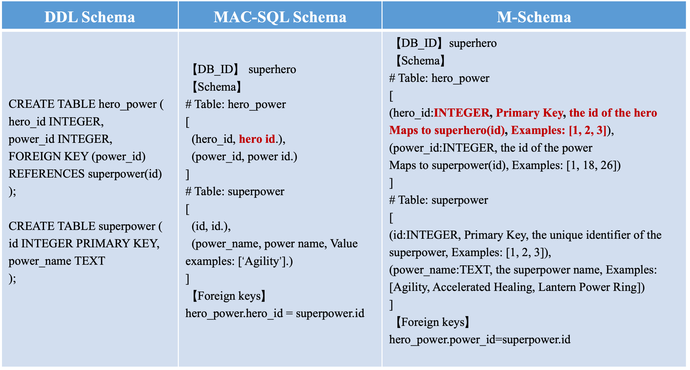

# ✅什么是M-Schema？

Data-Agent 回答数据问题的第一步，也是最重要的一步，就是探查表结构。如果连表结构都不知道，或者表结构查得不准，后面生成 SQL、算指标、出报告全都是空谈。LLM 写 SQL 不是凭空造的，它得先知道有哪些表、每张表有哪些字段、字段之间怎么关联，才能动手。

那问题就来了：**表结构到底以什么格式喂给 LLM？** 格式选得对，模型理解得准，SQL 就靠谱；格式选得差，信息要么太多撑爆上下文，要么太少让模型瞎猜。

为什么不直接塞 DDL

最直觉的做法，把数据库的 `CREATE TABLE` 语句直接丢给 LLM。sakila 库的 `rental` 表，DDL 大概长这样：

```sql
CREATE TABLE `rental` (
  `rental_id` int NOT NULL AUTO_INCREMENT,
  `rental_date` datetime NOT NULL,
  `inventory_id` mediumint NOT NULL,
  `customer_id` smallint NOT NULL,
  `return_date` datetime DEFAULT NULL,
  `user_id` bigint NOT NULL COMMENT '处理本次租赁的员工ID（指向 sys_user.id）',
  `dept_id` bigint NOT NULL COMMENT '业绩归属部门（数据权限改写用）',
  `last_update` timestamp NOT NULL DEFAULT CURRENT_TIMESTAMP,
  PRIMARY KEY (`rental_id`),
  KEY `idx_fk_inventory_id` (`inventory_id`),
  KEY `idx_fk_customer_id` (`customer_id`),
  CONSTRAINT `fk_rental_inventory` FOREIGN KEY (`inventory_id`) REFERENCES `inventory` (`inventory_id`) ON DELETE RESTRICT
) ENGINE=InnoDB DEFAULT CHARSET=utf8;
```

DDL 当然能描述数据库结构，LLM 也能理解。问题在于，**原始 DDL 并不是信息密度最高的 Schema 表达方式**：

- **包含大量与查询无关的信息：**存储引擎、字符集、索引名称、`AUTO_INCREMENT` 等信息，对生成 SELECT SQL 通常没有帮助，却会持续占用上下文。
- **缺少业务语义：**`customer_id` 是客户 ID，这很好理解；但如果某个字段叫 `status`，类型是 `TINYINT`，DDL 并不会告诉模型 `0`、`1`、`2` 分别代表什么。
- **全量注入扩展性差：**十几张表时还能接受，一旦数据库有几百张表，每次请求都把全部 DDL 塞进上下文，不仅浪费 Token，还会增加模型从大量无关表中识别目标表的难度。

所以问题并不是“LLM 看不懂 DDL”，而是**没有必要让 LLM 每次阅读整个数据库的原始建表脚本**。

更合理的方式，是先定位可能相关的表，再按需提供经过压缩和增强的 Schema 信息。

M-Schema 是什么

M-Schema 是阿里 XiYan 团队提出的一种半结构化 schema 表示，专门为 Text2SQL 场景设计。说白了，它就是拿到 DDL 之后，改写成一种 LLM 更容易读的字符串格式。

[GitHub - XGenerationLab/M-Schema: a semi-structure representation of database schema](https://github.com/XGenerationLab/M-Schema)



**它没什么神秘的地方，核心思路就是：把数据库 Schema 中对 SQL 生成真正有用的信息抽取出来，再补充字段描述和示例值，用一种紧凑的半结构化文本重新组织。**

同样是上面那张 `rental` 表，M-Schema 输出如下：

```sql
# Table: rental
[
(rental_id: INTEGER, Primary Key, Examples: [1, 2, 3]),
(rental_date: DATETIME, Examples: [2005-05-24 22:53:30]),
(inventory_id: MEDIUMINT, Examples: [1, 2, 3]),
(customer_id: SMALLINT, Examples: [1, 2, 3]),
(return_date: DATETIME, Examples: [2005-05-26 22:04:30]),
(user_id: BIGINT, 处理本次租赁的员工ID（指向 sys_user.id）, Examples: [1, 2]),
(dept_id: BIGINT, 业绩归属部门（数据权限改写用）, Examples: [100, 101]),
(last_update: TIMESTAMP, Examples: [2006-02-15 21:30:53])
]
```

对比原始 DDL，M-Schema 保留了表名、字段、类型、主外键等结构信息，去掉了存储引擎、字符集、索引名称等与 SQL 生成关系不大的内容，同时还能补充字段描述和示例值。

**它本质上不是创造发明了一种新的数据库 Schema，而是把原始 Schema 做了一次面向 LLM 的信息提纯和增强：无关的信息删掉，缺失的语义补进来。**

实现原理

M-Schema 的官方实现是 Python 写的，核心逻辑主要集中在三个文件：`schema_engine.py`、`m_schema.py` 和 `utils.py`。`schema_engine.py` 负责连数据库、读元数据。它基于 SQLAlchemy 的 Inspector API 做自省，所谓自省，就是程序运行时主动去读数据库暴露出来的结构信息：有哪些表、每张表有哪些列、列的类型、主键、外键。读的过程中，对每个字段再跑一次 `SELECT DISTINCT ... LIMIT 5` 采集几条示例值。`m_schema.py` 负责把这些元数据组装成 M-Schema 文本。核心是 `to_mschema()` 方法，遍历每张表，把字段拼成括号元组格式，外键单独输出一块：

```python
# m_schema.py 里的核心拼接逻辑
def single_table_mschema(self, table_name, ...):
    output.append(f"# Table: {table_name}")
    field_lines = []
    for field_name, field_info in table_info['fields'].items():
        field_line = f"({field_name}:{raw_type.upper()}"
        if field_info['comment'] != '':
            field_line += f", {field_info['comment'].strip()}"
        if is_primary_key:
            field_line += f", Primary Key"
        if len(examples) > 0:
            field_line += f", Examples: [{example_str}]"
        field_line += ")"
        field_lines.append(field_line)
    output.append('[')
    output.append(',\n'.join(field_lines))
    output.append(']')
```

这里有个细节容易被忽略：`to_mschema()` 并不是框架内部自动触发的，它只是一个按需调用的格式化方法。整套流程串起来其实就三步：

- **连库**：入口脚本用 `create_engine()` 建立数据库连接
- **自动自省**：`SchemaEngine` 构造时，内部自动调 `init_mschema()`，遍历所有表，把列、主键、外键、示例值全部读进内存，组装成 MSchema 对象
- **按需格式化**：调用方显式调 `to_mschema()`，才把对象转成文本

```python
engine = create_engine(db_url)                            # ① 连库
schema_engine = SchemaEngine(engine=engine, db_name=db)   # ② 自动自省（构造时完成）
mschema_str = schema_engine.mschema.to_mschema()          # ③ 按需格式化
```

框架只负责把元数据装进对象，要不要输出文本、输出给谁，由调用方决定。你也可以只调 `save()` 把 schema 存成 JSON，根本不调 `to_mschema()`。

最终，一个字段会被组织成下面这种格式：

```text
(rental_id: INTEGER, Primary Key, Examples: [1, 2, 3])
```

所以这部分实现本质上就是**按照 M-Schema 定义的格式，将结构化元数据序列化成一段半结构化文本**。表和字段在 Schema 块中逐个展开，表之间的外键关系则单独汇总到 `Foreign keys` 块。示例值采集时还做了清洗操作，在 `utils.py` 的 `examples_to_str` 里：

- 日期时间类型只留一个，取多个没意义
- 长文本超过 50 字符的丢弃，超过 20 的只留一个
- 邮箱和 URL 直接过滤掉，不送进 LLM

拿 sakila 数据库跑一遍，完整输出就是这种效果：

```text
【DB_ID】 dodo_agentx
【Schema】
# Table: payment
[
(payment_id: SMALLINT, Primary Key, Examples: [1, 2, 3]),
(customer_id: SMALLINT, Examples: [1, 2, 3]),
(rental_id: INTEGER, Examples: [1, 2, 3]),
(amount: DECIMAL, Examples: [2.99, 0.99, 5.99]),
(payment_date: DATETIME, Examples: [2005-05-25 11:30:37])
]
# Table: film
[
(film_id: SMALLINT, Primary Key, Examples: [1, 2, 3]),
(title: VARCHAR, Examples: [ACADEMY DINOSAUR, ACE GOLDFINGER]),
(rental_rate: DECIMAL, Examples: [0.99, 4.99, 2.99]),
(rating: ENUM, Examples: [PG, G, NC-17])
]
【Foreign keys】
payment.customer_id = customer.customer_id
payment.rental_id = rental.rental_id
```

整个输出分三块：DB_ID 标明数据库，Schema 块逐表列出字段，Foreign keys 块列出表间关联。示例值的作用很明确，看到 `rating` 的 `Examples: [PG, G, NC-17]`，LLM 写 WHERE 条件就不会瞎猜枚举值。

优缺点

优点：

- **紧凑高效**：相比直接把完整 DDL 塞给 LLM，通常能减少不少无关信息和 token 占用
- **示例值很实用**： 能帮助 LLM 理解字段的实际取值和业务语义
- **半结构化表达**： LLM 读起来比纯 DDL 和纯 JSON 都更直观

缺点：

- **强依赖 DDL 里的 comment**。建表时没写注释，输出里就没有字段说明，LLM 只能看字段名瞎猜。而现实里老项目 DDL 没注释是常态。
- **示例值有泄露风险**。手机号、身份证号这类敏感字段，如果碰巧是 VARCHAR，示例值照样会暴露。

第一个问题最致命。但严格来说，这并不是 M-Schema 格式本身的问题，而是**仅依赖数据库元数据，很难补全业务语义**。

能否用 Java 实现

M-Schema 本身没有什么神秘的地方，说白了，就是**读取数据库元数据，再按照约定的格式组织成一段半结构化文本**。

而 Java 生态里有几乎差不多的功能：JDBC 规范中的 `DatabaseMetaData` 接口。主流关系型数据库驱动都会提供相应实现，同样可以读取表、字段、主键和外键等数据库元数据。

也就是说，**M-Schema 这种 schema 表示能力完全可以用纯 Java 实现，没有必要为了生成一段 schema 描述，再额外拉一个 Python 脚本进来运行。**

下篇来讲 dodo-agentx 中的 M-Schema 的完整实现。

---

来源: https://thoughts.aliyun.com/workspaces/6963289eb0fc2e001bb052eb/docs/6a577b96d31fed0001c453d9
