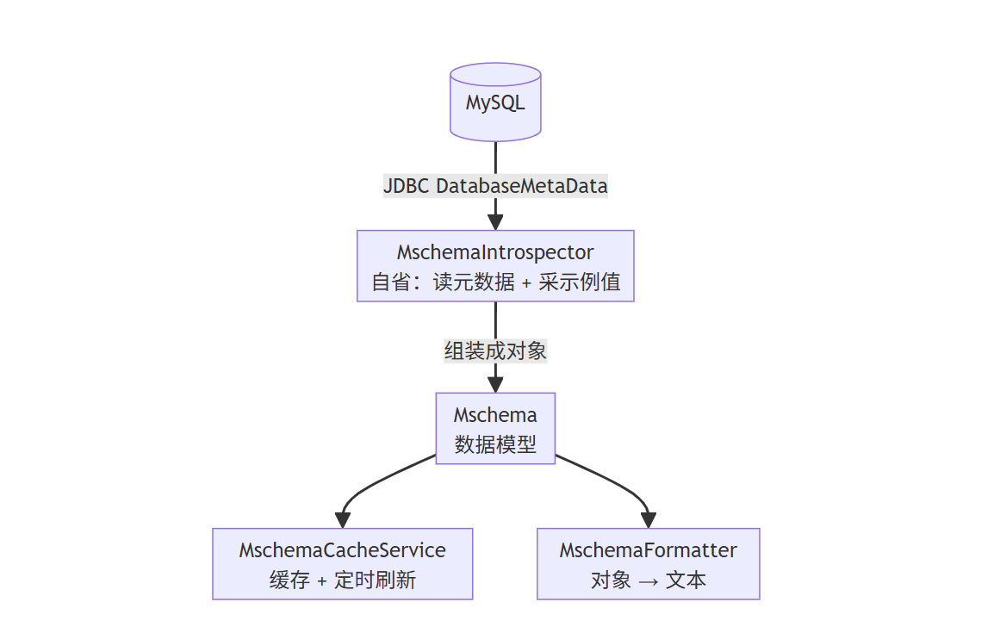
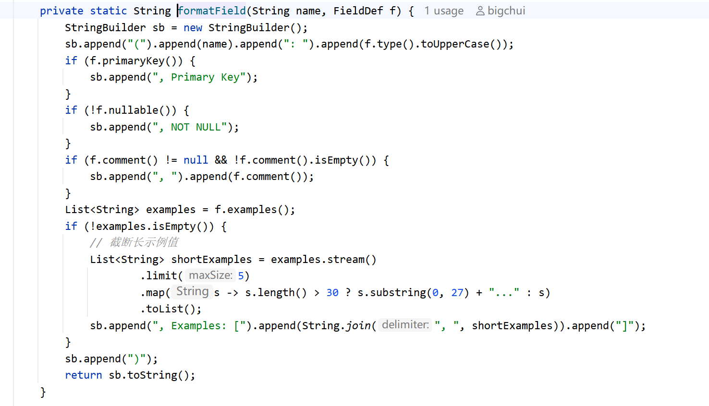
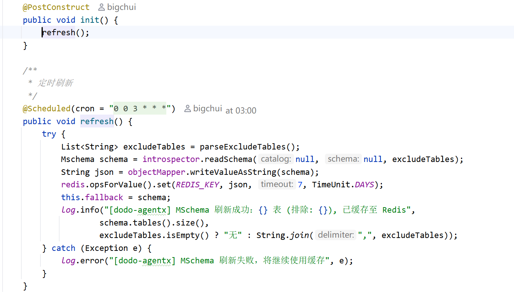
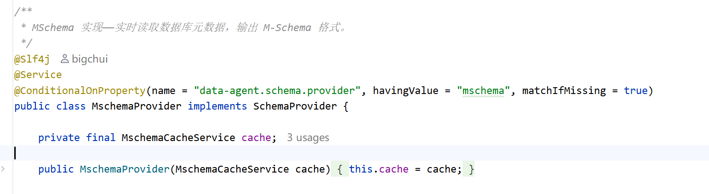

# ✅M-Schema的Java实现

M-Schema 说白了就是读数据库元数据，按约定格式拼成一段 LLM 好读的文本。官方实现基于 Python 的 SQLAlchemy。

dodo-agentx 是 Java 项目，没必要为了生成一段 schema 描述，还要额外拉一个 Python 脚本进来跑。Java 生态里有现成的对标能力：JDBC 规范里的 `DatabaseMetaData` 接口，JDK 自带，主流关系型数据库驱动都实现了，同样能读表、读列、读主键、读外键。

这节就来讲清楚怎么用 Java 实现 M-Schema。

整体架构

把数据库 schema 变成 M-Schema 文本，需要：连接数据库，读元数据，用一个对象把结果装起来，拼成文本，以及避免每次都重复读。



| 角色 | 职责 |
| --- | --- |
| **Mschema** | 数据模型（record），装表、字段、外键的结构信息 |
| **MschemaIntrospector** | 连数据库，用 JDBC 读元数据 + 采示例值，组装成 Mschema 对象 |
| **MschemaFormatter** | 把 Mschema 对象格式化成 M-Schema 文本 |
| **MschemaCacheService** | 缓存自省结果，定时刷新 |
| **SchemaProvider** | 策略接口，屏蔽数据源差异，LLM 工具层只调用它 |

最后这个 SchemaProvider 是对外暴露的接口，Agent 的 `listTables`、`describeTables` 工具通过它拿数据。工具本身后面单独讲，这篇只聚焦 M-Schema 的实现链路。

数据模型

`Mschema` 是一个纯 record，没有业务逻辑，就是装数据的容器，用 Jackson 序列化后存 Redis：

```java
public record Mschema(
    String dbId,
    Map<String, TableDef> tables,
    List<FkDef> foreignKeys) {

    public record TableDef(String comment, Map<String, FieldDef> fields) {}
    public record FieldDef(String type, boolean primaryKey, boolean nullable,
                           String comment, List<String> examples) {}
    public record FkDef(String table, String column,
                        String refTable, String refColumn) {}
}
```

`TableDef` 里用 `LinkedHashMap` 保证字段顺序：数据库里字段什么顺序，输出的文本就什么顺序。

自省器

`MschemaIntrospector` 是核心，对标 Python 版的 `SchemaEngine`。所谓自省，其实就是：**初始化，连一次数据库，把表结构完整读一遍**。

为什么需要自省？因为表结构不会在运行时变。上线之后，表加个字段、改个注释，都是非常低频的操作，绝大多数时候数据库结构是静态的。所以只需要启动时读一次，缓存起来就够了。

自省用 JDBC 的 `DatabaseMetaData`，整个读取过程可以分五步：

```java
public Mschema readSchema(String catalog, String schema, List<String> excludeTables) {
    try (Connection conn = dataSource.getConnection()) {
        DatabaseMetaData meta = conn.getMetaData();
        String effectiveCatalog = catalog != null ? catalog : conn.getCatalog();

        // 1. 读表清单（REMARKS 列就是表注释）
        // 2. 读视图（如果数据库有的话；JDBC 的 getTables 传 TABLE + VIEW 类型一起读）
        // 3. 读每张表的列 + 主键（getColumns + getPrimaryKeys）
        // 4. 读外键（getImportedKeys）
        // 5. 采集示例值（异步，仅字符串列）
        return new Mschema(dbName, tables, fks);
    }
}
```

前四步都是标准的 JDBC 元数据查询，一次 ResultSet 遍历就拿到。有两个细节值得说一下：

- **catalog 从连接里取**：MySQL 必须指定 catalog（库名），否则 `getTables` 会把所有库的表都捞出来。所以代码里先判断调用方有没有传，没传就从 `conn.getCatalog()` 取当前连接的库。
- **exclude-tables 排除系统表**：dodo-agentx 自身的系统表（agentx_session、agentx_trace 等）不该暴露给数据分析，配置一下就过滤掉了，支持 `agentx_*` 通配符。

示例值采集

第五步是唯一需要真正查数据的地方。设计上有两个考虑。

第一个：**只对字符串类型列采集**。数值列 `amount` 采到 `[2.99, 0.99]` 对理解字段含义帮助不大，而字符串列 `rating` 采到 `[PG, G, NC-17]` 信息量很大，能直接帮 LLM 写对 WHERE 条件：

```java
private static final Set<String> SAMPLE_VALUE_TYPES = Set.of(
    "VARCHAR", "CHAR", "ENUM", "SET", "TINYTEXT", "TEXT", "MEDIUMTEXT"
);
```

第二个：**异步并行采集，带超时保护**。几十个字符串列，串行跑 `SELECT DISTINCT` 可能十几秒。每列起一个 CompletableFuture 同时跑，最后统一等 5 秒：

```java
CompletableFuture.allOf(futures.toArray(new CompletableFuture[0]))
        .get(EXAMPLE_TIMEOUT_SECONDS, TimeUnit.SECONDS);   // 5 秒
```

`allOf` 把所有采集任务打包，`get(5, 秒)` 表示最多等 5 秒。5 秒内全采完就正常返回；5 秒后还有列没采完，就放弃等待，已经采到的保留。原因就是：示例值是锦上添花，某张几百万行的大表跑 `SELECT DISTINCT` 太慢，不能让它拖垮整个自省流程。

当然这边对于一些敏感字段还需要做脱敏处理，比如密码、用户住址、邮箱等敏感信息，不能由于这个采样导致敏感数据的泄露。

格式化器

`MschemaFormatter` 负责把对象转文本，对标 Python 版的 `to_mschema()`。核心是字段拼接：



对外提供两个方法：`formatTableList` 只输出表名清单加注释（给 `listTables` 用，帮 Agent 快速挑相关表），`formatTables` 输出完整的 M-Schema 文本（给 `describeTables` 用，展开字段详情）。

缓存

自省是个开销不小的操作，几十张表、几百列、还要查示例值，实际生产环境可能表更多，代价更大，不能每次请求都跑一遍。

`MschemaCacheService` 的思路也很简单：**表结构一般都是静态的，读一次就够了**。启动时自省一次，结果存起来，后续都走缓存：



表结构虽然一般都是静态，但偶尔会有 DDL 变动：加了字段、补了注释。这边加了一个频率很低的定时任务，默认凌晨 3 点刷一次，保证不会一直用旧的。如果你的系统确定表结构不会变，这个定时任务完全可以去掉，启动时读一次就够了。

取数据时做了三层兜底：

```text
public Mschema get() {
    // 1. 优先 Redis
    String json = redis.opsForValue().get(REDIS_KEY);
    if (json != null) return objectMapper.readValue(json, Mschema.class);
    // 2. Redis 挂了 → 内存兜底
    if (fallback != null) return fallback;
    // 3. 都没有 → 同步刷新一次
    refresh();
    return fallback;
}
```

Redis 挂了降级到内存那份 fallback 副本，保证服务不受影响。

策略模式

上面的自省器、格式化器、缓存，都是在讲 `provider: mschema` 这一种数据源。但 schema 的来源不止一种。`SchemaProvider` 把数据源差异屏蔽掉：

```text
public interface SchemaProvider {
    String listTables();
    String describeTables(List<String> tableNames);
}
```

`MschemaProvider` 是默认实现，通过 `@ConditionalOnProperty` 注册，不配就走它：



`listTables` 和 `describeTables` 这两个工具只依赖 `SchemaProvider` 接口，不关心数据是来从什么数据源来的。换数据源不用改工具代码，换一个实现类就行。我们下一篇会讲一种 YAML 的方式，就是另一个 SchemaProvider 实现。

小结

整条链路：自省器连接数据库，读元数据，组装成 Mschema 对象，缓存服务把对象存进 Redis 省去重复读取，格式化器按需把对象拼成文本。表结构是静态的，所以自省只需在启动时跑一次，缓存起来复用。

和 Python 版的核心对比：

| 能力 | Python 版 | dodo-agentx（Java） |
| --- | --- | --- |
| 读元数据 | SQLAlchemy Inspector | JDBC<br>`DatabaseMetaData` |
| 采示例值 | `SELECT DISTINCT`<br>全字段串行 | `SELECT DISTINCT`<br>仅字符串列，异步并行 |
| 缓存 | 无，每次现读 | Redis + 定时刷新 + 内存降级 |
| 额外依赖 | SQLAlchemy + llama_index | 纯 JDK + Spring |

可以看到 M-Schema 的能力完全可以用纯 Java 实现，不依赖任何 Python 组件。底层就是 JDBC 规范接口，所有数据库驱动都支持。

他的优势可以动态的获取表结构，可以设置同步的频率，不过这套方案有是有缺陷的：表结构信息全靠数据库元数据，强依赖 DDL 里的 comment，建表时没写清楚注释，或者压根没有注释，那么最终输出里的字段就是光秃秃的名称和类型。

我们下一篇讲的 YAML 方式，就是来解决这个问题的。

---

来源: https://thoughts.aliyun.com/workspaces/6963289eb0fc2e001bb052eb/docs/6a577bd4a7c8ff00010b0556
