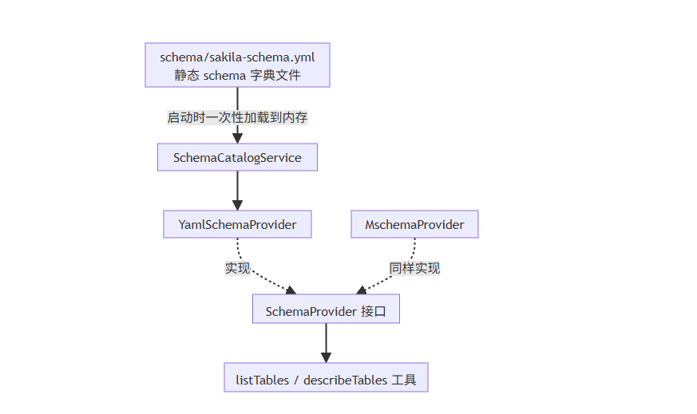
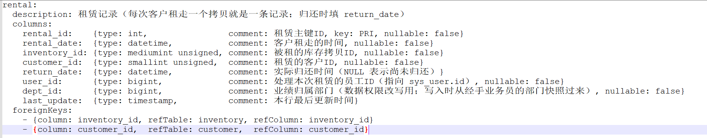
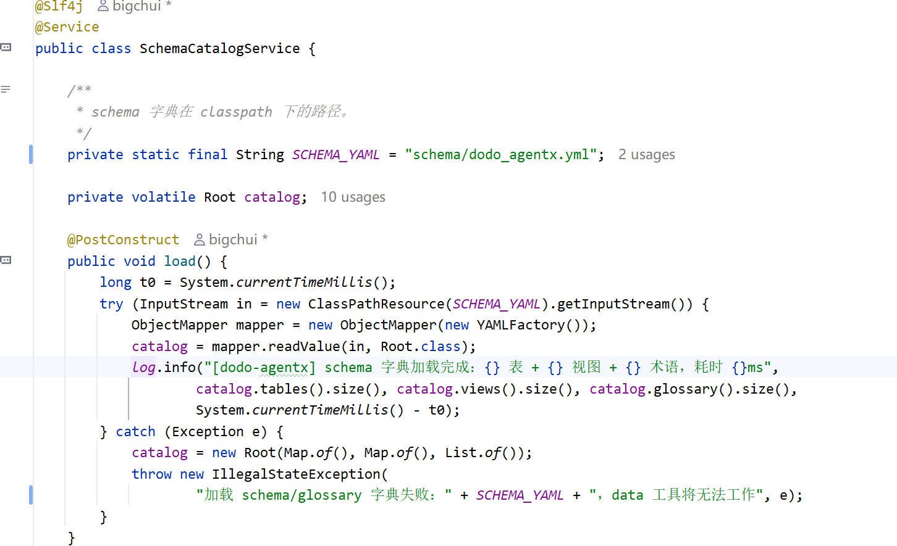

# ✅Yaml Schema方式

前面讲的 M-Schema Java 方案有个绕不开的问题：**它完全基于 DDL**。所有字段说明都从数据库元数据读，DDL 里没写注释，读出来就是空字符串。

现实是，很多老项目的 DDL 确实没注释，或者注释是自描述型的，比如`customer_id` 的注释写"customer_id"，就跟没写一样。这种情况下 mschema 读到的 comment 全是空的，LLM 看到 `active: TINYINT` 不知道状态枚举值到底怎么表达的，看到 `amount: DECIMAL` 也不知道这是什么金额、能不能求和。模型只能靠字段名和类型瞎猜，当然你也可以自己去补这些 comment 也是可以的。

这节课给大家介绍另一种方式：不查数据库，把 schema 当成一份配置文件手动维护。这就是 YAML 方式。

整体流程

yaml 方案也是 `SchemaProvider` 接口的一个实现。接口本身上节课讲过，只有两个方法：

```java
public interface SchemaProvider {
    String listTables();
    String describeTables(List<String> tableNames);
}
```

`MschemaProvider` 是默认实现，从数据库实时自省。`YamlSchemaProvider` 是另一个实现，从 classpath 下的静态 yml 文件读，两者只是数据来源不同：



工具层只依赖 `SchemaProvider` 接口，不关心数据是从数据库来的还是从 yml 文件来的。切换实现方式，改一个配置项就行：

```yaml
data-agent:
  schema:
    provider: yml      # 默认是 mschema
```

YAML 结构

数据模型是一组 record，和 YAML 文件结构一一对应：

```java
public record Root(Map<String, TableDesc> tables,
                   Map<String, TableDesc> views,
                   List<GlossaryDesc> glossary) {}

public record TableDesc(String description,
                        Map<String, ColumnDesc> columns,
                        List<FkDef> foreignKeys) {}

public record ColumnDesc(String type, String comment,
                         Boolean nullable, String key) {}
```

`Root` 顶层三块：`tables`（基础表）、`views`（预聚合视图）、`glossary`（业务术语字典）。对应 `dodo_agentx.yml` 里的真实片段：



- **字段顺序靠 YAML 书写顺序保证**：`columns` 解析进 `LinkedHashMap`，写 yaml 时字段什么顺序，LLM 看到的就什么顺序。
- **nullable 用 Boolean 包装类型**：YAML 里可以省略，省略时默认按可空处理，只有 NOT NULL 的字段才需要显式写 `nullable: false`。
- **key 是索引类型**：取值 `PRI / UNI / MUL`，对齐 MySQL `SHOW COLUMNS` 的语义。

YAML 的优劣势

表结构、字段类型、外键关系、视图、示例值等数据库结构信息，M-Schema 已经能够很好地表达。而 YAML 元数据最大的价值，不在于重复这些信息，而是在 Schema 之上补充 **LLM 最缺乏的业务语义**。

相比直接依赖数据库 DDL，YAML 有几个明显优势。

可以承载更丰富的业务语义

数据库 Comment 更偏向开发人员阅读，长度有限，不适合作为持续维护的 AI 知识。

YAML 则只是普通文本，可以自由维护任意长度的说明，把容易让模型误解的业务概念直接写清楚。

例如：

```yaml
active:
  type: boolean
  comment: 是否活跃标记（1=有效，0=停用；这是账户状态字段，与"近30天有 rental 记录"的行为活跃不是一个概念，涉及"活跃客户"请参考 glossary 中的定义。）
```

对于 LLM 来说，这种业务解释远比一句"是否活跃标记"更有价值，可以避免模型把**账户状态**和**行为活跃**混为一谈。

字段可以补充业务属性

数据库只能告诉模型这是一个 `DECIMAL(5,2)` 字段，却不知道它代表什么业务含义。

例如：

```yaml
amount:
  type: decimal(5,2)
  comment: 付款金额（美元，含税）；金额指标，可用于 SUM、AVG 等聚合分析。
```

这里不仅告诉模型这是金额，还告诉它：

- 单位是什么
- 是否含税
- 是否属于指标字段
- 常见聚合方式

这样模型在生成 SQL 时，就更容易选择正确的字段和聚合方式。

示例值可以人工维护，而不是运行时采集

M-Schema 会通过 `SELECT DISTINCT` 自动采集部分字段的示例值，这种方式无需人工维护，但也存在一些限制：

- 大表采样成本较高；
- 某些类型（如数值、时间）通常不会采集；
- 线上数据库权限或超时也可能导致采集失败。

YAML 则可以直接维护模型真正需要了解的典型取值。

例如：

```yaml
rating:
  type: enum
  comment: G、PG、PG-13、R、NC-17（影片年龄分级）
```

LLM 在生成 SQL 时，就能直接知道合法取值，而无需再依赖运行时查询数据库。

可以补充视图背后的业务含义

数据库可以告诉模型，这是一个 View。但不会告诉模型：

- 为什么会有这个 View；
- 它适合解决什么业务问题；
- 底层已经 Join 了哪些表；
- 是否已经完成聚合。

如果数据库里有视图，YAML 可以这样补充：

```yaml
views:
  sales_by_film_category:
    description: 按影片类别汇总销售额的预聚合视图，已经 JOIN 了 category、film_category、payment，并按类别完成 SUM(amount) 聚合。查"各类别销售额"直接用，不用重新拼 JOIN。
```

有了这些说明，LLM 更容易直接选择视图，而不是重新拼接复杂的 JOIN 和 GROUP BY。

dodo-agentx 当前用的 dodo_agentx 库实际上没有视图。sakila 原版其实自带 7 个视图，嫁接到 RBAC 数据权限体系时为了不让视图绕过 `dept_id / user_id` 的行级过滤，索性全部删掉，所有汇总都改成走基础表 + 显式 JOIN，权限改写更可控。这里给出 views 块的写法只是说明 YAML 有这个能力，后续如果接入到你们自己的业务项目中，如果有视图的话，可以按这个格式维护即可。

可以维护统一的业务术语（Glossary）

这是 YAML 相比传统 Schema 最大的扩展能力。很多业务问题中的概念，并不能直接映射到某一个字段，而是需要一套统一的业务口径，例如：

- 活跃客户
- 新/老客户
- 销售额
- 热门影片
- 最近一个月
- 高价值客户

这些概念往往对应固定的 SQL 条件、过滤规则甚至统计方式。

YAML 可以集中维护这些业务术语，让模型在生成 SQL 时引用统一定义，而不是每次根据字面意思自由发挥，从而保证查询结果符合企业的业务口径。

但也要承担相应代价

相比 mschema 的"自动读、自动同步"，yaml 方案需要团队持续投入维护精力，灵活性的另一面就是这部分成本。

- **需要人工维护和审核**：这是最主要的代价。表结构变更、业务口径调整都需要人同步更新 yml，AI 可以辅助生成初稿，但业务语义的准确性必须人工把关。
- **首次撰写有一定工作量**：每张表、每个字段都要补注释和描述，dodo_agentx 20 张表（14 张 sakila 业务表 + 5 张 sys_ 系统表 + user_profile）至少几百个字段。实际生产环境的表会更大更多，不过表结构变更通常不频繁，首次完成后主要是增量维护，工作量可控。
- **漂移是静默的**：yml 和真实数据库结构不一致时不会报错。LLM 按过时的字段类型生成 SQL，只会查不出数据或运行时抛错。

加载机制

`SchemaCatalogService` 把 yml 读进内存：



整个 Schema 字典采用**启动预加载 + 内存只读**的方式。

- **启动时一次加载**：通过 `@PostConstruct` 在 Spring 容器启动完成后读取 YAML，并反序列化为 Java 对象。整个应用生命周期只加载一次，避免运行期间重复解析文件。
- **内存常驻访问**：加载完成后，Schema 字典一直保存在内存中，后续所有查询都直接访问内存对象，响应速度稳定，几乎没有额外开销。
- **线程安全共享**：Schema 数据属于静态元数据，启动完成后不再修改，可以安全地被多个请求并发读取，无需额外加锁，也不存在读写竞争。
- **无需缓存层**：`listAll`、`find`、`findMany` 等接口都是直接查询内存中的 `Map`，不依赖数据库、Redis 等外部存储，也不存在缓存失效、缓存预热或缓存一致性等问题。

这种设计非常适合 Schema、业务字典、Glossary 等**低频变更、高频读取**的数据。即使包含几百张表、几千个字段，整体数据量通常也只有几 MB，常驻内存几乎没有压力，却能获得最快的查询性能。

YAML 如何维护

YAML 并不是数据库 Schema 的映射，而是一份持续沉淀业务语义的元数据，更推荐采用 **AI 生成初稿、人工补充业务语义、持续迭代维护** 的方式。

- **AI 生成初稿：**首先导出数据库 DDL，获取所有表和视图的定义，再将 DDL 与 `SchemaCatalog` 对应的数据结构一起提供给 LLM，让它生成符合规范的 YAML。对于表名、字段名、类型、主键、外键等结构化信息，LLM 基本能够准确转换，大部分重复性的整理工作都可以交给 AI 完成。
- **人工补充业务语义：**真正需要人工维护的是数据库无法表达的业务知识，例如 `active` 表示账户状态而不是行为活跃、`amount` 为含税金额，以及"活跃客户""热门影片"等业务术语的定义。这些内容无法直接从 DDL 推导出来，当然 LLM 也可以帮你完成一部分，但是需要人工审核，也是 YAML 最有价值的部分。
- **持续迭代维护：**YAML 并不是一次生成后就一成不变，而是一份随着业务不断演进的知识库。每当数据库 Schema 发生变化、业务口径调整，或发现 LLM 在某个字段上频繁理解错误时，都应该同步更新 YAML。建议将 YAML 与代码一起纳入 Git 管理，与数据库 Schema 保持同步演进。长期来看，它维护的不仅是一份元数据，更是团队积累的业务知识和 LLM 使用经验。

两种方案对比

可以把 mschema 和 yaml 放一起对比一下：

| 方式 | Mschema | Yaml |
| --- | --- | --- |
| 数据来源 | 实时 JDBC 自省 | 静态 yml 配置文件 |
| 字段 comment | 来自 DDL，DDL 没写就空 | 人工或 AI 补，可以写很详细 |
| 示例值 | 运行时 SELECT DISTINCT 采集 | 直接配置 |
| 表 / 视图 / 外键 | 都有，完整支持 | 都有，完整支持 |
| 业务口径建议 | 没有，需单独设计 | 可以嵌进 comment |
| 业务术语字典 | 没有，需单独设计 | glossary 块承载 |
| 启动是否连库 | 是 | 否 |
| DDL 变动同步 | 自动（重新自省就拿到新结构） | 手动（要同步改 yml） |
| 维护成本 | 低 | 中等，首次撰写后是增量维护 |
| 适用场景 | DDL 注释齐全、表变更比较频繁的项目 | DDL 无注释、表变更频率低，需要更加丰富的业务语义的项目 |

小结

yaml 方案不替代 M-Schema 的结构信息采集，而是在它之上补一层 LLM 最缺的业务语义。表名、字段、类型、外键、示例值这些 mschema 都能拿得到，但字段的业务含义、口径建议、视图用途、业务术语，都得靠这份手工维护的 yml 字典。加载也简单：启动时一次性读进内存，后续纯内存查询，不连数据库、不依赖缓存层。

两种方案的选择标准一句话：**DDL 注释齐全、表结构稳定，用 mschema 省心；DDL 没注释、需要嵌业务口径，用 yaml 前期投入换长期质量**。代价就是需要人工维护和审核，首次撰写有点工作量，后续是增量维护。

---

来源: https://thoughts.aliyun.com/workspaces/6963289eb0fc2e001bb052eb/docs/6a59f588c71a8900017a9347
