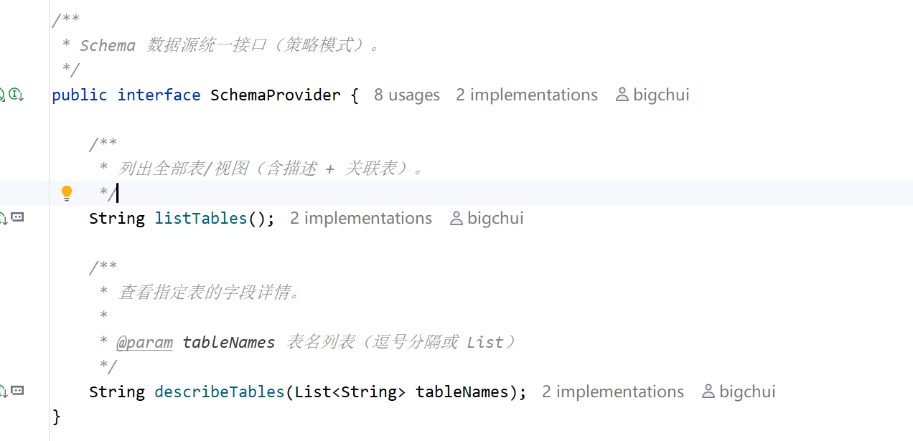
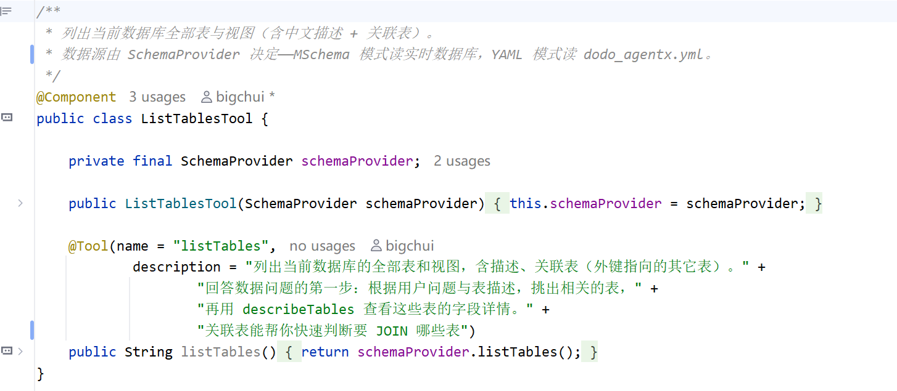
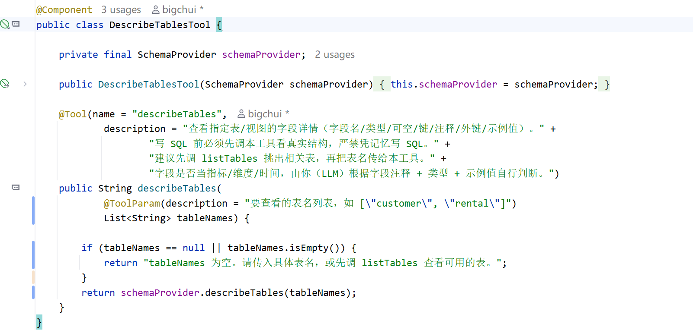
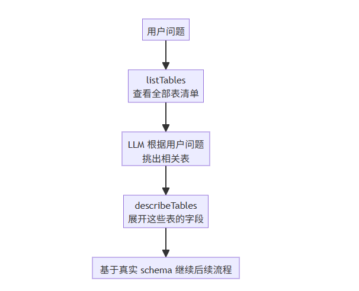

# ✅Schema 工具的封装

前面几篇讲 schema 的数据怎么来：M-Schema 定义格式、Java 自省读数据库、yaml 字典手动维护。无论哪种方式，最终目的只有一个：把数据库结构告诉 LLM，让它能动手写 SQL。

数据有了之后，下一个问题是：**它怎么在 Agent 运行时真正起作用**？答案就是封装成工具，让 React Agent 在运行时，按照 data-analysis 这个 Skill.md 的指令说明，来按需调用。

两个工具

`SchemaProvider` 接口最终会被封装成两个工具暴露给 React Agent 来使用，分别是：`ListTablesTool `和 `DescribeTablesTool`。



分工很清晰：

- `listTables` 看整体：列出所有表和视图，带描述和关联表，让 LLM 从用户问题里挑出相关的几张表



- `describeTables` 看细节：传入表名，返回这些表的完整字段详情



两阶段渐进式

data-analysis 的 SKILL.md 里明确指引了调用顺序：先调 `listTables` 看表清单，挑出相关表，再调 `describeTables` 展开字段。React Agent 在执行任务时按这个顺序依次调用：



为什么不直接把所有 DDL 拼到 system prompt 里一次性注入？

- 几十张表的 schema 字符串就有几 KB，真实业务几百张表直接吃掉大半个上下文窗口；
- schema 全塞进去，LLM 反而要从噪音里挑相关表，准确率大幅下降。

两阶段渐进式让上下文跟着思考流程走，每一步只看当前需要的部分，token 省了，注意力也聚焦。

数据源切换

两个工具底层都是 `SchemaProvider` 接口，前面讲过的两种实现通过一个配置切换：

```text
data-agent.schema.provider=yml      # 默认 mschema
```

工具代码只依赖接口，换数据源不用改工具的代码。

小结

schema 数据有了之后，封装成 `listTables` 和 `describeTables` 两个工具，暴露给 React Agent。Agent 按照 SKILL.md 的指令提示，用两阶段渐进的方式（先看表清单挑表，再展开字段详情）拿到相关表的真实结构，再动手写 SQL。

到这里 LLM 已经能拿到相关表的完整结构了，当然到了这一步，有了 Schema 就可以生成SQL了，但是真的能写准确吗？业务术语的消歧是怎么一回事？。

---

来源: https://thoughts.aliyun.com/workspaces/6963289eb0fc2e001bb052eb/docs/6a59f5e951b1440001ed63f3
