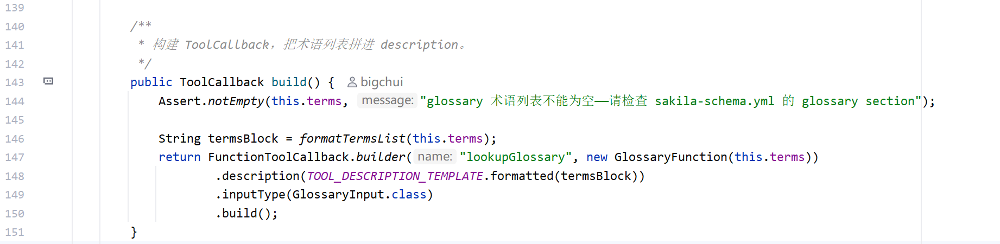
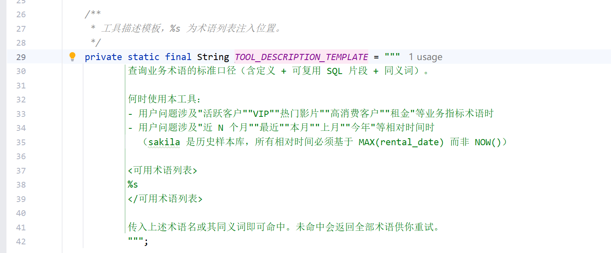
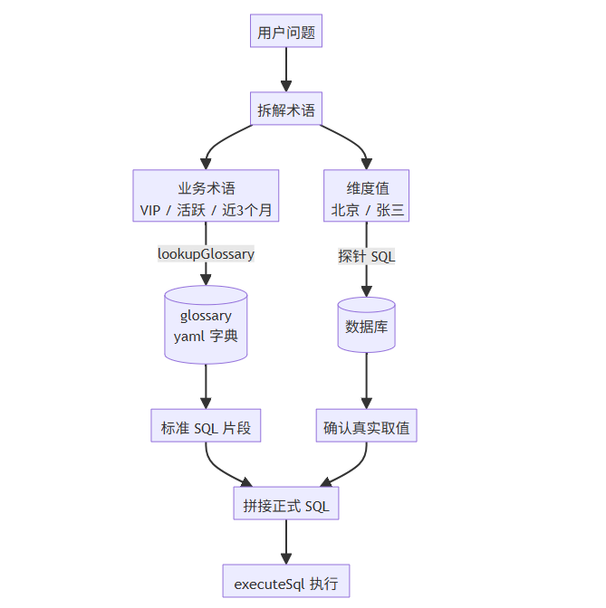

# ✅业务消歧怎么做？

前面讲的两个 schema 工具（`listTables` 挑表、`describeTables` 看字段），已经让 LLM 拿到了用户问题相关表的真实结构。走到这一步，理论上可以动手写 SQL 了，但真落地会发现还不够。

问题出在**业务术语口径**上。用户提问里经常会带"VIP"、"活跃"、"大额"、"最近 N 个月"这类业务术语，它们在 DDL 里找不到对应字段，含义完全由业务方定义。如果不给 LLM 一个明确的锚点，它只能根据字面意思自己发挥，那就会导致**每次生成的 SQL 条件都可能不一样**：

| "VIP 客户有多少" | LLM 可能的发挥 |
| --- | --- |
| 第一次问 | `WHERE (SELECT SUM(amount) FROM payment WHERE customer_id=...) > 1000` |
| 第二次问 | `WHERE (SELECT COUNT(*) FROM rental WHERE customer_id=...) > 5` |
| 第三次问 | `WHERE create_date < '2024-01-01'` |

口径漂移带来的后果很严重：业务方拿到的数字对不上，AI 看起来"不靠谱"，整个数据问答功能就废了。光有 schema 解决不了这类问题，需要一个统一的业务术语口径字典。

比如，LLM 知道字段叫 `city`，但不知道库里到底存的是"北京"还是"Beijing"，凭猜测写 WHERE 也容易翻车。这类问题需要**实际看一眼数据**。所以我们要做的就是**业务消歧**，这边给出两种消歧手段：`lookupGlossary`**解决业务术语的口径问题，探针 SQL 解决字段实际值的形态问题。**

lookupGlossary：业务术语

数据结构

前面讲 YAML schema 时提到过 glossary 块，承载的就是业务术语字典。每个术语用 `GlossaryDesc` 描述：

```java
public record GlossaryDesc(String term,          // 术语标准名
                           String description,   // 业务口径的自然语言描述
                           String sqlFragment,   // 可直接复用的 SQL 片段
                           List<String> synonyms) {} // 同义词列表
```

四个字段对应到 `dodo_agentx.yml` 里"活跃客户"的定义：

```yaml
- term: 活跃客户
  description: 近 30 天内有至少 1 笔成功 rental（租赁）记录的去重 customer。注意这里的"30 天"基于数据最大时间而非 NOW()。
  sqlFragment: customer_id IN (SELECT DISTINCT customer_id FROM rental WHERE rental_date >= DATE_SUB((SELECT MAX(rental_date) FROM rental), INTERVAL 30 DAY))
  synonyms: [active customer, 有效客户, 活跃用户]
```

LLM 调 `lookupGlossary("活跃客户")`，拿到标准口径和 sqlFragment，写 SQL 时直接把 sqlFragment 拼到 WHERE 里。一条口径，项目全部统一，业务方改口径只需修改 yaml，Agent 自动生效。

为什么放 yaml

理论上把术语存进数据库表、redis也都能实现，这边我们直接选择复用 yaml，**统一行为**：术语口径和 schema 字段都跟着 git 走，版本可追溯，修改 schema 时，术语口径也可以顺便修改或者 review，多一个数据源就多一份维护成本，没必要。

FunctionToolCallback

`lookupGlossary` 是整个设计里的一个关键点。前面的 `listTables`、`describeTables` 等工具都使用 `@Tool` 注解注册，因为它们的工具描述是固定的，编译时就可以确定。而 `lookupGlossary` 不同，它需要把 **运行时加载的术语列表** 动态注入到工具描述中，让 LLM 在选择工具时就能看到当前支持查询的所有业务术语。`@Tool` 注解的 `description` 必须是编译时常量，无法拼接运行时数据。如果继续使用注解方式，LLM 虽然知道有一个"查询业务术语"的工具，却不知道到底有哪些术语可查，只能根据用户问题去猜测是否调用该工具，工具选择的准确率会明显下降。因此，使用 `FunctionToolCallback`进行注册，在创建工具时动态生成 `description`：





这样，运行时加载的 YAML 术语会直接拼接到工具描述中，LLM 在进行 Tool Selection 时就能看到完整的术语列表了。

当用户提问"统计 VIP 用户数量"时，LLM 会发现工具描述中存在 **"高消费客户（同义词：VIP客户）"**，从而主动调用 `lookupGlossary`，获取标准业务口径，而不是依赖模型自身去猜测 "VIP" 的含义。这种方式将业务知识直接暴露给 Tool Selection 阶段，能够显著提升工具选择和术语匹配的准确率。

为什么不用向量检索

向量检索适合找相似内容，但术语口径查询需要的是找标准定义，两者目标不同。

例如，用户查询"近期活跃用户"，向量模型可能认为"活跃客户"、"高消费客户"、"高净值客户"等术语语义接近，但它们对应的业务口径完全不同：前者按行为频次统计，后者按消费金额统计。一旦命中错误术语，LLM 会基于错误口径继续推理，最终得到一个"看起来合理、实际上错误"的答案。

因此，术语查询采用**精确匹配**策略：先匹配术语名，再匹配业务显式维护的同义词，而不是依赖向量相似度。

```java
String lower = trimmed.toLowerCase(Locale.ROOT);
GlossaryDesc hit = termIndex.get(lower);       // 1. 术语名精确匹配
if (hit == null) {
    hit = synonymIndex.get(lower);             // 2. 同义词精确匹配
}
```

这里的 `synonyms` 并不是向量意义上的模糊匹配，而是**业务显式维护的同义词**，哪些词可以互换完全由业务定义，而不是由向量模型判断。

这种方式遵循**宁可不命中，也不要错命中**的原则，保证 LLM 获取的始终是业务定义的标准口径，而不是语义上相近但定义不同的术语。

时间锚点

sakila 是 2005 年的历史样本库。如果 LLM 把"最近 3 个月"翻译成：

```sql
WHERE payment_date >= DATE_SUB(NOW(), INTERVAL 3 MONTH)
```

结果永远是空（NOW 是当前年份，数据是 2005 年的）。这是 Text2SQL 在历史样本数据上的缺陷。

dodo-agentx 在 glossary 里专门登记了一条元规则"时间锚点"：

```yaml
- term: 时间锚点
  description: >
    元规则。sakila 是冻结的历史样本库，rental/payment 数据范围约 2005-05-25 ~ 2005-09-01。
    所有相对时间（"最近 / 近 N 个月 / 本月 / 上月 / 今年"）必须基于
    (SELECT MAX(rental_date) FROM rental) 作为"数据当前时间"来算。
```

"近 3 个月"的 sqlFragment 翻译成：

```sql
rental_date >= DATE_SUB((SELECT MAX(rental_date) FROM rental), INTERVAL 3 MONTH)
```

**基于数据本身的最大时间作为"现在"**，而不是真正的当前时间。这条规则不写进 glossary，data-agent 几乎不可用。这个其实在我们的真实业务场景中也非常常见，比如“统计本周的销售额”，这个本周是指周一到现在，还是指最近7天？再比如“最近30天的销售情况”，这个是到当天的23:59:59，还是说当前时间，如果没有这些时间锚点和定义，LLM每次生成的SQL都可能随意发挥。统计准确性也就无从谈起了。

探针 SQL：探测真实数据

和示例值的关系

看到这可能会问：前面讲 schema 时不是已经有示例值了吗（mschema 自动采集的 `Examples`、yaml 里配置的典型取值）？为什么还要单独发探针 SQL？

两者确实在做同一件事：告诉 LLM 字段里实际存什么。但有三个关键差异：

| 维度 | 示例值（schema 自带） | 探针 SQL（按需发起） |
| --- | --- | --- |
| 时机 | 静态快照，启动时一次性采集 / yaml 里写死 | 实时查询，反映当下数据库状态 |
| 范围 | 通用预览，常见几个取值（最多 5 个），mschema 只采字符串列 | 针对 LLM 当下问题精准查，例如<br>`WHERE city LIKE '%Bei%'` |
| 生命周期 | 可能过时；新表上线时数据还没产生，根本采不到 | 动态查询，表里有数据就能立即查到 |

最典型的场景：**新表刚上线时还没数据**，mschema 自省采到的示例值是空，等业务跑一段时间数据进来了，schema 里那个空状态可能还没定时刷新。这时 LLM 想写 `WHERE city = '北京'` 还是 `'Beijing'` 没有依据，只能现场发一条探针 SQL 确认。再比如**用户问的是非常规值**：示例值碰巧采到的是 `['KOBE', 'JAMES', 'WADE']`，但用户问的是 `'张三'` 这种库里实际有没有的值，示例值帮不上忙，探针可以 `WHERE first_name LIKE '%张%' LIMIT 10` 定向查。

**示例值是静态预览，探针 SQL 是按需深入**。两者互补，不是替代。

探针怎么用

DDL 能告诉你字段类型（`city VARCHAR(50)`），但不会告诉你里面存的是"北京"还是"Beijing"、大小写规则、枚举的完整取值。凭猜测写 WHERE 容易踩坑：查 'Beijing' 但库里是 '北京'，查不到数据。这类错误最难排查，SQL 语法没问题但结果就是不对。

Agent 写正式 SQL 前，先发一条 SQL 探针：

```sql
SELECT DISTINCT city FROM address WHERE city LIKE '%Bei%' LIMIT 10
```

LIMIT 10 保证结果不会撑爆上下文。返回结果让 LLM 知道库里实际怎么写的，再写 WHERE 就稳了。**宁可多跑几次探针，也别凭猜测写错 WHERE 导致空结果或漏数据**。探针的成本是几毫秒，正式 SQL 写错重试一轮的成本是几十秒，还要算上结果错误带来的业务误判。

三种典型用法：

- 取枚举值：`SELECT DISTINCT rating FROM film LIMIT 10`
- 模糊查特定值：`SELECT DISTINCT city FROM address WHERE city LIKE '%Bei%' LIMIT 10`
- 看字段样本：`SELECT first_name, last_name FROM customer LIMIT 5`

探针本质是用 `executeSql` 工具执行的 SELECT 查询。executeSql 本身的设计（为什么强制只读、安全护栏怎么做）下一篇详讲，这里先知道它就是执行只读 SELECT 返回结果就够了。

两类消歧怎么配合

两类消歧并行进行：术语类查 glossary 字典拿到标准 SQL 片段，值类发探针 SQL 确认真实取值，最后汇合拼成正式 SQL。



举个完整例子，用户问"近 3 个月北京活跃客户的销售额"。

第一步，拆业务术语：

| 业务术语 | lookupGlossary 命中 | 拿到的口径 |
| --- | --- | --- |
| 近 3 个月 | 近3个月 | `rental_date >= DATE_SUB((SELECT MAX(rental_date) FROM rental), INTERVAL 3 MONTH)` |
| 活跃客户 | 活跃客户 | `customer_id IN (SELECT DISTINCT customer_id FROM rental WHERE ...)` |
| 销售额 | 租金 | `SUM(payment.amount)` |

第二步，确认维度值：

- "北京" → 探针查 `address.city` 库里是中文还是英文

第三步，把口径和维度值拼成正式 SQL。

**术语部分查口径字典，值部分查真实数据**。两类消歧配合下来，LLM 一次写对的概率会显著提高。

小结

消歧是写 SQL 前的关键步骤，`lookupGlossary` 把业务术语翻译成标准 SQL 片段，解决"VIP 是什么"这种语义 gap；探针 SQL 看一眼字段里实际存的值，解决"北京还是 Beijing"这种形态 gap。

口径字典有几个设计点值得记：**用 FunctionToolCallback 把术语列表拼进工具描述**（让 LLM 选工具时直接看到所有术语，避免瞎猜）、**精确匹配不用向量检索**（口径必须一术语一标准答案）、**同义词显式登记进 yaml**（显式的模糊比隐式的模糊可控）。时间锚点这种元规则也塞进 glossary，说明这套机制不仅能存业务术语，也能存"怎么写 SQL"的通用约定。

---

来源: https://thoughts.aliyun.com/workspaces/6963289eb0fc2e001bb052eb/docs/6a59f614a7c8ff00010dea27
