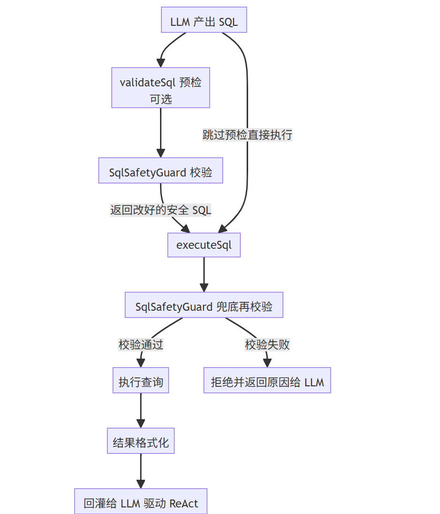
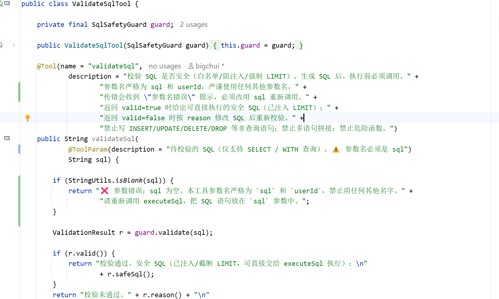
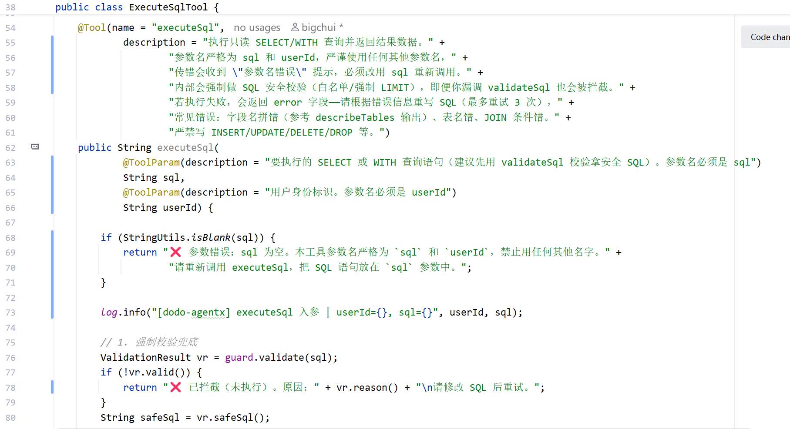
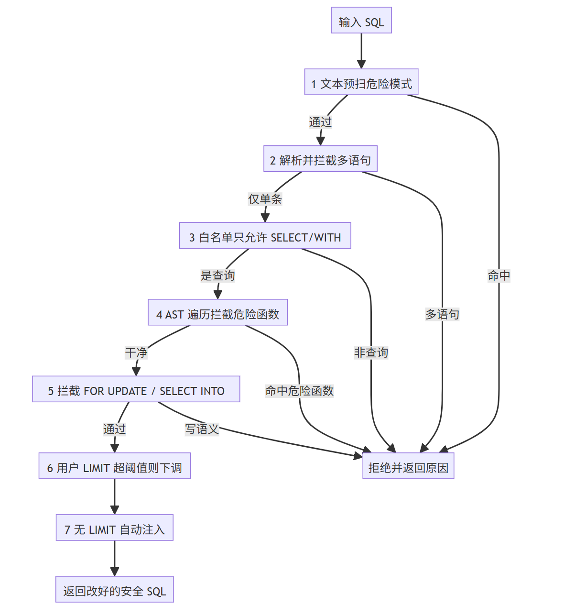
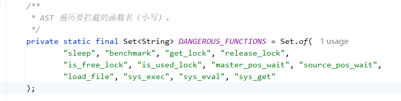

# ✅SQL安全校验

schema 和业务口径都拿到了，LLM 这时候其实可以动手写 SQL，但 SQL 不能直接丢给数据库执行。DataAgent 面对的不是普通后台接口，而是大模型动态生成的查询，所以执行前必须先做一层统一校验：既要拦住危险 SQL，也要拦住会拖垮数据库、污染上下文的高风险查询形态。

整体设计

一次安全的 SQL 执行，背后要经过三个环节：**校验**（SQL 是否只读、是否安全、查询形态是否可控）、**执行**（跑查询并约束资源）、**反馈**（错误提示如何引导 LLM 修正）。校验是核心，由 `SqlSafetyGuard` 统一负责，被 `validateSql` 和 `executeSql` 两个工具共享：



SQL工具

- **validateSql**：是给 LLM 主动调用的预检，只校验不执行，返回校验通过后的**安全 SQL**（已注入好 LIMIT、把超阈值的 LIMIT 下调）。LLM 拿到改好的 SQL 再交给 executeSql，能减少执行失败的重试。



- **executeSql**：真正执行的工具，不管 LLM 调没调过 validateSql，它进来第一件事就是再调一次`SqlSafetyGuard.validate()` 兜底，危险 SQL 依然会被拦截。



两者共享同一个 `SqlSafetyGuard`，校验逻辑只维护一份：引导 LLM "先验证再执行" 减少试错，但安全性不能寄托在大模型的自觉上，毕竟我们这个不是workflow，而是 ReAct 架构，所以就算你的 Skill.md 写的规则再严格，大模型也不可能每次都完全遵守。

SqlSafetyGuard

**JSqlParser**

`SqlSafetyGuard` 的精确校验依赖 **JSqlParser**，它是一个开源的 Java SQL 解析器。它的作用不是直接操作 SQL 字符串，而是先把 SQL 解析成**抽象语法树（AST，Abstract Syntax Tree）**，即按照 SQL 语法规则把一段文本拆成一棵树，每个节点对应一种语法元素。例如，MySQL 提供了 `SLEEP()` 函数，用于让数据库暂停执行指定的秒数。虽然它本身是合法函数，但在实际业务 SQL 中几乎不会使用，却经常出现在 SQL 注入、拒绝服务（DoS）攻击和时间盲注（Time-based Blind SQL Injection）中，因此通常会被 SQL 防火墙列为危险函数。例如：

```sql
SELECT SLEEP(1) FROM t WHERE id = 1;
```

解析后的 AST 大致如下：

```text
Select
└── PlainSelect
    ├── selectItems
    │   └── Function(name=SLEEP, args=[1])   ← 函数调用
    ├── fromItem
    │   └── Table(name=t)                    ← 表名
    └── where
        └── EqualsExpression(id, 1)
```

可以看到，`SLEEP()` 会被解析成 `Function` 节点，表 `t` 会被解析成 `Table` 节点，字符串字面量（如 `'abc'`）则会解析成 `StringValue` 节点。也就是说，SQL 中每一种语法成分，在 AST 中都有对应的节点类型。JSqlParser 还提供了 **Visitor 机制** 来遍历 AST。Visitor 会从根节点开始深度优先遍历整棵树，每访问到一种节点类型，就会回调对应的 `visit` 方法。例如，访问到 `Function` 节点会调用 `visit(Function)`，访问到 `Table` 节点会调用 `visit(Table)`。因此，只需要重写关心的 `visit` 方法，就可以在遍历过程中检查或处理对应的语法节点。`SqlSafetyGuard` 正是利用这一机制，在遍历 AST 时检查是否调用了 `SLEEP()`、`LOAD_FILE()`、`BENCHMARK()` 等危险函数。相比直接用正则匹配 SQL 文本，这种**先解析成 AST，再基于语法树进行审计**的方式更加准确、健壮，也是业界 SQL 防火墙和 SQL 安全审计的主流实现思路。

校验流程

`validate()` 是一条流水线，任何一步不过就直接拒绝，并把原因返回给 LLM：



**文本预扫危险模式**

交给解析器之前，先用正则扫一遍原始文本，挡住文件操作类高危入口：

```java
private static final Pattern DANGEROUS_PATTERN = Pattern.compile(
    "(?i)\\bLOAD_FILE\\s*\\("            // LOAD_FILE(  读服务器文件
        + "|\\bINTO\\s+(OUTFILE|DUMPFILE)\\b"  // SELECT ... INTO OUTFILE 写文件
        + "|\\bSYSTEM_USER\\s*\\("        // SYSTEM_USER( 信息泄漏
        + "|\\bFILE_READ|\\bFILE_WRITE"   // 文件读写标记
);
```

为什么解析前先扫？JSqlParser 遇到畸形或故意构造的 SQL 解析可能失败，文本预扫作为第一道粗筛先把最危险的挡掉。它有误杀代价（分不清字符串字面量，比如 `WHERE remark = 'INTO OUTFILE 说明'` 会被命中），所以正则适合做文本级粗筛，但不适合承担函数调用的精确识别，真正的精确判断靠第四步。

**解析并拦截多语句**

解析后检查条数，`stmts.size() != 1` 就拒绝。一条 SELECT 后偷偷接 DELETE 靠的就是分号串多语句，这里直接卡死。

**只允许 SELECT/WITH**

检查解析结果是不是 `Select` 类型。"白名单" 就是**只放行查询类语句，其余一切拒绝**。SELECT 大家熟，WITH 是另一种查询写法，全称**公共表表达式（CTE）**，先用 `WITH` 把子查询起个名字再 SELECT 它：

```sql
WITH active_users AS (SELECT id FROM users WHERE last_login > '2024-01-01')
SELECT * FROM orders WHERE user_id IN (SELECT id FROM active_users);
```

WITH 本质还是查询，JSqlParser 解析成 Select 的子类，所以放行。INSERT/UPDATE/DELETE/CREATE/DROP/ALTER/CALL 全部拒绝，这是只读语义的根本保证。

**AST 遍历拦截危险函数（重点）**

这一步是整个 `SqlSafetyGuard` 的核心，这里为什么还需要 AST？因为**文本预扫只负责粗筛，真正危险函数的识别必须依赖 AST。**如果仅靠正则去识别函数调用，会有两个天然缺陷：

- **误判**：正则只看文本，无法区分函数调用和字符串字面量。例如：

```sql
WHERE note = 'LOAD_FILE() 演示'
```

`LOAD_FILE\s*\(` 同样会命中，但这里只是字符串，并没有真正调用 `LOAD_FILE()`。

- **漏判**：MySQL 允许在函数名和括号之间插入注释，例如：

```sql
SELECT LOAD_FILE/**/('/etc/passwd')
```

这条 SQL 可以正常执行，但 `/**/` 并不是空白字符，普通正则很容易匹配失败，危险函数就漏过去了。AST 从根本上解决了这两个问题。JSqlParser 解析 SQL 后，真正的函数调用会变成 `Function` 节点，而字符串字面量则是 `StringValue` 节点。Visitor 遍历语法树时，只会在遇到 `Function` 节点时回调 `visit(Function)`，因此不会把字符串里的 `"LOAD_FILE()"` 当成函数，也不会受到空白、换行、注释等语法细节的影响。具体实现中，`DangerousFunctionFinder` 并没有自己实现 AST 遍历，而是继承了 JSqlParser 提供的 `TablesNamesFinder`。虽然它原本用于提取表名，但内部已经实现了完整的 Visitor 递归遍历能力，因此只需要重写 `visit(Function)`，就能在遍历过程中检查所有函数调用：

```java
private static class DangerousFunctionFinder extends TablesNamesFinder {
    private String found;

    @Override
    public void visit(Function function) {
        if (found == null && function.getName() != null) {
            String lower = function.getName().toLowerCase();
            if (DANGEROUS_FUNCTIONS.contains(lower)) {
                found = lower;
            }
        }
        super.visit(function); // 继续递归，防止函数参数中还有函数调用
    }
}
```

真正启动遍历只需要调用一次：

```java
String bad = new DangerousFunctionFinder().scan(select);
```

`scan()` 内部会调用 `getTableList()`，由 `TablesNamesFinder` 从 AST 根节点开始递归遍历整棵语法树。当遍历到任意 `Function` 节点时，JSqlParser 会自动回调我们重写的 `visit(Function)`，从而完成危险函数检测。



由于 Visitor 会递归遍历整棵 AST，因此无论危险函数出现在 `SELECT`、`WHERE`、`HAVING`、子查询还是函数嵌套中，都能够被准确识别。

**拦截 FOR UPDATE 和 SELECT INTO**

FOR UPDATE 加写锁、SELECT INTO 把结果写出去，都和只读语义冲突，直接拒绝。

**查询形态校验**

只限制 SQL 语法还不够。很多 SQL 没有安全攻击风险，但在生产环境里依然很危险，比如没有排序的分页、过多 JOIN、`CROSS JOIN`、无条件 JOIN。这类 SQL 可能扫大量数据，也可能把一对多关系直接展开，导致结果行数异常放大，最后污染 LLM 上下文。所以 `SqlSafetyGuard` 还会做查询形态校验：

- **分页必须稳定：** 使用 `OFFSET` 时必须带 `ORDER BY`，否则同一页结果可能重复或漏数据。
- **JOIN 数量受控：** `data-agent.safety.max-joins` 默认是 3，超过就拒绝，提示 Agent 拆成多步查询或改成聚合查询。
- **拒绝 CROSS JOIN：** 防止产生笛卡尔积。
- **拒绝无条件 JOIN：** JOIN 必须有明确的 `ON/USING` 条件。
- **递归检查子查询：** 校验不只看最外层 SELECT，也会检查 CTE、UNION 分支、FROM 子查询、JOIN 子查询、WHERE 子查询和 JOIN ON 里的子查询，避免把复杂查询藏在里面。

这些规则的目的不是让 SQL 变得“保守”，而是保证 DataAgent 查出来的结果能进入上下文、能被模型稳定理解。复杂问题应该拆成多个小查询，统计类问题优先聚合，列表类问题按主表分页，明细类问题按需钻取。

**LIMIT 处理**

用户写的 LIMIT 超过阈值（`data-agent.safety.max-rows`，默认 200）就下调到阈值；没写 LIMIT 就自动注入一个。LLM 写 SQL 经常忘加 LIMIT、或写个 `LIMIT 100000` 想拿全量，最后两步可以把它摁在可控范围内。走完整条流水线，返回一条改好的安全 SQL。

解析失败一律拒绝

整条流水线还有一条原则：**解析或校验出现任何异常，一律拒绝**，宁可让 LLM 重写一条 SQL，也不放行任何拿不准的查询。审计环节拿不准，就按风险处理。

如何引导 LLM 修正

`validate()` 的返回值是 `ValidationResult`，三个字段：

```java
public record ValidationResult(boolean valid, String reason, String safeSql) {}
```

- `valid`：是否通过
- `reason`：失败原因（成功时为 "OK"）
- `safeSql`：通过时返回改好的安全 SQL（已注入 LIMIT），失败时为 null

关键在 `reason`，流水线每一步拒绝时都给出**具体原因**，而不是笼统的"校验失败"，告诉 LLM 错在哪、怎么改：

| 命中的规则 | 返回的失败原因 |
| --- | --- |
| 文本预扫命中危险模式 | 检测到危险模式：LOAD_FILE( ... |
| 多语句拼接 | 仅允许单条语句，检测到 N 条（禁止用 ; 串联） |
| 非 SELECT/WITH | 仅允许 SELECT/WITH 查询，禁止 InsertStatement（INSERT/UPDATE/DELETE/DDL/CALL 等均被拦截） |
| 命中危险函数 | 检测到危险函数：sleep() |
| FOR UPDATE | 禁止 FOR UPDATE / FOR SHARE（只读连接） |
| SELECT INTO | 禁止 SELECT ... INTO（写文件/写变量/写表） |
| OFFSET 无 ORDER BY | 分页查询使用 OFFSET 时必须带稳定 ORDER BY，建议按主表主键或时间字段 + 主键排序 |
| JOIN 数量过多 | 当前 SQL 关联表过多，最多允许 N 个 JOIN。请拆成多步查询或改为 GROUP BY 聚合查询 |
| CROSS JOIN | 禁止 CROSS JOIN。请补充明确的 JOIN ON 条件，避免产生笛卡尔积 |
| 无条件 JOIN | 禁止无条件 JOIN。请使用明确的 JOIN ON/USING 条件，避免产生笛卡尔积 |
| 解析或校验异常 | SQL 语法解析失败：...（附 JSqlParser 报错） |

`validateSql` 工具拿到结果后，通过的话，就给安全 SQL 让它直接交给 executeSql，不通过就附上原因让它改完重新校验。这种反馈是 ReAct 能自洽的关键，如果只甩一个 false 或原始异常堆栈，LLM 往往不知道从哪改起。

小结

执行 SQL 前必须先校验，把 LLM 可能生成的危险 SQL 和高风险查询形态挡在执行之前。这一层由 `validateSql` 工具暴露给 LLM 做预检，`executeSql` 内部也会再次调用 `SqlSafetyGuard.validate()` 进行兜底，两者共享同一套校验逻辑。整个校验过程是一条流水线：文本预扫、解析拦截多语句、SELECT/WITH 白名单、AST 遍历检测危险函数、拦截 `FOR UPDATE` 和 `SELECT INTO`、校验分页和 JOIN 形态、自动处理 `LIMIT`，任何一步失败都会直接拒绝。

其中，**文本预扫和 AST 并不是互相替代，而是各司其职**。文本预扫负责快速拦截文件操作、信息泄漏等高危模式，实现快速失败；AST 则负责危险函数调用的精确识别，同时支撑 CTE、UNION、子查询和 JOIN 结构的递归检查。这样既能防注入、防危险函数，也能避免复杂关联查询把结果放大后塞进模型上下文。

校验通过后，`SqlSafetyGuard` 会返回一条可安全执行的 SQL，但这只是第一道防线。真正执行 SQL 时，还需要控制查询超时、限制返回行数、规范化结果以及处理数据库异常，下一篇将介绍 `executeSql` 的执行层设计。

---

来源: https://thoughts.aliyun.com/workspaces/6963289eb0fc2e001bb052eb/docs/6a61f03aa7c8ff000115f9d8
