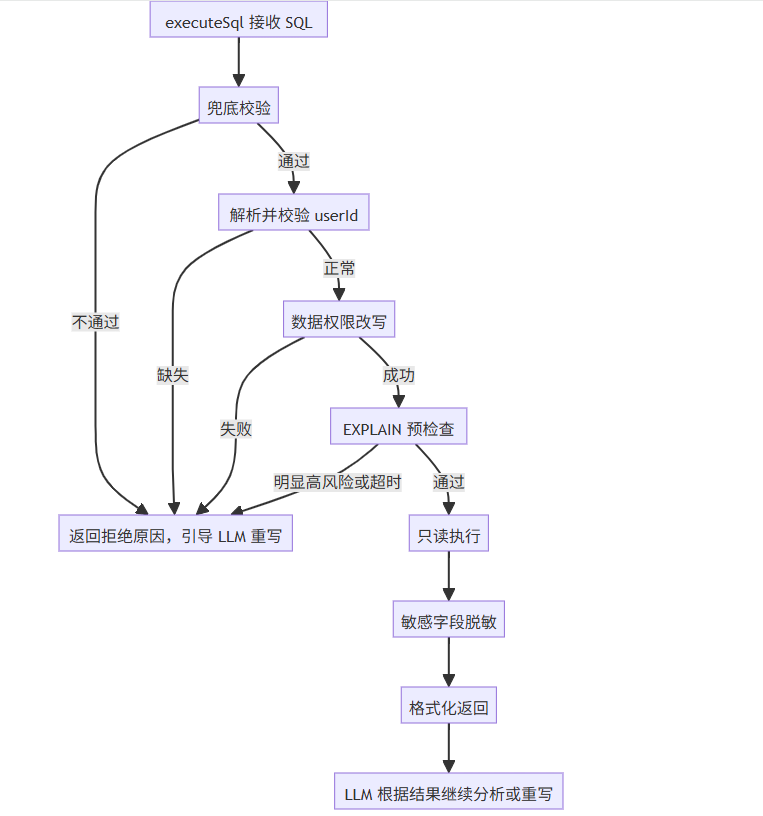
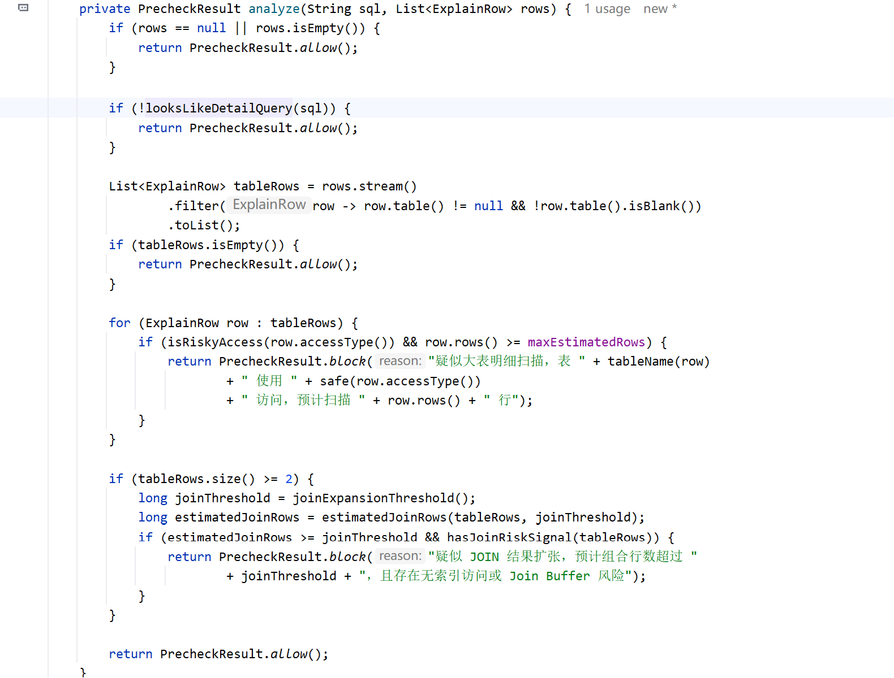
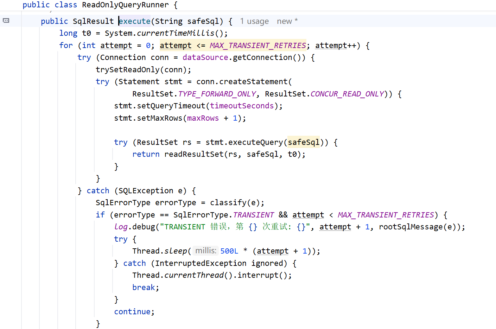
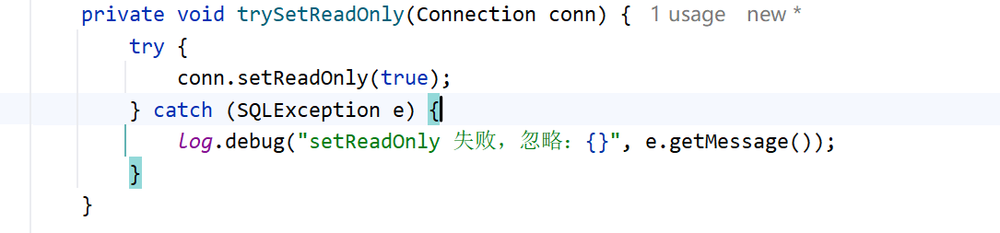

# ✅执行SQL的完整流程

校验通过之后，executeSql 拿到的是一条改好的安全 SQL。但真正执行时还有一些问题要解决：不同用户查同一句 SQL 看到的数据范围要不一样、敏感字段不能暴露给 LLM、执行出错时怎么把错误反馈给 LLM 让它改对、查出来的结果怎样呈现。

这一篇就把 executeSql 的完整流程拆开讲，看一条 SQL 从进 executeSql 到回到 LLM，中间到底经历哪些步骤。

完整流程

executeSql 内部不是简单的「接收 SQL → 执行 → 返回」，而是一条串了 6 步的完整流程，每一步解决一个独立问题：



简单过一遍这 6 步：

- **兜底校验**：把上一节讲过的 `SqlSafetyGuard` 在执行前再跑一遍
- **数据权限改写**：按当前用户的可见范围注入权限条件，不同用户查同一句 SQL 看到的数据范围不同
- **EXPLAIN 预检查**：真正执行前看数据库执行计划，提前拦截明显过重的大表明细扫描和 JOIN 扩张
- **只读执行**：用只读连接把 SQL 跑出来，带资源约束和错误分类
- **敏感字段脱敏**：命中脱敏列的结果替换成 `********`，LLM 看不到原文
- **格式化返回**：把结果拼成 markdown 给 LLM，失败或结果过多时带上改写建议

每一步都不能跳过。data-agent 是 ReAct 架构，不是写死的 workflow，Skill.md 里写的「先 validate 再 execute」只是引导，大模型完全可能跳过 validateSql 直接调 executeSql。所以 **executeSql 自己必须把校验、权限改写这些事再做一遍，不能依赖模型的自觉**。

下面把简单的几步直接讲清楚。数据权限改写和敏感字段脱敏的实现细节内容多，这篇只点一下做什么，分别留到后面展开。

executeSql 怎么获取 userId

讲完整流程之前，先解决一个前置问题：executeSql 的两个入参 `sql` 和 `userId`，sql 好理解是 LLM 写的，userId 哪来的？

**最直接的做法**是在 system prompt 里把当前登录用户的 userId 告诉 LLM，让它在工具调用参数里自己拼上。问题在于 userId 往往是一串长数字（比如雪花 id），LLM 传长 id 容易抄错位、漏一位、多一位，一旦传错，数据权限就跟着错，**所以这些系统参数就不应该依赖 LLM**。

dodo-agentx 的实际做法是借助 agentx 框架的 toolParams 注入机制。框架在调度工具调用时，会通过 `ToolCallExecutor.replaceToolParams` 把 `RunnableParams.toolParams` 里的真值合并进 LLM 生成的工具调用参数：

```java
// ToolCallExecutor.replaceToolParams（spring-ai-agentx-core）
for (Map.Entry<String, Object> entry : params.getToolParams().entrySet()) {
    if (accepted.contains(entry.getKey())) {
        args.put(entry.getKey(), entry.getValue());  // 不论 LLM 写啥都覆盖
    }
}
```

这个合并是**无条件覆盖**，三种情况都接得住：

- LLM 写 `"userId":"default"`：覆盖为真值
- LLM 漏掉 `userId`：增量补上（避免 LLM 偶发漏字段导致工具收到 null）
- LLM 乱填 `"userId":"xxx"`：同样覆盖

拦截判断：从工具的 `inputSchema` 读出合法参数名清单，只注入该工具真实声明的字段，避免给 MCP 严格校验的工具（比如 Tavily 用 Pydantic）塞多余字段导致报错。executeSql 自己还有一道兜底：如果收到的 userId 还是空或者 `default`，说明框架的替换机制异常（比如 RunnableParams 没正确传），**直接拒绝执行**并打 error 日志，不允许任何未带身份的 SQL 执行后续流程。

执行流程

兜底校验

这一步上一篇已经展开讲过，这里只看它在 executeSql 里的位置：`executeSql` 收到 SQL 后，第一步就是调用 `guard.validate(sql)`。不管 LLM 之前有没有主动调过 `validateSql`，执行层都会重新校验一次。

这层校验不仅保证 SQL 只读，也会控制查询形态。只要校验不通过，executeSql 就不会进入数据权限改写和数据库执行，而是把拒绝原因返回给 LLM，让它按原因重写 SQL。

executeSql 里再做一次而不是依赖 LLM 调 validateSql 的原因上面说过：**安全防护不能寄托在大模型的自觉上**。

数据权限改写

校验通过的安全 SQL 还不能直接跑，因为这条 SQL 是 LLM 按用户问题生成的，它不知道当前登录用户能看到哪些数据。直接跑就等于把全库数据都暴露给当前用户，权限体系形同虚设。

数据权限改写：**解析 SQL 的 AST，找出 FROM 和 JOIN 里出现的真实表，再按用户权限注入过滤条件**。普通 FROM 表和普通 JOIN 右表会把条件合并到 WHERE；如果受控表出现在 LEFT JOIN 右侧，条件会追加到 JOIN ON，避免把 LEFT JOIN 变成类似 INNER JOIN 的效果。规则按用户的数据范围决定：

- **ALL**：不注入，看全部
- **DEPT_AND_SUB**：注入 `dept_id IN (本部门及子部门 id 列表)`
- **DEPT**：注入 `dept_id IN (本部门 id 列表)`
- **SELF**：注入 `user_id = 当前用户 id`

改写过程出任何异常，**直接拒绝这条 SQL**，不让一条没经过权限过滤的查询跑到数据库。

这里有个关键问题：为什么要在 executeSql 这一层硬改 SQL，而不是让 LLM 根据用户权限自己生成对应的 SQL？原因就是 **LLM 不稳定，这次按权限写了，下次可能就忘。安全不能依赖模型，必须靠代码兜底**。后面会展开讲整套数据权限是怎么搭起来的，以及不同业务表的权限规则怎么扩展。

EXPLAIN 预检查

数据权限改写之后，executeSql 拿到的才是真正要执行的最终 SQL。这个时候会先跑一次普通 `EXPLAIN`，让数据库优化器生成执行计划，用它判断这条 SQL 是否明显过重。这一步解决的是静态校验看不到的问题：`SqlSafetyGuard` 能看出 SQL 有没有危险语法、JOIN 数是不是太多、有没有无条件 JOIN，但它不知道真实表里有多少数据。两个表 `LEFT JOIN` 看起来很简单，如果右侧子表很大，执行时也可能产生大量扫描或一对多扩张。

EXPLAIN 预检查只做保守拦截，不能太严苛：

- 小表全表扫描可以放行
- 没有走索引但预计行数很小可以放行
- `COUNT/SUM/AVG/GROUP BY` 这类聚合查询优先放行
- 明细查询里预计扫描行数过大才拦截
- JOIN 预计组合量过大，并且存在无索引访问或 Join Buffer 风险才拦截

配置项也只保留两个：

```yaml
data-agent:
  explain-precheck:
    timeout-seconds: 5
    max-estimated-rows: 100000
```

`timeout-seconds` 是 EXPLAIN 自己的超时时间。普通 EXPLAIN 不会真正执行查询结果，通常很快；如果连生成执行计划都超过 5 秒，说明这条 SQL 本身风险偏高，executeSql 会直接拦截，让 LLM 缩小范围或拆查询。

`max-estimated-rows` 是执行计划里的预计行数阈值。它不是结果行数，而是数据库预计要扫描或组合的数据量。比如明细查询里某张表预计扫描超过 10 万行，或者 JOIN 的预计组合量明显过大，就会被拦截。

代码里核心就是两步：先拿执行计划，再做保守判断。

```java
List<ExplainRow> rows = explain(finalSql);
PrecheckResult result = analyze(finalSql, rows);
```

`explain(finalSql)` 执行的是 `EXPLAIN`，代码只读取几个关键字段：`table`、`type`、`key`、`rows`、`Extra`。这些字段已经够判断风险：`rows` 看预计扫描量，`type/key` 看访问方式，`Extra` 里能看到 `Using join buffer` 这类 JOIN 风险信号。`analyze` 的判断规则保持克制：



这里的重点是先放过聚合查询。`COUNT/SUM/AVG/GROUP BY` 这类查询本来就可能扫表，只要返回结果小，就不在这一层强拦。只有明细查询才继续判断扫描行数和 JOIN 扩张。

异常处理分两类：EXPLAIN 超时会拦截，因为生成计划都慢，真实执行风险更高；非超时异常会放行，避免 EXPLAIN 自身兼容性问题影响 data-agent 可用性。拦截后会直接提示 LLM 改成聚合、主表分页、子表先聚合，或按主键二次钻取。

只读执行

这一步把改写后的 SQL 真正跑到数据库里，通过 `ReadOnlyQueryRunner.execute(sql)` 完成。核心代码把 JDBC 4 层约束、瞬态错误重试、错误分类都串在一起：





**JDBC 4 层约束**

写操作的硬拦截在校验阶段（只允许 SELECT），执行层不重复做，而是在 JDBC 层面叠了 4 道约束，主要防御资源耗尽和意外写入：

1. **只读提示** `trySetReadOnly(conn)`：向 JDBC 驱动声明这次连接只查数据。两个用途，读写分离路由（主从架构下，HikariCP 等连接池据此把只读连接路由到从库，减轻主库压力），和驱动层的轻量拦截（MySQL Connector/J 收到 hint 后会尝试挡掉非 SELECT 语句，但这个拦截有 bug，只看 SQL 头几个字符是不是 SELECT，连 WITH、前面带空格或注释的 SELECT 都会被误杀）。所以这是驱动提示而不是强制，代码里 `trySetReadOnly` 是 try-catch 失败就忽略，没当关键依赖。
2. **结果集不可更新** `TYPE_FORWARD_ONLY + CONCUR_READ_ONLY`：禁止通过 ResultSet 的 `updateXxx` 反向写回数据。
3. **查询超时** `stmt.setQueryTimeout(timeoutSeconds)`：默认 30 秒（配置项 `data-agent.safety.query-timeout-seconds`），防止慢查询和 `SLEEP()` 类攻击长时间占用连接。
4. **行数限制** `stmt.setMaxRows(maxRows + 1)`：在 JDBC 层再限制一次返回行数（默认 `maxRows=200`），和 SQL 里的 LIMIT 形成双保险。多取的那一行用来判断结果是不是被截断了。

**错误分类与重试**

SQL 执行失败不能简单抛个错给 LLM，要分类处理。先解释一个关键词：**TRANSIENT，瞬态错误**，指的是临时性、重试可能成功的错误，比如网络抖一下、连接被重置、数据库死锁被自动回滚。它的特点是再跑一次很可能就好了。与之相对的是永久性错误，比如表名写错、权限不够，重试多少次结果都一样。**区分这两类是后面所有处理逻辑的基础**。

`classify()` 根据 JDBC 返回的 SQLState 把错误分成四类：

| 类型 | 典型 SQLState | 处理方式 |
| --- | --- | --- |
| TRANSIENT（瞬态） | 08xxx 连接异常、40001 死锁 | 内部透明重试，不告诉 LLM |
| SCHEMA | 42S02 表不存在、42S22 列不存在 | 暴露给 LLM，建议查 describeTables |
| SYNTAX | 42000、42601 语法错误 | 暴露给 LLM 修语法 |
| FATAL | 28xxx 权限不足、SQLState 为 null | 告知 LLM 无法继续 |

这里最关键的设计是：**TRANSIENT 错误对 LLM 不可见**。连接抖一下、一次超时，这些重试一下就好，没必要污染 LLM 的上下文。executeSql 内部对 TRANSIENT 错误自动重试两次，LLM 完全无感。只有非 TRANSIENT 错误，或重试耗尽，才把错误回灌给 LLM，而且带上分类后的修复建议：SCHEMA 建议重新调 describeTables 确认字段名、SYNTAX 提示检查关键字和括号引号、FATAL 说明是权限或资源问题。每条返回都带着明确的**失败原因 + 下一步建议**，这是 ReAct 循环能自洽的关键：LLM 知道该去查 schema 还是改语法，重新调工具重写 SQL。如果只甩一个原始异常堆栈，LLM 往往不知道怎么修。

敏感字段脱敏

执行成功的结果集，在回到 LLM 之前要先过一遍敏感字段脱敏：命中脱敏配置的列（比如 `sys_user.password`、`user_profile.id_card`、`user_profile.home_address`），整列的值都替换成 `********`。

脱敏在结果回到 LLM 之前完成，LLM 看到的就是 ********，**对 LLM 完全不可见**。

这一层独立于数据权限改写：**权限改写解决的是「行级过滤」问题（你能看哪几行），脱敏解决的是「列级遮挡」问题（你能看的行里某些字段还是要挡住）**。两者各管各的，互不替代。具体怎么匹配列名、有哪些配置项和陷阱，后面会展开。

结果格式化

ResultSet 不建议直接塞给 LLM。executeSql 把这件事拆成两个方法：`readResultSet` 负责从 JDBC 结果集读出结构化数据，`format` 负责把它渲染成带引导提示的 markdown。**readResultSet 的截断检测**：JDBC 层已经设了 `setMaxRows(maxRows + 1)`，多允许一行。`readResultSet` 遍历 ResultSet 时利用这一点做截断检测：

```java
List<Map<String, Object>> rows = new ArrayList<>();
boolean truncated = false;
while (rs.next()) {
    if (rows.size() >= maxRows) {
        truncated = true;   // 读到了第 maxRows+1 行，说明结果被截断了
        break;
    }
    Map<String, Object> row = new LinkedHashMap<>(colCount);
    for (int i = 1; i <= colCount; i++) {
        row.put(columns.get(i - 1), normalizeValue(rs.getObject(i)));
    }
    rows.add(row);
}
```

读出来的每个值都过一遍 `normalizeValue`，把 JDBC 返回的对象转成 LLM 看得懂的格式：BigDecimal 去尾零（`100.00` 显示为 `100`），各种时间类型（LocalDate、LocalDateTime、sql.Date、sql.Timestamp）统一格式化成 ISO 字符串，byte[] 显示成 `[BLOB N bytes]` 占位符。不做这步，LLM 看到的就是 `java.sql.Timestamp@xxx` 这类对它毫无意义的 toString。最后把 columns、rows、rowCount、truncated 这些字段打包成 SqlResult 返回。

**format**

`ExecuteSqlTool的``format` 拿到 SqlResult 后分三条路走：

- **失败分支**：拼错误原因 + 执行的 SQL + 修复建议。把执行的 SQL 回显出来很关键，让 LLM 看到自己到底写了什么，配合上一步错误分类的修复建议（重新调 describeTables 确认字段），ReAct 循环才能自洽。
- **空结果分支**：返回 0 行不直接甩「无数据」，而是引导 LLM 可能是 WHERE 过严或 JOIN 关联键错，建议先 `SELECT COUNT(*)` 看真实命中量，或去掉部分条件重查。**空结果对 LLM 是个歧义场景，不给引导它容易反复试错**。
- **正常分支**：调 `renderTable` 渲染 markdown 表格，但**只渲染前 PREVIEW_ROWS=20 行**。行数超过 20 时拼上一段明确提示：剩余 N 行未展示，要全量用 LIMIT/OFFSET 分页重查，要做分析改写聚合 SQL（GROUP BY + SUM/COUNT/AVG），不要从预览行里手算总量或均值，否则一定算错。

小结

executeSql 的完整流程，贯穿一个原则：**关键步骤不能信任 LLM，安全必须靠代码兜底**。

- 校验不能寄托在 LLM 会主动调 validateSql 上，executeSql 自己再跑一遍
- 数据权限不能寄托在 LLM 会按用户范围生成 SQL 上，代码里统一做权限改写
- 查询计划不能寄托在 LLM 会主动避开大表 JOIN 上，EXPLAIN 预检查会提前拦截明显过重的明细扫描和 JOIN 扩张
- 资源约束不能寄托在 LLM 会写合理的 LIMIT 上，JDBC 层再叠一道
- 错误反馈不能甩原始堆栈，要带上修复建议，让 LLM 能自洽重写
- 结果格式不能直接塞 ResultSet，要归一化、截断、渲染成 markdown
- 大结果不能直接塞进上下文，要引导 Agent 走聚合、主表分页或按主键钻取

**每一层都不是多余的，每一层都假设上一层可能出错或被绕过**。这种层层兜底的设计，才是 data-agent 这种「ReAct 自主决策 + 关系型数据库」组合能跑在生产环境的前提。

---

来源: https://thoughts.aliyun.com/workspaces/6963289eb0fc2e001bb052eb/docs/6a61f0af74e4030001ec1fca
