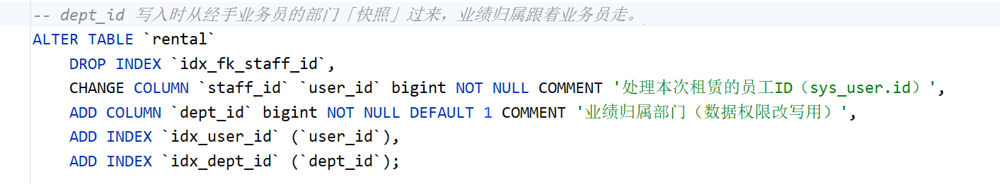
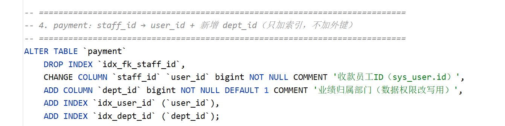
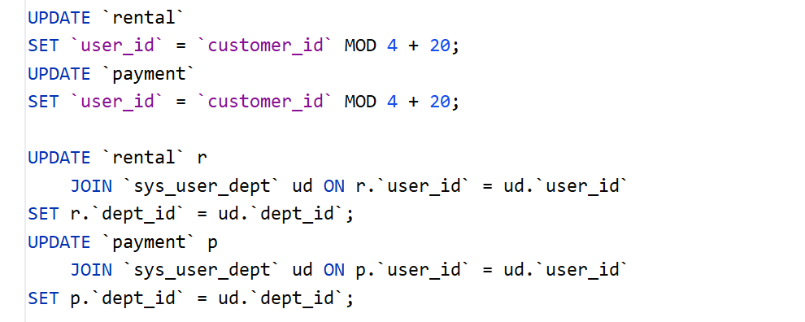

# ✅权限模型的改造

executeSql 要实现数据权限，得先搞清楚当前业务系统的用户、角色、部门关系，以及哪些业务表需要做数据权限过滤。

dodo-agentx 设计了一套比较简单易懂的用户角色部门体系，并对 sakila 加以改造，它原本没有这些概念，我们把业务数据和用户角色数据整合了起来。对各位来说，完全可以改为接入自己项目的业务数据库：一个完整的业务系统，用户角色权限和业务数据通常是已经关联好的，按本篇的思路替换表名和字段就行。

sakila 的改造

sakila 是 MySQL 官方的电影租赁示例库，业务表（customer / rental / payment / inventory / film 等）很完整，我们借来演示 Text2SQL。但它原本是**门店视角**：staff（店员）、store（门店）两张表互相外键，所有业务表都挂这俩上，**没有部门、没有层级**，演示不了企业内的数据权限。

改造的目标是把门店视角换成组织视角。**改造的SQL 在 ****`sql/old/upgrade_data_agent.sql`****，当前这个sql只是历史归档参考，不用执行他，****`init.sql`****已经包含了改造后的完整数据权限功能**。关键三步：

**第一，删 staff 和 store。** 先解除所有指向它们的外键，再 DROP 两张表。**sakila 自带的 7 个视图也一起删掉避免对LLM产生误导和干扰。**

**第二，rental（租赁） / payment（支付） 改 user_id + 加 dept_id。** 这就是业绩表，原来记"哪个店员经手"，改成"哪个员工经手 + 业绩归属哪个部门"：



payment 同样的改法：



customer 和 inventory 这种主数据直接 DROP 掉 store_id 列，不挂部门。


**第三，回填数据。** staff_id 改成 user_id 后值还是老的（1、2），得分配到我们新准备的几个业务员身上：



`customer_id MOD 4 + 20` 把业绩轮转分给四个销售员（user_id 20~23），演示效果均匀。dept_id 从业务员的部门抄过来。

另外加了一张 **user_profile** 表（身份证、住址、年龄等敏感字段），用于专门演示 SELF 数据权限。

权限系统表

权限系统五张表，对应 RBAC 标准模型：

```text
sys_user ─┬─ sys_user_role ─ sys_role
          └─ sys_user_dept ─ sys_dept
```

**sys_user**：业务字段极简，注意没有 dept_id 字段，部门走关联表。

**sys_role**：关键字段是 `data_scope`，定义角色能看到多大范围：

- **ALL**：全库可见（admin）
- **DEPT_AND_SUB**：本部门及子部门（主管）
- **DEPT**：仅本部门（分析员）
- **SELF**：仅本人（普通员工）

data_scope 写在角色上而不是用户上，是因为用户可以多角色，实际数据范围取所有角色里的"最大"。

**sys_dept**：树形结构，用 `ancestors` 字段缓存从根到父节点的完整路径。比如"上海销售部"的 ancestors 是 `0,100,201,210`（根 → 集团 → 华东 → 上海分公司）。好处是**查子树一次 LIKE 搞定**：

```sql
SELECT * FROM sys_dept WHERE ancestors LIKE '0,100,201,210,%';
```

代价是部门移动时要重写所有子节点的 ancestors，但部门结构变动很少，值得。

**sys_user_role 和 sys_user_dept**：两张纯关联表，联合主键。**sys_user_dept 是多对多关系**，这点关键，一个用户可以挂多个部门，**支持跨部门兼职**。比把 dept_id 写在 sys_user 上灵活得多，单值字段表达不了跨部门。

预置数据

预置数据的核心目标：**每条数据都能够覆盖一种典型的数据权限场景，方便快速验证权限模型是否正确。**

部门结构

构造 **27 个部门、4 级组织树**：

```text
豆豆科技集团
├── 总部
├── 华东大区
│   ├── 上海子公司
│   │   ├── 上海销售部
│   │   └── 上海售后部
│   └── ...
└── 华南大区
    ├── 广州子公司
    └── ...
```

设计 4 级层级的原因：

- `DEPT_AND_SUB`（本部门及子部门）必须依赖上下级组织关系才能体现效果。
- 如果只有 2 级部门，`DEPT_AND_SUB` 和 `DEPT` 查询范围容易重叠，无法有效验证权限差异。
- 多级组织可以覆盖集团 → 大区 → 子公司 → 具体业务部门的真实企业场景。

角色与权限范围

设计 4 个角色，与 4 种数据权限范围一一对应：

| 角色 | scope | 权限范围 | 演示效果 |
| --- | --- | --- | --- |
| admin | ALL | 全部数据 | 超级管理员查看所有业务数据 |
| manager | DEPT_AND_SUB | 本部门及子部门 | 查看整个部门及子部门的数据 |
| analyst | DEPT | 当前部门 | 只能查看所属部门数据 |
| employee | SELF | 仅本人 | 只能查看自己的业务数据 |

切换不同角色即可直观看到数据范围变化。

用户场景

设计 11 个测试用户，覆盖所有典型权限场景：

| 用户 | 角色 | 部门 | scope | 演示场景 |
| --- | --- | --- | --- | --- |
| admin | admin | 集团(100) | ALL | 超级管理员查看全部数据 |
| mgr_test | manager | 华东(201) | DEPT_AND_SUB | 查看华东及下属所有部门数据 |
| analyst_test | analyst | 上海销售(211) | DEPT | 只能查看上海销售部门数据 |
| sh_sales 等 4 个用户 | employee | 各销售部门 | SELF | 普通员工只能查看自己的数据 |
| cross_analyst | analyst | 上海销售(211)、杭州销售(221) | DEPT | 验证多部门用户权限 |

跨部门验证：cross_analyst

`cross_analyst` 是专门用于验证多部门权限的测试用户。该用户在 `sys_user_dept` 关系表中存在两条记录：

```text
user_id -> dept_id
cross_analyst -> 211
cross_analyst -> 221
```

查询业务数据时，如果权限计算逻辑存在问题，例如：

- 只读取用户第一个部门；
- 忽略多部门关联；
- SQL 条件只拼接单个 dept_id；

则 `cross_analyst` 会出现数据缺失，可以快速发现权限实现问题。

sa-token登录与身份获取

数据模型立起来了，还得让用户能登录、让后端能识别"当前是谁"。dodo-agentx 用 **sa-token**，轻量级的 Java 权限认证框架。

登录入口

AuthServiceImpl.login 流程是：查用户 → 校验密码 → 校验状态 → 调 sa-token 登录：

```java
StpUtil.login(user.getId());
```

`StpUtil.login(userId)` 是 sa-token 的核心 API，调用后生成 token（默认 UUID），写 Cookie 或返回前端塞 header。前端后续请求带上这个 token，sa-token 就能识别出当前用户。

路由拦截

SaTokenConfig 注册了一个全局拦截器 SaInterceptor，做两件事：

- **全局登录校验**：所有接口默认要登录，例外的是登录接口本身、根路径、静态资源
- **角色强制**：`/sys/**`（用户/部门/角色管理）和 `/api/skills/**`（技能管理）必须 admin 角色

```java
SaRouter.match("/**")
        .notMatch("/auth/login")
        .notMatch("/")
        .notMatch("/druid/**")
        .check(r -> {
            if (isStaticResource()) return;
            StpUtil.checkLogin();
        });
SaRouter.match("/sys/**").check(r -> StpUtil.checkRole("admin"));
```

executeSql 工具如何获取 userId

业务代码里拿 userId 很简单，直接 `StpUtil.getLoginIdAsLong()` 就拿到。但这里有个关键陷阱：agentx 框架工具调用时，会切到别的线程跑。sa-token 的上下文是绑在原始 HTTP 请求线程上的，线程一换就拿不到。executeSql 在新线程里调 `StpUtil.getLoginIdAsLong()`，要么返回 null，要么直接抛异常。

正确做法是分两步：

**第一步：Controller 在 HTTP 线程里取 userId 并冻结进 RunnableParams**

```java
// AgentController.stream()
Long userId = authService.getCurrentUserIdOrNull();   // HTTP 线程，sa-token 能拿到
RunnableParams params = RunnableParams.builder()
        .conversationId(convId)
        .userId(userIdStr)                             // userId 跟着 params 走完整生命周期
        .addParam("userId", userIdStr)
        .addToolParam("userId", userIdStr)             // 关键：声明工具参数 userId 的真实值
        .build();
return dodoAgent.streamForResult(query, params, ...);
```

**第二步：executeSql 从工具参数中拿到真实 userId**

executeSql 的工具签名里 userId 是一个普通参数，LLM 看到的提示词中固定是 `default` 占位符。LLM 调用 executeSql 时，不管它传什么 userId（可能照抄 default、可能自己编一个数字、甚至漏掉这个字段），agentx 框架的 `ToolCallExecutor.replaceToolParams` 在真正调用工具前，会用 RunnableParams 里 `addToolParam` 预设的值**强制覆盖**。

这个机制的核心价值：**框架主动替换关键参数，保证 LLM 不会拼错或乱填**。像 userId 这种敏感字段，绝不能让 LLM 决定值。LLM 可能照抄 default、可能漏字段、可能编一个不存在的 ID。replaceToolParams 不论 LLM 传什么，都按 RunnableParams 预设的真实值覆盖。这层防御让 executeSql 拿到的 userId 是可信的。

所以 sa-token 的职责边界就是：**只在 HTTP 请求入口负责认证取 userId，进到工具调用链路后就退场**。

小结

到这里，数据权限依赖的基础模型已经准备完成，主要包含两部分：

**1. 数据库层改造**

- 将 sakila 从原本的门店模型改造成企业组织模型：
- `rental/payment` 增加 `user_id + dept_id`，关联业务数据归属；
- `sys_user/sys_role/sys_dept` 等五张权限表，实现简单标准的 RBAC 模型；
- `sys_user_dept` 使用多对多关系，支持跨部门用户；
- `sys_dept.ancestors` 缓存组织路径，方便快速查询部门及子部门数据。

**2. 用户身份获取**

- Controller 在 HTTP 请求入口通过 sa-token 取当前登录用户 `user_id`；
- `user_id` 注入 `RunnableParams`，跟着流式生命周期传递；
- executeSql 等工具在跨线程的流式执行中从 `RunnableParams` 拿 `user_id`，不直接依赖 sa-token；
- 数据权限模块根据 `user_id` 查询用户角色、部门范围，动态生成 SQL 条件做权限过滤。

后续的数据权限实现，都是建立在这套用户、角色、部门模型以及 `RunnableParams` 里的 `user_id` 基础之上。

---

来源: https://thoughts.aliyun.com/workspaces/6963289eb0fc2e001bb052eb/docs/6a61f105c71a89000182930d
