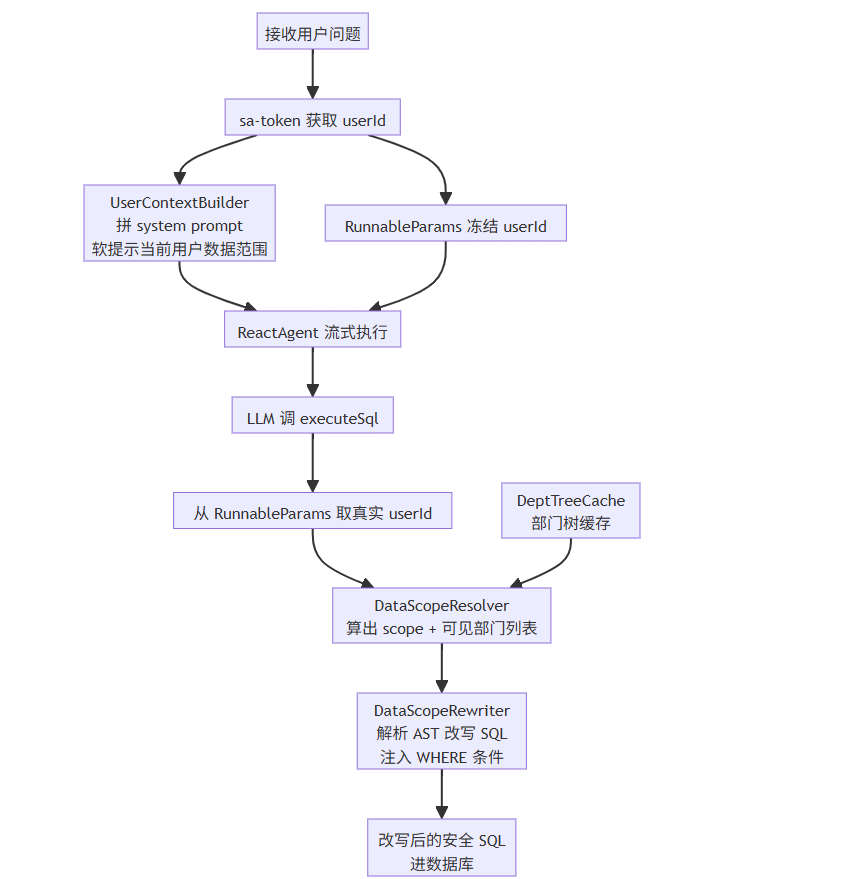
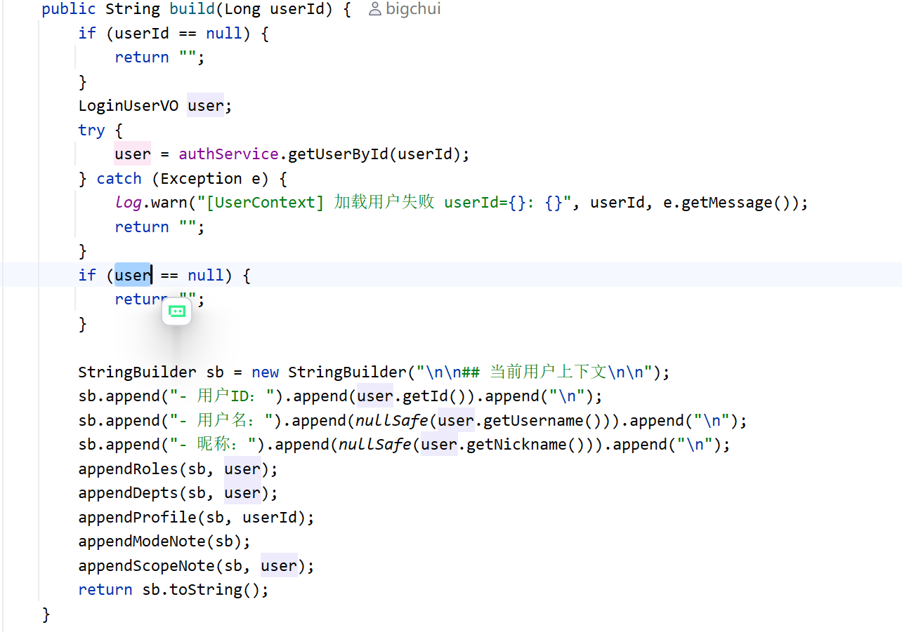
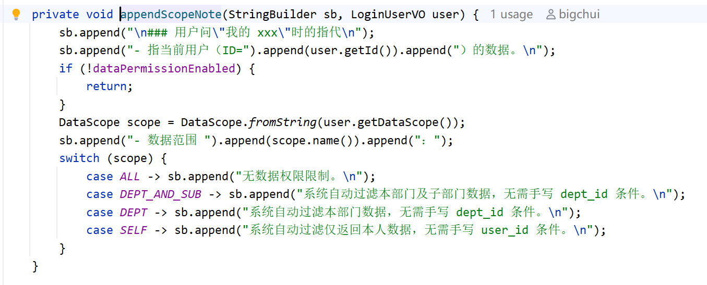
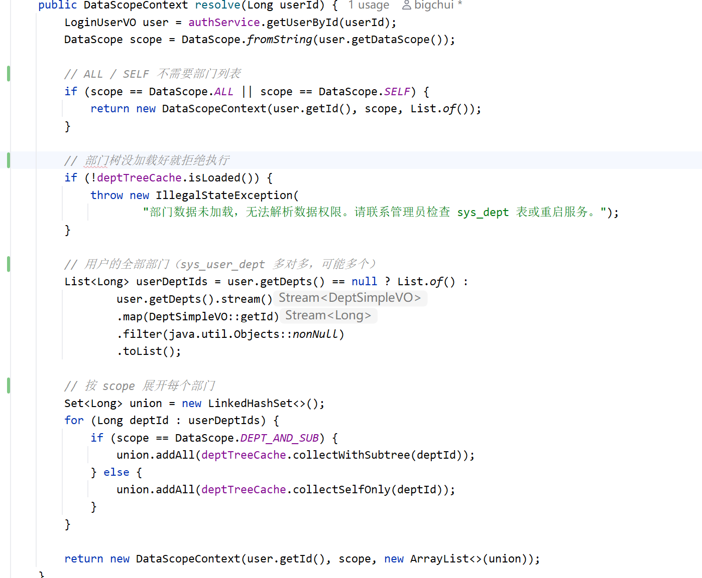
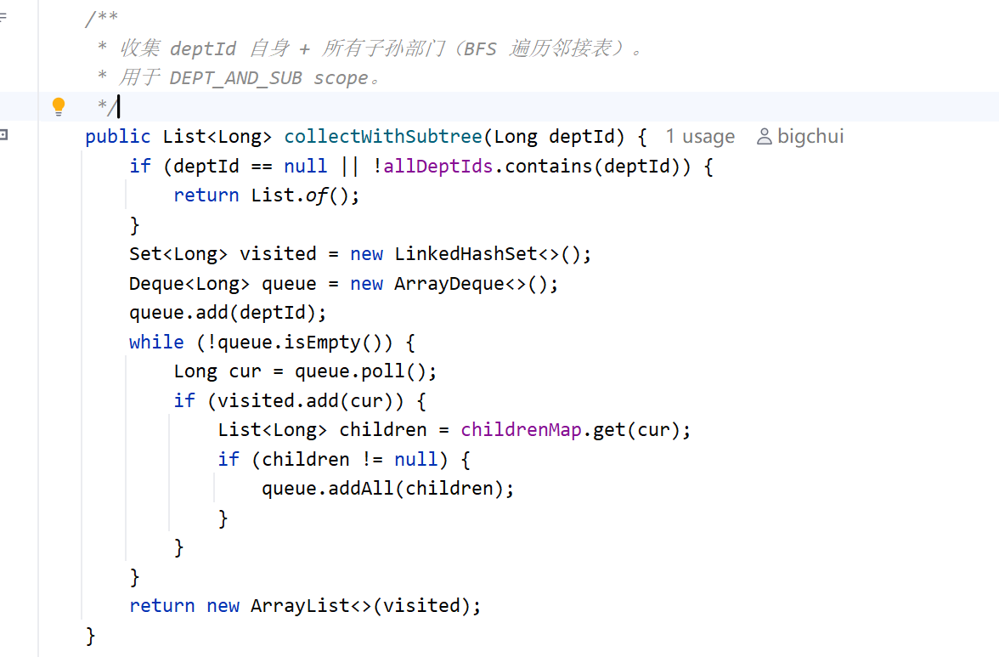
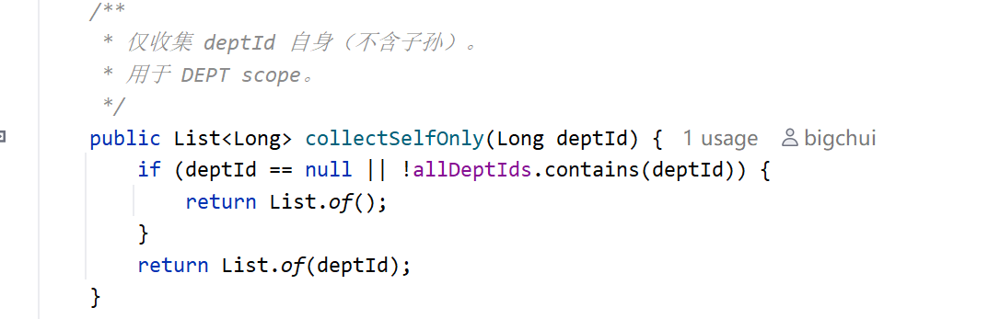

# ✅如何计算数据权限？

依赖 agentx 框架的 RunnableParams 功能，executeSql 工具可以方便地拿到真实准确的 userId。接下来就是怎么基于这个 userId 做数据权限，也就是如何把LLM生成的SQL，拼接上一段 WHERE 条件。

整体链路

数据权限的完整链路，几个角色串起来：



从接收用户问题到 SQL 进数据库，整条链路按时间顺序串起来：

**前半段：请求准备**

- sa-token 在 HTTP 线程拿到 userId
- UserContextBuilder 拿 userId 拼一段 system prompt，软提示 LLM 当前用户的数据范围
- 同时 RunnableParams 把 userId 冻结，跨线程安全传递
- ReactAgent 开始流式执行

**后半段：SQL 改写**

- LLM 生成 SQL，调 executeSql
- executeSql 从 RunnableParams 取出真实 userId
- DataScopeResolver 拿 userId 算出 scope + 可见部门列表（DeptTreeCache 辅助算子树）
- DataScopeRewriter 解析 SQL 的 AST，往 WHERE 注入权限条件
- 改写后的安全 SQL 进数据库

整套链路一个关键原则：**出任何异常，直接拒绝这条 SQL，不让没经过权限过滤的查询跑到数据库**。

UserContextBuilder：告诉 LLM 当前是谁

讲改写之前，先讲一个看似不相关但很重要的角色。UserContextBuilder 拼装一段 markdown 塞进 system prompt，告诉 LLM 当前登录用户是谁、有哪些角色、挂在哪个部门、数据范围是什么：





关键是 `appendScopeNote` 这段，它把当前用户的数据范围翻译成自然语言告诉 LLM：

- ALL：无数据权限限制
- DEPT_AND_SUB：系统自动过滤本部门及子部门数据，无需手写 dept_id 条件
- DEPT：系统自动过滤本部门数据，无需手写 dept_id 条件
- SELF：系统自动过滤仅返回本人数据，无需手写 user_id 条件

**这是提示，不是约束**。LLM 看了这段，会知道自己不用在 SQL 里手写 `dept_id = xxx`（写了也会被代码硬覆盖），避免它在 WHERE 里塞一些自以为是的权限条件污染查询。但真正的权限边界不靠它，靠代码层。LLM 即使完全无视这段提示，自己写了个没有 dept_id 条件的 SQL，DataScopeRewriter 也会硬给它注入。

当然这边展示的用户信息，也需要做数据脱敏，一些敏感字段不应该从system prompt中暴露出去。

DataScopeResolver：算出能看哪些部门

DataScopeResolver 的输入是 userId，输出是 DataScopeContext（scope + 可见部门 ID 列表）：



几个关键点：

- **scope 来自角色的最大值**：前面讲过，用户多角色时取所有角色里最宽松的 scope（admin 的 ALL > manager 的 DEPT_AND_SUB > analyst 的 DEPT > employee 的 SELF）
- **ALL 和 SELF 直接短路**：ALL 看全部不用算部门，SELF 只按 user_id 过滤也不用算部门，都不需要走部门树
- **DEPT_AND_SUB 和 DEPT 才需要展开**：遍历用户挂的所有部门（多对多），按 scope 决定要不要带子孙，最后去重 union 成一个列表
- **部门树没加载就抛异常**：拿不到部门数据宁可拒绝执行，也不能放行未过滤的查询

DeptTreeCache：部门树

DataScopeResolver 算子树靠 DeptTreeCache。dodo-agentx 的实现很简单，启动时把 sys_dept 全表加载到内存的邻接表里（演示项目只有 27 个部门，数据量小）。如果真实业务部门规模上万，建议改成 Redis 存储，这里就不展开了。

重点是**怎么算部门树**，邻接表的结构是 `parentId → 子部门 ID 列表`：

```java
private volatile Map<Long, List<Long>> childrenMap;
```

DataScopeResolver 会根据 scope 调两个方法：





`collectWithSubtree` 是一个标准的 **BFS（广度优先搜索）**，从 deptId 出发，一层一层往下扩，先把直接子部门全部入队，再处理下一层，直到没有新节点为止，最终把自己和所有子孙都收集起来。`collectSelfOnly` 更简单，只返回自己。缓存没加载好时，DataScopeResolver 检测到 `!isLoaded()` 直接抛异常拒绝执行，绝不放行未过滤的查询。

小结

这一篇讲了如何去计算数据权限：

- sa-token 在 HTTP 线程拿到 userId，UserContextBuilder 同时把它翻译成自然语言塞进 system prompt，**软提示** LLM 不要手写权限条件
- DataScopeResolver 拿 userId 算出 scope（ALL / DEPT_AND_SUB / DEPT / SELF）和可见部门列表，多角色取最宽松的 max scope
- DeptTreeCache 用邻接表 + BFS 算子树，缓存没加载好直接拒绝执行

软提示让 LLM 配合写出干净的 SQL，但真正的边界不靠它。算出来的 DataScopeContext 怎么用？怎么把它变成 SQL 里的 WHERE 条件硬注入进去？这就是下一节 **DataScopeRewriter** 要讲的内容：如何改写 SQL。

---

来源: https://thoughts.aliyun.com/workspaces/6963289eb0fc2e001bb052eb/docs/6a61f15774e4030001ec2023
