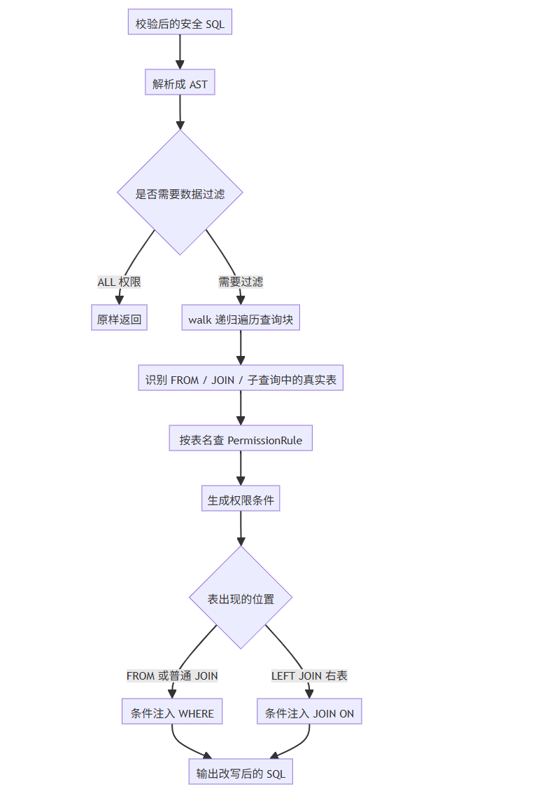
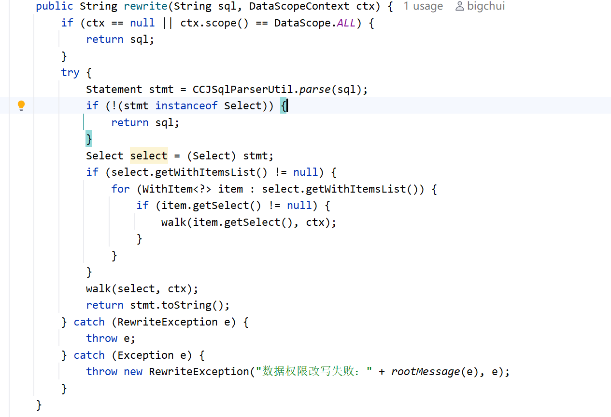
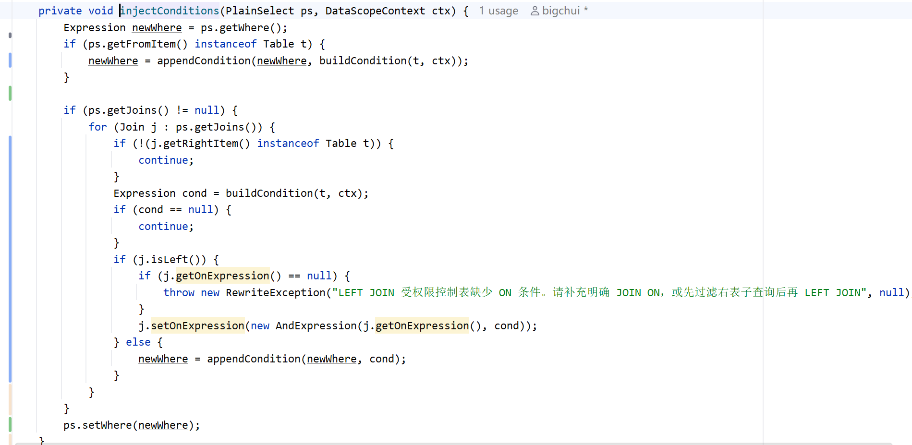
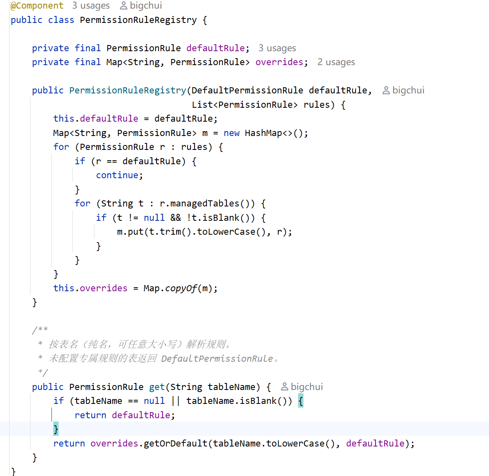
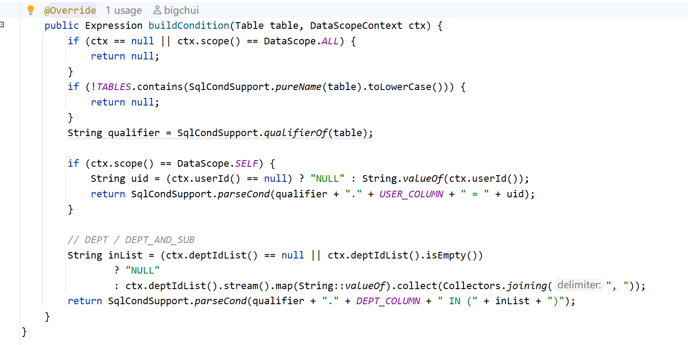
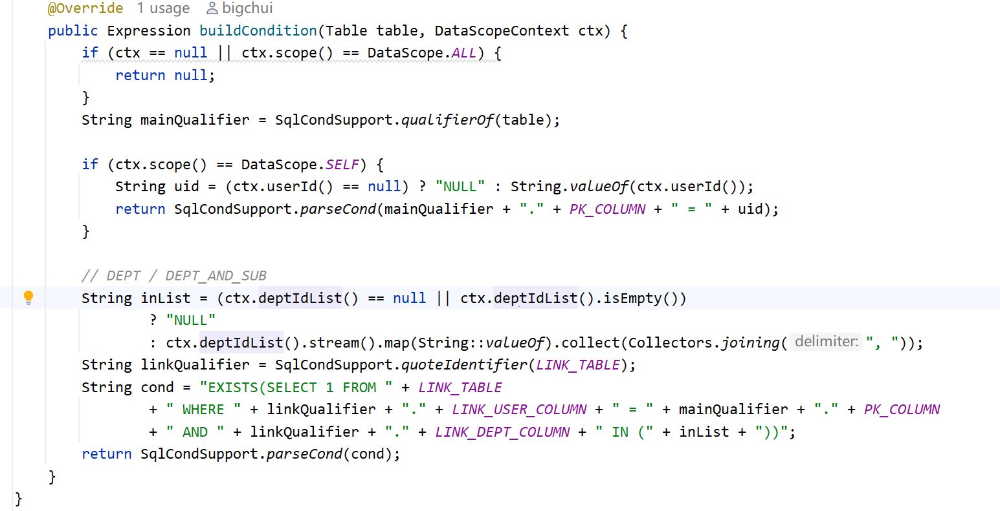
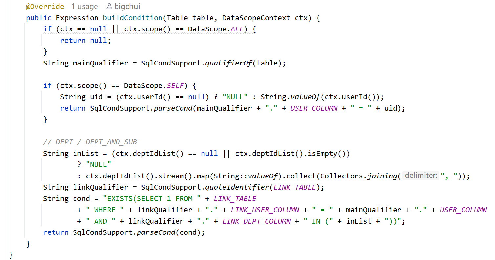

# ✅如何改写数据权限？

算出了 DataScopeContext（scope + 可见部门列表），这一节讲怎么用它来改写 SQL，把权限条件注入到 SQL 里。

整体流程



核心三步：解析 SQL 成 AST → 递归遍历找真实表 → 对每张表按规则生成权限条件，并根据表所在位置注入到 WHERE 或 JOIN ON。

rewrite：入口



ALL 直接原样返回，非 SELECT 语句也不处理。只有需要过滤的 SELECT 才走 walk。解析或改写出任何异常，直接抛 RewriteException，不让没经过过滤的 SQL 放行。

为什么不直接拼接 SQL

最直观的做法是字符串拼接——给原 SQL 末尾追加一段条件就行了：

```sql
SELECT * FROM rental WHERE status = 1
-- 拼接后
SELECT * FROM rental WHERE status = 1 AND dept_id IN (1, 2, 3)
```

简单情况没问题，但稍一复杂就出事。

**运算符优先级陷阱**。假设原 SQL 里有 OR：

```sql
SELECT * FROM rental WHERE status = 1 OR amount > 100
```

直接在末尾追加 AND 条件：

```sql
SELECT * FROM rental WHERE status = 1 OR amount > 100 AND dept_id IN (1, 2, 3)
```

因为 AND 优先级高于 OR，实际执行的是 `status = 1 OR (amount > 100 AND dept_id IN (...))`——只要 status = 1，不管哪个部门的数据都能查到，权限条件被 OR 短路了，数据直接泄漏。

**子查询和 JOIN 搞不定**。一个 SQL 里可能有多张表、多层子查询，每张表都要注入各自的权限条件：

```sql
SELECT * FROM rental r JOIN payment p ON r.id = p.rental_id
WHERE r.customer_id IN (SELECT customer_id FROM customer WHERE active = 1)
```

这里 rental、payment、customer 三张表各自需要过滤，还得带表别名（`r.dept_id`、`p.dept_id`）。字符串拼接分不清哪张表在哪，更处理不了子查询里面嵌的表。

**AST 怎么解决**：JSqlParser 把 SQL 解析成一棵结构化的树，每个查询块、每张表、每个 JOIN 都是独立的节点。DataScopeRewriter 遍历这棵树，精确定位每张表，把权限条件以 AST 节点的形式注入进去。普通条件会 AND 到 WHERE，LEFT JOIN 右表的条件会 AND 到 JOIN ON。节点拼接会自动保留语法结构，不会像字符串拼接那样破坏原 SQL 的语义，也能递归到子查询和 JOIN 里的每张表。这也是业界做 SQL 权限改写的主流方式：MyBatis-Plus 的数据权限插件、ShardingSphere 的权限模块，底层都是解析 AST 再改写，而不是简单的拼字符串。

walk：递归遍历 AST

JSqlParser 把 SQL 解析成一棵 **AST（抽象语法树）**，就是把 SQL 文本拆成一个个节点，按嵌套关系组成树。比如这条简单 SQL：

```sql
SELECT * FROM rental WHERE status = 1
```

它的 AST 长这样：

```text
PlainSelect
├── selectItems: [*]
├── fromItem: Table(rental)
└── where: status = 1
```

复杂一点的，带 JOIN 和子查询：

```sql
SELECT r.* FROM rental r
JOIN payment p ON r.id = p.rental_id
WHERE r.customer_id IN (
    SELECT customer_id FROM customer WHERE active = 1
)
```

AST 变成：

```text
PlainSelect                              ← 外层查询块
├── fromItem: Table(rental, alias=r)
├── joins: [Join(Table(payment, alias=p))]
└── where: InExpression
    └── ParenthesedSelect                ← 被括号包裹的子查询 (SELECT ...)
        └── PlainSelect                  ← 内层查询块
            ├── fromItem: Table(customer)
            └── where: active = 1
```

子查询在 AST 里就是一个嵌套分支。walk 的工作就是**递归走这棵树**，每遇到一个 PlainSelect（查询块）就注入条件，遇到子查询就钻进去继续注入：

```java
private void walk(Select select, DataScopeContext ctx) {
    if (select instanceof PlainSelect ps) {
        // 最常见的普通查询：SELECT ... FROM ... WHERE ...
		// ① 给当前查询块的每张表注入条件
        injectConditions(ps, ctx);      
		// ② FROM/JOIN 里如果是子查询，钻进去
        walkFromItem(ps.getFromItem(), ctx);       
        for (Join j : ps.getJoins()) {
			//    JOIN 右侧也可能是子查询
            walkFromItem(j.getRightItem(), ctx);   
        }
		// ③ WHERE 里如果嵌了子查询，也钻进去
        rewriteSubSelectsInWhere(ps.getWhere(), ctx); 
    } else if (select instanceof SetOperationList sol) {
        // UNION：多个 SELECT 用 UNION 连接
		//    每个分支都是独立的查询块，各自注入
        for (Select branch : sol.getSelects()) {    
            walk(branch, ctx);
        }
    } else if (select instanceof ParenthesedSelect ps) {
        // 被括号包裹的子查询：(SELECT ...)，剥开括号还是个 Select
		//    继续往里走
        walk(ps.getSelect(), ctx);           
    }
}
```

对照前面的 AST 例子看：walk 先给外层 PlainSelect 注入条件，然后发现 WHERE 里嵌了一个子查询，`rewriteSubSelectsInWhere` 钻进去，内层 PlainSelect 也注入条件。

**简单来说：FROM 后面的子查询走 walkFromItem，WHERE 里面的子查询走 rewriteSubSelectsInWhere，各管各的位置。不管 SQL 怎么嵌套，walk 都会递归到底，每个查询块都注入，一个都逃不掉。**

injectConditions：对每张表注入条件

walk 遇到 PlainSelect 就调 injectConditions，这是 Rewriter 和 Rule 的衔接点：



injectConditions 会处理当前查询块里的真实表：FROM 主表、JOIN 右表都会按表名查 Registry 拿规则，再调用规则生成权限条件。区别在于，条件最终注入的位置不完全一样：

- **FROM 主表**：权限条件合并到 WHERE。
- **普通 JOIN 右表**：权限条件也合并到 WHERE。
- **LEFT JOIN 右表**：权限条件追加到 JOIN ON。

这样设计是为了保留 SQL 原本的关联语义。普通 JOIN 本身要求两边都匹配，条件加到 WHERE 没问题；LEFT JOIN 则强调左表数据要保留，右表只是补充信息，所以右表的权限条件不能简单放到 WHERE。

LEFT JOIN 为什么要特殊处理

LEFT JOIN 的含义是：左表记录必须保留，右表有匹配数据就补上，没有匹配数据就补 NULL。比如：

```sql
SELECT u.id, u.username, p.amount
FROM sys_user u
LEFT JOIN payment p ON p.user_id = u.id
```

这条 SQL 表达的是：用户要保留，付款记录只是补充信息。如果把 payment 的权限条件放到 WHERE：

```sql
WHERE p.dept_id IN (1, 2, 3)
```

那些没有付款记录的用户，`p.dept_id` 是 NULL，条件不成立，就会被过滤掉。这样一来，LEFT JOIN 就被改成了类似 INNER JOIN 的效果，查询能执行成功，但结果会悄悄变少。

正确做法是把右表的权限条件放到 JOIN ON 里：

```sql
SELECT u.id, u.username, p.amount
FROM sys_user u
LEFT JOIN payment p
  ON p.user_id = u.id
 AND p.dept_id IN (1, 2, 3)
```

这样左表用户仍然保留，只有符合权限的付款记录才会被关联进来。没有付款记录，或者付款记录不在权限范围内，右表字段就是 NULL，但左表行不会被误删。

所以 DataScopeRewriter 的规则是：**普通表条件进 WHERE，LEFT JOIN 右表条件进 ON**。这是为了能够保证权限过滤不破坏原本的 JOIN 语义。

为什么需要不同的过滤规则

如果所有表都用同一套字段过滤，injectConditions 里写死就行了。但现实是**不同表的权限字段不一样**：

- **rental / payment**：有 `dept_id` 和 `user_id`，直接 `dept_id IN (...)` 或 `user_id = ?`
- **sys_user**：主键是 `id` 不是 `user_id`，部门权限要关联 sys_user_dept 中间表
- **user_profile**：有 `user_id` 但没 `dept_id`，部门权限也得关联中间表

如果把三套逻辑都塞进 injectConditions，没法扩展。所以抽出一个 PermissionRule 接口，每张表（**或每类表，也就是权限字段一样的**）配一个规则，injectConditions 只管调规则，不关心具体怎么生成条件。

**相同逻辑的表可以合并**。rental 和 payment 权限字段完全一样，共用 DefaultPermissionRule 就行，不用各写一个。换到真实业务也一样：所有"有 dept_id 的业务表"共用一条规则，只有字段特殊的表才单独写。

PermissionRule：为单张表生成条件

PermissionRule 是策略接口，每个实现类负责一组表的权限条件生成：

```java
public interface PermissionRule {
	// 我管哪几张表
    Set<String> managedTables();                          
	// 怎么生成条件          
    Expression buildCondition(Table table, DataScopeContext ctx);   
}
```

两个方法职责很清楚：

- **managedTables**：返回这个规则接管的表名集合（小写纯名）。rental 和 payment 字段一样，所以 DefaultPermissionRule 返回 `Set.of("payment", "rental")`，一个规则管两张表
- **buildCondition**：拿到 AST 中的 Table 节点（含表名、别名等信息）和 DataScopeContext（userId、scope、可见部门列表），返回一个 JSqlParser 的 Expression 对象。返回 null 表示这张表不需要过滤

返回的是 Expression（AST 节点）而不是字符串，因为注入到 WHERE 或 JOIN ON 的都必须是节点——JSqlParser 最终把整棵 AST 序列化成 SQL，条件以节点形式存在才能正确拼接。

PermissionRuleRegistry：表名到规则的路由



启动时 Spring 把所有 PermissionRule 实例注入进来，Registry 按 `managedTables()` 建一张"表名 → 规则"的路由表（overrides）。查询时按表名精确匹配，没配专属规则的表走 DefaultPermissionRule 兜底。

这样设计的好处：injectConditions 不需要知道有哪些规则、每张表该用哪个，它只管问 Registry 要。新增一张表，写一个 Rule 注册进去就行，Rewriter 一行都不用改。

三个规则

目前内置了 3 种规则，本质上对应的是 3
类不同的数据表。分类逻辑很简单：权限字段一致的表，可以复用同一套规则，权限字段不一致的表，就需要单独写规则，否则生成出来的权限条件就无法正确落到 SQL 里。

DefaultPermissionRule（rental / payment）

标准业务表，同时有 `dept_id` 和 `user_id` 字段，逻辑最简单：



两个关键点：

- **qualifierOf**：取表在 SQL 中的限定名，别名优先。如果 SQL 写了 `FROM rental r`，qualifier 是 `r`；没写别名就是 `rental`。注入的条件是 `r.dept_id IN (...)` 而不是 `rental.dept_id IN (...)`，避免 JOIN 多表时字段歧义
- **parseCond**：把字符串拼成的条件解析成 JSqlParser 的 Expression 节点。规则内部用字符串拼条件最直观，parseCond 负责转换成 AST 节点

最终注入效果，假设 SQL 是 `SELECT * FROM rental r WHERE r.status = 1`，DEPT_AND_SUB 用户可见部门为 [1, 2, 3]：

```sql
SELECT * FROM rental r
WHERE r.status = 1 AND r.dept_id IN (1, 2, 3)
```

SysUserPermissionRule（sys_user）

sys_user 表有两个特殊之处：主键是 `id` 不是 `user_id`，而且它自己就是用户表，部门关系存在 sys_user_dept 中间表里，自身没有 `dept_id` 字段。



- SELF：`sys_user.id = ?`（用自己的主键定位本人）
- DEPT / DEPT_AND_SUB：得关联 sys_user_dept 中间表才能按部门过滤

```sql
-- DEPT_AND_SUB 生成的条件
EXISTS(SELECT 1 FROM sys_user_dept
  WHERE sys_user_dept.user_id = sys_user.id
  AND sys_user_dept.dept_id IN (1, 2, 3))
```

为什么用 EXISTS 而不是 JOIN？因为 JOIN 会改结果集行数，一个用户挂多个部门，JOIN 出来变多行，而 EXISTS 只判断"有没有"，不改变行数。

UserProfilePermissionRule（user_profile）

user_profile 有 `user_id` 但没有 `dept_id`，和 sys_user 类似，部门权限也得关中间表：



```sql
-- DEPT_AND_SUB 生成的条件
EXISTS(SELECT 1 FROM sys_user_dept
  WHERE sys_user_dept.user_id = user_profile.user_id
  AND sys_user_dept.dept_id IN (1, 2, 3))
```

和 SysUserPermissionRule 的唯一区别是关联字段不同：sys_user 用主键 `id` 关，user_profile 用 `user_id` 关。

三个规则的差异就在**用什么字段定位用户、用什么方式关部门**。以后新增一张表，只需要写一个 Rule 注册进去，核心改写逻辑一行都不用动。

小结

DataScopeRewriter 的流程就是：解析 SQL 成 AST → walk 递归遍历每个查询块 → 对每张表查规则生成权限条件 → 按表所在位置注入 WHERE 或 JOIN ON。

- **walk 的递归保证完整性**：JOIN、子查询、UNION、CTE 都逃不掉
- **注入位置保证语义正确**：FROM 表和普通 JOIN 右表进 WHERE，LEFT JOIN 右表进 ON，避免权限条件破坏 LEFT JOIN 语义
- **PermissionRule 保证扩展性**：不同表字段名不一样，用规则差异化处理，相同逻辑的表合并
- **PermissionRuleRegistry 保证解耦**：Rewriter 不关心具体规则，只管查 Registry 拿规则调 buildCondition 生成条件即可

---

来源: https://thoughts.aliyun.com/workspaces/6963289eb0fc2e001bb052eb/docs/6a61f18cd31fed0001cf178a
