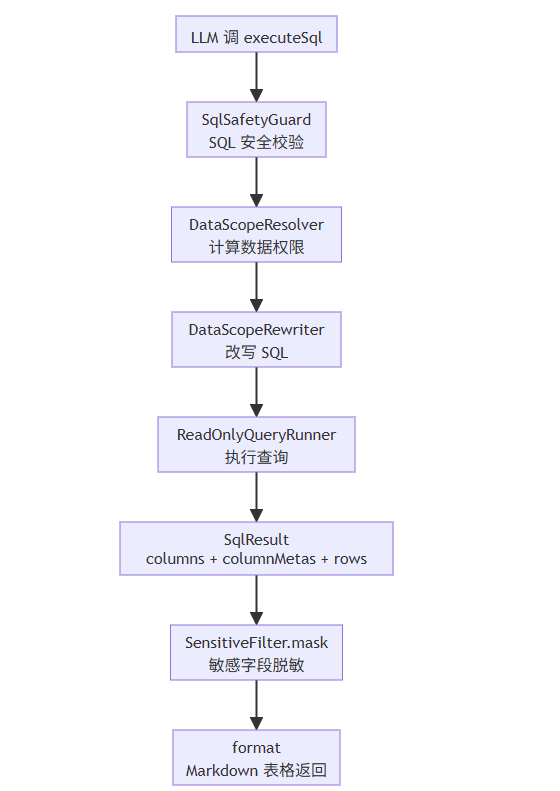
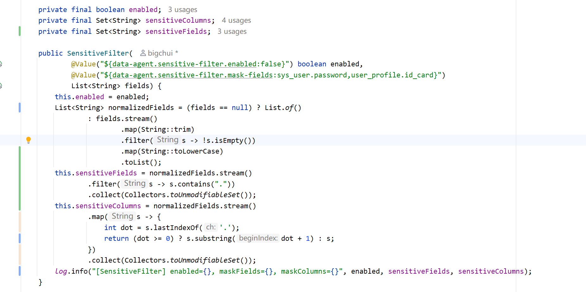
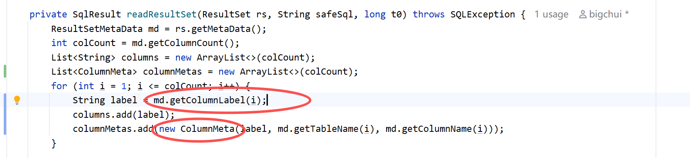
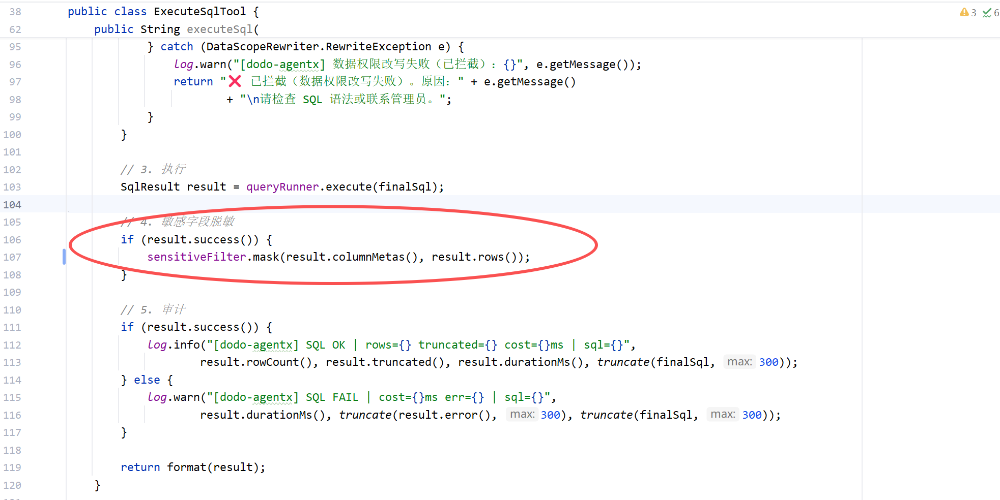
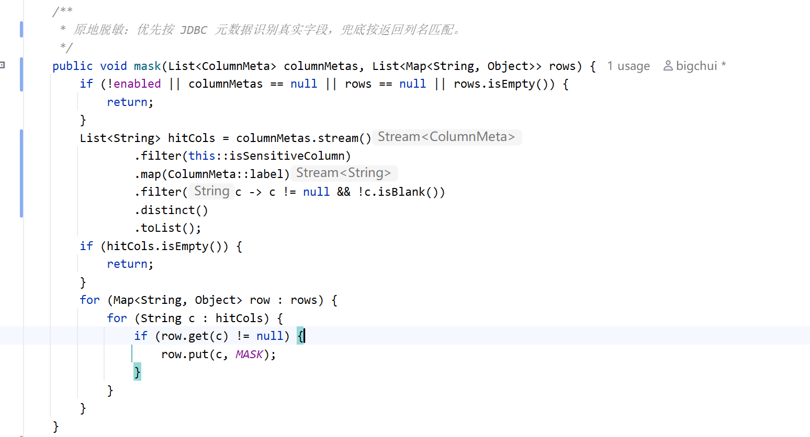
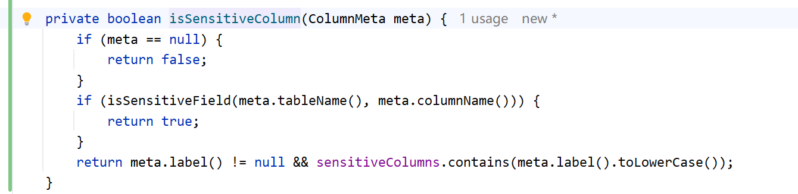
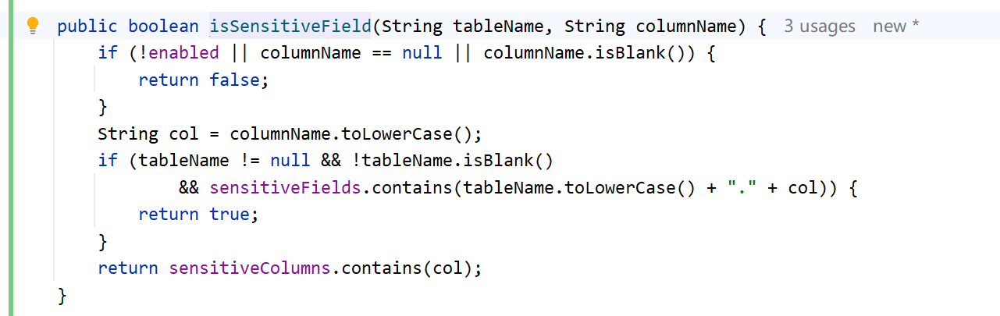
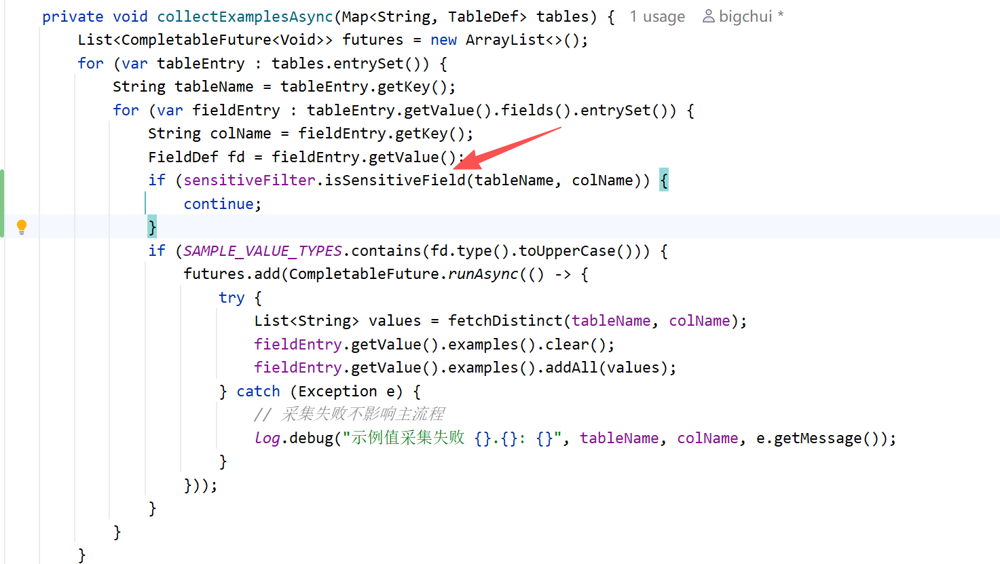
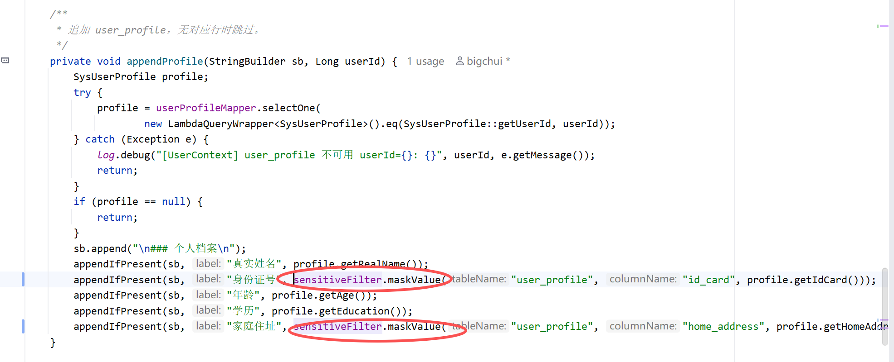

# ✅敏感字段如何脱敏

前面讲的数据权限，解决的是**当前用户能查到哪些行**。但有些字段即使在权限范围内，也不应该直接展示，比如密码、身份证号、家庭住址。

所以 executeSql 在查询成功后，还会做一次敏感字段脱敏。数据权限是在 SQL 执行前过滤行，敏感字段脱敏是在 SQL 执行后处理列值，这两个能力解决的问题不一样。

整体流程



这条链路里，SensitiveFilter 的位置很靠后。SQL 已经校验过，数据权限也已经注入过，数据库也已经执行完了。它处理的是内存里的查询结果，把命中的敏感列替换成 `********`，再交给 format 渲染成 Markdown。

敏感字段配置

敏感字段是放在配置文件里：

```yaml
data-agent:
  sensitive-filter:
    enabled: true
    mask-fields: sys_user.password,user_profile.id_card,user_profile.home_address
```

这里有两个配置：

- **enabled**：是否开启脱敏
- **mask-fields**：哪些字段需要脱敏

当前配置了三类字段：登录密码、身份证号、家庭住址。真实业务里可以按自己的表结构继续加，比如手机号、银行卡号、邮箱等。

配置怎么加载

SensitiveFilter 启动时会读取这些配置：



这里同时维护了两份集合：

- **sensitiveFields**：完整字段，比如 `sys_user.password`、`user_profile.id_card`
- **sensitiveColumns**：字段名，比如 `password`、`id_card`、`home_address`

为什么要存两份？可以从配置和查询结果两边理解。

配置里写的是 `sys_user.password`，它表达的是"只要来源是 sys_user 表的 password 字段，就要脱敏"。所以我们保留一份完整字段集合 `sensitiveFields`，后面拿到 JDBC 元数据时，可以用 `sys_user.password` 精确匹配。但查询结果展示时，列名不一定带表名，因为某些查询或数据库驱动不一定能稳定拿到表名，尤其是复杂表达式、函数列、子查询结果。这时候如果拼不出 `sys_user.password`，就退一步按字段名 `password` 判断。简单说：`sensitiveFields` 用来匹配完整规则，比如 `sys_user.password`；`sensitiveColumns` 是从配置里提取出来的字段名，比如 `password`，用于拿不到表名时兜底。

查询结果columnMetas

一开始最直接的实现，是只看查询结果的列名。比如返回列里有 `password`，就把这一列脱敏。

问题是 SQL 可以写别名：

```sql
SELECT password AS pwd FROM sys_user
```

这时候结果表头是 `pwd`，不是 `password`。如果只按结果列名判断，就识别不到这个字段其实来自 `sys_user.password`。

所以 ReadOnlyQueryRunner 读取 ResultSet 时，除了保存展示列名 columns，还额外保存 columnMetas：



`getColumnLabel` 是结果集最终展示出来的列名，写了别名就返回别名。`getColumnName` 是数据库真实字段名，`getTableName` 是字段来源表名。

比如：

```sql
SELECT id, username, password AS pwd FROM sys_user
```

columns 是：

```text
["id", "username", "pwd"]
```

columnMetas 是：

```text
[  
ColumnMeta(label="id",       tableName="sys_user", columnName="id"),
  
ColumnMeta(label="username", tableName="sys_user", columnName="username"),
  
ColumnMeta(label="pwd",      tableName="sys_user", columnName="password")
]
```

这样 SensitiveFilter 就能知道：虽然展示列名叫 `pwd`，但真实字段是 `sys_user.password`，应该脱敏。

mask替换结果值

executeSql 查询成功后，会调用 SensitiveFilter：



真正的脱敏逻辑是：先找出命中的列，再把这些列的值替换成固定掩码。



这里替换的是 `rows` 里的值。也就是说，数据库查出来的原始值不会再进入后面的 Markdown 渲染结果。

脱敏前：

| id | username | pwd |
| --- | --- | --- |
| 1 | admin | 123456 |

脱敏后：

| id | username | pwd |
| --- | --- | --- |
| 1 | admin | ******** |

怎么判断是不是敏感字段

判断逻辑分两层：优先按真实字段判断，兜底按展示列名判断。



`isSensitiveField` 负责判断真实字段：



比如 `SELECT password AS pwd FROM sys_user`：

- label 是 `pwd`
- tableName 是 `sys_user`
- columnName 是 `password`

先判断 `sys_user.password`，命中配置，所以脱敏。这样就避免了简单别名绕过。最后的 `sensitiveColumns.contains(col)` 是兜底。有些数据库驱动或者复杂表达式可能拿不到 tableName，这时候还能按字段名判断一次。**当前实现是全局脱敏：只要字段命中配置，不管是谁查，结果都返回 ****`********`****。适合大多数"敏感字段默认不展示"的场景。如果业务中要做得更精细，可以直接结合现有角色体系判断。比如 admin 和部门主管可以看身份证号明文，DEPT 和 SELF 范围的普通角色不能看。实现上就是在 ****`isSensitiveField`**** 命中之后，再根据当前用户角色或 dataScope 判断一次：有明文查看权限就原样返回，没有权限就替换成 ****`********`****。**

M-Schema 示例值不采样敏感字段

除了 executeSql 查询结果，还有一个容易忽略的地方：describeTables。

M-Schema 会采集字符串字段的示例值，帮助 LLM 理解字段内容。如果不处理，`password`、`id_card`、`home_address` 这类字段也可能被采样到示例值里。

所以在采样前加一层判断：



这样敏感字段不会进入 M-Schema 的 examples，describeTables 也就不会把这些示例值暴露给 LLM。

这个处理比采样后再替换更干净，因为敏感值从一开始就不进缓存。

用户上下文也要脱敏

UserContextBuilder 会把当前用户的身份、角色、部门、个人档案拼进 system prompt。这里也不能直接写敏感值。

原来个人档案里会直接写身份证号、家庭住址，现在写入前先过 SensitiveFilter：



`maskValue` 的逻辑很简单：如果这个字段命中敏感配置，就返回 `********`，否则原样返回。

这样 system prompt 里也不会出现真实身份证号和家庭住址。

小结

敏感字段脱敏解决的是**查到结果以后，哪些值不能明文展示**。

当前实现覆盖了三条链路：

- **executeSql 结果脱敏**：查询成功后，根据 columnMetas 判断真实字段来源，把敏感列替换成 `********`
- **M-Schema 示例值保护**：敏感字段不采样 examples，避免 describeTables 暴露样例
- **用户上下文脱敏**：身份证号、家庭住址写入 system prompt 前先脱敏

这里最关键的优化是 columnMetas。只看结果列名会被别名影响，而 columnMetas 保存了展示列名（别名）和真实字段来源之间的关系，所以 `password AS pwd` 也能正确脱敏。

---

来源: https://thoughts.aliyun.com/workspaces/6963289eb0fc2e001bb052eb/docs/6a61f21ba7c8ff000115fbb1
