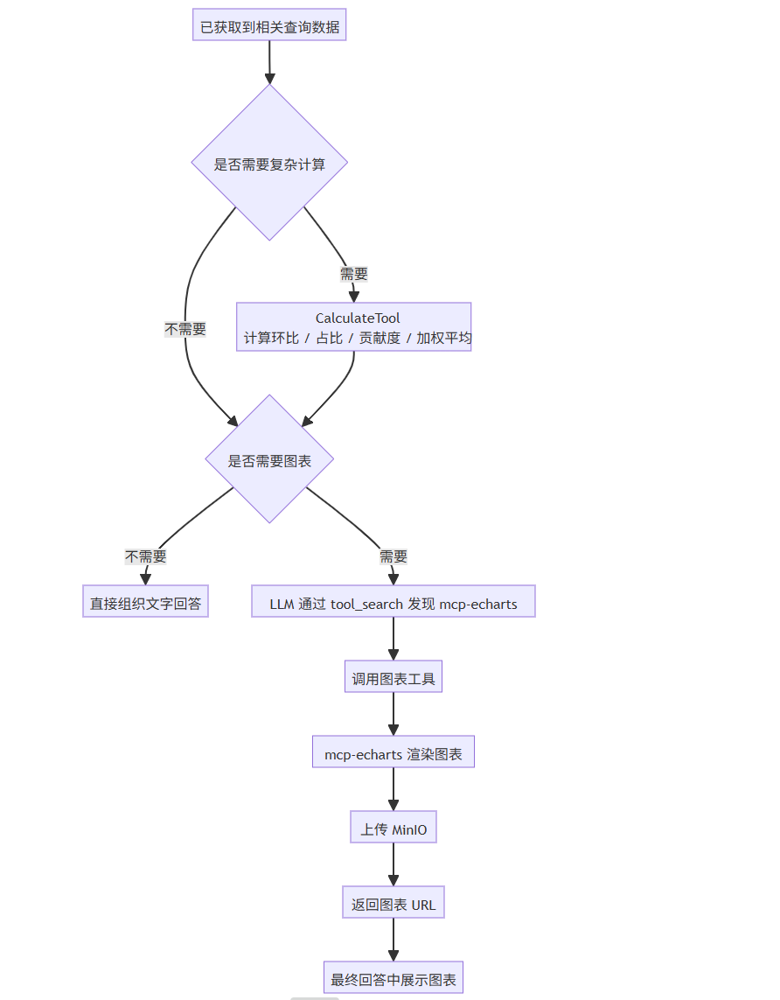
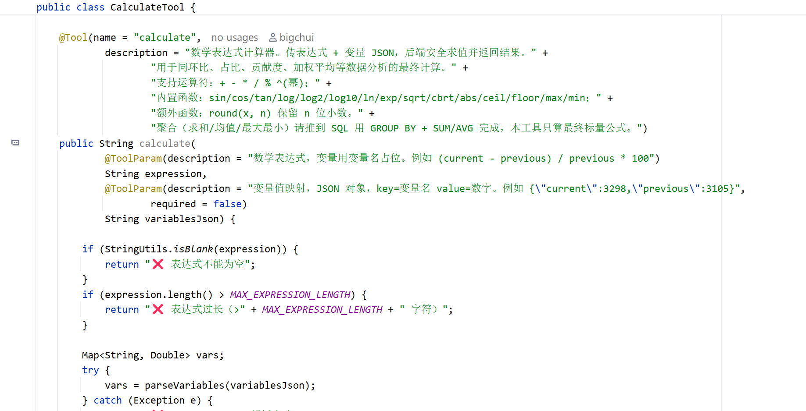
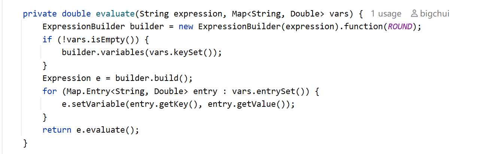
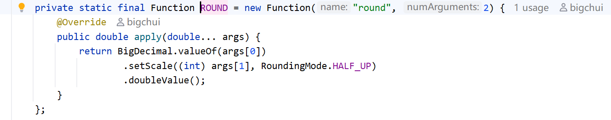
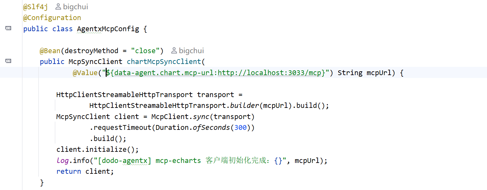
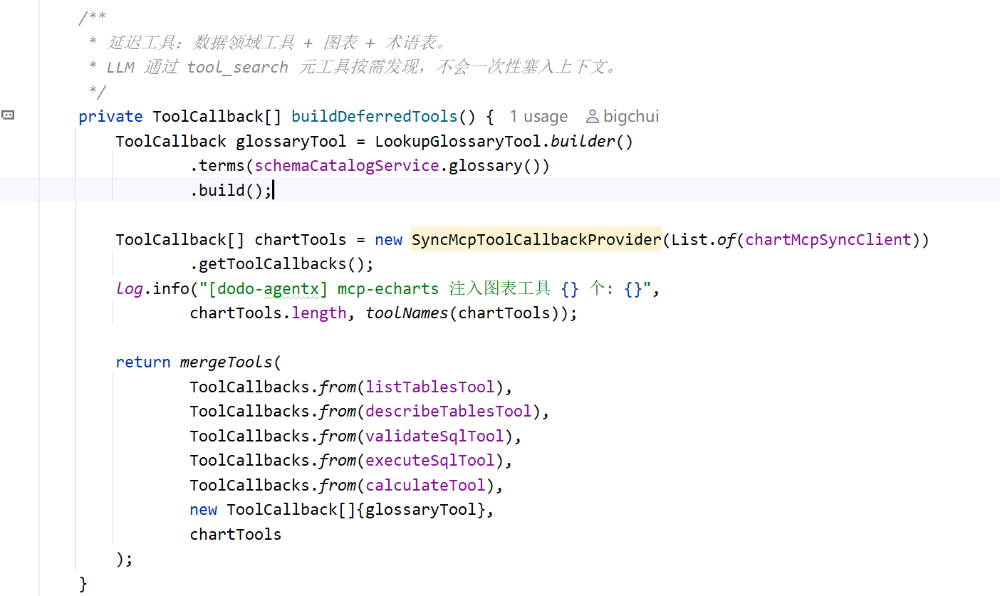
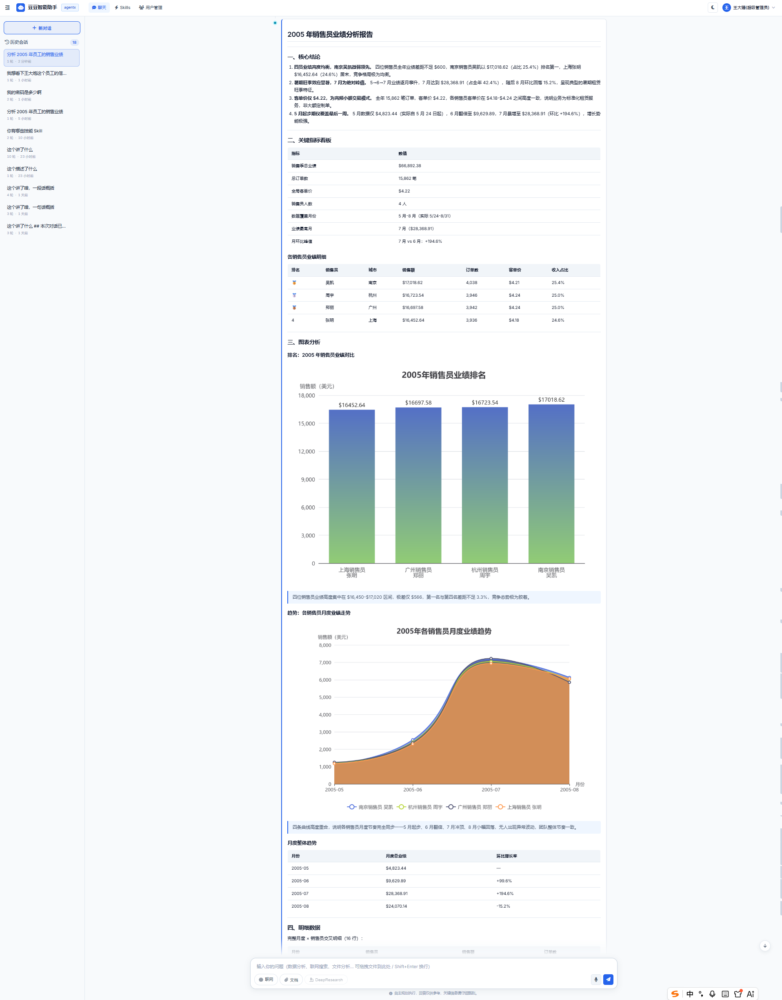

# ✅复杂计算与图表生成

获取到 SQL 查询数据以后，下一步就是生成分析报告。

如果只返回一段文字或者一张 Markdown 表格，可读性其实并不好。用户问趋势、占比、排行这类问题时，最直观的表达方式往往是图表，比如折线图、饼图、柱状图。

但生成图表前，有些数据还不能直接拿来画。比如环比、占比、贡献度这些指标，需要先基于 SQL 查询结果再做一层计算。也就是说，报告生成前通常会有两件事：**先把数据加工成最终指标，再把适合可视化的数据生成图表**。

所以 dodo-agentx 里引入了两个能力：CalculateTool 负责做最终公式计算，mcp-echarts 负责生成图表。这样最后给用户的就不是一张干巴巴的结果表，而是一份带指标、带解释、带图表的分析报告。

整体流程



SQL 负责把基础数据查出来，CalculateTool 负责把最终指标算准，mcp-echarts 负责把结果可视化。

CalculateTool

为什么需要 CalculateTool

最直接的做法，是让 LLM 自己算，或者把所有计算都塞进 SQL。简单问题可以，但复杂一点就不合适。

**不适合完全交给 LLM 算**，因为 LLM 本质上不是计算器，甚至是非常不擅长数学计算，他的本质只是文本预测。简单时可能看起来没问题，但一旦涉及多个变量、多次四舍五入、百分比格式，结果就可能非常不稳定。数据分析报告里的数字必须准，不能靠模型预测。

**也不适合所有计算都塞进 SQL**。SQL 很适合做聚合，比如 `SUM`、`COUNT`、`AVG`、`GROUP BY`。但有些最终指标是拿聚合结果再算出来的，比如环比、占比、贡献度、加权平均。如果全部塞进 SQL，语句会变得很长，LLM 也更容易写错。更合适的方式是：SQL 先查出清晰的中间结果，再用 CalculateTool 算最终公式。

所以 CalculateTool 的定位很明确：**不查数据库，不做大批量聚合，只做最终标量公式计算**。

CalculateTool 怎么用

CalculateTool 对外暴露的是一个数学表达式工具：



它的入参有两个：

- **expression**：数学表达式，比如 `(current - previous) / previous * 100`
- **variablesJson**：变量值，比如 `{"current":3298,"previous":3105}`

比如要算环比：

```text
expression = round((current - previous) / previous * 100, 2)
variablesJson = {"current":3298,"previous":3105}
```

返回结果类似：

```text
✅ round((current - previous) / previous * 100, 2) = 6.22
变量值：current=3298, previous=3105
```

这样 LLM 不需要自己心算，只要组织公式和变量，最终结果由后端工具计算。

CalculateTool 的实现

底层用的是 exp4j，一个轻量级表达式计算库：



这里的逻辑很简单：

- 用 ExpressionBuilder 构造表达式
- 把 variables 里的变量注册进去
- 给每个变量设置值
- 调 `evaluate()` 得到最终结果

另外工具里还补了一个 `round(x, n)` 函数，用来做报告里常见的小数位处理：



CalculateTool 只做最终公式，不替代 SQL。比如用户问“每个月的销售额是多少”，应该让 SQL 做：

```sql
SELECT month, SUM(amount)
FROM payment
GROUP BY month
```

而不是把每一行明细都拿出来，再让 CalculateTool 去加总。但如果用户问“本月比上月增长多少”，可以先用 SQL 查出两个聚合值：

```text
current = 3298
previous = 3105
```

再让 CalculateTool 算：

```text
round((current - previous) / previous * 100, 2)
```

简单来说：**批量聚合交给 SQL，最终公式交给 CalculateTool**。

CalculateTool 解决的是数值算准确。但很多分析报告不只是要数字，还要让用户一眼看出趋势、占比、排名。

比如：

- 趋势类：适合折线图
- 排名类：适合柱状图
- 占比类：适合饼图
- 分布类：适合散点图

所以当数据和指标都准备好以后，如果用户的问题适合可视化，LLM 会继续调用 mcp-echarts 生成图表。这样最终回答里既有文字结论，也有准确指标和图表链接，报告会更完整。

mcp-echarts

mcp-echarts 是什么

[https://github.com/hustcc/mcp-echarts](https://github.com/hustcc/mcp-echarts)

mcp-echarts 是一个基于 MCP 协议的图表服务，它是一个独立的 Node.js 服务。

它做的事情很明确：接收图表参数，调用 ECharts 渲染图表，然后把图表结果返回给调用方。dodo-agentx 不需要自己写 ECharts 渲染逻辑，只需要把这个 MCP 服务接进来，就能获得柱状图、折线图、饼图、散点图等图表能力。

启动方式在安装部署里已经写过：

```shell
npm install -g @mcp-echarts/server

cmd /c "set MINIO_ENDPOINT=<your-minio-host>&& set MINIO_PORT=<port>&& set MINIO_ACCESS_KEY=<key>&& set MINIO_SECRET_KEY=<secret>&& set MINIO_BUCKET_NAME=dodo-agentx-files&& mcp-echarts -t streamable"
```

启动后默认监听：

```text
http://localhost:3033/mcp
```

这就是一个可以私有化部署的图表服务。它跑在自己的机器上，图表也上传到自己的 MinIO 上。

为什么必须配 MinIO

这里有一个很关键的点：**mcp-echarts 必须配 MinIO**。

如果不配 MinIO，图表工具通常只能把图片内容以 base64 编码直接返回给模型，一张普通图表可能就是几万甚至几十万字符，这会直接导致两个问题：

- **拖垮上下文**：大模型上下文里塞进一大段 base64，可能上下文会直接爆炸
- **无法正常渲染**：就算 LLM 的上下文能装的下，但是这超大的字符串，根本没法正常渲染，错一个字符就全错了，而且输出也要非常久。

所以正确做法不是让图表内容直接进入大模型上下文，而是让 mcp-echarts 渲染完图表后上传 MinIO，然后只把一个 URL 返回给模型。

也就是：

```text
不要返回 base64：data:image/png;base64,xxxxxx...

而是返回 URL：http://minio-host:19000/dodo-agentx-files/chart/xxx.png
```

URL 很短，前端可以直接 markdown 渲染展示图片。

stdio 还是 streamable？

MCP 有多种传输方式，目前最常见的是 stdio 和 streamable http。

stdio 更适合本地单用户、单进程的工具调用。它通过标准输入输出和 MCP 服务通信，开发调试很方便。但 dodo-agentx 对于工具的处理是并发调用的，并且如果同时有多个用户、多轮会话、多次图表生成请求，stdio的方式也会存在问题，非常有可能第一次调用成功，后续直接被拒绝。

所以这里选择 **streamable http**。mcp-echarts 作为一个独立 HTTP 服务运行，dodo-agentx 通过 HTTP MCP 客户端连接它。这样更适合服务端部署，也更适合并发场景。

配置里也是这个地址：

```yaml
data-agent:
  chart:
    mcp-url: http://localhost:3033/mcp
```

怎么接入

dodo-agentx 的 MCP 客户端集中在 `AgentxMcpConfig` 里装配：



- 使用的是 `HttpClientStreamableHttpTransport`，也就是 streamable http
- `mcpUrl` 从配置文件读取，默认是 `http://localhost:3033/mcp`

延迟工具集

CalculateTool 和 mcp-echarts 都放在延迟工具里：



这样设计是为了减少上下文占用。CalculateTool 和图表工具不是每轮都必须用，只有当问题真的需要复杂计算或可视化时，LLM 才通过 tool_search 找到并调用。

这也符合前面讲过的工具分层：常用能力常驻，专业工具延迟发现。

小结

这一篇讲的是查询结果出来之后，怎么让报告更丰富、更完整。

- **executeSql**：拿到基础查询数据
- **CalculateTool**：计算环比、占比、贡献度、加权平均等最终指标
- **mcp-echarts**：把趋势、占比、排名等结果生成图表
- **MinIO**：保存图表图片，只把 URL 返回给模型和前端

这里最关键的设计是三点：

- **复杂计算不要靠 LLM 来算**，要交给 CalculateTool 保证结果准确
- **图表必须借助 MinIO**，不要让 mcp-echarts 直接返回 base64，否则会占满大模型上下文
- **MCP 使用 streamable http**，不要用 stdio 扛服务端并发，独立 HTTP 服务更适合私有化部署

这样最终返回给用户的就不只是 SQL 表格，而是一份带指标、带解释、带图表的分析结果。



---

来源: https://thoughts.aliyun.com/workspaces/6963289eb0fc2e001bb052eb/docs/6a61f278a7c8ff000115fbde
