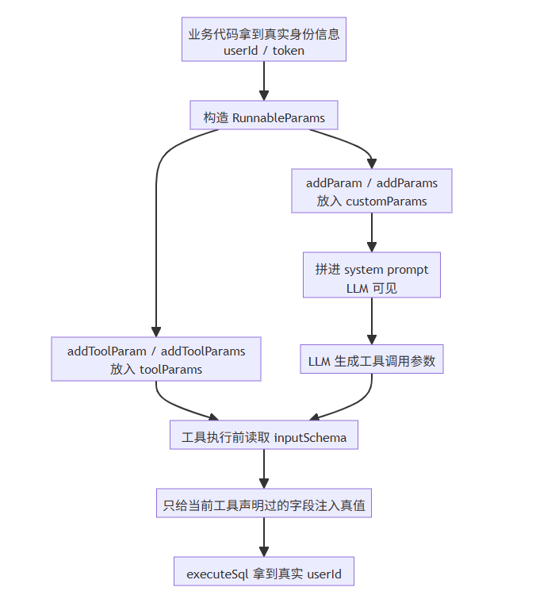
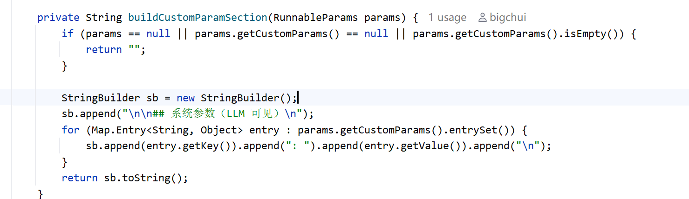
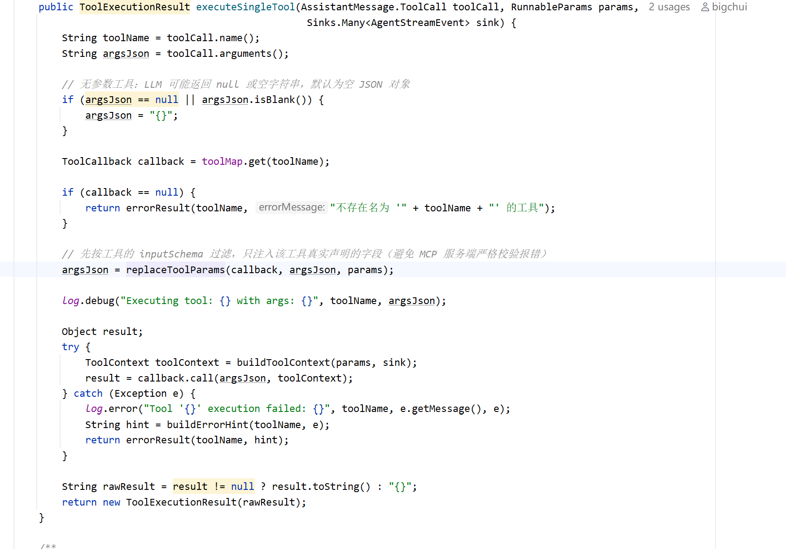
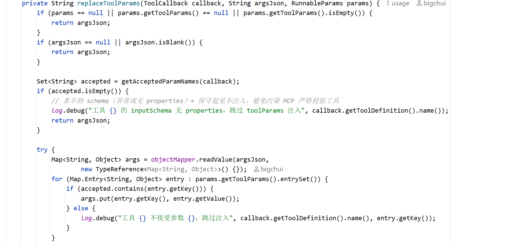
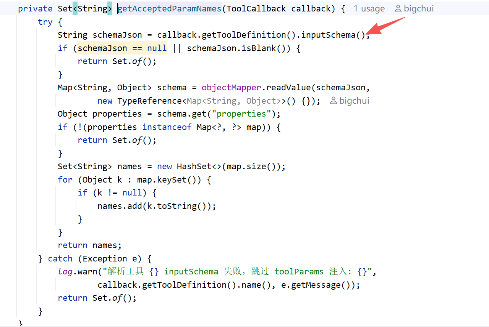

# ✅如何实现动态工具参数？

在 data-agent 中，真正执行 executeSql 的时候，需要带上当前用户身份信息，我们这边是 userId。这样数据权限改写才能知道，这条 SQL 应该按什么样的角色权限来处理。

可能最直接的做法，是把 userId 写进 system prompt，让大模型自己在调用工具时把它传进去。

这个做法在我们当前项目里，确实也可以工作。因为现在的 userId 比较短，大模型就算自己抄一遍，出错概率还不算高。

但这个方案本质上并不稳。因为今天传的是短 userId，明天也可能传的是更长、更敏感的运行时认证信息，比如 token、sessionId 等等。这类字符串只要错一个字符，工具调用就会直接失败。而且这类值本来就不应该交给 LLM 去传递。

所以这里真正要解决的问题是：**怎么把运行时的真实参数，稳定地交到工具手里，而不依赖 LLM。**

**spring-ai-agentx 的 RunnableParams 机制就是为了解决这个问题的。调用方把真值放进去，LLM 只负责决定调哪个工具、传哪些业务参数；等工具真正执行前，框架再把 RunnableParams 里的真实参数动态注入进去。**

完整的执行流程



这个流程里，最关键的是把两类参数拆开处理：

- **addParam、addParams**：传给 LLM 看，会进入 prompt
- **addToolParam、addToolParams**：传给工具执行用，不进入 prompt

也就是说，语言、格式、业务背景这类内容，可以交给 LLM 理解；但 userId、token 这种**运行时真值**，不应该交给 LLM 传递。

addParam 和 addToolParam 的区别

先看常见的写法：

```java
RunnableParams params = RunnableParams.builder()
        .addParam("language", "zh-CN")
        .addParam("format", "markdown")
        .addToolParam("userId", userIdStr)
        .build();
```

如果一次要传多组参数，也可以用批量版本：

- `addParams(...)`：一次放入多组 LLM 可见参数
- `addToolParams(...)`：一次放入多组工具执行参数

它们和单个方法的区别，只是一个一次传一个，一个一次传多个，**语义完全一样**。

addParam / addParams

这个方法的参数是 **给 LLM 看** 的，框架在构造 system prompt 时，会把 `customParams` 里的值直接拼进去，具体实现在 LoopMessageBuilder 的buildCustomParamSection 方法：



所以这类参数适合放：

- 语言
- 输出格式
- 业务模式
- 一些希望模型感知到的上下文

addToolParam / addToolParams

这条路是 **给工具执行用** 的。

它不会进入 prompt，LLM 看不到真值。像下面这些参数，更适合放这里：

- userId
- token
- tenantId
- sessionId

因为这些值的要求不是让模型理解，而是**让工具执行时拿到准确的值**。

如何替换工具参数

动态工具参数真正生效，不是在构造 prompt 的时候，而是在 agentx 框架真正准备执行工具的时候。**它的触发时机是在 ReAct 循环里：LLM 先返回 toolCall，框架再解析这次 toolCall 对应的工具名和参数，然后在真正发起工具调用之前，把 RunnableParams 里的真实参数动态合并进去**。

也就是说，参数替换发生在“模型已经决定要调哪个工具”之后，但又发生在“工具代码真正开始执行”之前。这样做的好处是，既不影响 LLM 的工具选择能力，又能保证像 userId、token 这类运行时的参数，最终交到工具手里的时候一定是框架兜底后的真实值，而不是模型自己生成的值。

核心入口在 `executeSingleTool(...)`：



这段代码其实就做了四件事：

- 先拿到 LLM 生成的工具名和参数 JSON
- 如果参数为空，就先补成 `{}`
- 根据工具名找到真正执行工具的 `ToolCallback`
- 在 `callback.call(...)` 之前，先执行 `replaceToolParams(...)`

所以这里最关键的一点是：**动态工具参数是在框架真正调工具前最后一刻注入的。**

这样就不要求 LLM 配合，也不要求 LLM 先把参数传对。除了参数替换，`executeSingleTool(...)` 还会调用 `buildToolContext(...)`，把 `userId`、`conversationId`、`runnableParams` 一起放进 `ToolContext`。也就是说，工具除了能从入参里拿到真实值，还能从上下文里拿到这次调用的完整运行时信息。

replaceToolParams

真正完成替换的是 `replaceToolParams(...)`：



这个方法的执行逻辑非常直接：

- 先看这次调用里有没有 `toolParams`
- 再看当前工具有没有合法的参数声明
- 把 LLM 生成的 `argsJson` 解析成 Map
- 遍历 `toolParams`
- 只要字段被当前工具声明过，就把真值写回去
- 最后再序列化回 JSON，交给真正的工具执行

这里最重要的一句是：

```java
args.put(entry.getKey(), entry.getValue());
```

这意味着它的行为是 **覆盖**，也就是说，以下三种情况都能接住：

- LLM 漏传了 `userId`：框架补上
- LLM 乱传了 `userId`：框架覆盖成真值
- LLM 传了占位值：框架照样覆盖成真值

所以当前项目里的真实机制就是：**只要这个工具声明了 **`userId`**，框架最终就会把它替换成真实值。**

为什么还要读 inputSchema

很多人看到这里，会觉得直接把 `toolParams` 全塞进去不就行了。

但实际接入 MCP 工具时，会遇到一个问题：有些工具会对参数做严格校验，不能多传字段。所以这里必须先调用 `getAcceptedParamNames(...)`：



这一步的目的就是 **白名单过滤**。

框架不会把 `toolParams` 里的所有字段都注入给当前工具，而是只给它真正声明过的字段。这样做有两个直接好处：

- **不会把参数乱塞给无关工具**
- **MCP 工具做严格校验时，不会因为多字段直接报错**

所以它不是粗暴替换，而是 **按 schema 精准替换**。

executeSql 为什么这样获取 userId

回到 data-agent 这个场景，executeSql 拿 userId 不是为了展示，而是为了后面的数据权限处理。

在业务代码里，典型写法就是：

```java
RunnableParams params = RunnableParams.builder()
        .userId(userIdStr)
        .addToolParam("userId", userIdStr)
        .build();
```

后面 LLM 生成 `executeSql` 的工具调用时，不管它有没有把 `userId` 写对，只要真正开始执行工具，就一定会先进入 `executeSingleTool(...)`，然后在里面调用 `replaceToolParams(...)`。最后 executeSql 拿到的 `userId`，就是框架替换后的真实值。

如果这种值交给 LLM 自己传，会有两个直接问题：

- **传错了**，数据权限处理就可能获取错误的身份或者直接查不到身份，最终查出来的数据范围也会错
- **漏传了**，工具直接执行失败

短 userId 看起来问题不大，但只要换成长 token，这个问题就会一下子变得很明显。所以动态工具参数的核心价值就是 **把运行时真值从 LLM 生成链路里拿出来，改成由框架兜底处理。**

小结

RunnableParams 不只是用来做动态工具参数，它本身还有会话、记忆、结构化输出等运行时能力。

这一篇我们只聚焦动态工具参数这一个能力。从实现上看，这套机制真正落地的关键，不只是在 `RunnableParams`，更在 `ToolCallExecutor`：

- `addParam`、`addParams` 负责传递 **LLM 可见参数**
- `addToolParam`、`addToolParams` 负责把真值放进 `toolParams`
- `executeSingleTool(...)` 在真正执行工具前统一调度
- `replaceToolParams(...)` 负责把真值按 schema 动态替换进去

所以像 userId、token 这类运行时认证信息，就应该走 **addToolParam** 这条路，而不是写进 system prompt 交给大模型自己传。

---

来源: https://thoughts.aliyun.com/workspaces/6963289eb0fc2e001bb052eb/docs/6a61f2d43fb9180001d28813
