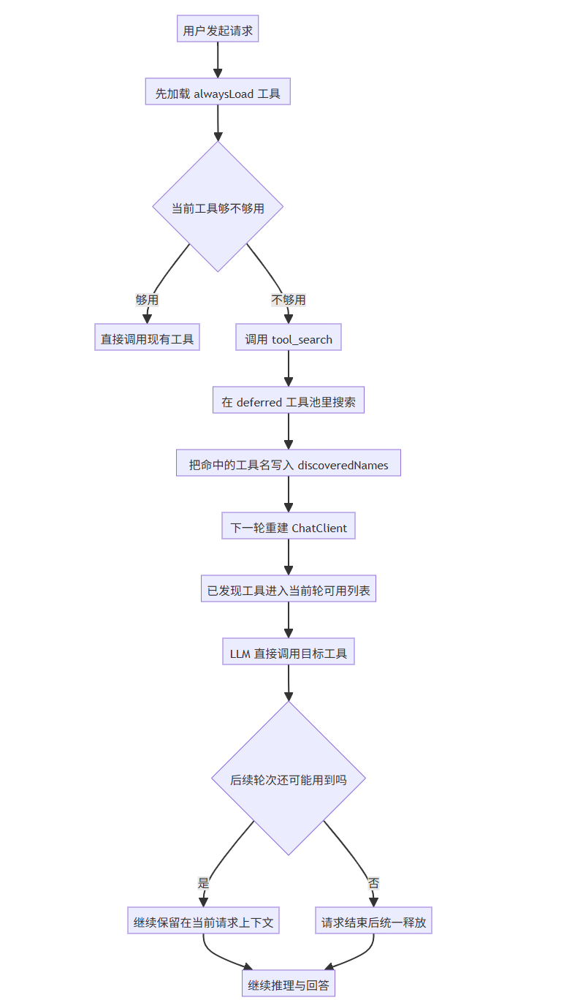
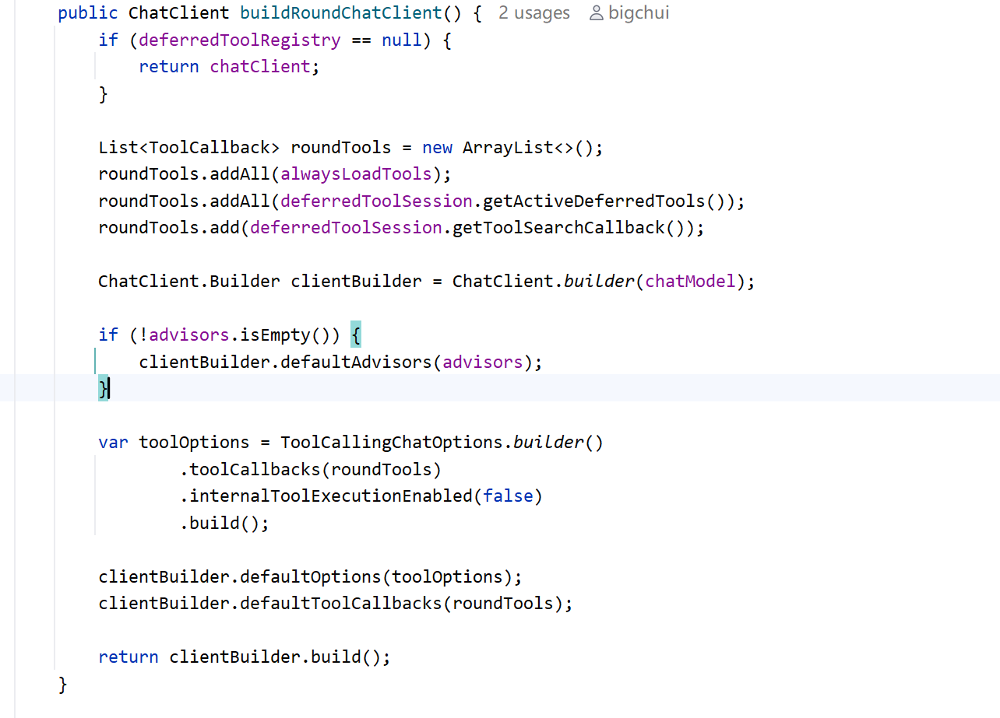
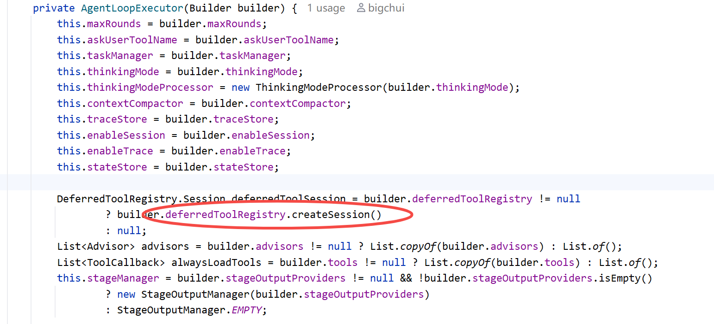
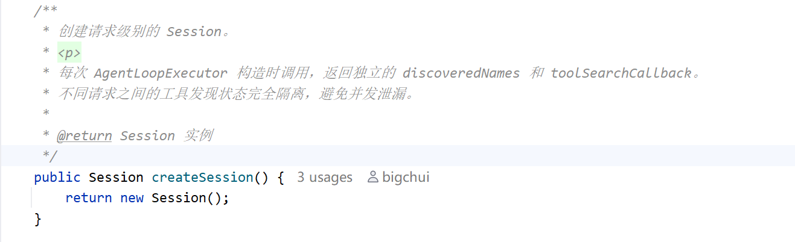
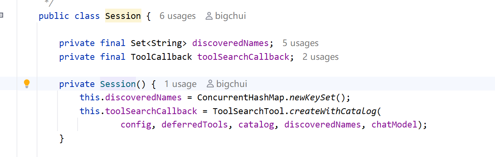

# ✅如何按需披露工具

在 dodo-agentx 里，有不少的工具，常驻的有 TodoWrite、Bash、文件系统、Grep、SkillsTool、时间工具；数据分析场景里，还有 `listTables`、`describeTables`、`validateSql`、`executeSql`、`calculate`，再加上图表工具、术语表工具等等。如果把这些工具一次性全部注入给大模型，最直接的问题有两个：

**第一，上下文会膨胀；**

**第二，工具一多，模型容易选错。**

所以这里真正要解决的问题，就是：**当工具越来越多时，怎么只在需要的时候把它披露给模型。**

这就是 ToolSearch 要做的事。

完整的执行流程



这个流程里，最关键的是把工具分成两层：

- **alwaysLoad**：每轮都给模型看，适合通用、常用能力
- **deferred**：先不暴露，等模型真的需要时，再通过 `tool_search` 去搜索和披露

也就是说，ToolSearch 不是替模型执行工具，而是先帮模型**缩小工具范围**。

如何接入

在 DodoAgent 里，核心写法就是这一段：

```java
return ReactAgent.builder()
        .chatModel(chatModel)
        .instructions(instructions)
        .tools(alwaysOn)
        .deferredTools(toolSearchConfig, deferredTools)
        .maxRounds(100)
        .build();
```

这里的意思是：

- `tools(alwaysOn)` 放的是常驻工具
- `deferredTools(...)` 放的是延迟披露工具

像数据分析相关的专业工具，就都放在 deferred 里：

```java
return mergeTools(
        ToolCallbacks.from(listTablesTool),
        ToolCallbacks.from(describeTablesTool),
        ToolCallbacks.from(validateSqlTool),
        ToolCallbacks.from(executeSqlTool),
        ToolCallbacks.from(calculateTool),
        new ToolCallback[]{glossaryTool},
        chartTools
);
```

这样做的好处是，像 `executeSql`、`calculate`、图表工具这类能力，不会在每一轮都占上下文。只有用户问题真的走到数据分析、复杂计算、图表生成这些场景时，大模型才需要把它们找出来。

为什么要这样分层

如果这些工具全都常驻，会有两个直接结果：

- 每一轮请求都要把全部 function 带给模型，上下文成本会持续增加
- 模型在很大的工具集合里做选择，更容易出现误选

所以当前的做法不是减少工具能力，而是把工具的**披露时机**往后推。先让模型看到一组小而稳定的常驻工具；只有它判断当前工具不够时，再去搜索更专业的那一批工具。

tool_search 是如何找出工具的

`tool_search` 本身也是一个工具，它注册出来就是一个普通 ToolCallback：

```java
return FunctionToolCallback.builder("tool_search", fn)
        .description("搜索可用的工具。当当前工具不足以完成用户任务时，调用此工具搜索更多工具。")
        .inputType(ToolSearchFunction.SearchRequest.class)
        .build();
```

同时，框架还会在 system prompt 里补一段引导：**只有当前工具不够用时，才调用 **`tool_search`**。**

搜索模式

ToolSearch 一共支持三种模式：

- **KEYWORD**：只走关键词匹配
- **LLM**：只走 LLM 选择
- **HYBRID**：先关键词，没结果再走 LLM

```java
public enum Mode {
    KEYWORD,
    LLM,
    HYBRID
}
```

默认模式是 **HYBRID**：

```java
public static ToolSearchConfig defaults() {
    return new ToolSearchConfig(Mode.HYBRID, DEFAULT_MAX_RESULTS);
}
```

所以在 dodo-agentx 里，当前这套 ToolSearch 默认就是：**先关键词搜索，没搜到再让 LLM 补一轮判断。**

关键词这条路，核心就是对工具名和描述做分词、打分。比如 camel_case、下划线会先拆开，中文描述会直接走 Jieba 分词。这样用户说“查天气”“生成图表”“查表结构”时，不需要和工具名完全一致，也能大致搜到目标工具。

如果关键词没搜出来，再走 LLM 模式补一轮判断，这样做的含义是：**常见场景先走低成本快速匹配，复杂语义再让模型补充。**

所以 HYBRID 不是把两套逻辑简单堆在一起，而是在速度和理解能力之间做了一个平衡。

为什么必须重建 ChatClient

这一点是 ToolSearch 里最关键的实现，很多人看到 `tool_search` 把工具名写进 `discoveredNames`，会觉得到这里就结束了。其实还没有。**真正让新工具对 LLM 生效的，不是“搜到了”，而是“重建了当前轮的 ChatClient”。**

因为 LLM 能不能调用一个工具，取决于这一轮发给它的 function 列表里有没有这个工具的定义。如果只是在内存里或者只是 messages 里，获得了“已经搜到过某个工具”，但是没有重建 ChatClient，那么这一轮请求带给模型的 function 还是旧的那一份，模型依然看不到新工具，也就不可能直接调用它。

所以这里必须做一次重建。

代码就在 `LlmInvoker.buildRoundChatClient()`：



基于这组重新构建的 `roundTools` 重新构造 ChatClient，这一步的意义就是：

- `tool_search` 搜到工具后，只是把工具名记进了 Session
- `buildRoundChatClient()` 会在下一轮把这些工具真正加入 `roundTools`
- 只有 chatclient 重建完成后，新工具的 function 定义才会真正出现在 LLM 的上下文里

所以 **ChatClient 的重建不是一个优化动作，而是 ToolSearch 能成立的必要条件。**

如果没有这一步，就算 `tool_search` 已经发现了工具，LLM 这一轮拿到的参数里也还是没有对应的 function，后面就无法直接调用这些新工具。

search 到的工具需不需要收回

这里还有一个很关键的设计点：**工具一旦在本次请求里被 **`tool_search`** 搜到，就不会在后续轮次里立刻移除，而是会一直保留在本次请求的上下文里，直到这次任务结束。**这样做的原因就是：因为从实际任务来看，只要某个工具在这一轮被搜出来，往往就说明**当前任务后面大概率还会继续用到这一组工具**。比如数据分析场景里，大模型一旦搜到了 `listTables`、`describeTables`、`executeSql`、`calculate` 这些工具，后面通常不会只调一次就结束，而是会围绕这组工具连续完成探索表结构、生成 SQL、执行 SQL、修正 SQL、做复杂计算这些步骤。如果这里做得非常动态，比如这一轮刚用完就立刻把工具收回，看起来更细，但实际会带来一个更麻烦的问题：**模型可能会频繁重新调用 **`tool_search`**，反复搜索同一批工具。**

这样就会导致：

- **增加无意义的轮次消耗**：本来已经找到过的工具，还要再搜一遍
- **让调用过程来回反复**：一会儿披露，一会儿收回，模型容易重复进入 `tool_search`

所以当前的取舍是：**按需披露，但不做过度动态回收。**

- 没搜到之前，不暴露
- 一旦搜到，在本次请求里持续保留
- 等本次请求结束，再整体清空

这样既控制了初始上下文大小，又避免了反复搜索同一组工具的问题。

请求隔离

虽然 search 到的工具会在**当前请求**里持续保留，但它不会泄漏到其他请求。

`AgentLoopExecutor` 初始化时的这段代码：



这一步的意思是：**每次新的执行请求进来，都会重新创建一个新的 Session。** 不管是流式调用还是非流式调用，只要进入一轮新的 Agent 执行，就不是复用上一次的工具发现状态，而是新建一份当前请求自己的 Session。

再看 `DeferredToolRegistry` 里的实现：





也就是说：每次 `createSession()` 都会 `new Session()`，并且每个 Session 内部都会新建自己独立的 `discoveredNames`。比如：A 请求里 search 到了 `executeSql`，只是把它记在 **A 请求自己的 discoveredNames** 里；等到 B 请求进来时，会重新创建一个新的 Session，B 请求拿到的是一份新的空集合，而不是 A 请求之前留下来的结果。

这也是 ToolSearch 一个很重要的边界：**当前请求内保留，请求之间隔离。**

小结

ToolSearch 的核心作用，就是把工具分成**常驻**和**延迟披露**两层，让大模型先在一小组稳定工具里工作，只有当前工具不够时，再通过 `tool_search` 去搜索并披露更专业的工具。

它真正落地的关键点有三个：

- `tool_search` 负责从 deferred 工具池里找出当前任务需要的工具
- `discoveredNames` 负责记录本次请求里已经发现过哪些工具
- `buildRoundChatClient()` 负责在下一轮把这些工具真正加入 function 列表，让 LLM 可以直接调用

同时，这套机制还保留了两个很重要的边界：

- **当前请求内保留**：工具一旦 search 到，在本次任务结束前会持续可见，避免反复调用 `tool_search`
- **请求之间隔离**：每次请求都会新建 Session，上一轮发现过的工具不会泄漏到下一轮

至于搜索模式，ToolSearch 支持 **KEYWORD、LLM、HYBRID** 三种方式。dodo-agentx 当前采用的是 HYBRID，也就是先关键词匹配，没结果再让 LLM 补一轮判断。这样既能兼顾常见场景下的匹配效率，也能兼顾复杂语义下的工具发现能力。

所以在 dodo-agentx 里，`executeSql`、`calculate`、图表工具这些专业能力，才能在真正需要的时候再进入大模型上下文，而不是从一开始就把全部工具都塞进去。

---

来源: https://thoughts.aliyun.com/workspaces/6963289eb0fc2e001bb052eb/docs/6a61f315a7c8ff000115fe00
