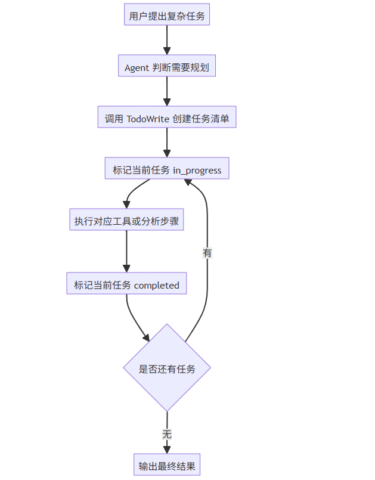
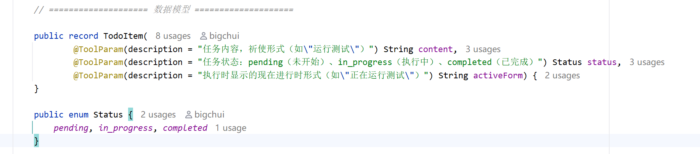
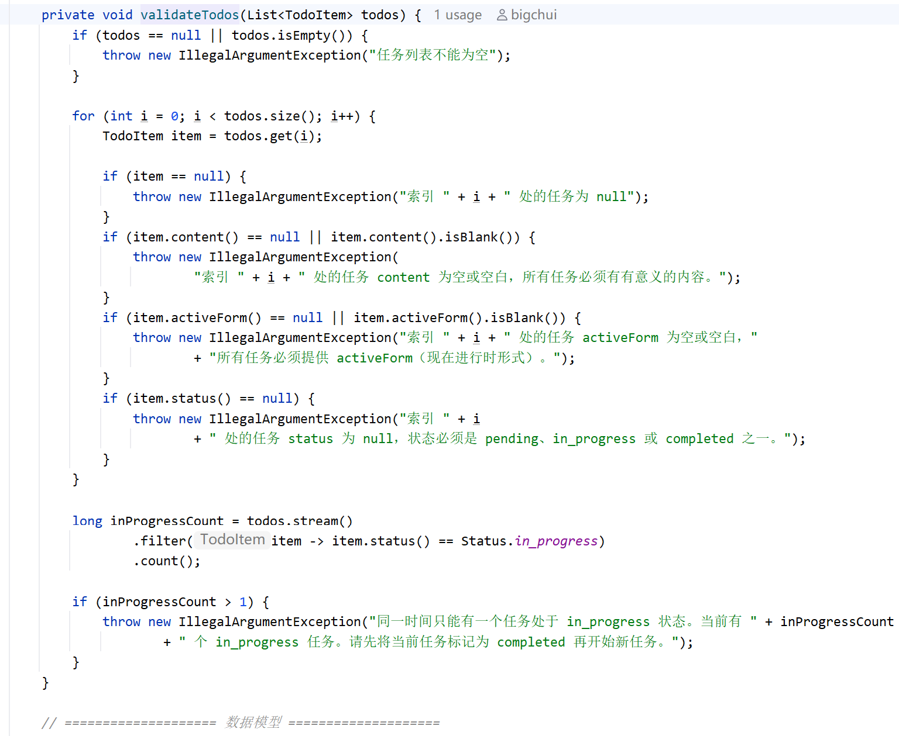
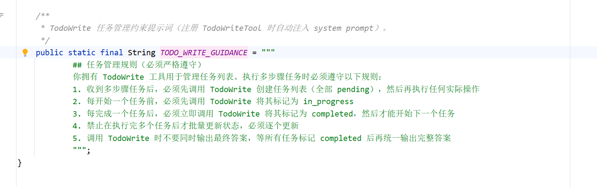

# ✅如何让智能体自主规划

复杂任务里，智能体最容易跑偏的地方，就是**做着做着忘了最初的目标**。

比如 data-agent 里用户问“分析 2005 年 8 月的员工销售业绩”，这不是一条 SQL 就能解决的问题。Agent 需要先拆题，再探查 schema、查询业务口径、生成 SQL、校验 SQL、执行查询、检查结果，必要时还要计算指标、生成图表，最后输出报告。步骤一多，如果只靠 LLM 自己在上下文里记，很容易做到后面忘记前面：查了排名，忘了趋势；执行了 SQL，忘了校验结果；跑了几轮工具之后，最开始的分析目标也被上下文冲淡了。

所以 dodo-agentx 在常驻工具里加入了 `TodoWrite`。它的核心作用，就是让 Agent 在处理复杂任务前先把任务规划显式写出来，再按任务清单一步一步推进。这个思路和 Claude Code 里的 plan 模式能力很像：先把要做的事情列清楚，再边做边更新进度，避免复杂任务跑偏。

为什么需要 TodoWrite

ReAct Agent 的特点是边思考边行动。它每一轮都会根据当前上下文决定下一步要不要调工具、调哪个工具、工具返回后是否继续。这个机制很灵活，但也带来一个问题：**Agent 的计划默认只存在于模型上下文里**。

对于简单问题，这影响不大。

比如用户问：

```text
查一下 2005 年 8 月的总销售额
```

Agent 可能只需要查 schema、写一条聚合 SQL、执行返回结果。任务很短，即使没有任务列表，也不太容易跑偏，但复杂任务不太一样，比如：

```text
分析 2005 年 8 月员工销售业绩，给出排名、趋势、异常员工和建议
```

这类问题至少包含几类子任务：

- 查清楚“员工销售业绩”对应哪些表和字段
- 查业务术语口径，比如销售额、时间范围怎么定义
- 统计整体销售额和员工排名
- 分析趋势和异常员工
- 必要时下钻某个员工的明细
- 整理成报告和图表

没有 TodoWrite 时，Agent 容易出现几个问题：

- **漏步骤**：查了排名，忘了趋势；写了 SQL，忘了校验结果
- **顺序乱**：还没看 schema 就写 SQL，或者还没确定口径就开始汇总
- **进度不可见**：用户只能看到工具调用，看不出整体任务完成到哪里了
- **上下文变长后容易忘目标**：执行几轮工具后，最初的分析目标被淹没

TodoWrite 解决的就是这些问题。它把“我要怎么做”变成一份结构化任务列表，让 Agent 在长链路的执行过程中持续维护这份列表。

整体执行流程

在 dodo-agentx 里，`TodoWrite` 是常驻工具。

```java
private ToolCallback[] buildAlwaysOnBaseTools() {
    return mergeTools(
            TodoWriteTool.create(),
            BashTool.create(),
            FileSystemTools.create(),
            GrepTool.create(),
            ToolCallbacks.from(timeTool)
    );
}
```



这个流程有两个关键点：

第一，TodoWrite 需要持续更新：Agent 每开始一个任务前，要先把这个任务标记为 `in_progress`；每完成一个任务后，要立即标记为 `completed`。

第二，TodoWrite 只负责规划和进度，不替 Agent 决定具体工具调用：真正执行时，Agent 仍然通过 ReAct 循环动态判断下一步，比如查 schema、查 glossary、执行 SQL，还是生成图表。

TodoWrite 工具的定义

`TodoWriteTool` 位于 `spring-ai-agentx` 框架中，本身很轻量，核心就是一个工具方法：

```java
@Tool(name = "TodoWrite", description = """
    创建和管理结构化任务列表，用于跟踪多步骤任务的进度。
    ...
    """)
public String todoWrite(
        @ToolParam(description = "任务列表，包含所有任务的当前状态")
        List<TodoItem> todos) {
    validateTodos(todos);
    return "任务列表已成功更新。请使用任务列表跟踪你的进度，并继续执行当前的任务。";
}
```

它的参数是一个任务列表，每个任务包含三个字段：



这三个字段分别是：

- `content`：任务要做什么，比如“探查销售相关表结构”
- `status`：任务当前状态，比如 `pending`、`in_progress`、`completed`
- `activeForm`：执行时展示什么，比如“正在探查销售相关表结构”

任务列表由 LLM 自己创建和维护。框架提供的是结构化格式和校验规则，规划内容仍然来自 Agent 对当前任务的理解。

为什么要校验任务列表

如果 TodoWrite 随便接收一个 JSON，它自身也会变得不可靠。模型可能同时把两个任务标记为 `in_progress`，也可能生成空任务，或者状态字段乱写。所以 `TodoWriteTool` 内部会做校验：



这几个校验规则很简单，但很关键：

- 任务列表不能为空
- 每个任务必须有明确内容
- 每个任务必须有执行时展示文案
- 每个任务必须有合法状态
- 同一时间只能有一个任务处于 `in_progress`

最后一条尤其重要。它保证 Agent 的执行状态是单线推进的：当前正在做什么，用户能看清楚，框架也能看清楚。

如何引导 Agent 优先规划

光注册工具其实还不够，LLM 需要知道什么时候该用、怎么用。因此 `spring-ai-agentx` 框架在检测到 `TodoWrite` 工具存在时，会把任务管理规则注入 system prompt。在构建消息时，`LoopMessageBuilder` 会判断当前工具列表里有没有 `TodoWrite`：

```java
if (todoWriteEnabled) {
    systemPrompt = appendSection(systemPrompt, PromptConstants.TODO_WRITE_GUIDANCE);
}
```

对应的提示词是：



这段提示词的目的，就是尽可能约束 Agent 在复杂任务开始前优先调用 TodoWrite 做规划。工具描述会告诉模型 TodoWrite 的用途，系统提示词会强调多步骤任务下的使用规则，两者一起让 Agent 更容易形成“先规划，再执行”的行为。

在 data-agent 里，我们也把这条规则写进了 `data-analysis/SKILL.md`：当用户问题包含多个指标、多个时间窗口、需要报告或图表，或者预计需要多次 SQL 查询时，必须先调用 `TodoWrite` 建立任务清单，再开始具体执行任务。

这样一来，复杂数据分析任务的第一步就会更倾向于先列计划，而不是直接就开始干。

小结

TodoWrite 的核心作用，就是让 Agent 在执行复杂任务的时候不要跑偏。

它像一个轻量的 plan 模式：复杂任务开始前先列任务，执行时逐步更新状态，完成后再输出最终结果。真正的工具调用仍然由 ReAct 循环决定，TodoWrite 负责把“要做什么、正在做什么、已经做完什么”结构化地记录下来。

在实现上，它有三个关键点：

- `TodoWriteTool` 提供任务列表工具，让 LLM 创建/更新 `pending / in_progress / completed` 状态
- `PromptConstants.TODO_WRITE_GUIDANCE` 注入任务管理规则，尽可能约束 Agent 在复杂任务前先规划

所以，TodoWrite 就是 ReactAgent 处理复杂任务时的规划外壳。它保留了 ReAct 的灵活性，也让复杂任务的执行过程变得可观察、可追踪。

---

来源: https://thoughts.aliyun.com/workspaces/6963289eb0fc2e001bb052eb/docs/6a61f58051b1440001f54fd2
