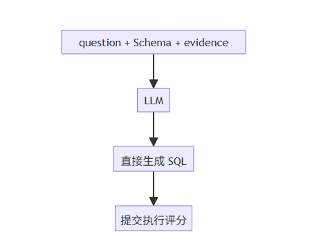
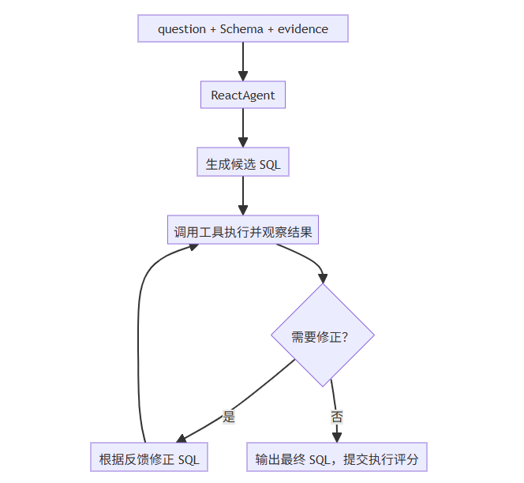
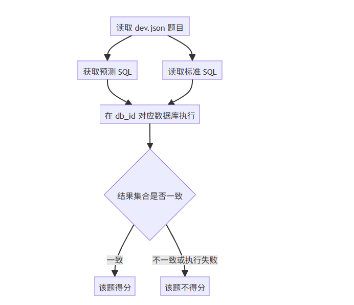
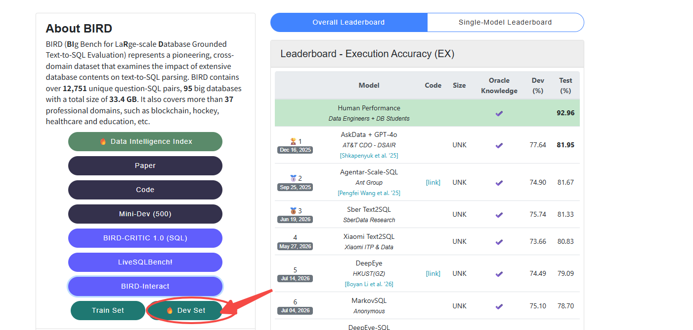
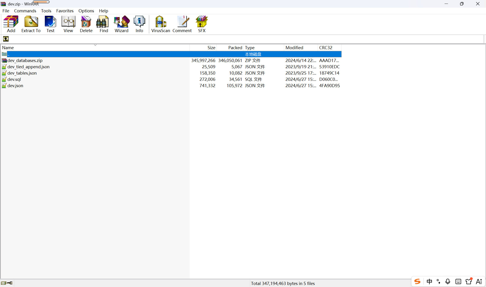
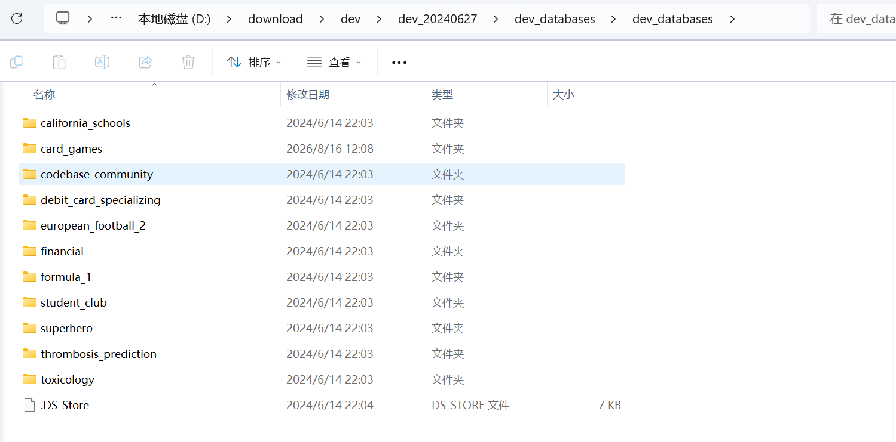
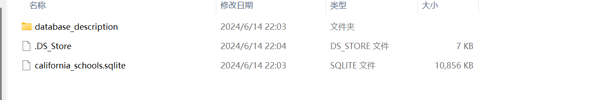
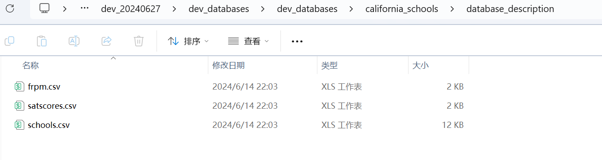
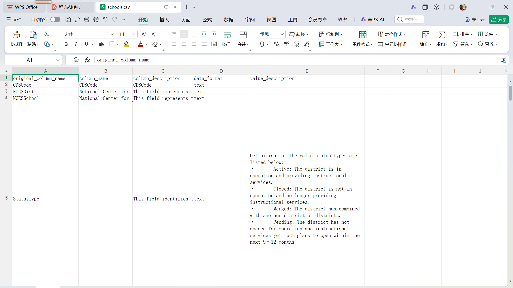
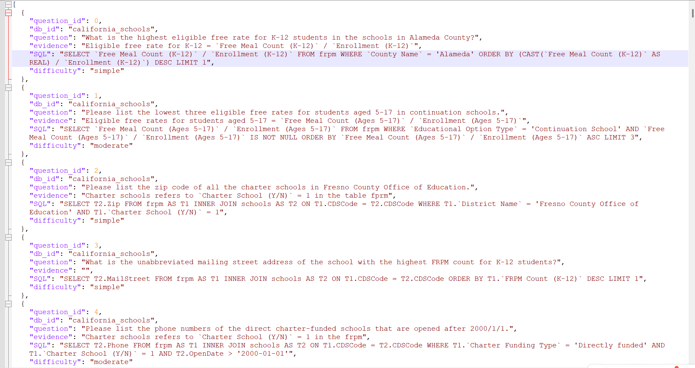

# ✅BIRD评测：DataAgent如何做公开数据评测？

前面的课程中，我们已经完成了一个生产级的 DataAgent。它能够查询 Schema、理解业务术语口径、生成并执行 SQL。除此之外，在生产环境中，我们还需要补齐安全校验、权限控制、数据脱敏和异常兜底等安全能力。

所以，生产环境中的 DataAgent 更关注的是：**系统能不能安全、稳定地运行。**

但是，安全做得好，并不代表生成的 SQL 就一定准确。SQL 到底准不准，本质上取决于几个因素：

- **模型本身的理解能力**：模型对问题、Schema 以及整体上下文的理解能力，决定了Text2SQL的上限和下限。
- **Schema 是否合理**：表、字段、外键、示例值等信息是否准确、完整，有没有歧义。
- **业务术语口径是否清晰**：比如“活跃客户”“时间锚点”这些概念，到底应该如何定义。

这些因素共同决定了 Text2SQL 的准确性。我们在前面的 DataAgent 中，将这些能力作为独立工具引入，再通过系统提示词把标准执行流程固化下来。

但是，**这样的架构设计到底能不能真正提升 SQL 准确率**？只靠几个 Demo 或人主观很难判断。**我们需要一套标准化评测体系，量化衡量它生成的 SQL 是否准确。**

什么是 BIRD

[BIRD-bench](https://bird-bench.github.io/)

**BIRD 可以理解为一套标准化的 Text2SQL 考题**。每道题包含自然语言问题、所属数据库、业务背景知识和标准 SQL gold_sql。被评测系统根据题目生成 SQL，评分脚本再把预测 SQL 和标准 SQL 放到同一个数据库中执行，最后比较执行结果。

BIRD 现在已经发展成一套比较完整的数据库智能评测体系，包含 BIRD-SQL、BIRD-Interact、BIRD-Critic 等不同评测方向：

- **BIRD-SQL / BIRD Dev**：面向 Text2SQL 基础能力。给模型自然语言问题和数据库，让它生成 SQL，并判断查询结果是否正确。
- **BIRD-Interact**：面向交互式多轮任务。它通过用户模拟器逐步给出模糊需求、补充信息和后续变更，考察 Agent 能否主动澄清、维护上下文、调用工具、修正错误并完成操作。这个方向更接近完整意义上的 Agent 评测，可以当参考，我们不直接用，后面自建一套更贴合业务的。
- **BIRD-Critic**：面向 SQL 分析、诊断和修复。它关注 Agent 能否理解有问题的 SQL，结合 Schema 和业务背景定位错误，并给出正确修正。

为什么选择 BIRD Dev

先做一个定位澄清：我们这一步做的是 DataAgent 的**准确性评测**，不是 Agent 的完整评测。它测的是给定 question、Schema 和 evidence，系统生成的 SQL 执行结果准不准，本质是 Text2SQL 能力评测，考察的是 Agent（或者说 LLM）对 Schema 和业务背景信息的理解，以及把理解转化成 SQL 的能力。这块能力的上下限主要由大模型本身的理解能力决定，Agent 编排做的，是通过执行、校验、纠错这套闭环，把模型已有的能力稳定地兑现出来，再加上让程序安全、稳定地运行，而不是凭空创造超越模型的能力。

真正的 Agent 评测考察的是另一套东西：多轮交互中会不会主动澄清模糊需求、能不能有效管理上下文、工具选择和调用对不对、任务最终能不能完成、结果是否正确等等。业界有 BIRD-Interact 这类交互式评测集可以参考，但直接拿来用需要做不少适配工作。我们后面的做法是自己构建一套更简单、也更贴合 DataAgent 业务场景的 Agent 评测，到时候单独展开，大家先不要把两种评测搞混。

所以这一步要验证的，是 DataAgent 最基础、也是最核心的能力：

**给定用户问题、数据库 Schema 和必要的业务术语口径，DataAgent 能否生成语义正确、执行结果正确的 SQL。**

BIRD Dev 与这个目标匹配度很高。它为每道题提供自然语言问题、目标数据库、业务术语口径以及标准 SQL，同时题目覆盖多个不同领域的真实数据库，能够较好地检验 DataAgent 从**自然语言理解 → Schema 理解 → 业务术语口径转换 → SQL 构造**这一完整链路。

BIRD Dev 的 SQL 查询也并不局限于简单的单表过滤，而是包含多表 JOIN、聚合、排序、Top-K、子查询、窗口函数以及基于业务术语口径的计算等不同类型的查询。这使得 BIRD Dev 更接近我们希望验证的 DataAgent 场景：**Agent 需要真正理解 Schema、业务语义和数据关系。**

另外，很重要的是 BIRD Dev 很适合做对照实验，我们可以让同一个模型在相同的 `question`、Schema 和 `evidence` 条件背景下，分别采用两种不同的方式生成 SQL：

**Baseline 直接让模型生成 SQL：**



**DataAgent 则把关键能力交给 ReactAgent 编排**：



两组实验使用完全相同的题目、背景信息和评分标准，就可以比较：

**引入 ReactAgent + 工具的模式，是否真正提升了 Text2SQL 的执行准确率。**

BIRD 的评分标准

BIRD 的核心指标是 EX，全称 Execution Accuracy，也就是执行准确率。对于一道题目，评分流程如下：



整体分数可以简化为：

```text
EX = 结果正确的题目数 / 总题目数
```

**EX 关注的是最终执行结果，SQL 文本写法是否相同不影响得分**：

- 子查询和 JOIN 写法不同，不影响；
- 聚合表达式不同但计算结果相同，不影响；
- 字段别名不同，不影响；
- 行顺序不同，不影响。

**但结果集合必须完全一致：**

- SQL 执行失败，不得分；
- 多返回一个字段，不得分；
- 少返回一个字段，不得分；
- 多返回或少返回一个不同的值元组，不得分；
- 返回粒度错误导致结果集合变化，不得分。

例如标准 SQL 只返回一列数值，预测 SQL 返回了“数值”和“学校名称”两列。即使数值本身正确，两列结果也无法和一列标准结果一致，这道题不能得分。

这个规则其实和我们的业务场景相比会严格很多，我们业务场景中做数据分析，其实多传一列两列，可能还有助于最终分析报告的可读性。但是BIRD不是这么考虑的，它防止的是把相关字段都查出来这种取巧方式。

而且别看规则就这么几条，想拿高分非常不容易。DataAgent 必须准确理解用户要查什么、返回哪些字段，BIRD 官网首页挂着持续更新的榜单，大部分知名的大模型和 Agent 厂商，在 Dev 集上也就 60 到 70 多分的水平。一方面数据集里混着一些脏数据和故意引导出错的干扰内容，稍不留神就掉坑里；另一方面严格的结果比对把“差不多对”完全排除在外。很多现在比较火的模型，不加任何工程手段直接裸跑，baseline 也就 50 分出头。

所以想在榜单上继续往上走，行业里主要有两条路线。一条在模型层面，通过微调和训练，提升大模型做数据分析、Text2SQL 的底层能力，这条路投入大、周期长，我们这门课不展开；另一条在 Agent 层面，用工具、编排、校验这些工程手段，把模型已有的能力稳定地发挥出来，我们后面的改造就围绕这条路。这里也顺便建立一个认知：**单看准确率，DataAgent 的上限和下限都依赖大模型本身，Agent 工程更多是让它安全、稳定地跑起来，支撑生产环境的多轮对话，把模型已有的能力稳定地兑现出来，而不是凭空创造超越模型的能力。**

准备数据

到 BIRD 官网点击下载 Dev Set，[https://bird-bench.github.io/](https://bird-bench.github.io/)，会得到一个压缩包：





解压后会看到：

```text
dev.json
dev.sql
dev_tables.json
└── dev_databases/
    └── dev_databases/
```

这套流程主要使用两个部分：`dev.json（评测数据集）` 和内层 `dev_databases（sqllite数据库）`。

数据库目录

内层 `dev_databases` 是数据库根目录，每个子目录代表一个数据库：



每个数据库目录里有两类内容：



1. `.sqlite` 文件：真正的 SQLite 数据库，评分时预测 SQL 和标准 SQL 都在这里执行。
2. `database_description` 目录：官方提供的字段描述文件，每个 CSV 对应一张表。



这些csv文件中的字段描述信息相当于就是我们前面课程中介绍的数据库Schema，这个就是我们DataAgent生成SQL的重要依据。



评测数据集

`dev.json` 就是评测数据集，是一个 JSON 数组，数组里的每个对象就是一道题，包含 `question_id`、`db_id`、`question`、`evidence`、`SQL`、`difficulty` 这几个字段。



可以把 BIRD Dev 中的主要数据与 DataAgent 做如下对应：

| BIRD Dev 数据 | DataAgent 中的概念 | 说明 |
| --- | --- | --- |
| `question` | 用户问题 | 用户用自然语言提出的数据查询需求 |
| `db_id` | 目标数据库 | 标识当前问题对应的数据库 |
| `evidence` | 业务术语口径 | 对业务术语、字段映射、计算公式、规则等进行补充说明 |
| `SQL` | 标准答案 | 用于评测预测 SQL 的执行结果，不要求预测 SQL 与标准 SQL 写法完全一致 |
| `difficulty` | 题目难度 | 用于进一步分析不同难度下的 SQL 生成能力 |

其中，`db_id` 是题目和数据库之间的关联键。例如 `db_id` 为 `california_schools` 时，就会使用：

```text
dev_databases/california_schools/california_schools.sqlite
```

注意，`SQL` 是标准答案，只给评分脚本使用，不会注入给 DataAgent。DataAgent 拿到的信息包含： `question`**、**`db_id` 对应的数据库和 `evidence`，跟真实用户提问时的信息量一致，这样测出来的准确率才有说服力。

小结

生产场景和评测场景的关注点不一样：生产更关注智能体安全稳定地运行，评测更关注 Text2SQL 的准确率。而 SQL 准不准，取决于模型本身的理解能力、Schema 是否合理、业务术语口径是否清晰这三个因素。

还要再强调一次定位：我们当前做的是 DataAgent 的准确性评测，本质是测模型对 Schema 和业务口径的理解能不能转化成正确的 SQL，能力主要依赖大模型本身；完整的 Agent 评测，多轮交互、主动澄清、工具编排这些，是后面单独的主题，不要把两者搞混。

要量化准确性，就需要一套标准化评测体系，这就是引入 BIRD 的原因。BIRD 把 Text2SQL 变成标准化考题，把预测 SQL 和标准 SQL 放到同一个数据库里执行，比对结果。我们选用其中的 BIRD Dev，让同一个模型分别用 Baseline 直出和 DataAgent 编排两种方式答题，验证 ReactAgent + 工具的模式能不能真正提升执行准确率。

不过 BIRD 拿高分并不容易，榜单上大部分大模型和 Agent 厂商也就 60 到 70 多分。想再往上走有两条路线：模型微调提升底层能力，或者 Agent 工程把模型能力稳定发挥出来，我们这门课聚焦后者。

数据有两部分：dev.json 保存题目和标准答案，dev_databases 保存 SQLite 数据库和字段描述。标准 SQL 只给评分脚本用，模型拿到的只有 question、数据库和 evidence，和真实用户提问时的信息量一致，这样测出的分数才有说服力。

---

来源: https://thoughts.aliyun.com/workspaces/6963289eb0fc2e001bb052eb/docs/6a86ba263fb9180001f1b093
