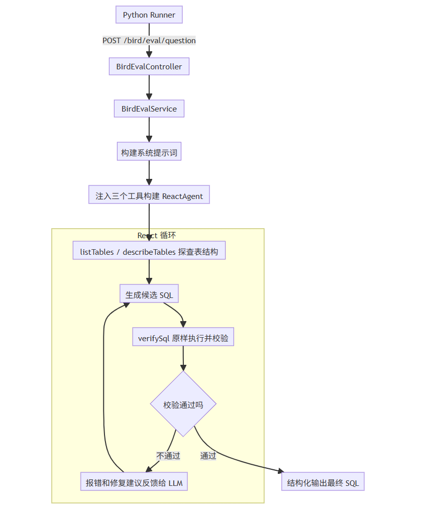
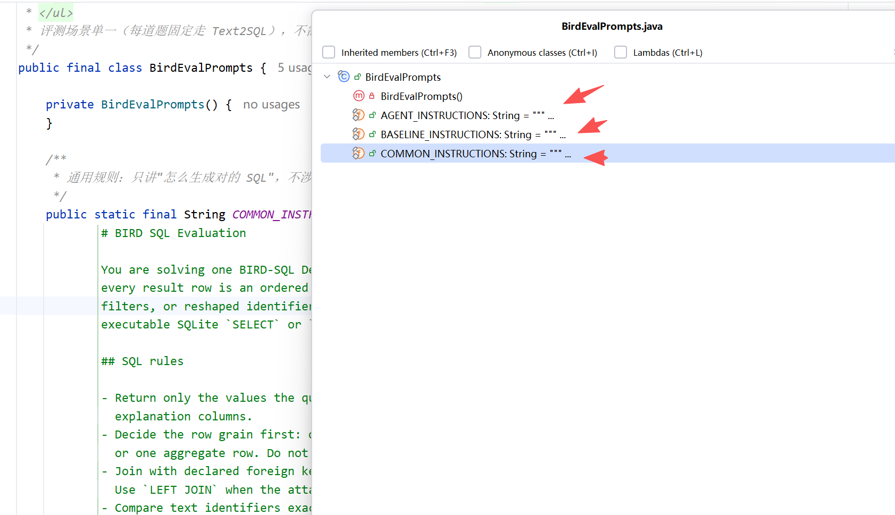
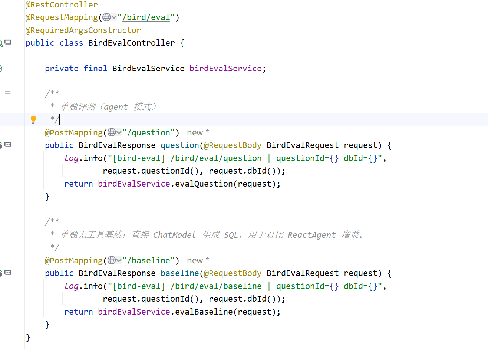
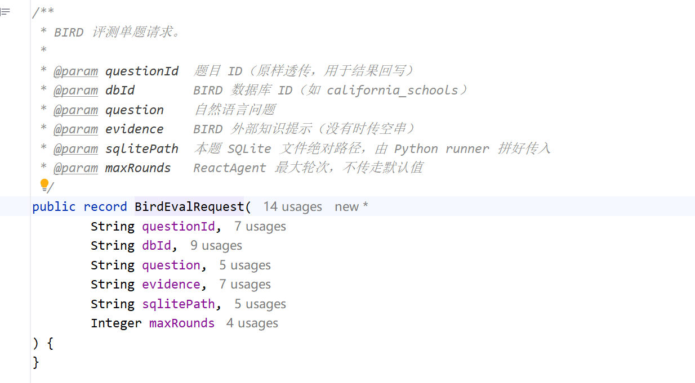
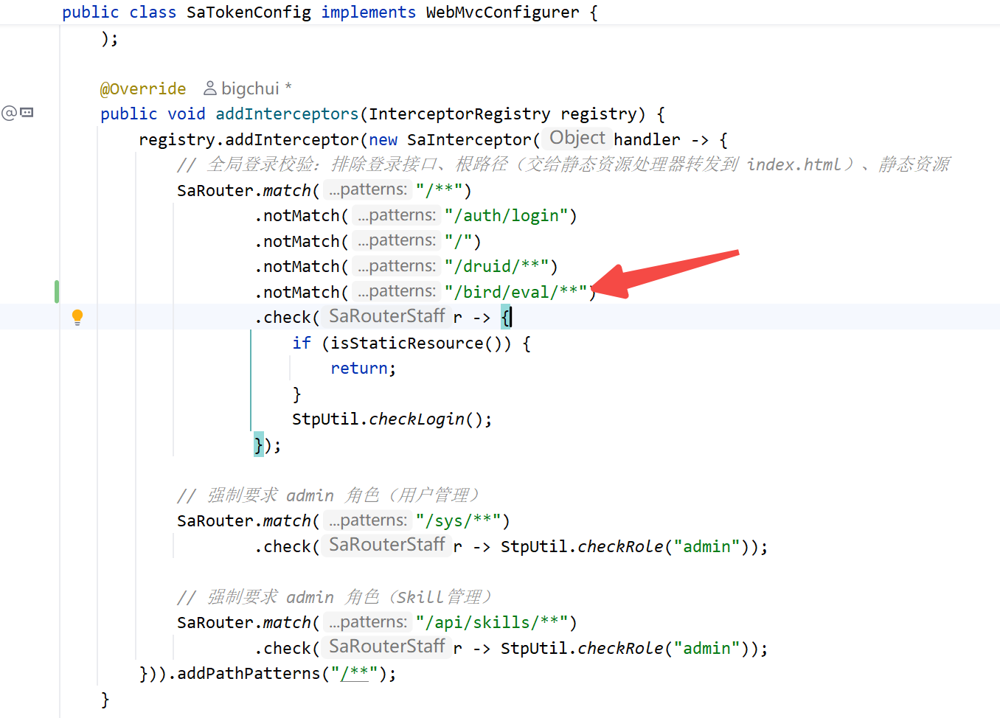
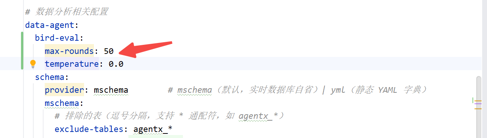
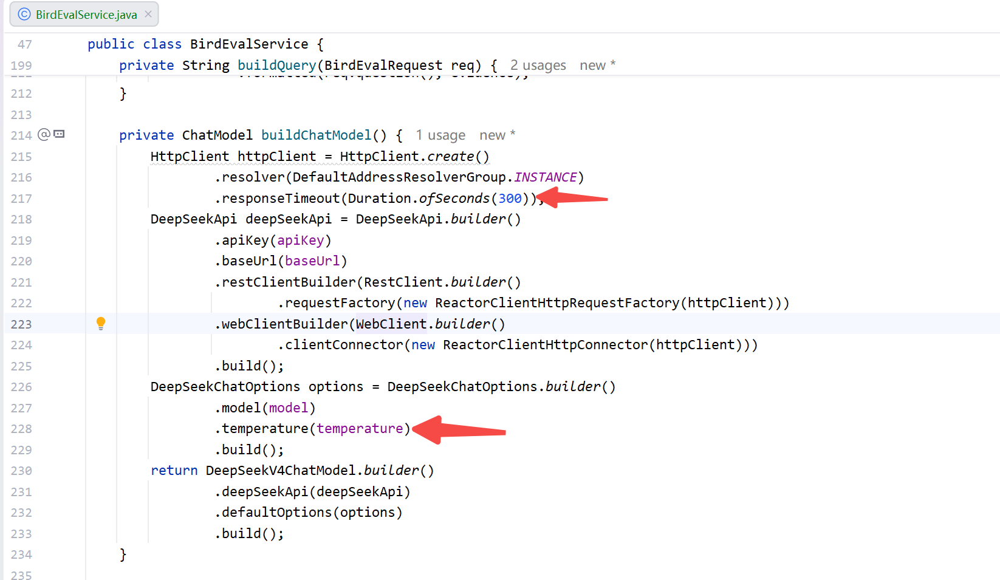

# ✅BIRD评测：如何改造我们的DataAgent？

为了适配 BIRD 的评测，我们需要对 DataAgent 做一次改造。

我们前面课程建的生产级 DataAgent，目标是稳定、安全地运行。用户问一个问题，SQL 要经过安全校验、数据权限改写、EXPLAIN 预检查、敏感字段脱敏等层层把关，最终输出的是一份完备的分析报告。

但 BIRD 评测完全是另一回事，它只关心一件事：生成的 SQL 执行结果和标准答案是不是完全一致。一个字段不一样，不得分；多返回一列，不得分；SQL 被安全机制拦截了，还是不得分。而且 BIRD 考题里扫几十万行数据的查询也很常见，这种 SQL 在生产环境会被 EXPLAIN 预检查毫不犹豫地拦下来，在评测里它恰恰是正确答案。

所以这些安全措施在评测里不仅没用，还会帮倒忙。改造方向就是：**去掉所有安全措施，链路终点也不是分析报告，而是一条完整的 SQL**。

改造要验证什么

去掉安全措施，不等于退化成裸调 LLM。这次评测真正要验证的是：**React 架构到底比原始 LLM 强多少**。

实验采用控制变量法。不管是 ReactAgent 还是直接调 ChatModel，输入完全一样，question、Schema、evidence 全部暴露给模型，唯一区别是解题方式。

直接用 LLM 生成，做法很朴素：把题目、完整 Schema、evidence 一股脑塞进上下文，让模型一次性生成 SQL，完全依赖模型自身能力。这个成绩就是 LLM 的 baseline。

ReactAgent 能做的就会多一些：

- **绑定工具，按需披露 Schema**：还是和之前一样，先调 listTables、describeTables 查库，看清楚表结构和字段含义再写 SQL。
- **调用 verifySql 执行并校验**：SQL 写完不是直接交卷，而是先执行一遍，校验结果是否符合预期。不符合就把报错信息返回给模型，引导它修正后重新生成，循环往复直到通过。

我们的目标就是两组数字：LLM 裸跑的 baseline 是多少分，React 架构下能提升到多少分。

改造后的执行流程



构建系统提示词

系统提示词直接用静态常量固化在 BirdEvalPrompts 里。注意它不是一整段，而是按场景拆成了三段：



- **COMMON**：怎么生成对的 SQL 的通用规则。投影最小化、行粒度、外键连接、文本标识符原样比较、不要臆测过滤条件这些，只讲规则，不涉及任何工具；
- **AGENT**：Agent 专用的工作流。先 listTables、describeTables 查库，怎么从题目推导 requestedColumns，怎么用 verifySql 做探针和终验，最后怎么交卷；
- **BASELINE**：无工具直出的适配段，告诉模型工具不可用、Schema 已完整内嵌、按 JSON 契约输出。

Agent 的系统提示词就是 COMMON + AGENT 两段拼起来的（拼装逻辑在 BirdEvalService 的 buildInstructions）。为什么要这么拆？因为这套提示词还要服务后面的对照实验：baseline 复用 COMMON 段，保证两边"怎么写对 SQL"的知识完全一致，差异只在解题方式上。如果把工具工作流也塞给 baseline 看，等于给一个没有手的模型讲用法说明书，既不公平也是噪声。这个拆分在对比实验那一讲还会展开。

这里有个设计决策要说明：**为什么不用 SkillsTool**。生产环境的 skill 是为通用问答场景设计的，用户的问题可能是数据分析、文件解读、联网搜索，也可能命中其他配置好的 Skill 场景，所以要用 SkillsTool 按需加载。但评测场景是单一的，就是答题生成 SQL 这一种固定流程。如果走 skill，模型还得先多调一轮工具把 skill 内容加载出来，白白多一轮循环。直接放进 system prompt，省掉这一轮调用即可。

注入工具

构建 Agent 的核心代码在 BirdEvalService：

```text
private ReactAgent buildAgent(BirdEvalRequest req) {
    BirdToolBundle bundle = toolFactory.create(req.sqlitePath(), buildReviewContext(req));
    ToolCallback[] tools = mergeTools(
            ToolCallbacks.from(bundle.listTablesTool()),
            ToolCallbacks.from(bundle.describeTablesTool()),
            ToolCallbacks.from(bundle.verifySqlTool())
    );

    return ReactAgent.builder()
            .chatModel(chatModel)
            .instructions(buildInstructions(req))
            .tools(tools)
            .maxRounds(resolveMaxRounds(req))
            .build();
}
```

**每道题都会构建一套新的工具集**。因为三个工具都绑定着这一题的 SQLite 数据库路径，换一道题就可能换了一个数据库，工具就得跟着换一套。所以每来一道题就现场构建一套，用完即弃。

三个工具的分工：

- **listTables / describeTables**：直接复用生产环境的两个工具类。它们依赖的是 SchemaProvider 接口，生产环境注入 MySQL 实现，这里的评测环境注入 SQLite 实现 SqliteSchemaProvider，工具代码一行不用改。SqliteSchemaProvider 具体的实现后面单独展开。
- **verifySql**：新建的评测专用工具，负责原样执行 SQL 并校验结果。生产的 executeSql 带着五层安全处理不能用于评测，所以必须重建，具体实现也放到后面讲。

React 循环执行

Agent 构建好之后进入 React 循环，这是整个评测链路的核心。循环里的动作主要分三步：

探查表结构

模型拿到题不是闷头就写 SQL，先调 listTables 列出库里的表，圈定和题目相关的候选表，再调 describeTables 查看这些表的字段和业务含义，看清楚结构再动手。

执行并校验结果

基于探查到的结构生成候选 SQL，调 verifySql 原样执行。工具会把执行结果和校验结论一起返回，字段名写错、SQL 执行失败、结果为空、返回的列和题目要求对不上，这些情况都会被标出来。

反馈给 LLM 修正

校验不通过，报错信息和修复建议就返回给模型，引导它修正 SQL 再验一遍，如此循环，直到通过或者达到最大轮次。校验通过，循环结束，Agent 输出结构化结果。

这正是 React 架构比裸 LLM 强的地方：**生成的 SQL 经过了真实执行结果的检验，错了有机会改，而不是一次性输出听天由命**。

结构化输出

循环结束后，Agent 的输出用 BirdAgentOutput 接收：

```text
@Data
public class BirdAgentOutput {
    private String sql;                       // 最终 SQL
    private List<String> requestedColumns;    // 声明的返回列，按顺序
}
```

`sql` 就是提交给评分脚本的答案，纯 SQL 文本，不带 markdown 和解释。`requestedColumns` 是模型同时声明的"这条 SQL 应该返回哪些列、按什么顺序"。它一方面强迫模型写 SQL 之前先想清楚返回什么，BIRD 对列数和列序极其严格，多一列都不得分；另一方面它会在 verifySql 的终验里做校验，执行结果的列数、列名、列序要和声明完全对得上，这部分讲验证工具时展开。

入口配置

入口是新增的 BirdEvalController，暴露 POST /bird/eval/question



接收参数 BirdEvalRequest：



这里要注意 sqlitePath 是随请求传进来的，不是提前配好的。BIRD 一千多道题分布在几十个数据库里，每道题用哪个库都不一样，所以由调用的脚本每题把对应的数据库路径传过来，接口侧只认这个路径，不在本地预置任何数据库信息。

有些配置也需要调整：

- **SaToken 放行**：评测接口是本地脚本调用的，没有登录态，要加一条 `.notMatch("/bird/eval/**")` 放行。



- **temperature 设为 0.0**：生产对话需要一点随机性让回答自然，评测恰恰相反，同一道题跑两遍分数应该接近，否则实验结论可能波动较大。





小结

这一讲把改造的思路和流程讲清楚了。生产 DataAgent 追求安全稳定，链路终点是一份分析报告；BIRD 评测只需输出纯 SQL，生产环境的安全措施，反而会影响评测结果。所以我们单独搭了一条评测链路，去掉所有安全措施，链路就是四步：系统提示词按 COMMON 加 AGENT 拆分、固化答题规则和工作流，每道题构建一套工具，React 循环里查库、生成、验证、修正，最后结构化输出 SQL。其中 ReactAgent 框架和两个 Schema 工具可直接复用。

这次评测真正要验证的，是 React 架构比裸 LLM 强多少：baseline 把题目、Schema、evidence 一股脑塞给模型一次性生成，ReactAgent 则按需查 Schema、执行校验 SQL、错了引导修正。两者的效果差异到底多大，我们评测结果说了算。

---

来源: https://thoughts.aliyun.com/workspaces/6963289eb0fc2e001bb052eb/docs/6a86b9d451b144000114bd5e
