# ✅BIRD评测：评测数据的Schema改造

上一讲改造链路时提过，listTables、describeTables 两个工具是直接复用业务代码的，一行没改。能做到这一点，靠的是它们背后的 SchemaProvider 接口：工具只认接口，不关心底下连的是什么数据库。

我们的业务 DataAgent 查的是 MySQL，评测环境则对应的是 SQLite 文件。所以 Schema 这部分的改造，就是给 SchemaProvider 补一个 SQLite 实现：SqliteSchemaProvider。

Schema 的加载策略和我们前面的业务DataAgent 完全一致，还是渐进式的。模型先调 listTables 浏览全库有哪些表，圈定和问题相关的候选表，再调 describeTables 看这些表的字段详情。信息按需披露，不是一次把整个库塞给模型。

SchemaProvider 接口

```text
public interface SchemaProvider {

    /**
     * 列出全部表/视图（含描述 + 关联表）。
     */
    String listTables();

    /**
     * 查看指定表的字段详情。
     */
    String describeTables(List<String> tableNames);
}
```

前面给大家都介绍过了，它只有两个方法，一个列全库的表，一个看指定表的字段详情。目前有三个实现：

- **MschemaProvider**：默认实现，连 MySQL 实时自省，字段含义取自表和列的 COMMENT。
- **YamlSchemaProvider**：静态 YAML 字典，适合业务复杂、或者数据库注释不全的场景。
- **SqliteSchemaProvider**：评测专用，连每道题的 SQLite 文件，字段含义来自 BIRD 官方的 CSV 描述。

三个实现的数据来源不同，但组装出来的都是同一个 Mschema 领域模型，工具层完全无感。评测链路每来一道题，BirdEvalToolFactory 就 new 一个 SqliteSchemaProvider，绑定当题的数据库路径。

工具是怎么装配的

我们之前注入工具，都是通过构建 ToolCallbacks 直接注入 ReactAgent 即可。但是评测这边的情况有所不同，BIRD 几十个数据库，一千多道题分散在文件目录里面，这道题查 A 数据库，下一道题可能就是其他数据库，sqlitePath 是请求参数，运行时通过 Python 评测脚本动态传进来。我们不能直接构建好工具注入，而是要根据 sqlitePath 动态构建工具，也就是 BirdEvalToolFactory：

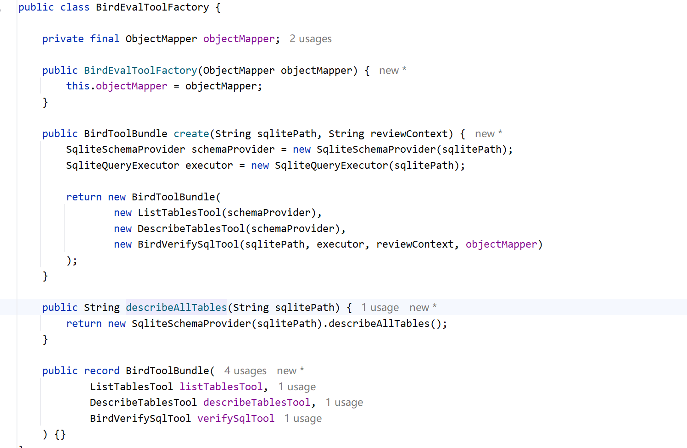

SchemaProvider 的绑定从启动时换成了请求时：每来一道题，拿它的 sqlitePath 现场构建一个 SqliteSchemaProvider，再用它组装出三个工具，一道题绑定一组工具，用完即弃。SqliteQueryExecutor 是 verifySql 底层的执行器，同样绑定当前题目。

这样装配工具后，我们通过 Python 评测脚本并发跑题，每道题注入各自的 bundle 工具，互不干扰。

执行流程

先看 listTables、describeTables这两个方法：

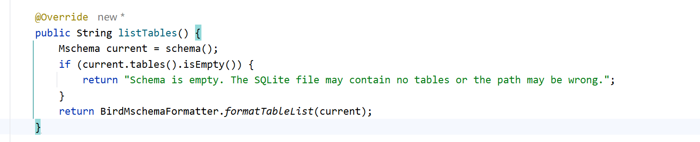

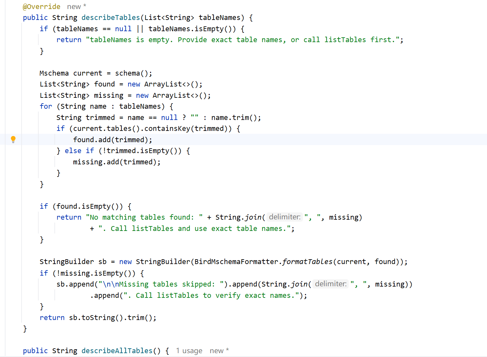

他们都是一样的套路：**自己不碰数据库，数据统一从 schema() 方法中获取**，拿到 Mschema 后交给 BirdMschemaFormatter 渲染成文本，区别只是渲染内容不同，一个渲染表清单，一个渲染指定表的字段详情。

另外还有一个 describeAllTables 方法，他是一次性输出全库所有表的字段详情，是给 LLM 直连评测（不经过 Agent 编排）的场景用的，这里不涉及。

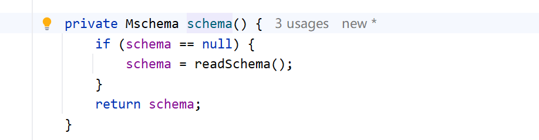

一次 Schema 构建要把所有表、字段、外键、CSV 描述、样例值都过一遍，成本不小，所以我们构建一次就可以了，后面不管调几次工具，用的都是这一份，懒加载。

真正的构建在 readSchema，流程如下：

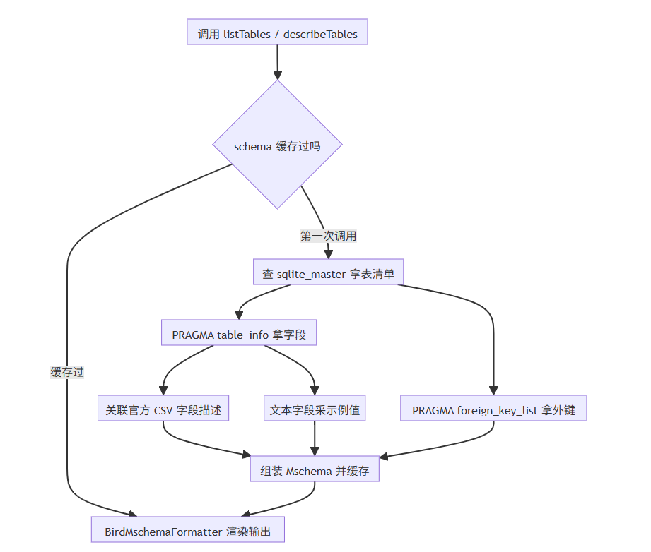

构造函数中会把 sqlitePath 转成 jdbc:sqlite 连接字符串；从文件名推导 dbId，BIRD 的约定就是 db_id 目录下放 db_id.sqlite，读库失败会兜底返回空 Schema。

读取表清单

```text
private static final String LIST_TABLES_SQL =
        "SELECT name, type FROM sqlite_master " +
                "WHERE type IN ('table', 'view') AND name NOT LIKE 'sqlite_%' ORDER BY name";
```

sqlite_master 是 SQLite 的系统表，记录库里所有对象。type 限定只要表和视图，再排除 sqlite_ 开头的内部表，剩下的就是模型能查询的业务表。

读取字段信息

拿到字段名、类型、是否非空、是否主键。每个字段最终组装成一个 FieldDef。

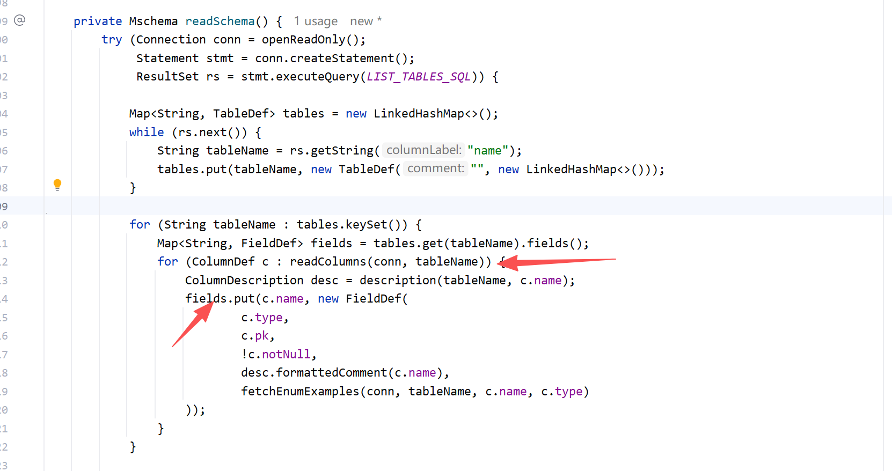

对每张表执行 PRAGMA table_info：

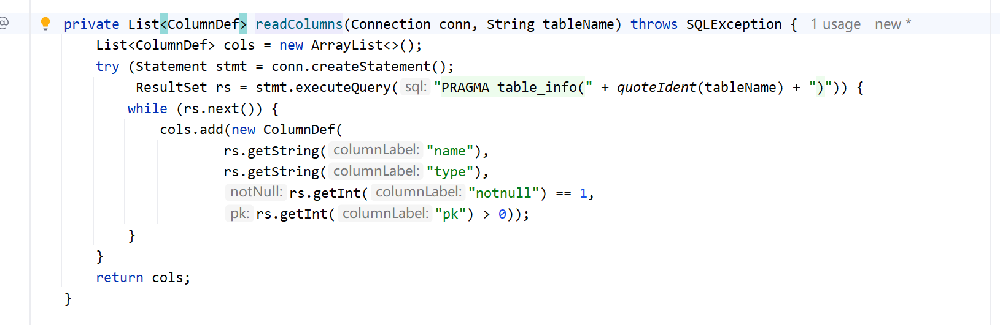

关联官方字段描述

结构信息 PRAGMA 能给，但字段的业务含义它给不了。而且 SQLite 没有 MySQL 那样的 COMMENT 机制，字段含义没法存在表结构里，所以 BIRD 官方把这份信息单独放在 CSV 里：每个数据库目录下有个 database_description 目录，每个 CSV 对应一张表，文件名就是表名。

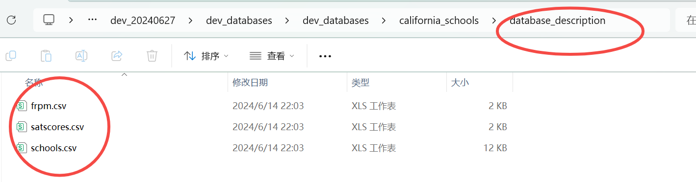

description方法就是去读取字段描述：

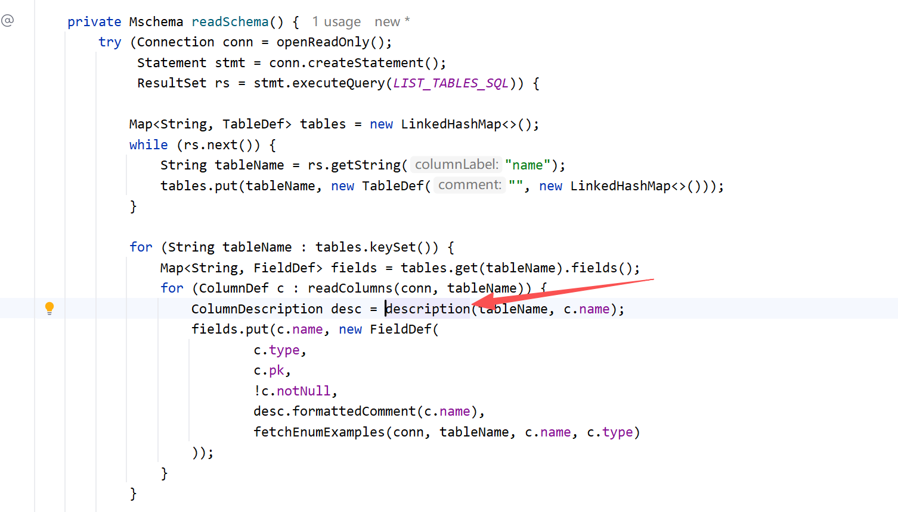

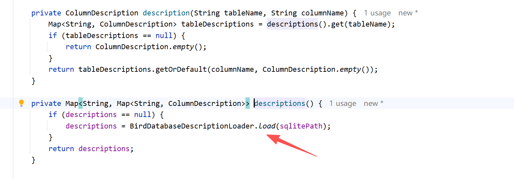

最终的调用就是 BirdDatabaseDescriptionLoader 从 sqlitePath 的父目录定位这个目录并读取：

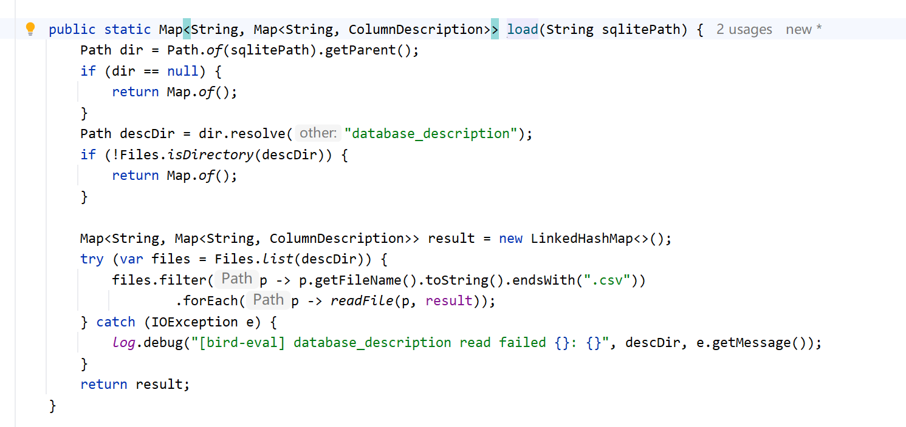

每个字段对应一条 ColumnDescription，三个信息：alias（别名）、description（含义描述）、valueDescription（取值说明）。

最后还需要对这个 ColumnDescription 做一些格式化处理 formattedComment：

- description 直接输出；
- alias 和原列名归一化后一样就不输出。比如列名是 stu_id，alias 也是 stu_id，写出来纯属废话；只有 alias 真带了新信息才输出；
- valueDescription 以 Values: 开头输出。特别地，官方有些字段标了 unuseful，这时会输出一条显式提示：不要对这个字段做过滤、分组，除非题目明确要求。这是在对抗数据集里的干扰列。

采集示例值

字段有了含义还不够。还记得我们业务 DataAgent 的 MSchema 吗？我们还需要去采集一些示例值，模型写条件时就不容易猜错。采样同样只针对文本字段：

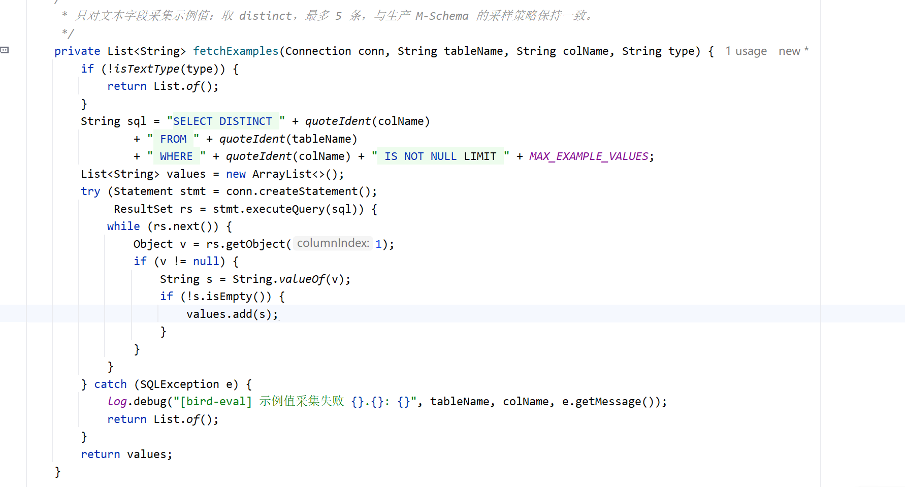

SELECT DISTINCT 去重，最多采 5 条。数值、时间这些类型格式是确定的，不用采，只有文本字段的取值花样多，采了才有信息量。

读取外键

多表 JOIN 的依据是外键。对每张表执行 PRAGMA foreign_key_list，把结果整理成 FkDef，四个信息：本表的表名、外键列，指向哪张表、哪个列。处理逻辑和业务侧一致，业务侧走 JDBC 的 getImportedKeys，这里换成 SQLite 的 PRAGMA，通道不同，组装的都是同一个 FkDef。

这份外键信息其实被用了两次。第一次就是上面说的，渲染进 Schema 给模型看，帮它把 join 写对。第二次在下一讲的 verifySql 里：校验模型交上来的 SQL 时，用的还是这同一份外键信息。比如 satscores 和 schools 之间明明声明了外键（cds 对 CDSCode），模型的 SQL 却拿学校名字去连接两张表，校验时一查外键声明就能发现不对，报错打回去重写。

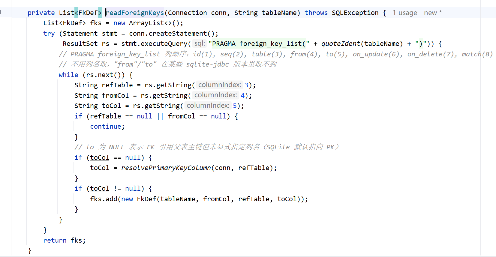

组装 MSchema 输出

表、字段、外键都齐了，组装成一个 MSchema 对象。这个领域模型是和我们前面业务 DataAgent 共用的，也是两个工具类能直接复用的根本：不管底下是 MySQL 还是 SQLite，工具拿到的都是同一种结构。

最后由 BirdMschemaFormatter 渲染成模型看到的文本，formatTableList 渲染表清单加全库外键，给 listTables 用：

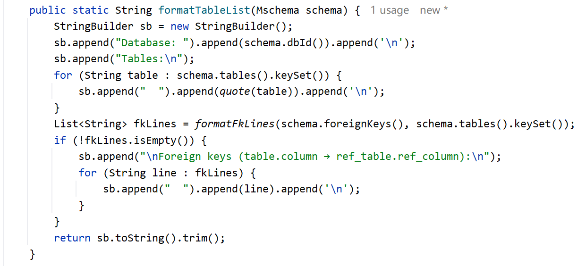

formatTables 渲染指定表的字段详情加相关外键，给 describeTables 用：

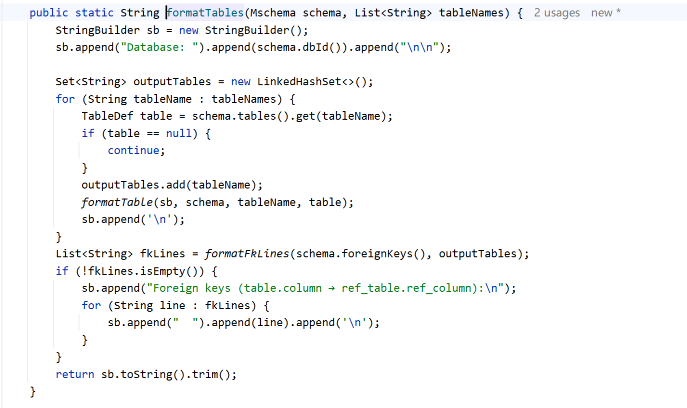

这里没有直接复用业务侧的 `MSchemaFormatter`，而是针对 BIRD 单独实现了 `BirdMschemaFormatter`。因为 BIRD 是全英文评测，渲染格式上做了几处针对性调整：统一输出英文，标识符统一使用反引号包裹，以应对字段名中的空格和括号；字段含义放在字段下方并完整保留换行，避免丢失 CSV 中的多行说明；PK、NOT NULL 和外键指向放在字段最前面，方便模型快速识别约束和 JOIN Key。虽然 Formatter 是两套，但提供给模型的核心信息完全一致，仍然包括表、字段、类型、含义、示例值和外键。

小结

这一讲把评测环境的 Schema 链路讲完了。装配上，工具不能提前构建注入，因为 sqlitePath 是评测脚本运行时传进来的，所以由 BirdEvalToolFactory 按题动态构建，一道题一组工具，用完即弃。构建上，两个入口方法统一从 schema() 懒加载拿数据，readSchema 里查 sqlite_master 拿表清单，PRAGMA 拿字段和外键，官方 CSV 补字段含义，文本字段采示例值，最后组装成和业务共用的 Mschema。

对模型来说，体验和业务 DataAgent 是一致的：先 listTables 浏览全库，再 describeTables 深入候选表，渐进式加载没有变。变的只有两处：数据从 MySQL 换成 SQLite，渲染格式换成 BIRD 定制的英文版。下一讲讲 verifySql，看它怎么原样执行 SQL 并校验结果。

---

来源: https://thoughts.aliyun.com/workspaces/6963289eb0fc2e001bb052eb/docs/6a86bafd3fb9180001f1b38a
