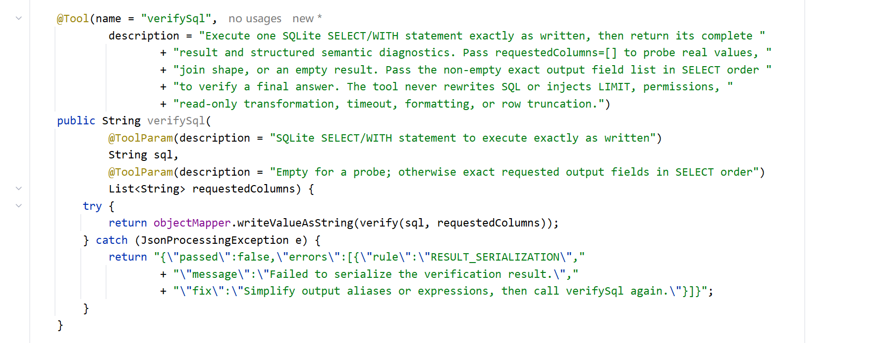
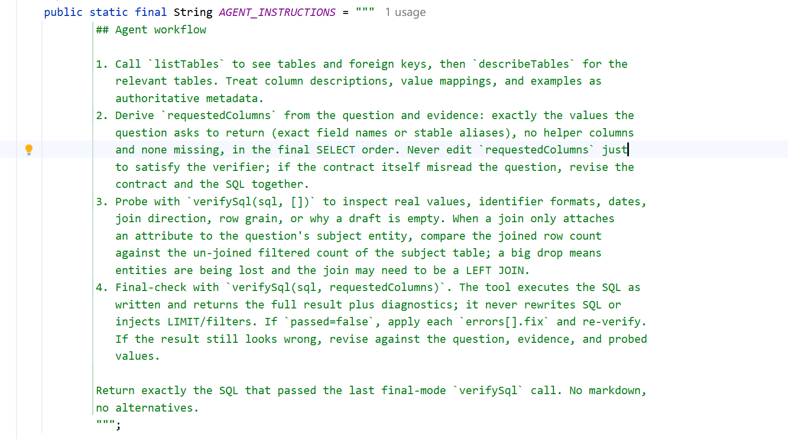
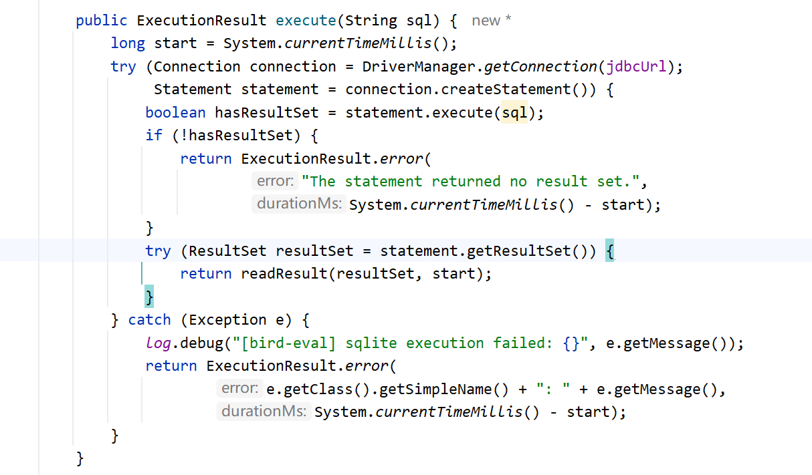
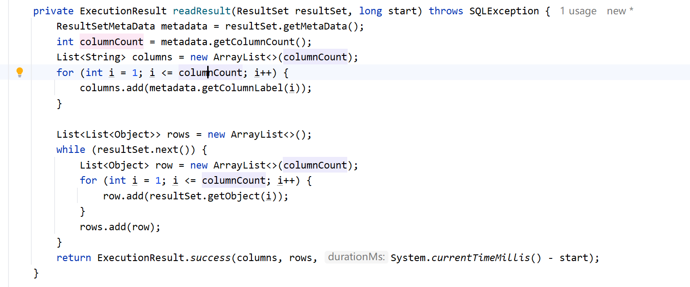
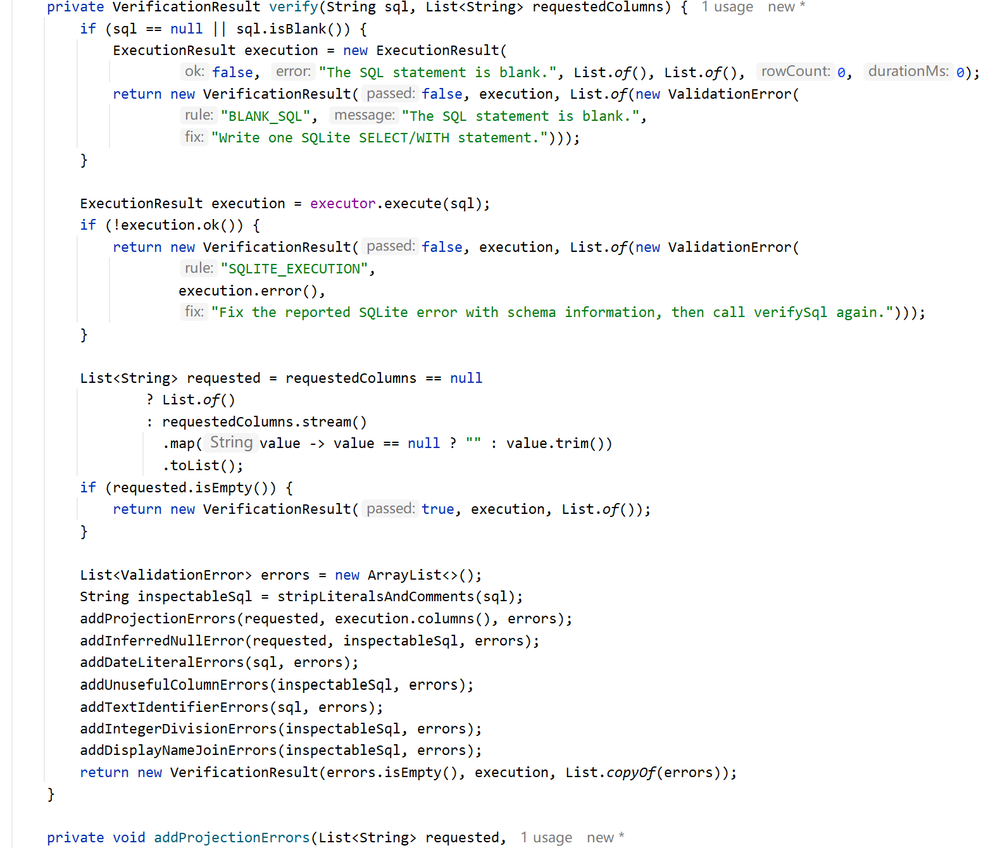
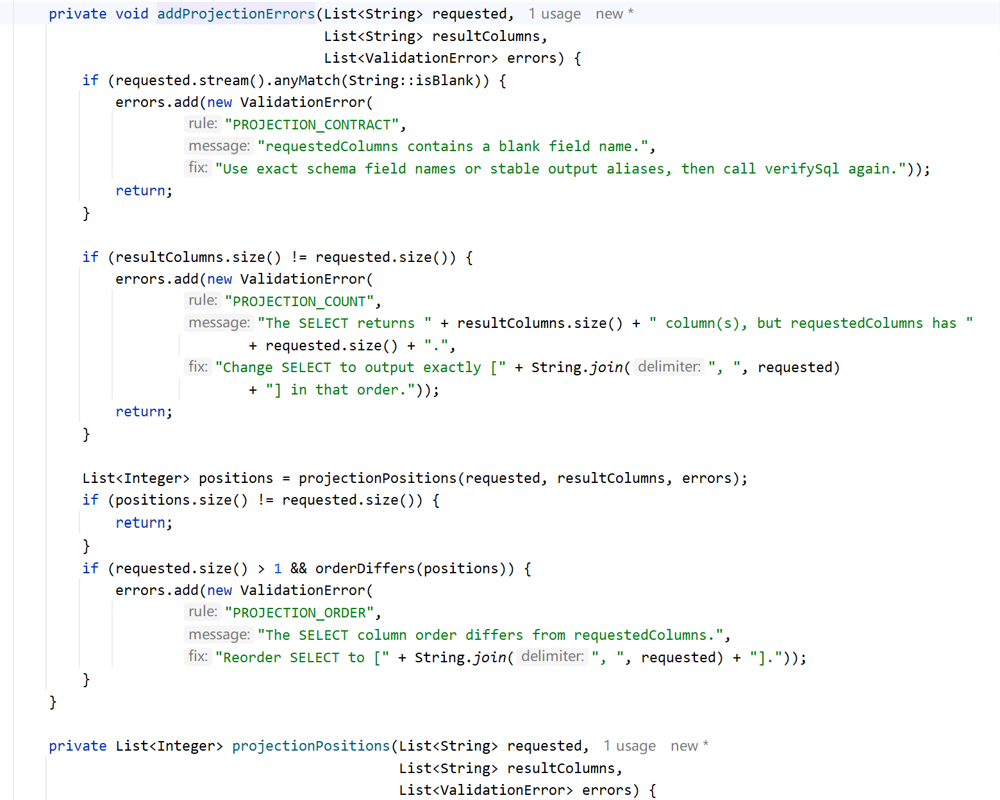

# ✅BIRD评测：执行验证工具

评测 DataAgent 的三个工具里，listTables、describeTables 是直接复用业务代码的，真正新加的工具就是 verifySql。这一讲就把它拆开，看看它是如何同时实现执行和验证的。

为什么评测需要执行 SQL

先想一个问题：BIRD 评测要求评测 DataAgent 输出的是 SQL，不是查询结果，评分时脚本会拿提交的 SQL 自己去执行、和标准 SQL 的结果比对。那 Agent 是不是生成完 SQL 就可以直接结束了，根本不需要执行？

理论上确实可以不执行。但这样的话，和我们直接把 schema、evidence、question 塞进大模型上下文让它直出 SQL，有什么区别吗？完全没有。业务 DataAgent 里 validateSql、executeSql 做的大量工作，执行、校验、纠错这一整套，全都用不上了。

回忆业务 DataAgent 的核心经验：SQL 只有执行了才知道对不对。执行报错，错误信息回灌给 LLM，驱动它重写；执行成功，还能对照问题检查结果的字段对不对得上、数量级正不正常。这套闭环正是 Agent 相比 LLM 直出 SQL 的价值所在，没有理由在评测里丢掉。所以评测 DataAgent 的做法是：LLM 每生成一版 SQL，就执行一把，能执行成功、字段和问题对得上、数量级正常，才算过关。这就是 verifySql 要做的事。

为什么不能直接复用 executeSql

业务 DataAgent 的 executeSql，拿到模型写的 SQL 不是直接执行，而是先过一条安全流水线：

这些在生产级业务场景中都是很好的安全防护措施：真实业务库、真实用户，SQL 要防危险操作，权限要隔离，敏感数据要保护，结果规模要控制。但放到评测场景里，情况恰恰不同：

- 拦截危险 SQL：评测 SQL 只用于在独立的评测数据库上生成结果，不涉及真实业务数据，因此不需要引入生产环境那套危险 SQL 防护；
- 强制 LIMIT、行数硬限、结果截断：EX 评分需要将提交 SQL 与标准 SQL 的执行结果进行全量比对，少返回任何一行都可能直接判错；
- 权限改写、数据脱敏：评测没有真实用户体系，也不存在需要保护的敏感数据；
- EXPLAIN 预检查：评测核心是 SQL 能否正确执行并得到正确结果，额外的性能预检查没有必要，也可能引入不必要的执行限制。

更重要的是，两者的目标其实是反的：生产业务侧通过各种加工来保证 SQL 和结果安全可控；而 BIRD 评分要求提交的 SQL 原样执行，任何额外加工都有可能改变执行语义，导致结果偏离模型本意，最终影响评分。所以对 executeSql 的态度是取其精华、去其糟粕，这里的糟粕不是说它不好，而是不适合评测：安全流式线的那些加工要去掉，执行、校验结果、错误回灌这套精华要保留。落地就是新写的 BirdVerifySqlTool，执行则依赖它内部的 SqliteQueryExecutor。

|  | executeSql（业务） | verifySql（评测） |
| --- | --- | --- |
| 目标 | 安全可控，结果给人看 | 原样执行，供结果比对 |
| SQL 处理 | 校验、注入 LIMIT、权限改写 | 一字不改 |
| 结果 | 脱敏、预览截断 | 全量返回 |
| 校验方向 | 安全性：能不能执行 | 语义：结果形态对不对 |
| 输出 | markdown 分析报告 | JSON 结构化 |

verifySql 的两种模式

先看 verifySql 的工具提示词：

两个参数：sql 是要执行的语句；requestedColumns 是这份 SQL 预备输出的字段清单，这个参数是否为空，会把调用分成两种模式：

- **探针模式**：传空列表。模型写 SQL 的中途想看看真实值长什么样、join 方向对不对、为什么结果是空的，就传空执行一次。工具只执行不校验，完整结果原样返回，此时 passed=true 只代表执行成功，不代表答案通过了校验。
- **终验模式**：传非空清单，内容是从题目推导的输出字段，按 SELECT 顺序排列。执行完拿实际结果的列和清单比对，再做几组语义检查，全部通过才 passed=true。

另外我们在系统提示词 BirdEvalPrompts 里也会有对应的工作流要求：

写 SQL 的过程中，模型用探针看真实数据，确认编号的实际格式、日期的存储方式、join 方向、为什么结果为空这些细节；SQL 定稿后切终验，passed=false 就逐条修改，再用同一份 requestedColumns 重新验证，直到通过才输出最终 SQL。

SqliteQueryExecutor

看完两种模式，再来看执行部分，执行统一交给构造时注入的 SqliteQueryExecutor：

这个类整体很短，核心功能就是把 SQL 按提交的原样执行，刻意不做校验、不改写、不设超时、不强制只读、不注入行数限制，目的就是绝对透明，返回原始结果。

执行结果读两样东西：columns 是结果每一列的输出名，有别名（AS）时就是别名，这是后面投影校验的比对基准；rows 就是全量数据，模型要看的真实数据。

整体流程

主流程 verify()，其中的 executor 就是构造时注入的 SqliteQueryExecutor：

前两道是硬错误：SQL 为空、SQLite 执行报错，直接失败返回。探针模式走到这里就结束了，只会碰到这两种错误。

终验模式会多走七组检查，每条错误是一个 ValidationError，三个字段：rule（违反了哪条规则）、message（哪里错了）、fix（怎么改）。整个结果序列化成 JSON 返回，模型逐条照 fix 修，修完了会再调一次。

终验检查

评测采用的是**严格的结果集比对**。很多 SQL 在 SQLite 里完全能正常执行、不报任何错，但结果就是和标准答案对不上：多带一列辅助列、自作主张加 `IS NOT NULL` 丢了行、日期格式想当然、整数除法被截断。这些都不是语法错误，而是**语义和题意理解上的错误**，所以要靠一组针对性的检查来识别。

**这些规则怎么来的，要坦白说明：说白了有点定制化。来源就是一个循环：跑一批题，打开错题分析报告，让 Claude Code 逐题对比预测 SQL 和标准 SQL，找出新的丢分模式，沉淀成一条新规则，再跑下一批验证效果。每条规则背后都是一类真实踩过的坑，没有一条凭空设计。为什么可以这么干？因为在当前评测里，verifySql 就是 Agent 相比直连 LLM 的唯一增量优势，规则库就是这个优势的核心载体，借助 Claude Code 持续维护规则本身就是这个玩法的一部分。边界也要说清楚：定制化只为拿分服务，生产环境的校验规则追求通用和安全，不能把过拟合的规则带回去。**

七组检查里，投影契约最重要，单独展开讲，其余六组一张表就看懂了。

投影契约

四条判断规则：

- PROJECTION_CONTRACT：清单里有空字段名；
- PROJECTION_COUNT：SELECT 的列数和清单数量不一致，比如题目要两列，SQL 输出了三列，多出来的辅助列在比对时就是错；
- PROJECTION_NAME：结果列里找不到唯一匹配的请求字段，这时提示模型要么给输出值起对应的 alias，要么修正清单；
- PROJECTION_ORDER：都匹配上了但顺序不对。

字段匹配用 normalized 归一化后再比，全部转小写，再去掉所有非字母数字字符，这样 studentId、student_id、STUDENT ID 都能对上，宽容书写差异，但数量和顺序卡死。

其余六组规则

构造工具时会通过 loadColumnMetadata 把官方 CSV 描述、列类型、外键声明这些元数据一次性预加载好，后面这些检查全是在这份元数据上做的：

| 规则 | 拦什么 | 判定依据 |
| --- | --- | --- |
| 隐式 NULL 过滤 | 题目没提缺失，SQL 却加了 IS NULL / IS NOT NULL，丢行 | 题目和 evidence 文本 |
| 日期字面量格式 | '2024/01/15' 这类斜杠日期，字典序比较一行匹配不上 | SQL 字面量 |
| 干扰列 | 用了官方标注 unuseful 的干扰列 | 官方 CSV 元数据 |
| 文本标识符改写 | 拿 TEXT 编号补零、CAST 成数字、SUBSTR 截短、TRIM 去前导零 | PRAGMA 列类型 |
| 整数除法 | 两个 INTEGER 列直接相除，商被截断成整数 | PRAGMA 列类型 |
| 展示名 Join | 两表有声明外键，join 却拿学校名字这类展示字段互连 | PRAGMA 外键声明 |

这六组有两个共同的设计原则。

第一，判定依据要么是题目文本，要么是库上的客观事实。尤其是列类型和外键这种，PRAGMA 读出来白纸黑字写在库上，工具不猜题目意图，只陈述"这两列是整数"、"这两张表有外键"，信不信、怎么改由模型决定。连 fix 的措辞都遵守这个原则：比如日期规则不断言"必须改成 ISO 格式"，只提醒先用探针看一眼库里真实存的格式再照着写，万一某个库真用斜杠存日期，模型看了探针结果自己会明白。

第二，误杀防护。分子已经被 CAST AS REAL 包住或乘过 1.0 的除法不报，说明模型自己处理过了；题目或 evidence 点名要用的字段不拦。宁可少拦，不能把对的改错。

小结

`verifySql` 同时承担执行和验证两个职责。执行部分依赖 `SqliteQueryExecutor`，做到**绝对透明**：SQL 一字不改，结果全量返回。它和业务侧 `executeSql` 的多道安全管线是两个极端，但本质上是场景目标不同——评测要的是**原样执行后的结果比对**，任何额外加工都有可能改变结果，反而污染评测。

验证则分为**探针和终验**两种模式：探针让模型查看真实数据，帮助确认字段含义和数据分布；终验通过七组规则拦截那些**SQL 能正常执行，但结果很可能答错**的典型模式。将报错信息再反馈给模型，让它继续迭代 SQL。

对模型来说，整体体验依然和业务 DataAgent 是一致的：SQL 执行失败或校验不通过，错误信息都会反馈，驱动 ReAct 循环重新生成。**变化的只是校验目标**：业务侧关注的是这条 SQL 是否安全可靠，评测侧关注的则是这个答案是否准确。

最后，这些校验规则其实并不是一成不变的，都是围绕 BIRD 评测的丢分原因，逐步沉淀出来的。数据集里的脏数据和干扰内容不止这七类，后续可以借助评测的结果，让 AI 进行错题分析持续补充规则，这就是评测分数继续提升的空间。

---

来源: https://thoughts.aliyun.com/workspaces/6963289eb0fc2e001bb052eb/docs/6a86bb2874e40300010bd262
