# ✅BIRD评测：如何跑一次完整的评测？

前面改造完成后，评测 DataAgent 就已经 ok 了，这一节我们就来正式评测一下，看改造后的评测 DataAgent 到底效果如何。评测接口一次只接收一道题，BIRD Dev 评测集有一千五百多道题，总不能一道道手工调，所以整个评测全流程由一个 Python 脚本 bird_eval_runner.py 驱动，并发调接口生成 SQL，本地评分，产出报告。

跑前提示

先说清楚成本。每道题 ReactAgent 要跑多轮循环，每轮都是一次真实的模型调用，一千五百多道题全量跑完，光 token 费用可能就要好几十块；如果用的是 qwen-3.7-plus 那种更贵的模型，成本还要再往上翻。所以谨慎调用，建议跑 100 题看看效果就可以了。

大家学习这套东西，主要是学思路：搞清楚 DataAgent 评测的流程、原理是什么，怎么对比、怎么算分。并不是说一定要跑完全量、去和BIRD 在线榜单比个高低，我们的目标是理解 DataAgent 评测这件事本身。

测评准备

跑评测前需要准备三样东西：

- **BIRD dev 数据包**：官网下载解压后的目录，里面有两样东西我们需要用到，
- 一个是：dev.json 评测集，一千五百多道题，每道题一条记录，包括 **question_id、db_id、question、evidence、SQL、difficulty**。其中 SQL 是标准答案，只在评分时用，整个过程不会发给模型。
- 另一个是：dev_databases 目录，每个 db_id 一个子目录，里面放对应的 sqlite 的数据库。这里有个小坑：有的压缩包解压出来，dev_databases 里面又套了一层 dev_databases，脚本对此做了兼容，检测到嵌套会自动下钻一层，不用手动挪目录。
- **评测服务**：启动 dodo-agentx，默认监听 `http://127.0.0.1:8889`，评测接口是 `POST /bird/eval/question`。
- **输出文件**：脚本固定输出在项目的 scripts/report/ 目录下，pred.jsonl 记录预测结果，pred.report.md 是最终报告。这两个文件不用手动建，首次运行自动生成。

参数

脚本参数就一个必填：--data-root 指向数据包根目录，也就是你下载解压的 BIRD Dev目录，我的本地目录是：`D:\download\dev\dev_20240627`

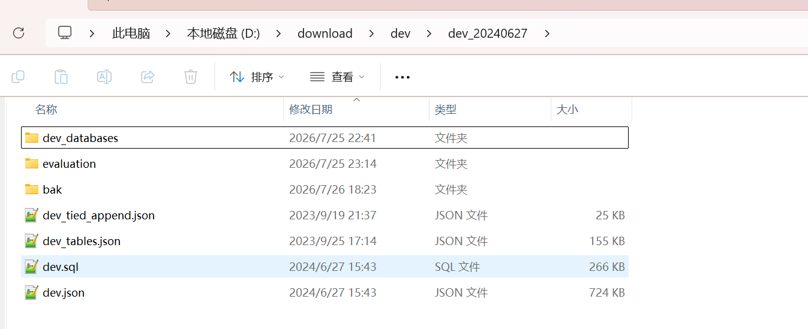

| 参数 | 默认值 | 作用 |
| --- | --- | --- |
| --base-url | [http://127.0.0.1:8889](http://127.0.0.1:8889) | 评测服务地址 |
| --endpoint | /bird/eval/question | 评测接口路径 |
| --output | scripts/report/pred.jsonl | 预测结果文件，同时也是断点状态 |
| --max-questions | 0（全部） | 只跑前 N 题，控制成本就靠它 |
| --concurrency | 5 | 并发跑题数 |
| --sql-timeout | 300 秒 | 评分时单条 SQL 的执行超时 |
| --rerun-failed | 关 | 重跑上次失败的题 |

整体流程


流程分两个阶段：

- **跑题**：读 dev.json，按并发数把题目逐个 POST 给评测接口，每道题生成的 SQL 追加写入 pred.jsonl；
- **评分**：题目跑完后，预测 SQL 和标准 SQL 分别在当题数据库上执行，比对结果集算分，生成最终报告。

跑题

入口：run 方法

脚本跑起来的最后一行才是真正的开始，先调 parse_args 解析命令行参数，然后进入 run 方法。run 是全流程的总调度，跑题和评分两阶段都在它里面：

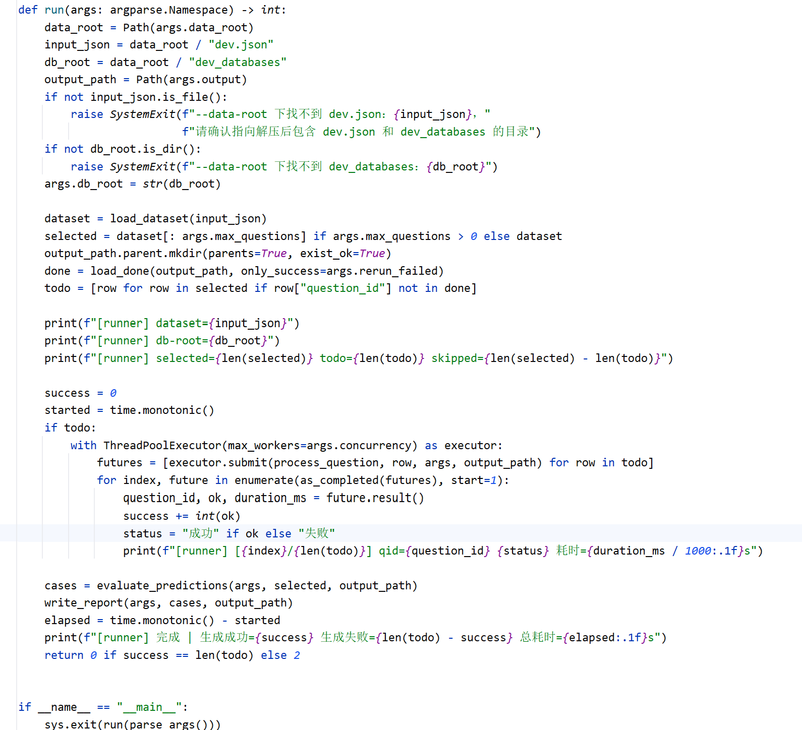

跑题阶段：

- **定位并校验数据**：由 --data-root 推导出 dev.json 和 dev_databases 的路径，两个都做存在性检查，缺了直接退出；
- **加载数据集**：load_dataset 把 dev.json 读成列表，逐条校验 question_id、db_id、question、evidence、SQL、difficulty 六个字段齐不齐，缺字段的行直接拦下；--max-questions 有值就只截取前 N 题；
- **算断点**：load_done 读 pred.jsonl，把已记录的 question_id 收集起来，过滤出本次真正要跑的 todo。默认跑过的全跳过；加 --rerun-failed 后，失败的题不算完成，会重新跑；
- **开线程池并发跑题**：ThreadPoolExecutor 的 max_workers 就是 --concurrency，todo 里每道题 submit 一个 process_question 任务，as_completed 逐个收回结果、打进度日志；
- **收尾进入评分**：全部任务收完，调 evaluate_predictions 评分，再 write_report 出报告。

单题调用：process_question

线程池里每个任务就是 process_question，一道题从拼路径、发请求到写结果，全在这里。

先看数据库路径怎么来。db_id 就是我们评测集每道题都会带的一个数据库的关联键：

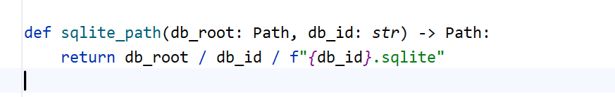

process_question 开头先做一道检查，再拼请求体：

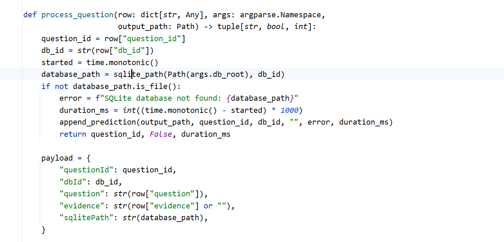

数据库文件不存在，直接记失败，连请求都不发。请求体五个参数：questionId、dbId 标识题目和数据库；question、evidence 是题目和参考知识；sqlitePath 是当题数据库文件的完整路径，第二讲说过它不写死在配置里，由调用的脚本每题传进来，这个脚本就是那个调用方。DataAgent 拿到的就是 question、evidence 和这个数据库，标准 SQL 一定不能放在里面。

真正发请求的是 call_eval，URL 由 --base-url 和 --endpoint 拼出来，默认 `http://127.0.0.1:8889/bird/eval/question`：

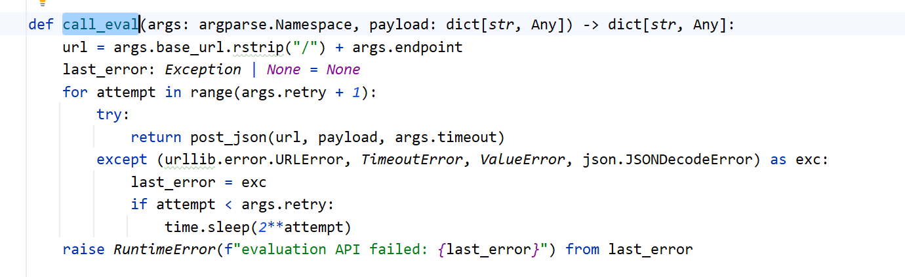

post_json 就是组装 HTTP POST、发 JSON、解析响应，不展开。值得关注的还有这层重试：HTTP 超时或服务异常时指数退避，间隔 1 秒、2 秒，最多重试 2 次，全部失败才往上抛，由 process_question 记成失败。

拿到响应后，process_question 判定这道题算不算成功：

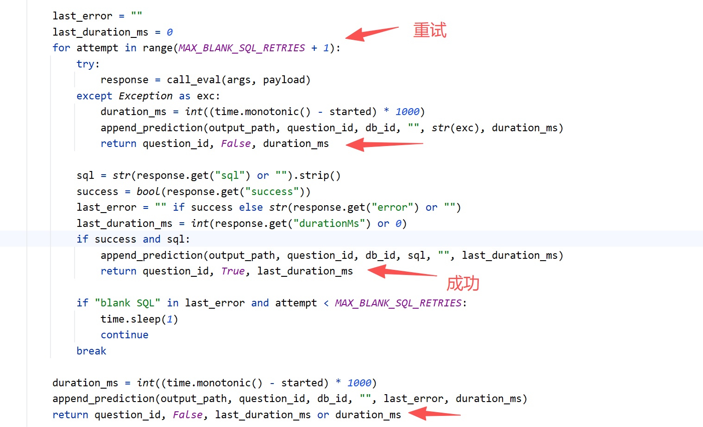

接口返回四个字段：success、sql、error、durationMs，success 为 true 且 sql 非空才算生成成功。有一种特殊情况：接口成功了但 SQL 是空的，说明模型这轮由于一些原因没能给出最终答案，脚本会间隔 1 秒重试，最多 3 次，还不行就记失败。

结果落盘：pred.jsonl

不管成功失败，每处理完一题立刻追加写一行进 pred.jsonl：

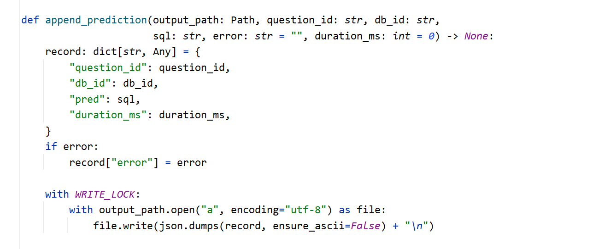

WRITE_LOCK 是线程锁，多个线程同时追加写同一个文件必须加锁，否则行会串。

这个文件被设计成两用：它既是最终预测结果，也是断点状态。一千多道题跑完需要很长时间，中途断网、改代码、重启服务都可能发生，如果每次重跑都从头来，前面已经成功的题就白跑了。有了 pred.jsonl，重跑时 load_done 读一遍文件就知道哪些题已经完成，只处理剩下的。

评分

题目跑完进入评分阶段，这一步完全在本地做，不再调接口，只需要 pred.jsonl 即可。

先交代来源：评分是按照 BIRD 官方评测脚本 evaluation_ex.py 做的，我们借助 AI 做了一些简化和修复，但原理和评分标准完全一致。官方的核心判定就一句话：预测 SQL 和标准 SQL 各自执行，结果集合相等才算对，再按难度分组统计正确率。我们简化的只是工程实现，判定逻辑一字没改。

评分入口：evaluate_predictions

评分的入口是 evaluate_predictions，在 run 里紧跟在线程池后面被调用：

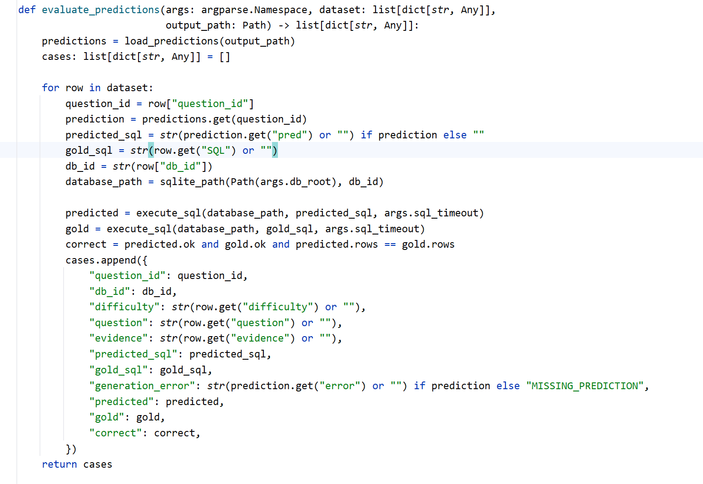

流程四步：

- load_predictions 把 pred.jsonl 读成字典，question_id 做键，按题号直接取到预测 SQL；
- 遍历数据集，每道题取两条 SQL：预测 SQL 从 pred.jsonl 来，标准 SQL 从 dev.json 的 SQL 字段来；
- 两条 SQL 在同一个数据库上各执行一遍，都交给 execute_sql；
- 算出 correct，连同题目信息汇总进 cases，交给后面算分和出报告。

执行：execute_sql

预测 SQL 毕竟是模型生成的，既可能有语法问题，也可能出现全表扫描等慢查询，所以执行层主要做两件事：**只读保护和超时控制**。

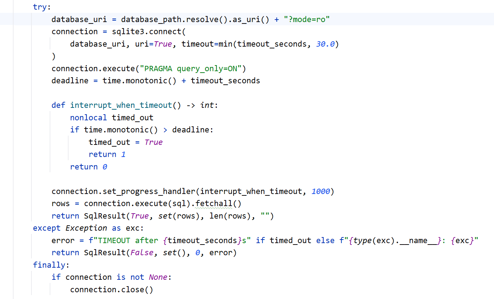

**只读保护做了双保险**：连接层通过 `mode=ro` 以只读方式打开数据库，同时设置 `PRAGMA query_only=ON`。这样即使模型生成了意外的写操作，也不会修改评测库，保证每次评测都在干净的数据上进行。**超时控制**则通过 SQLite 的 `progress_handler` 实现。SQLite 没有直接提供查询超时参数，因此这里注册一个回调，每执行约 1000 条虚拟机指令检查一次截止时间；一旦超时就返回 `1`，由 SQLite 中断当前查询。

**默认超时设为 300 秒**，主要是为了兼顾预测 SQL 和标准 SQL。BIRD 中少数标准 SQL 本身就可能执行几分钟，如果超时设得过短，标准答案都会执行失败，反而把原本正确的结果误判为错误。因此这里宁可适当放宽超时时间，也不能因为执行保护误杀正确答案。

判定：怎么样算通过

两条 SQL 都执行完了，这道题过不过，就看这一行：

```text
correct = predicted.ok and gold.ok and predicted.rows == gold.rows
```

三个条件同时满足，这道题才算通过：预测 SQL 执行成功、标准 SQL 执行成功、两边结果集合完全相同。

比对的是 set(rows)，集合里每个元素是一整行。用集合而不是列表，行顺序不影响结果，**查询出来的字段数不对，不得分**。比对是按整行进行的，标准 SQL 查两列，预测 SQL 多带了一个说明用的辅助列，行内容就成了 (a, b) 对 (a, b, c)，属于两个不同的元素，集合不相等，这题直接就是 0 分。所以 EX 判定看着宽容，实际很严格：不看写法、不看行序，但结果必须一模一样，多一列、少一列都不行。

想通这一点，也就理解了上一讲 verifySql 终验里投影契约检查的意义：模型生成的 SQL 经常能跑通、值也算对，就是顺手多输出了一列，这种 SQL 到评分这关就是 0 分。与其等评分时丢分，不如在 Agent 内部提前拦下来，让它当场改对。

分组算分：score_summary

单题的对错判完了，最后按题目的难易程度分组统计，simple、moderate、challenging 三档各算一个分数，再加一个总的：

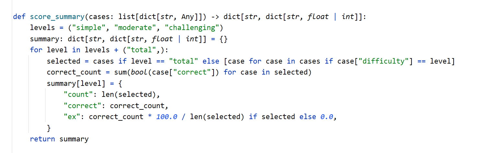

报告

评分完，调用 write_report 方法写 report.md，一共四块内容：

- **分数**：三个难度加总的分数表格；
- **运行摘要**：评分题数、生成失败数、错题数、生成 SQL 累计耗时；
- **生成失败**：question_id 加失败原因，一般是服务异常或空 SQL；
- **错题分析**：每道错题列出问题、evidence、预测 SQL、标准 SQL、两侧的执行情况。

错题分析是这份报告里最有价值的部分，预测和标准 SQL 并排一贴，差异一目了然。上一讲说过，verifySql 的校验规则都是从错题分析里沉淀出来的，这份报告就是后续持续提升评测分数、补充规则的原料。

执行评测

```text
# 先用 10 题验证链路：服务能通、路径能找到、评分能出报告
python scripts/bird_eval_runner.py --data-root D:/download/dev/dev_20240627 --max-questions 10

# 链路没问题，放宽到 100 题：前 10 题已完成会自动跳过，实际再跑 90 题
python scripts/bird_eval_runner.py --data-root D:/download/dev/dev_20240627 --max-questions 100
```

先小批量把链路跑通，确认服务、数据路径、评分都正常，再放开批量。中途断了也不怕，pred.jsonl 记着断点，重跑只处理没完成的题。围绕这个断点机制，有三种常见的重跑姿势：

- **完全从头开始**：把 report 目录下的文件删掉，再运行脚本即可；
- **只重跑失败的题**：默认情况下失败的题也算跑过，重跑时同样会被跳过，加 --rerun-failed 就会让失败的题重新跑；
- **重跑指定错题**：从 pred.jsonl 里把那一题对应的行删掉，再运行脚本，脚本发现这题没有完成记录，就会单独重跑它。

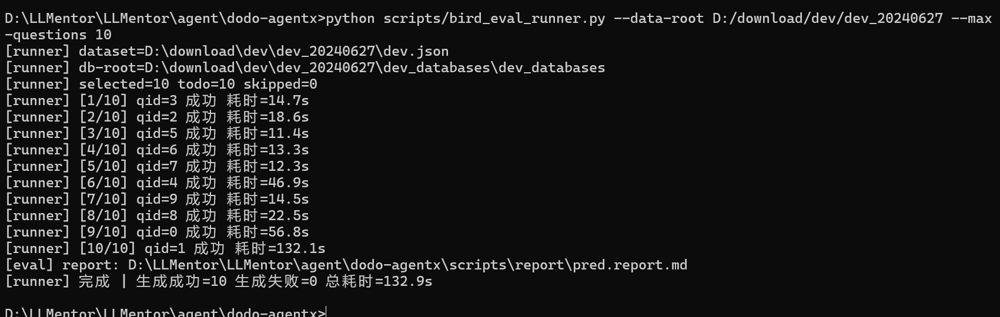

跑完之后，可以打开项目 `scripts/report`目录下的 `pred.report.md`查看报告：

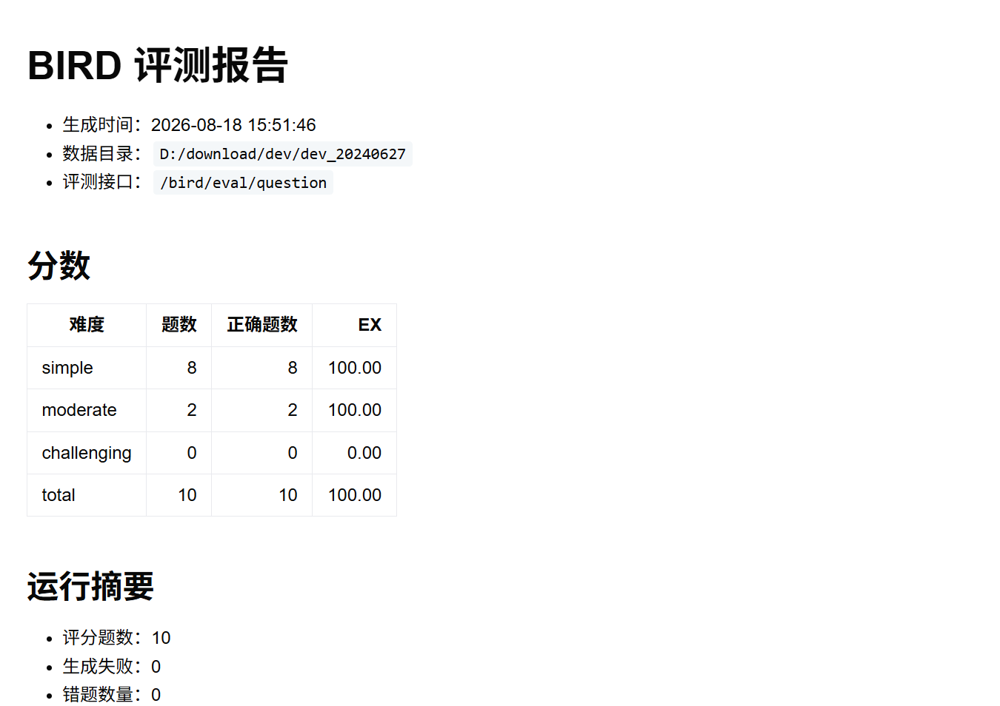

小结

跑题阶段从 run 方法进：解析参数、校验数据、加载数据集、算断点，然后线程池并发调评测接口，每题的结果立刻落进 pred.jsonl；评分阶段不再调接口，evaluate_predictions 把预测和标准 SQL 在本地只读执行，集合比对算准确率，按难度分组出分，生成带错题分析的报告。评分标准和 BIRD 官方脚本逻辑上是一致的。

---

来源: https://thoughts.aliyun.com/workspaces/6963289eb0fc2e001bb052eb/docs/6a86bb3c74e40300010bd39a
