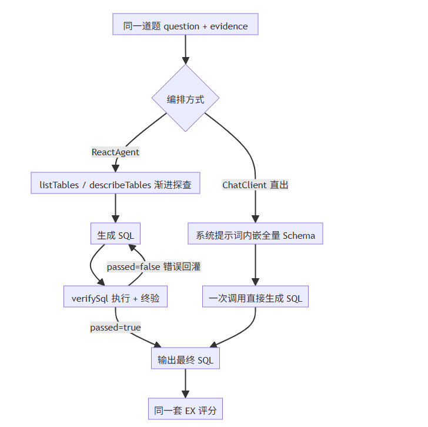
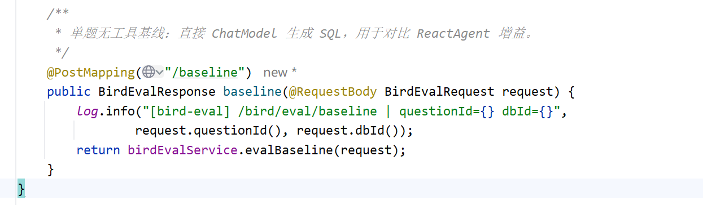
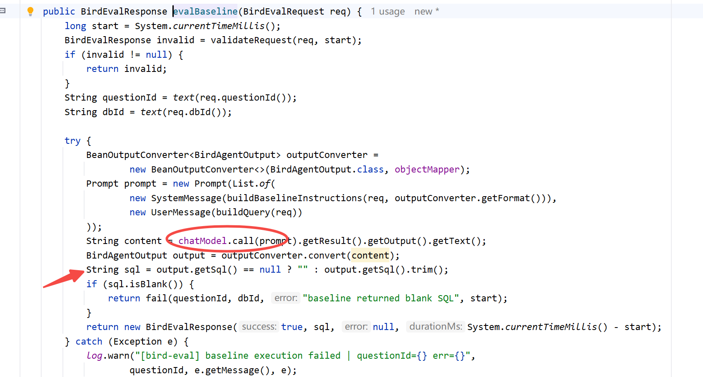
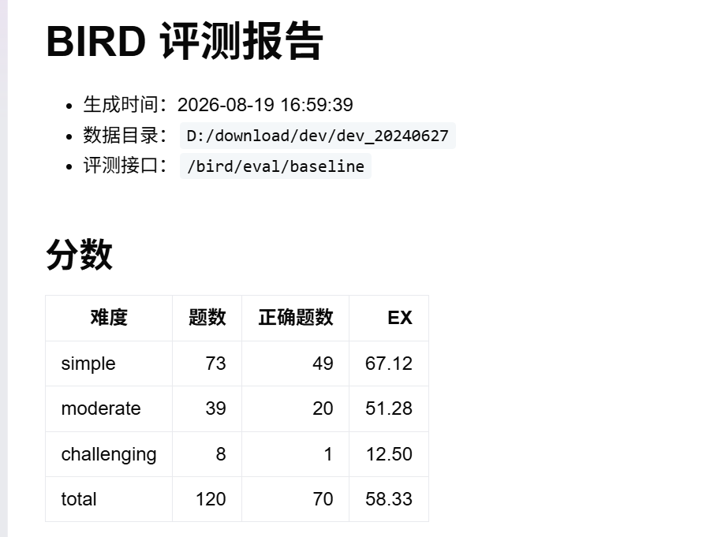
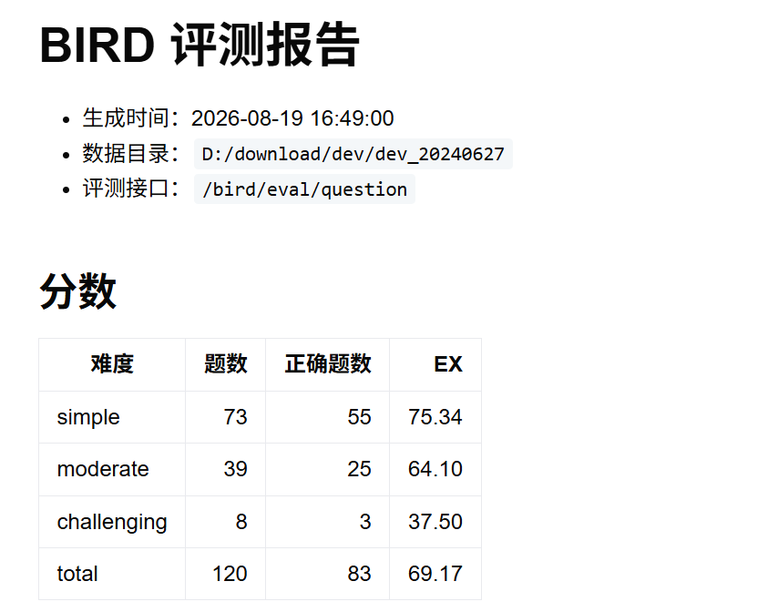

# ✅BIRD评测：如何和BaseLine进行对比？

前面评测跑完了，也有了分数。但分数本身说明不了什么：60 多分是高是低？没有参照物。还记得第二讲立的问题吗，把业务 DataAgent 改造成评测 DataAgent，就是为了验证 ReactAgent 编排到底比直接让 LLM 生成 SQL 强多少。这一讲就做这个对照实验：同一个模型，一边走 ReactAgent 编排，一边直接调 ChatClient 生成，各跑 120 题，用分数说话。

我们后面就称ReactAgent这种方式叫Agent，直接调用 LLM这种方式叫 BaseLine。

控制变量

对照实验的核心是**控制变量**：两组实验除了“是否经过 Agent 编排”之外，其余条件都保持一致，否则任何差异都可能污染实验结论。

- **同一模型**：`BirdEvalService` 中 `chatModel` 只初始化一次，Agent 和 baseline 共用同一个实例，模型、`temperature=0.0` 等配置完全一致。
- **同样的输入**：两组都通过同一个 `buildQuery` 构造 `question + evidence`，输入内容完全一致。
- **同样的背景信息**：两组都使用相同的 Schema 信息。区别仅在于获取方式：Agent 通过 `listTables → describeTables` 渐进式探查；baseline 没有工具，因此直接通过 `describeAllTables` 将**完整 Schema 一次性注入**，也就是说，baseline 获得的信息量实际上更多，不会因为 Schema 信息不足而吃亏。
- **同样的知识规则**：baseline 复用 `COMMON_INSTRUCTIONS` 里"怎么写对 SQL"的通用规则，再拼上 `BASELINE_INSTRUCTIONS` 适配段；`AGENT_INSTRUCTIONS` 那套工具工作流不会给它，不会引入噪声干扰。
- **同样的输出契约**：两边都要求输出 `BirdAgentOutput`（`sql + requestedColumns`），baseline 同样使用 `BeanOutputConverter` 做结构化解析。
- **同样的评分标准**：使用同一套评测脚本、EX 判定逻辑。

因此，**两组真正的变量只有一个：是否使用 Agent 编排。**

baseline 是**单次调用、直接生成 SQL**，没有工具调用、SQL 执行和结果校验；Agent 则通过 **ReAct 循环 + 三个工具**完成探查、生成、执行和校验。这样才能把最终的性能差异尽可能归因于 **Agent 编排 + 工具**。



baseline 链路

入口是 BirdEvalController 新加的第二个接口：



请求体和 /bird/eval/question 完全一样，评测脚本一个字段都不用改。核心逻辑在 evalBaseline：



说白了就是一次普通的 ChatModel 调用：系统提示词 + 用户消息进去，JSON 出来，解析成 BirdAgentOutput。没有循环，没有重试，SQL 生成成什么样就是什么样。

运行脚本

还是我们之前的评测脚本 bird_eval_runner.py，两个参数一换：--endpoint 指向 baseline 接口，--output 换个文件，别把 agent 的预测结果覆盖了：

```text
# ReactAgent 组
python scripts/bird_eval_runner.py --data-root D:/download/dev/dev_20240627 --max-questions 120

# Baseline 组
python scripts/bird_eval_runner.py --data-root D:/download/dev/dev_20240627 --max-questions 120 --endpoint /bird/eval/baseline --output scripts/report/pred.baseline.jsonl
```

跑完 scripts/report/ 下会有两份报告：pred.report.md 是 agent 组，pred.baseline.report.md 是 baseline 组。

结果对比

我们各跑了 120 题，结果如下：





| 难度 | BaseLine | Agent | 差距 |
| --- | --- | --- | --- |
| simple | 67.12 | 75.34 | +8.22 |
| moderate | 51.28 | 64.10 | +12.82 |
| challenging | 12.50 | 37.50 | +25.00 |
| **总分** | **58.33** | **69.17** | **+10.84** |

两份报告原文在项目的 scripts/report 目录下，错题分析都在里面，建议自己跑完打开对照着看。这里有个小插曲值得说：只跑前 100 题时，总分差距其实只有 5 分；加到 120 题后拉开到近 11 分。多出来的 20 题偏难，baseline 只对了 5 题，agent 对了 13 题。所以题目太少分数真的会不稳定，至少跑到 100 题以上再看差距。

看结果主要关注三点：

- **总分差多少**：Agent 领先近 11 分，这就是 Agent 编排交出的直接增益。第二讲说过预期：同一个模型下，执行反馈这类工程手段的收益就是几个到十几个百分点的稳定提升，这个结果符合预期；
- **哪一档难度差得最多**：challenging 差 25 分，moderate 差 13 分，simple 差 8 分。题目越难，越依赖看真实数据和多轮纠错，恰好是 baseline 做不到的两件事；simple 题基本靠模型直觉就能做对，Agent 没有多少发挥空间；
- **错题类型差在哪**：打开两份报告的错题分析对比，baseline 的错题通常是字段猜错、口径跑偏、投影多了少了列，这些都是“没看过数据、没执行过”的问题；agent 的错题更多剩复杂语义理解，错的层次略有差异。

还有一种错题，baseline 做对了、agent 反而做错的。这种题要么是题意或标准答案口径上的模棱两可，谁对谁错都有可能，有点掷硬币；要么是某条校验规则误伤了本来正确的 SQL，发现了就回头修规则。所以规则也不是一成不变的，为了评测拿高分，甚至可以定制化一些 BIRD 专用规则。

**同样的实验还可以延伸一步：换一个更强的模型再跑一轮，比如把 deepseek-v4-flash 换成 qwen-3.7-plus，会发现两组分数都有提升，我之前拿 qwen-3.7-plus 测过，一度可以到 80 多分。这恰好印证了第二讲的结论：模型、Schema、术语口径这些一致的前提下，DataAgent 准确率的上限和下限都取决于模型本身的理解能力，Agent 编排做的不是凭空创造能力，而是让数据分析在生产环境安全、稳定地跑起来，在这个基础上通过校验工具，把模型已有的能力充分发挥出来。**

总结

真正拉开 Agent 和 baseline 差距的是 **ReAct 循环重试 + verifySql 执行反馈**：SQL 只有执行了才知道对不对，语法错误当场暴露，投影不对、臆测过滤、误用干扰列这些“能跑通但结果错”的模式被终验规则拦下，每条错误反馈驱动模型重写再验，一道题内反复逼近正确答案。baseline 一次生成定终身，错了就是错了，没有任何纠错机会。所以这也是 Agent 编排价值的核心。

另外 verifySql 的规则是**可以持续迭代的**：错题分析里发现新的丢分模式，就沉淀成一条新校验规则，下次评测同类错误在提交前就被拦下。但要记住边界：生产环境的校验规则要的是通用和安全，不是对某套数据集过拟合。

到这里我们评测整体就闭环了：从业务 DataAgent 出发，改造出评测 DataAgent，搭好 Schema 和 verifySql 工具链，用 Python 脚本跑题评分，最后用对照实验回答了“Agent 编排有没有价值”。答案的核心就在执行反馈驱动的多轮迭代，外加一套能随错题持续进化的校验规则。

---

来源: https://thoughts.aliyun.com/workspaces/6963289eb0fc2e001bb052eb/docs/6a86bb5b51b144000114c29d
