# ✅Agent评测：如何构建评测体系（Agent执行）

上一篇讲了 Agent 评测为什么难：输出开放随机、执行过程多轮带工具、错误会级联。从这篇开始讲体系怎么搭。

一个完整的评测体系，主要可以分成三个阶段：**Agent 执行 → LLM Judge 评判 → Agent 定位**。第一阶段跑出结果，第二阶段判断结果并打分，第三阶段定位出具体的问题在哪。



本篇先讲第一阶段：**备齐评测原料，把 Agent 跑起来。**

评测需要什么？

正式开跑前，每道题先备齐四样东西：用户的问题、标准答案、预测答案、执行过程 trace 日志。

用户的问题

就是 Agent 实际接收到的原始问题，评测的输入。

标准答案

最重要、也最决定成败的一样。它给不给得出、怎么给，取决于任务是客观的还是主观的。

**客观任务：有正确答案。**

- 典型如 DataAgent 查数，再比如让 Agent 查你自己系统的某个 MCP 接口，返回什么是明确的；
- 标准答案可以提前准备好，DataAgent 就是 gold_sql（标准 SQL）加上它的执行结果；
- 比对不要求一字不差：自然语言报告做不到一字不差，**报告里包含正确的数据**、数值和结论跟标准答案对得上，就算好的回答。

**主观任务：没有正确答案。**

- 典型如让 Agent 写一篇作文、分析某支股票的趋势，这类问题仁者见仁智者见智；
- 给不出唯一正确的答案，标准答案只能空着；
- 评测时不比对事实，只按评分标准评质量。

**客观任务的标准答案一旦定下，就不能再变。** 比如 DataAgent，做法是配一份固定的数据快照，gold_sql 在这份快照上执行，执行完快照就冻结。否则数据一动，标准答案就过期，判分就失效了。

预测答案

Agent 生成的回复、交付报告，也就是我们需要评测的对象。

执行过程 trace 日志

Agent 不是 LLM：评 LLM 相对比较简单，一问一答，比对输入输出就行；Agent 是一条复杂的调用链路，多轮 ReAct 循环、上下文压缩、工具调用、和大模型的每一次交互，任何一环都可能出错。所以**调用日志链路一定要保存下来**，只存最终答案，中间环节全丢，一旦判错，出了问题从哪查起都不知道。

**我的 agentx 框架里就带了 trace 记录的能力，把每一轮 ReAct 和大模型交互的入参出参全部落库**。

先让 Agent 跑起来

原料备齐，把题目丢给 Agent，让它完整跑一遍。一次运行就是一轮一轮的 ReAct 循环：思考、调工具、看结果、再思考，直到它认为可以输出最终答案：



为什么需要跑多次？

**大模型本身具有一定的随机性，就像人一样，不可能永远不犯错。** 一次答对不代表 Agent 水平一定高，一次答错也可能只是偶发失误。如果只看单次结果就给 Agent 下结论，就像凭一道题判断一个学生的成绩好坏，结论并不可靠。

因此，**更合理的方式是多次运行，用整体表现来衡量 Agent 的能力和稳定性。** 例如每道题独立运行 5 遍、独立判分：

```text
第 1 遍：对
第 2 遍：对
第 3 遍：错
第 4 遍：对
第 5 遍：对
```

最终不只看这道题答没答对，而是看 **5 次中的整体正确率和稳定性**。上面的结果就是 4/5，说明 Agent 大部分情况下能够正确完成，但仍存在一定的不稳定性。

**为什么是 5 遍？** 5 遍只是一个工程上的折中：运行次数越多，对随机性的观察越充分，但评测成本也会线性增加。因此，可以先统一采用 5 遍作为默认配置；如果后续发现某类题目波动较大、需要更高的评测置信度，再针对性增加运行次数。

除此之外，多次运行还有一个额外价值：**时对时错的题，往往比全对或全错的题更值得分析。**

- **5/5 全对**：说明当前题目下 Agent 表现稳定；
- **0/5 全错**：通常说明能力或实现上存在明显问题；
- **2/5、3/5、4/5**：说明 Agent 具备完成能力，但存在不稳定因素，这类题最有分析价值。

对于时对时错的题，可以把**答对和答错时的完整 Trace 放在一起对比**，观察到底是哪一步发生了差异，例如提示词理解、工具调用、上下文压缩、结果总结出现了波动。这样，多次评测不仅能得到一个更可靠的分数，还能帮助我们定位 Agent **“为什么有时能做对，有时做不对”**。

小结

评测体系分三个阶段：**Agent 执行 → LLM Judge 评判 → Agent 定位。** 本篇讲的是第一阶段。

原料四样：用户的问题、标准答案、预测答案、trace 日志。其中标准答案是成败关键：客观任务提前备好 gold_sql 和执行结果，并把数据快照冻结；主观任务给不出标准答案，只能靠评分标准。trace 是 Agent 区别于 LLM 的独有原料，agentx 框架已经内置，每一轮交互的入参出参全在库里。

执行上，**每道题独立跑 5 遍**：LLM 像人一样不可能永远不犯错，单次结果说明不了水平，要看多次运行的整体正确率和稳定性；其中时对时错的题最有分析价值，对错两遍的 trace 一对比，往往就能看出波动在哪。

跑完之后，手上就有了一摞交付报告和一整套 trace。**这些报告到底判多少分、怎么判才稳，下一篇讲。**

---

来源: https://thoughts.aliyun.com/workspaces/6963289eb0fc2e001bb052eb/docs/6a86bcc9a7c8ff000136b921
