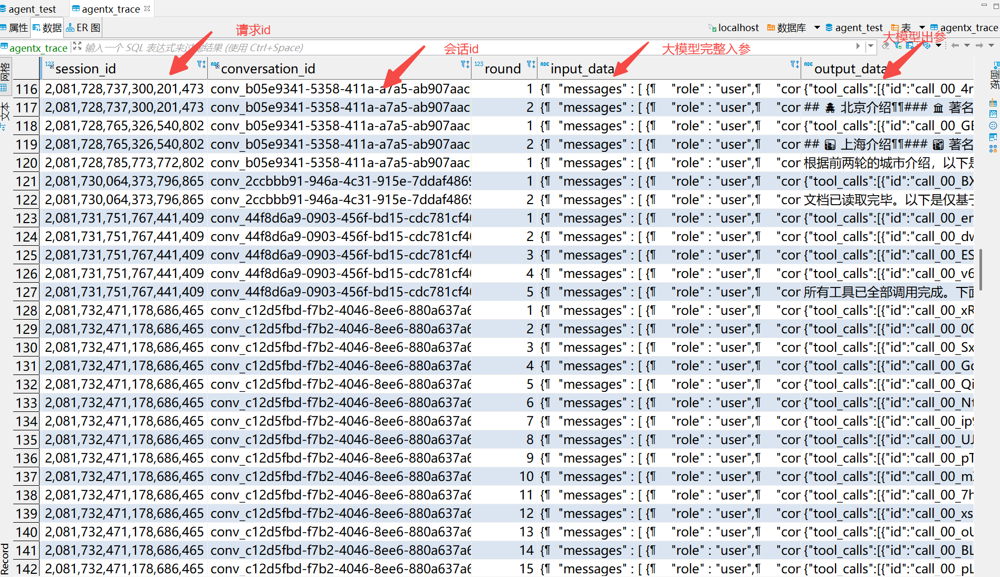
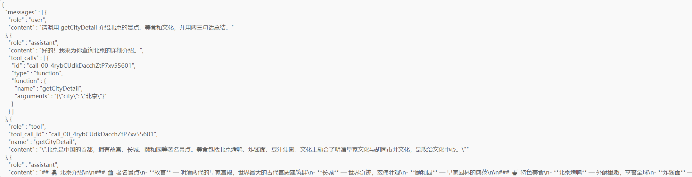

# ✅Agent评测：如何构建评测体系（问题定位）

评测跑完，裁判只告诉你“这份回答是对还是错、质量怎样”，可一旦判定不通过，开发真正关心的问题就变成了：**到底哪里错了？为什么错？**

为什么只靠 LLM 不行？

**LLM 没有工具，它只能看你喂给它的文本材料。** 像 DataAgent 这种客观任务、答案又是静态的，gold （标准答案）和 trace 日志都能事先准备好塞进提示词，纯 LLM 确实还能分析出问题大概出在哪。

但其他场景就不行了，比如：查天气、查你自己的业务系统，数据是动态变化的，定位的时候事实还在变，纯 LLM 没办法现场核实。**它需要“把正确答案查出来”的能力，所以必须得是带工具的 Agent。**

trace 日志

不管哪种场景，定位问题最关键的原料都是 **trace**。

我的 agentx 框架里，有一张表叫 agentx_trace表，trace 是按会话组织的，一轮对应一组记录（多条），把每轮 Agent 和大模型交互的入参出参全部存储落库：



比如input_data其实存储的就是和LLM的交互的入参：



而output_data存储的就是LLM的回复，比如工具调用的toolcall：

```json
{
	"tool_calls": [
		{
			"id": "call_00_ES1i1aR82afx3c4tFJP63308",
			"type": "function",
			"name": "getCityDetail",
			"arguments": "{\"city\": \"广州\"}"
		}
	]
}
```

所以 agentx 框架的这个trace功能，其实就是把一次任务中，中间所有的和大模型交互的步骤都记录下来，方便后续的追溯。



看懂这个结构，就明白它为什么好用：**不论是 Agent 内部的上下文压缩、工具调用，还是大模型返回的 toolcall 参数，在 trace 里都有据可查。** 每一轮 Agent 和 LLM 的交互，都能看得清清楚楚，就算错误是级联传导下来的，顺着 trace 分析，也一定能找到源头。

所以，**trace 天然适合交给带工具的 Agent 分析**：Agent 负责现场查证事实，trace 负责还原执行过程。**一个负责验证事实对不对，一个负责追溯过程哪里错，两者结合，就能把问题定位清楚了。**

诊断 Agent 如何构建？

**评判关注的是最终结果，诊断关注的则是执行过程。**

判错之后，起一个专门的诊断 Agent。给它配什么工具，不是写死的，**跟着被测 Agent 的场景走**：

- **DataAgent 场景**：注入只读 executeSql（对评测库跑 SQL，复核可疑数据）、describeTables（查表结构，构造验证 SQL 用）、按会话查 trace（拉出这道题每一轮的记录，或者直接注入提示词中）；
- **联网查天气场景**：注入天气查询接口（复核当时的真实天气）、按会话查 trace。

工作方式都是一样的：看 trace → 发现可疑点 → 调工具查证 → 回到 trace 找上下文。这样诊断 Agent 就不是干瞪着 trace 猜，而是边看边验证。

**甚至可以更进一步，为场景专门做一个 Skill：把定位问题的方法论、这个场景的查证手段、trace 的结构说明，都写进 Skill 里，形成一份专业定位问题的 SOP。载体也不限制，用我们框架里的 ReactAgent 接上这个 Skill 可以，直接借 Claude Code、Codex 这类现成的 CLI 工具也可以。**

找到根源错误点

错误定位最重要的原则，不是最后哪一步错了，而是**从整条 trace 往前看，第一次出错是在哪一轮**。

因为 Agent 的错误会级联。比如：



只看最终报告，结论是数字查错了；但真正该修的是第 3 轮为什么生成了错误的参数。所以**找根源错误点，是归因的核心**。

找到根源错误点，再看它属于哪一类。归到具体环节，优化才有目标：是改提示词、换工具、还是框架bug。**这就是留 trace 的意义：最终答案负责衡量结果，trace 负责解释结果。** 让评测从“只告诉你错了”升级成“告诉你错在哪、该怎么改”。

| 归因 | 典型表现 |
| --- | --- |
| **模型能力问题** | 模型自身理解、推理、决策或生成能力不足，例如理解错问题、选错字段、SQL 写错、分析结论错误 |
| **提示词问题** | 模型本身具备能力，但 Prompt、规则、Schema 描述或任务约束设计不合理，导致模型做出错误决策 |
| **工具问题** | Agent 决策本身正确，但工具调用或工具返回出现问题，例如接口调用失败、工具内部逻辑问题、数据异常 |
| **Agent 框架问题** | Agent 运行机制导致的问题，包括工具编排、参数传递、上下文管理、记忆管理、超时、调用链、结果回传等 |

小结

定位为什么必须是带工具的 Agent：纯 LLM 没有工具，查不了动态变化的事实；静态答案的场景它能分析个大概，动态场景必须现场查证。核心原料是 **trace**：每轮 Agent 和 LLM 交互的入参出参全部落库，agentx 天然提供。诊断 Agent 的工具跟着场景注入，配合 trace 日志，还可以沉淀成专门的问题定位 Skill。

**从 trace 往前找第一次出错的那一轮（根源错误点），归因到模型、提示词、工具、框架四类**，优化才有目标。

到这里，整个系列串起来就是：**用 Agent 产生结果，用裁判衡量结果，用多次运行衡量稳定性，再用诊断 Agent 分析失败原因。** 原料四样（问题、标准答案、交付报告、trace）是地基，判决分情况选裁判形态，打分用带锚点的档位分，重复跑几遍看指标，判错之后靠 trace 找根源。最终，评测不再只是一个打分器，而是一套**能衡量能力、发现问题、定位原因、指导优化**的完整体系。

---

来源: https://thoughts.aliyun.com/workspaces/6963289eb0fc2e001bb052eb/docs/6a86c039d31fed0001ee78fe
