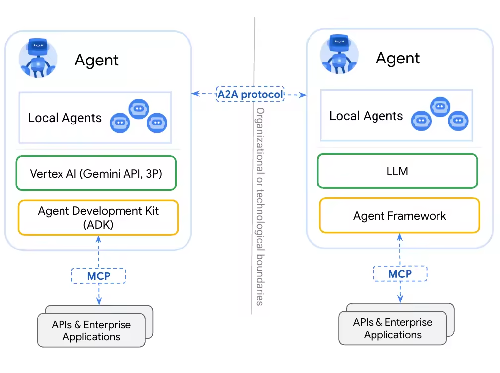
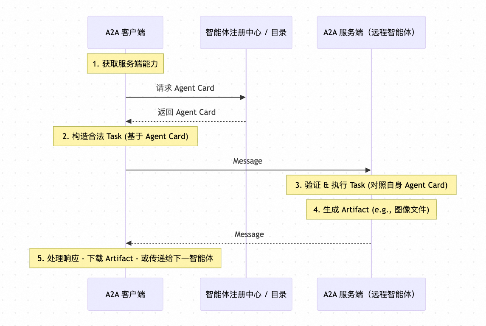

# ✅什么是A2A，和MCP有什么区别？

# 典型回答

MCP协议是解决Agent和工具之间通信的，定义出来的一套标准协议。而A2A也是一个协议，是一个Agent之间通信的协议。能实现多个智能体之间互相了解对方，以及调用。

A2A全程是Agent to Agent protocol，是一个解决了多个智能体之间相互隔离，无法交流的问题的。

但是需要注意的是，他主要解决的是多个独立部署的智能体之间的互相协作问题，而有些我们自己搭建的多智能体，本身已经实现了协作的话，那就不再需要A2A了。

一般用在我们开发的Agent ，需要调用别的团队、或者部门、或者是公司提供的，可能是用其他语言编写的Agent的时候。

当我们的agent要调用其他的agent，以前只能通过http调用，或者通过mcp调用，但是有了A2A之后，A2A就能实现互相调用了，有点类似RPC协议。

# 扩展知识

## A2A的主要流程

1、客户端Agent首先需要知道远程Agent能做什么。它通过获取智能体卡（Agent Card） 来了解服务端支持的任务类型、输入输出格式、是否需要认证等信息。

2、客户端根据 Agent Card 中声明的能力，构造一个合法的 Task。将该 Task 封装进一条 request 类型的 Message，发送给服务端。

3、服务端收到 Message 后，验证 task_type 是否支持（对照自身 Agent Card），执行任务逻辑（可能调用工具、模型、外部 API 等），若任务生成具体产出（如图片、代码文件、报告等），则创建 Artifact。

4、服务端将结果（包括对 Artifact 的引用）封装进 response Message。

> 更新: 2026-02-07 16:24:40  
> 原文: <https://www.yuque.com/hollis666/aw7b67/gckrf8u0hfsizppl>