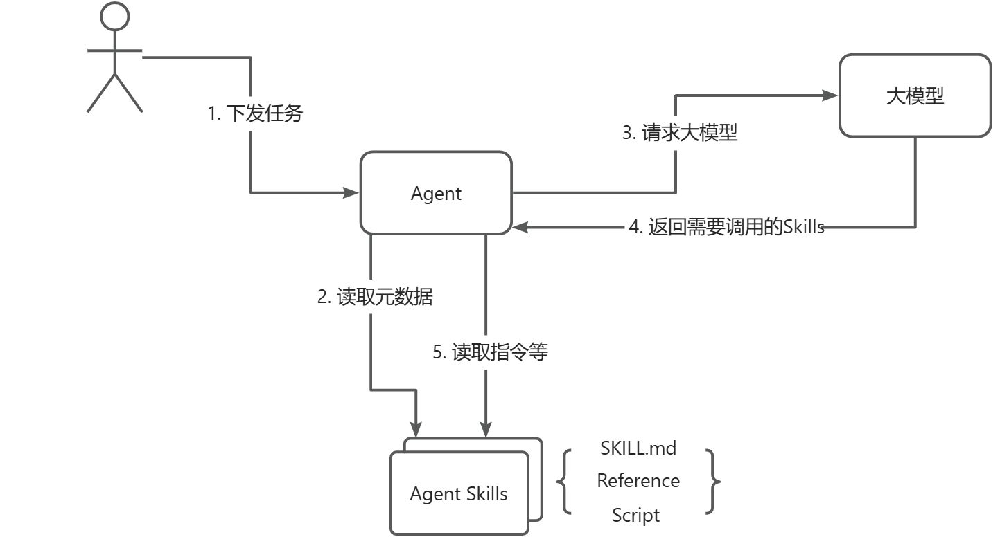

# ✅什么是Agent Skill？

# 典型回答

Agent Skill是**Anthropic** 这个公司推出的一种新的范式，解决的是Agent上下文太长的问题，其实也是上下文工程的一种典型实现。

我们来做个比喻，Agent就像一个酒店的大厨，而MCP、Function Call这些就像是后厨的锅碗瓢盆、葱姜蒜等这些工具和食材，随着我们对厨师的要求越来越多，需要让他会做各种菜，我么就给他堆满了工具和食材。

但是，厨师有了工具和食材就能做出好菜了么？未必，因为随着工具越来越多，食材越来越多，反而会让厨师更难以做出美味的菜肴，因为他可能不知道什么时候该用哪口锅，该用哪种酱油了。

这时候，就需要一个菜谱，来指导厨师做菜，而这个菜谱，就是Skill！

Agent Skills 的做法，是把一些**已经被验证有效的做事方式**，抽象出来，**封装成一个独立的能力模块**，让 Agent 在需要的时候直接使用。

***

**Agent Skill 本质上就是一个标准化的目录结构**。你可以先把它理解为：**一个给 Agent 用的能力文件夹目录**。

一个完整的 Skill，至少包含一个核心文件，其余内容都是围绕这个核心文件展开的

```markdown
my-skill/           # 技能名称
├── SKILL.md        # 必选：技能的介绍说明与指令约束
├── scripts/        # 可选：可执行的脚本
├── references/     # 可选：可参考的示例文件
└── assets/         # 可选：图片等资源文件
```

这个结构就是 Agent Skills 的核心，就是为了让 Agent 在运行时，**可以分层、有选择地加载信息**，而不是一次性把所有内容塞进上下文。

### 渐进式披露

把 SKILL.md、Reference、Script 放在一起看，其实它们就共同构成了Agent Skills的核心：**渐进式披露机制**。

所谓渐进式披露，顾名思义，就是不一次性把 Skill 的全部信息塞进上下文，而是根据 Agent 所处的阶段，**按需、分层地加载信息**。

在 Agent Skills 中，这种披露是严格分阶段发生的：

1. **技能发现阶段**\
   客户端只扫描 Skill 目录，并且只读取 SKILL.md 中由 `---` 包裹的元数据。Agent 在这个阶段只关心一件事：**这个 Skill 是做什么的，当前任务要不要用它**。而 Instruction、Reference、Script 在这个阶段都不会被加载。
2. **执行决策阶段**\
   当 Agent 基于元数据判断需要使用该 Skill 后，才会加载 SKILL.md 中的 Instruction。\
   此时 Agent 才开始理解：**这个 Skill 具体该怎么用，执行流程是什么，哪些地方需要额外注意。**
3. **细节补充阶段**\
   Reference 不会自动进入上下文。只有当 Instruction 中明确指示，或执行过程中确实需要查阅某些细节时，Agent 才会按文件粒度读取对应的 Reference 内容。这一步的目的就是**补充当前步骤所必需的最小信息集**。
4. **确定性执行阶段**\
   当流程中出现不适合交给模型自由生成的部分，Agent 会按 Instruction 的约定调用 Script。Script 负责用稳定、可控的代码完成具体操作，并只把结果返回给 Agent。大模型既不需要理解实现细节，也不会被大量原始内容干扰。只是调用，获取结果即可。

正是这种分层、延迟、按需加载的设计，使 Agent Skills 能够在保证执行稳定性的同时，显著降低上下文 token 的消耗。这也是 Agent Skills 演进为真正工程化能力模块的关键所在。



#


> 更新: 2026-03-01 14:49:44  
> 原文: <https://www.yuque.com/hollis666/aw7b67/vs5mhn65t55d50gx>