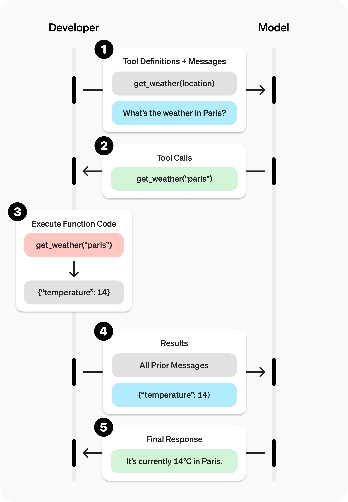

# ✅什么是Function Calling？

# 典型回答

\*\*Function Calling都是一种让大模型会使用工具的方案。\*\*如果一个大模型不会用工具，那就只能是一个简单的对话机器人，并且只能根据以往训练的数据进行对话。

如果你想让给大模型能够帮你联网查询、帮你操作本地文件、帮你调外部服务，都需要让他会用工具，而Function Call，MCP、A2A都是可以让大模型更好的使用工具的技术方案。

Function Call是Open AI提出的，最开始时只针对自家的GPT用的，他需要**先通过结构化的方式定义出来有哪些工具**。如：

```sql
import json

def get_current_temperature(location: str, unit: str = "celsius"):
    """Get current temperature at a location.

    Args:
        location: The location to get the temperature for, in the format "City, State, Country".
        unit: The unit to return the temperature in. Defaults to "celsius". (choices: ["celsius", "fahrenheit"])

    Returns:
        the temperature, the location, and the unit in a dict
    """
    return {
        "temperature": 26.1,
        "location": location,
        "unit": unit,
    }


def get_temperature_date(location: str, date: str, unit: str = "celsius"):
    """Get temperature at a location and date.

    Args:
        location: The location to get the temperature for, in the format "City, State, Country".
        date: The date to get the temperature for, in the format "Year-Month-Day".
        unit: The unit to return the temperature in. Defaults to "celsius". (choices: ["celsius", "fahrenheit"])

    Returns:
        the temperature, the location, the date and the unit in a dict
    """
    return {
        "temperature": 25.9,
        "location": location,
        "date": date,
        "unit": unit,
    }


def get_function_by_name(name):
    if name == "get_current_temperature":
        return get_current_temperature
    if name == "get_temperature_date":
        return get_temperature_date

TOOLS = [
    {
        "type": "function",
        "function": {
            "name": "get_current_temperature",
            "description": "Get current temperature at a location.",
            "parameters": {
                "type": "object",
                "properties": {
                    "location": {
                        "type": "string",
                        "description": 'The location to get the temperature for, in the format "City, State, Country".',
                    },
                    "unit": {
                        "type": "string",
                        "enum": ["celsius", "fahrenheit"],
                        "description": 'The unit to return the temperature in. Defaults to "celsius".',
                    },
                },
                "required": ["location"],
            },
        },
    },
    {
        "type": "function",
        "function": {
            "name": "get_temperature_date",
            "description": "Get temperature at a location and date.",
            "parameters": {
                "type": "object",
                "properties": {
                    "location": {
                        "type": "string",
                        "description": 'The location to get the temperature for, in the format "City, State, Country".',
                    },
                    "date": {
                        "type": "string",
                        "description": 'The date to get the temperature for, in the format "Year-Month-Day".',
                    },
                    "unit": {
                        "type": "string",
                        "enum": ["celsius", "fahrenheit"],
                        "description": 'The unit to return the temperature in. Defaults to "celsius".',
                    },
                },
                "required": ["location", "date"],
            },
        },
    },
]
MESSAGES = [
    {"role": "system", "content": "You are Qwen, created by Alibaba Cloud. You are a helpful assistant.\n\nCurrent Date: 2024-09-30"},
    {"role": "user",  "content": "What's the temperature in San Francisco now? How about tomorrow?"},
]
```

其中的**TOOLS**部分就是关于工具的定义，对于每个工具，它是一个具有两个字段的JSON object：

* `type`：string，用于指定工具类型，目前仅`"function"`有效
* `function`：object，详细说明了如何使用该函数

对于每个function，它是一个具有三个字段的JSON object：

* `name`：string 表示函数名称
* `description`：string 描述函数用途
* `parameters`：JSON Schema，用于指定函数接受的参数。请参阅链接文档以了解如何构建JSON Schema。值得注意的字段包括`type`、`required`和`enum`。

大多数框架使用“工具”格式，有些可能使用“函数”格式。根据命名，应该很明显应该使用哪一个。

定义好了工具之后，再向他提问的时候，将我们的prompts和上面定义的可用的工具都传给LLM，那么他就能根据用户的问题，选择工具去使用，更好的做回答了。

但是需要注意的是，LLM只会选择用哪个工具，并且给出调用这个工具的具体参数，他不会直接执行这个工具，工具的执行，还是需要靠应用侧的代码来执行的。

如下面这张图，其实是OpenAI给出的函数调用的过程，可以看到，最关键的函数的执行调用，其实是靠开发者来进行的，也是需要借助我们的应用，即你的python代码或者java代码。



所以，根据上面的交互图，我们总结下，通过大模型做Function call的过程是：

1. 向模型发送包含其可调用工具的请求
2. 从模型接收一个工具调用结果（包括具体的工具和参数）
3. 在应用端执行代码，使用工具调用的输入
4. 使用工具输出向模型发起第二次请求，带有工具调用结果
5. 接收模型返回的最终响应（或更多工具调用）


> 更新: 2026-04-18 13:53:04  
> 原文: <https://www.yuque.com/hollis666/aw7b67/evlxyxnnbsnibpnn>