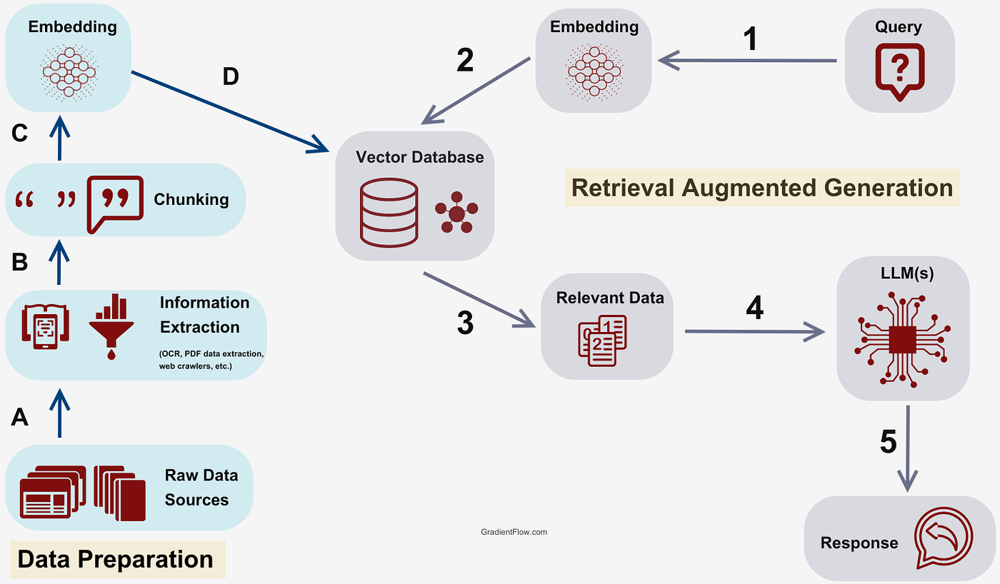

# ✅对RAG了解吗？谈谈什么是RAG？

# 典型回答

RAG 的全称是：**Retrieval-Augmented Generation**，翻译成中文是：**检索增强生成**。  

说人话就是——让大语言模型（比如 ChatGPT）在“生成答案”之前，**先去找资料（检索）来增强它的知识**，再用这些资料来生成更准确的回答。  

### 为什么需要RAG

因为对于很多大语言模型来说，他的知识是基于历史数据训练出来的，比如GPT-4是截止到2023年的数据，而在这之后发生的所有的新的事件，新的数据，他都是不知道的，那么他的回答就会有这部分的局限性。

还有就是，很多大模型是基于公开的资料训练出来的，而很多私域的信息他是没有学习过的，而很多知识是私有的知识，这就需要通过资料的方式增强他原来不熟悉的知识。

所以，有了RAG之后，就可以基于自己的知识构建自己的知识库，这样就能做到知识的更新和迭代，也能弥补大模型不知道一些特性领域的专业知识的不足。这样就能让大模型的回答更加的准确， 减少幻觉的发生。

### 如何构建一个RAG

可以看一下这张图（这张图是我从网上找到的），这里面就包括了构建RAG的主要流程。

1、前置准备

首先我们需要做数据准备，把你要用的资料收集好，比如：公司内部文档（PDF、Word、Markdown）、FAQ列表、产品手册等，然后清洗这些数据，比如去掉无关信息、切分成合理的小段。

然后把每一小段文本用**Embedding模型**转成向量，把这些向量存到**向量数据库**里，比如FAISS、Milvus等。

2、检索查询

当用户提问时，先用相同的Embedding模型把问题也转成向量。然后在向量数据库里用**向量相似度搜索**，找出最相关的几段资料（比如Top 5）。这些找到的内容就是**上下文增强材料**。

3、生成回答

紧接着，就可以把用户的问题 + 检索到的资料一起，作为Prompt发给大语言模型（LLM）。 这样可以保证模型只在资料范围内生成答案，降低幻觉。 

> 更新: 2025-04-26 15:51:07  
> 原文: <https://www.yuque.com/hollis666/aw7b67/ptlwuz4zxliwmea8>